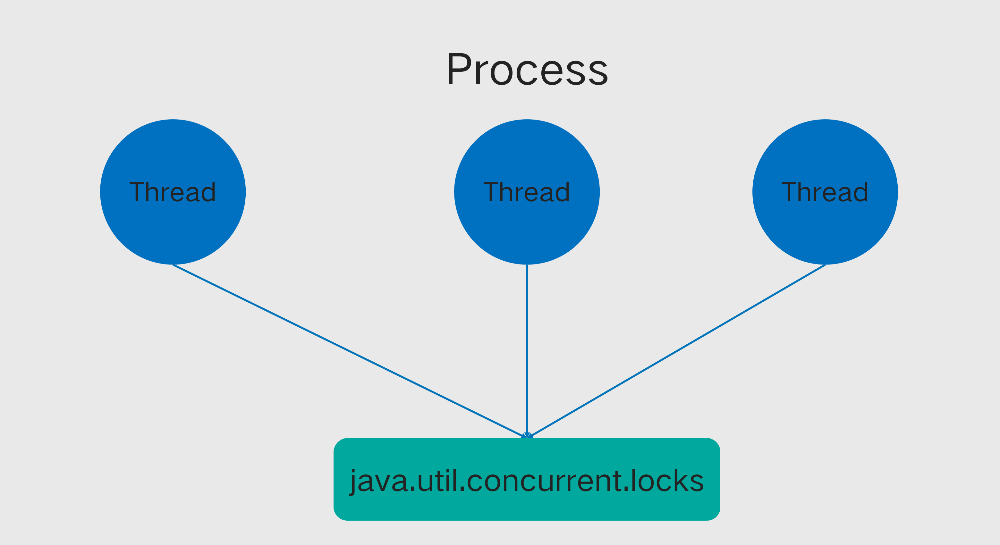
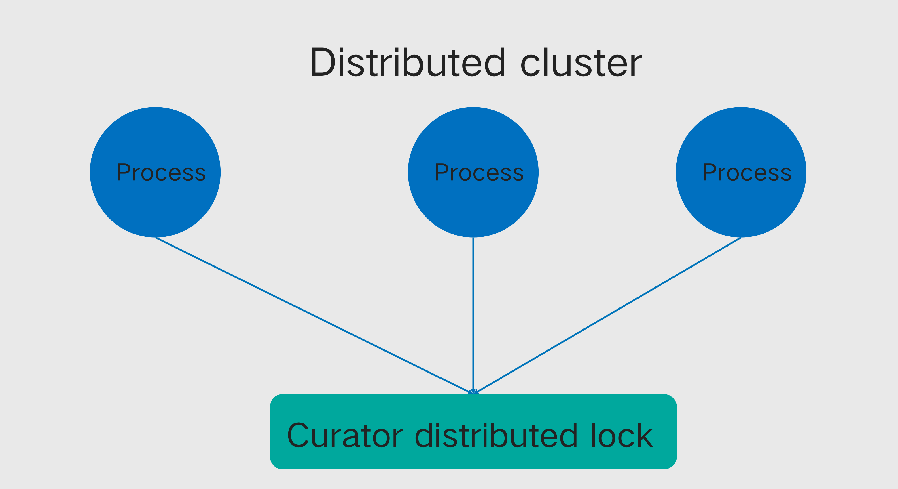
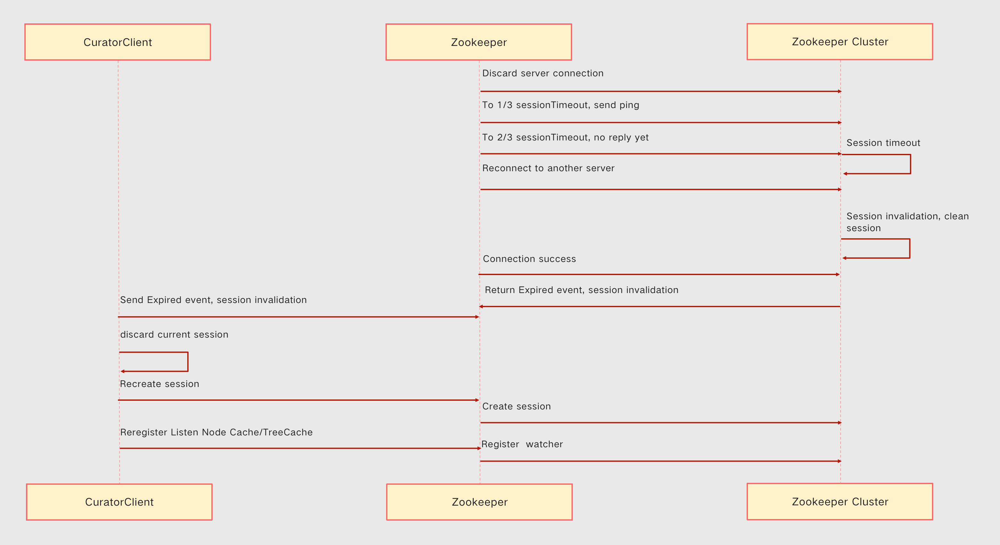
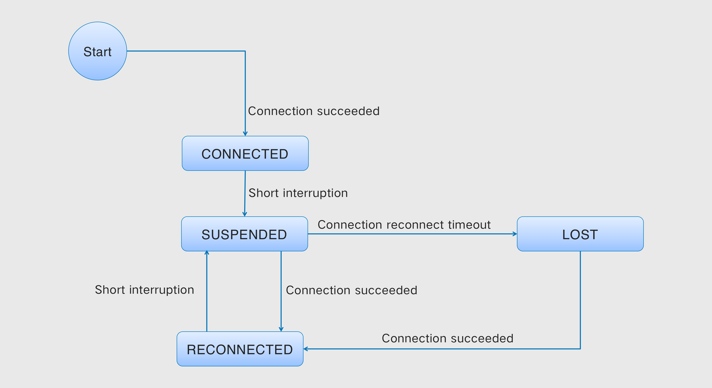
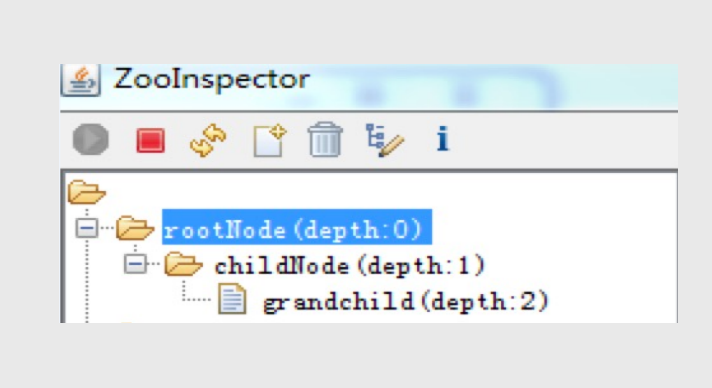
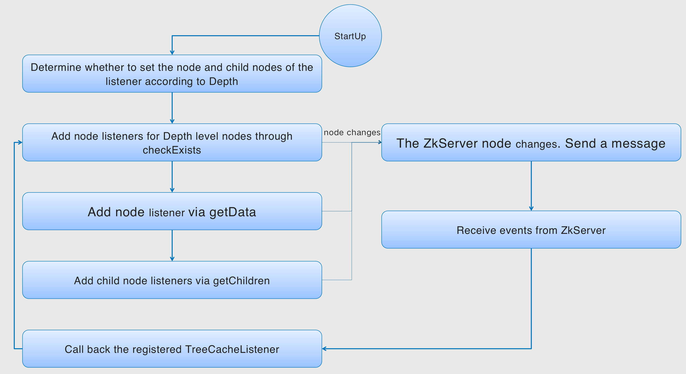

<script>
var pageHeader=document.getElementsByClassName("page-header")[0].innerHTML;
 pageHeader="<center></center>"+pageHeader;
document.getElementsByClassName("page-header")[0].innerHTML=pageHeader;
</script>

<h1 style="color:#606c71;text-align:center;" >Curator internal implementation mechanism</h1><br/>

<center>

</center>

> <br/>&nbsp;&nbsp;&nbsp;&nbsp; &nbsp;&nbsp;&nbsp;&nbsp; [Zookeeper](https://zookeeper.apache.org/) is not very unfamiliar to everyone. Now many open source middleware are using Zookeeper as a distributed coordination center service. Then the client that operates Zookeeper in Java has Zookeeper Natively provided, open source [zkclient](https://github.com/sgroschupf/zkclient) and [Apache Curator](https://curator.apache.org/). Zookeeper is relatively low-level, and it is very difficult to operate. Convenience, the way of expressing interfaces and methods is not direct enough, and there are still many problems. The zkclient is a native encapsulation of Zookeeper, but the documentation is insufficient, and there are many problems in the retry, exception and other mechanisms, and it has been used for a long time. The community criticized. So is there a better client now, that is Curator. In this article, I will analyze the implementation mechanism of Curator from an internal perspective.<br/>
> <br/>

# What's the right posture to use open source?

<center>

</center>

* All-takenism: Call it the stage of "All-takenism", no matter what it is, use it first and then talk about it.

* Know the roots: After using it for nine years, I became more and more familiar with it, and I have a good understanding of some principles and problems, which is called the "knowing the roots" stage.

* Patch up: In the process of later use, there will always be some problems or some unsatisfactory functions. Since we know how it is done, we will try to change its problems or add functions. This stage is called "Patch up".

* Make a new start: Wait until it is completely understood, and find that simple modifications or adding functions can't change the underlying shortcomings. At this time, it is found that the patch time invested is more and more, and the results are a little different. Ideal. If you think about it, it might be better to 'build one' again. Anyway, you have fully understood its principle, and it can also bring a lot of convenience for adding new functions or maintenance in the future. Then build one. This stage is called "Make a new start".

# Introduction to Curator

&nbsp;&nbsp;&nbsp;&nbsp; Apache Curator is a Java/JVM client library for Apache ZooKeeper, a distributed coordination service. It includes a highlevel API framework and utilities to make using Apache ZooKeeper much easier and more reliable. It also includes recipes for common use cases and extensions such as service discovery and a Java 8 asynchronous DSL.

&nbsp;&nbsp;&nbsp;&nbsp; So much so that Patrick Hunt, the creator of Zookeeper, commented on the Curator framework: `Guava is to Java What Curator is to Zookeeper`. This shows how excellent Curator is.

## Introduction to Curator

* Wraps and simplifies Zookeeper native API

* Automated connection management

*  Watcher repeated registration

* Stream programming

* Failure retry mechanism 

* Powerful Distributed Environment Tools Recipe

* Easy to test, quickly start embedded cluster

<center>

</center>

* curator-framework: some encapsulation of zookeeper's underlying api.

* curator-client: Provides some client-side operations, such as retry strategies, etc.

* curator-recipes: encapsulates some advanced features, such as: Cache event monitoring, election, distributed lock, distributed counter, distributed Barrier, etc.

* curator-async: Curator wrapper class for asynchronous operations, just like Java 8's lambdas.

## Curator Compatibility 

&nbsp;&nbsp;&nbsp;&nbsp; There are many versions of Curator currently on the market, such as `5.X`, `4.X`, `2.X`. All typical application scenarios need to rely on client and framework.

* 5.x supports ZooKeeper 3.5 and 3.6 (3.6 is preferred), now the last release of zookeeper is 3.6.2.

* 4.x supports ZooKeeper 3.5 and 3.6, now the last release of zookeeper is 3.5.8.

* 2.x supports ZooKeeper 3.x and below, now the last release of zookeeper is 3.4.14.

```
<dependency>
  <groupId>org.apache.curator</groupId>
    <artifactId>curator-recipes</artifactId>
    <version>x.x</version>
</dependency>
```

## Curator Quick Guide (1): Creating a Session

&nbsp;&nbsp;&nbsp;&nbsp; It is used in two ways, one is through the factory method, the other is through the flow builder method

### 1.Factory

```
CuratorFramework  curatorClient = CuratorFrameworkFactory .newClient(connectString,  sessionTimeoutMs,  connectionTimeoutMs, retryPolicy)
```

### 2.Stream

```
CuratorFramework curatorClient = CuratorFrameworkFactory.builder().
connectString(connectString).
sessionTimeoutMs(sessionTimeoutMs)
.connectionTimeoutMs(connectionTimeoutMs).
retryPolicy(retryPolicy).
build()
```

Parameter explanation:

connectString: zk cluster connection string, format host1:port1,host2:port2,host3:port3

connectionTimeoutMs: connection timeout time

sessionTimeoutMs: session timeout

retryPolicy: Failed retry policy

## Curator Quick Guide (2): Getting Started 

After the Curator session is created, it will be started directly. Various operations can be performed after the startup is successful.

```
curatorClient.start();

curatorClient.blockUntilConnected();
```

## Curator Quick Guide (3): Node Operations

```
curatorClient.create().withMode(CreateMode.EPHEMERAL).forPath(“/temp”);  //Create a temporary node

curatorClient.delete().forPath("/todelete");  //Delete node

curatorClient.setData().forPath("/update", "value".getBytes());  //Update Data

curatorClient.getChildren().forPath("/parentNodes");  // Get Nodes
```

## Curator Quick Guide (4): Retry Strategy

&nbsp;&nbsp;&nbsp;&nbsp; All operations of Curator, including setData create delete, etc. If it fails, it is allowed to retry several retry strategies within the system. Developers can customize their own strategies by implementing the RetryPolicy interface as needed.

Default retry policy:

* RetryNTimes(int n, int sleepMsBetweenRetries)
n: maximum number of retries.
sleepMsBetweenRetry: time between retry.

* RetryOneTime(int sleepMsBetweenRetry)
sleepMsBetweenRetry: time between retry

* RetryUntilElapsed(int maxElapsedTimeMs, int sleepMsBetweenRetries)
After the retry time exceeds the maximum time, no more retries.
maxElapsedTimeMs: Maximum retry time.
sleepMsBetweenRetriees: The interval between each retry.

* ExponentialBackoffRetry(int baseSleepTimeMs, int maxRetries, int maxSleepMs)
baseSleepTimeMs: initial sleep time.
maxRetries: Maximum number of retries.
maxSleepMs: Maximum retry time.

The current time for sleep: baseSleepTimeMs*Math.max(1, random.nextInt(1 << retryCount+1)), with the number of retries, increase the retry interval, and the index increases.

## Core API for Zk Node Operations

&nbsp;&nbsp;&nbsp;&nbsp; All zk node operations of Curator are done through Builder. Each operation background corresponds to a Builder, which is responsible for the operation of the zk node.
Since all operations are the same, the following takes `CreateBuilderImpl` as an example to illustrate its internal implementation.

| Core API | Internal implementation | Describe |
| :--- | :---  | :---  |
| create() | CreateBuilderImpl | Start creating the operation, and call f`orPath()` at the end to specify the ZNode to operate |
| delete() | DeleteBuilderImpl | Start the delete operation, Call `forPath()` at the end to specify the ZNode to be operated on |
| checkExists() | ExistsBuilderImpl | Begin the operation of checking whether the ZNode exists,At the end, call `forPath()` to specify that the ZNode is to be operated
| getData() | GetDataBuilderImpl | Start the operation to get the data of the ZNode node. At the end, call `forPath()` to specify that the ZNode is to be operated |
| setData() | SetDataBuilderImpl | Start the operation of setting the ZNode node data. At the end, call `forPath()` to specify the ZNode to be operated |
| getChildren() | GetChildrenBuilderImpl | Start getting the list of child nodes of ZNode, Call `forPath()` at the end to specify the ZNode to be manipulated |

# Curator Application Scenario

## Distributed Atomic Values

<center>

In the same process, multiple threads operate through the atomic value provided by the java concurrent package, ensuring the concurrent atomicity of multiple threads.
</center>

<center>

Different processes cannot use the atomic value of jdk's concurrent packets. Curator's atomic provides a similar function, sharing the same atomic value in a distributed environment.
</center>

## Distributed Atomic Value Code Snippet Example

Multiple distributions on different machines perform concurrent operations on the same atomic variable, All other machines can see the latest value.


```
RetryPolicy retryPolicy = new ExponentialBackoffRetry(1000, 10);
CuratorFramework cf = CuratorFrameworkFactory.builder().connectString(CONNECT_ADDR).sessionTimeoutMs(SESSION_OUTTIME).retryPolicy(retryPolicy).build();
cf.start();

DistributedAtomicInteger atomicIntger = new DistributedAtomicInteger(cf, "/atomicValue",new RetryNTimes(3, 1000));
System.out.println(atomicIntger.get().preValue()); 
AtomicValue<Integer> value = atomicIntger.add(1);
System.out.println(value.postValue()); 
```

## Distributed Lock

<center>

In the same process, multiple threads use the lock provided by java concurrent package to ensure the shared lock of multiple threads.
</center>

<center>

Different processes cannot use the locks of JDK's concurrent packets. Curator's locks provide a similar function to process global locks in a distributed environment.
</center>

## Distributed lock code snippet

Multiple distributed in different machines, the code in the loop can be executed only if the lock is obtained, so the logic of repeated execution can be avoided.

```
RetryPolicy retryPolicy = new ExponentialBackoffRetry(1000, 10);
CuratorFramework cf = CuratorFrameworkFactory.builder().connectString(CONNECT_ADDR)
			.sessionTimeoutMs(SESSION_OUTTIME).retryPolicy(retryPolicy).build();
cf.start();
InterProcessMutex lock = new InterProcessMutex(cf, "/lock");

try {
	lock.acquire();
	for (int i = 0; i < 1000000; i++) {
		SimpleDateFormat sdf = new SimpleDateFormat("HH:mm:ss|SSS");
		System.out.println(sdf.format(new Date()));
		TimeUnit.SECONDS.sleep(1);
}
} finally {
	lock.release();
}
```

## Master-slave election fragment instance

&nbsp;&nbsp;&nbsp;&nbsp; In distributed system design, master election is a common scenario. Master election is a process by which the master node is selected to control other nodes or assign tasks.
Several characteristics to be satisfied by the main election algorithm:
1. Each node obtains the right to become the master node in a balanced manner.Once the master node is selected, other nodes can perceive who is the master node. 
2. The master node is the only one that exists
3. Once the master node fails, goes down or disconnects, other nodes can sense it and re-select the master algorithm.

```
RetryPolicy retryPolicy = new ExponentialBackoffRetry(1000, 10);
CuratorFramework cf = CuratorFrameworkFactory.builder().connectString(CONNECT_ADDR)
			.sessionTimeoutMs(SESSION_OUTTIME).retryPolicy(retryPolicy).build();
cf.start();

LeaderLatch leaderLatch = new LeaderLatch(cf, "/latch");
leaderLatch.start();
leaderLatch.await(10, TimeUnit.SECONDS);
if (leaderLatch.hasLeadership()) {
	System.out.println("yes, i am leader");
}
leaderLatch.close();
```

## Distributed DistributedBarrier

You must wait for all tasks to be ready before you can start transaction processing. In a single process, the java.util.concurrent package provides Barrier. So what if you control all processes or threads distributed across different machines?

Curator provides us with a global distributed fence.

## Distributed DistributedBarrier code snippet

```
RetryPolicy retryPolicy = new ExponentialBackoffRetry(1000, 10);
CuratorFramework cf = CuratorFrameworkFactory.builder().connectString(CONNECT_ADDR)
		.sessionTimeoutMs(SESSION_OUTTIME).retryPolicy(retryPolicy).build();
cf.start();
ExecutorService service = Executors.newFixedThreadPool(10);
DistributedBarrier controlBarrier = new DistributedBarrier(cf, "/barrier");
controlBarrier.setBarrier();

for (int i = 0; i < 10; ++i) {
final int index = i;
Callable<Void> task = () -> {
	Thread.sleep((long) (3 * Math.random()));				controlBarrier.waitOnBarrier();
	System.out.println("Client #" + index + " begins");
	return null;
	};
service.submit(task);
}
Thread.sleep(10000);
System.out.println("all Barrier instances should wait the condition");
controlBarrier.removeBarrier();
service.shutdown();
```

# Curator Internal Anatomy

## Timeout Check and Retry Mechanism: Take Creating Nodes as an Example

<center>

</center>

Remark:

The timeout is the connectionTimeoutMs set when the Curator client was created.

Any operation in Curator needs to wait for the connection to complete, which is the time to wait for connectionTimeoutMs. If it is not connected within this time, the operation fails. Then whether the operation continues depends on the Retry policy.

The asynchronous create of Background will not be discussed due to the time and space. The specific implementation is similar.

## Session timeout and session rebuild

<center>

</center>

`sessionTimeoutMs` refers to the current client and server disconnection timeout time. When the client and server are disconnected for longer than this time, the session will be `Expired`.

If the session times out, all temporary data stored on `ZK` and registered subscribers will be removed. In this case, a ZooKeeper client instance needs to be recreated, and some additional processing needs to be coded by yourself.

Fortunately, `Curator` does the following for us:
A. First close the old zookeeper client,B. Get the connection string and recreate the new `zookeeper` client through the `zookeeperFactory` factory.

sessionTimeoutMs is 30 seconds.

10 seconds ping server.

At 20 seconds, try to reconnect to other servers.

If you reconnect after 29 seconds, the session is still valid.

After the 31st second reconnection, the session will be marked as Expired. Curator helps us rebuild the session. Listeners such as NodeCache/TreeCache are still valid. But the one-time consumption Watcher will be invalid.

## Curator event listener

Event monitoring is the core function of Zookeeper and the core function of Curator. Without event listeners, zooekeeper is nothing.

Since the native processing of zookeeper is a one-time consumption, it is very inconvenient.
Curator encapsulates Zookeeper event processing, mainly as follows:

* ConnectionStateListener：Lifecycle Events.
* Watcher: CuratorWatcher.
* NodeCache：Monitor the content changes of the node itself and the addition and deletion events of the node.
* TreeCache：Monitor the additions, deletions and changes of the node itself and the additions, deletions and changes of child nodes.

## Curator life cycle events: ConnectionStateListener

<center>

</center>

CONNECTED: Entire lifetime will only be entered once.

SUSPENDED: This state is entered on every interrupt.

RECONNECTED: reconnected successfully.

LOST: When the reconnection times out or the Session times out. The LOST event occurs in the following cases:

* connectionTimeoutMs times out when reconnecting.
* The sessionTimeoutMs timeout exceeded when reconnecting.

Note: Due to a bug in curator version 3.0 and below, if connectionTimeoutMs is the same as sessionTimeoutMs, it will take more than twice the time to receive LOST status and events.

For the throwing of the LOST event, please refer to CuratorFrameworkImpl.doSyncForSuspendedConnection method.

## NodeCache event listener

NodeCache is relatively simple, and only listens for changes in the current node.

| Event | Operate | Operate | Operate |
| :--- | :---  | :---  |:---  |
| nodeChanged Event | Create the current node | Delete the current node | Changes the Current node |

## NodeCache event implementation principle

<center>

</center>

## TreeCache event listener

TreeCache listens to the changes of the current node (Create/Delete/Change), as well as the changes of child nodes (Create/Delete/Change).

| Node Event | Create the current node | Delete the current node | Change the current node | Create the child node | Delete the child node | Change the child node |
| :--- | :---  | :---  |:---  |:---  |:---  |:---  |
| NODE_ADDED | 👌 |  |  | 👌 |  |  |
| NODE_REMOVED |  | 👌 |  |  | 👌 |  |
| NODE_UPDATED |  |  | 👌 |  |  | 👌 |

## TreeCache event principle

<center>

</center>

maxDepth monitoring can control the monitoring tree which level node.

0 only listen to this node

1 Monitor this node + child nodes

and so on

<center>

</center>

# Curator Best Practices

## Best Practice 1: Use Streaming Programming Patterns

```
CuratorFrameworkFactory.Builder builder = CuratorFrameworkFactory.builder().connectString("localhost:2181").sessionTimeoutMs(30000).connectionTimeoutMs(5000).retryPolicy(new ExponentialBackoffRetry(5000, 3, 10000)). namespace("a.b.c");
CuratorFramework curatorFramework = builder.build();

curatorFramework.create().creatingParentContainersIfNeeded().withMode(CreateMode.EPHEMERAL).forPath("/a/b/c");
```

## Best Practice 2: Save and reuse the CuratorFrameImpl client

CuratorFrameImpl is a wrapper around the zookeeper client, which is expensive to create and destroy.After it is created, it can be reused, or even share an instance globally.

## Best Practice 3: Take Advantage of Distributed Concurrent Objects

The Locks, Barrier, Queue, and Leader provided by Curator can solve many distributed synchronization problems across machines.

## Best practice 4: Set connectonTimeoutMs and sessionTimeoutMs reasonably

1. connectionTimeoutMs and sessionTimeoutMs are set according to the cluster network conditions. Neither too big nor too small.

2. The connectionTimeoutMs setting is smaller than the sessionTimeoutMs. connectionTimeoutMs is less meaningful than sessionTimeoutMs.

## Best Practice 5: Listen to the sessionExpired event

Once the Curator's Session times out, the zk server will clear all listeners and delete the emperal node immediately.

If successful again. The server finds that the timeout period set by the session has been exceeded, then the client will receive an Expired event, indicating that the session has been terminated and the client needs to be rebuilt. Curator has done this for us.

But we need to recreate the corresponding temporary nodes ourselves, and re-register the Watcher listeners (non-NodeCache/TreeCache listeners) and so on.

## Best practice 6: Use LOST events with caution

Most of the LOST is the connection timeout between the client and the zk server, not the session timeout. The received LOST event does not necessarily mean the session timeout. Many people misuse it, including many documents on the Internet. LOST is an event sent by the Curator client. Session_Expired is an event sent by the server to the client, and the two should not be confused.

## Best Practice 7: Prefer NodeCache/TreeCache over Watcher

Watcher is a one-time consumption, and it must be re-registered after consumption, which is prone to errors. Through NodeCache/TreeCache, let Curator manage the listener for us. Including disconnection of ReConnected/Session timeout, etc., the listener will be registered.

## Before introducing Best Practice 8, let's ask a question about a scenario.

<center>

</center>

Consider a scenario:

1. The client creates a sequence node 00000000.
2. The server was created successfully, and the server cluster transaction was submitted successfully.
3. Return to the client.
4. The network is abnormally disconnected before the data packet is sent to the line, and the client request will fail to execute this time. Then the client cannot determine success or failure.
5. Curator will retry for us here, then it will create 00000001.

Obviously this is not the result we want

## Best Practice 8: Use withProtection to create sequential nodes

```
curatorFramework.create().creatingParentsIfNeeded().withProtection().withMode(CreateMode.EPHEMERAL_SEQUENTIAL).forPath(path);
```

CreateBuilder provides a withProtection method to notify the Curator client to add a unique identifier before the created ordered node. If the create operation fails, the client will start to retry the operation, and one step of the retry operation is to verify whether There exists a node containing this unique identifier.

A method is provided in the Curator client to guarantee the execution of the application's delete operation, and the Curator client will re-execute the operation until it succeeds, or when the Curator client instance is unavailable. To use this feature, it is only necessary to use the guaranteed method defined in the DeleteBuilder interface.


<br>

### [back](./)
