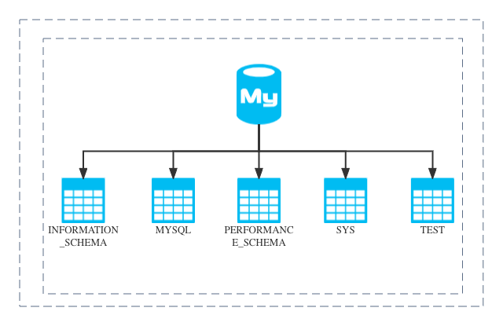

<h1 style="color:#606c71;text-align:center;" >Do you really understand MySQL's own libraries and tables?</h1> 

>  
> &nbsp;&nbsp;&nbsp;&nbsp; The history of MySQL can be traced back to 1979, and it has been continuously developed and iterated for decades. From the release of MySQL 1.0 in 1996 to the later 3.x, 4.x, 5.x and the latest 8.x, new functions have been continuously developed And improve the problem, it is liked and used by the public, but the built-in database and tables of the database have also changed a lot. I will use 5.7.19 (but the difference between the major version is still very large, and the minor version is basically the same) Let's find out what are the existing self-contained libraries and tables, what data are stored, what are they used for, and what convenience they can bring to our daily database maintenance or development work, let's take a look. 
>  

## INFORMATION_SCHEMA 
&nbsp;&nbsp;&nbsp;&nbsp;The information_schema database comes with MySQL and provides a way to access database metadata. What is metadata? Metadata is data about data, such as database or table names, data types of columns, or access rights, etc. Other terms sometimes used to describe this information include "data dictionary" and "system catalog". In MySQL, information_schema is regarded as a database, to be precise, an information database. It holds information about all other databases maintained by the MySQL server. Such as database name, database table, table column data type and access rights, etc. In INFORMATION_SCHEMA, there are several read-only tables. They are actually views, not base tables, so you won't be able to see any files related to them. Information_schema database table description:

| Serial Number | Table Name | Meaning |
| :--- | :----: | ---: |
| 1 | CHARACTER_SETS | The default correspondence table between characters and proofreading rules cannot be added, updated or deleted.|
| 2 | COLLATIONS | All correspondence tables between characters and collation rules, and there are information such as collation ID, default identification, whether to compile into the server (these are all MySQL extension information for the time being, and are useless now). This table cannot be added, updated, or deleted.|
| 3 | COLLATION_CHARACTER_SET_APPLICABILITY | All correspondence between characters and proofreading rules |
| 4 |  |  |

## MYSQL 
&nbsp;&nbsp;&nbsp;&nbsp;The core database of mysql, similar to the master table in sql server, is mainly responsible for storing the control and management information that mysql needs to use, such as database users, permission settings, keywords, etc. mysql database table description: 

| Serial Number | Table Name | Meaning |
| :--- | :----: | ---: |
| 1 | columns_priv | The permission table of the columns in the table, when executing GRANT SELECT (HOST), ON `db1`.* TO 'test'@'%' identified by "123456"; there will be data.|
| 2 | db | The permission table of the database, when executing GRANT SELECT ON `db1`.* TO 'test'@'%' identified by "123456"; there will be data.|
| 3 | engine_cost | Cost model, engine_cost (IO cost), server_cost (CPU cost), mysql execution plan analysis three see explain, profiling, optimizer_trace. |
| 4 |  |  |

## PERFORMANCE_SCHEMA 
&nbsp;&nbsp;&nbsp;&nbsp;Mainly used to collect database server performance parameters. And the storage engines of the tables in the library are all PERFORMANCE_SCHEMA, and users cannot create tables whose storage engine is PERFORMANCE_SCHEMA. MySQL5.7 is enabled by default, performance_schema database table description: 

| Serial Number | Table Name | Meaning |
| :--- | :----: | ---: |
| 1 | accounts | Record the current login information and total login statistics of each user corresponding to the host (disconnect one time and record it into the total number of connections), if USER and HOST are NULL, it means internal users.|
| 2 | cond_instances | List all conditions for all instances while the server is executing(visible).|
| 3 | events_stages_current | Stage summary table, containing currently executing stage events for each thread. |
| 4 |  |  |

## SYS 
&nbsp;&nbsp;&nbsp;&nbsp;All data sources of the Sys library come from: performance_schema. The goal is to reduce the complexity of performance_schema so that DBAs can better read the contents of this library. Let the DBA understand the operation of the DB faster. All the views in the sys library are views, so I will not do anything unnecessary. The MySQL Doc has a unified description:
### sys library table description 
[sys Schema Object Index](https://dev.mysql.com/doc/refman/5.7/en/sys-schema-object-index.html)

## TEST 
&nbsp;&nbsp;&nbsp;&nbsp;The is a test database created during installation. Like its name, it is a completely empty database without any tables and can be deleted(Not explained).

 

[back](./)