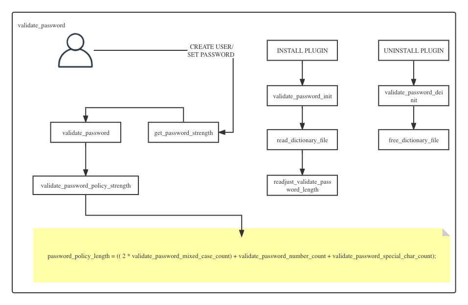

<iframe src="detail-header.html" title="Github of Anigkus" style="height:0px,widht:0px;display:none" id="kusifreamheader"></iframe>

<h1 style="color:#606c71;text-align:center;" id="h1" >How to use external plugin functionality in MySQL</h1><br/>

<center>

</center>

> <br/>&nbsp;&nbsp;&nbsp;&nbsp; Many functions in MySQL are implemented in the form of plug-ins, and the functions of MySQL plug-ins can be extended without modifying the source code. During the entire running cycle of MySQL, the entry points that plug-ins can support can include states, parameters, Functions, etc. For example, storage engines such as `InnoDB` and `CSV`, which are very useful, are provided in the form of plug-ins. There are also some functions such as semi-synchronous replication, MGR, log auditing, data recovery, password strength, etc. In this article, I will explain how to use the `Password Strength` plugin in MySQL.<br/>
> <br/>

Backgroup

&nbsp;&nbsp;&nbsp;&nbsp; MySQL supports server-side and client-side plug-ins, and the two plug-ins work together. The plug-in supports loading when the service starts, or can be dynamically loaded later. The function of the plug-in itself is more general than the UDF function. And the API interface of the plug-in is universal. The purpose of the plug-in is to be more conducive to the development of MySQL in the community and to enrich the functions of MySQL, just like the sigs in kubernates.

# Install Plugin

# Show the plugin director

```
mysql> SHOW VARIABLES LIKE 'plugin_dir%';
+---------------+--------------------------+
| Variable_name | Value                    |
+---------------+--------------------------+
| plugin_dir    | /usr/lib64/mysql/plugin/ |
+---------------+--------------------------+
1 row in set (0.00 sec)
``` 

## Confirm the plugin file

&nbsp;&nbsp;&nbsp;&nbsp; First make sure the `validate_password.so` file exists in `/usr/lib64/mysql/plugin/`.

```
$ ll  /usr/lib64/mysql/plugin/validate_password.so
-rwxr-xr-x 1 root root   217202 Jun 22 23:01 /usr/lib64/mysql/plugin/validate_password.so
```

## How to install plugins

&nbsp;&nbsp;&nbsp;&nbsp; There are two ways to install plugins: one is to edit the file (permanent), and the other is to dynamically load (temporary).

### Method 1

&nbsp;&nbsp;&nbsp;&nbsp; Edit /etc/my.cnf and restart the service to see the plug-in status of the plug-in.

```
[mysqld]
#validate_password=OFF # I temporarily comment out the disabled plugin, this time MySQL provides a faster way to enable the validate_password plugin
plugin-load-add=validate_password.so # Loading in this way can only be done through SHOW PLUGINS
```

### Method 2

```
mysql> INSTALL PLUGIN validate_password SONAME 'validate_password.so';  
```

# Show Plugins

&nbsp;&nbsp;&nbsp;&nbsp; There are three ways to view plugins.

## Method 1

```
mysql> SHOW PLUGINS;
+----------------------------+----------+--------------------+----------------------+---------+
| Name                       | Status   | Type               | Library              | License |
+----------------------------+----------+--------------------+----------------------+---------+
| binlog                     | ACTIVE   | STORAGE ENGINE     | NULL                 | GPL     |
| mysql_native_password      | ACTIVE   | AUTHENTICATION     | NULL                 | GPL     |
| sha256_password            | ACTIVE   | AUTHENTICATION     | NULL                 | GPL     |
| MRG_MYISAM                 | ACTIVE   | STORAGE ENGINE     | NULL                 | GPL     |
| PERFORMANCE_SCHEMA         | ACTIVE   | STORAGE ENGINE     | NULL                 | GPL     |
| MEMORY                     | ACTIVE   | STORAGE ENGINE     | NULL                 | GPL     |
| InnoDB                     | ACTIVE   | STORAGE ENGINE     | NULL                 | GPL     |
| INNODB_TRX                 | ACTIVE   | INFORMATION SCHEMA | NULL                 | GPL     |
| INNODB_LOCKS               | ACTIVE   | INFORMATION SCHEMA | NULL                 | GPL     |
| INNODB_LOCK_WAITS          | ACTIVE   | INFORMATION SCHEMA | NULL                 | GPL     |
| INNODB_CMP                 | ACTIVE   | INFORMATION SCHEMA | NULL                 | GPL     |
| INNODB_CMP_RESET           | ACTIVE   | INFORMATION SCHEMA | NULL                 | GPL     |
| INNODB_CMPMEM              | ACTIVE   | INFORMATION SCHEMA | NULL                 | GPL     |
| INNODB_CMPMEM_RESET        | ACTIVE   | INFORMATION SCHEMA | NULL                 | GPL     |
| INNODB_CMP_PER_INDEX       | ACTIVE   | INFORMATION SCHEMA | NULL                 | GPL     |
| INNODB_CMP_PER_INDEX_RESET | ACTIVE   | INFORMATION SCHEMA | NULL                 | GPL     |
| INNODB_BUFFER_PAGE         | ACTIVE   | INFORMATION SCHEMA | NULL                 | GPL     |
| INNODB_BUFFER_PAGE_LRU     | ACTIVE   | INFORMATION SCHEMA | NULL                 | GPL     |
| INNODB_BUFFER_POOL_STATS   | ACTIVE   | INFORMATION SCHEMA | NULL                 | GPL     |
| INNODB_TEMP_TABLE_INFO     | ACTIVE   | INFORMATION SCHEMA | NULL                 | GPL     |
| INNODB_METRICS             | ACTIVE   | INFORMATION SCHEMA | NULL                 | GPL     |
| INNODB_FT_DEFAULT_STOPWORD | ACTIVE   | INFORMATION SCHEMA | NULL                 | GPL     |
| INNODB_FT_DELETED          | ACTIVE   | INFORMATION SCHEMA | NULL                 | GPL     |
| INNODB_FT_BEING_DELETED    | ACTIVE   | INFORMATION SCHEMA | NULL                 | GPL     |
| INNODB_FT_CONFIG           | ACTIVE   | INFORMATION SCHEMA | NULL                 | GPL     |
| INNODB_FT_INDEX_CACHE      | ACTIVE   | INFORMATION SCHEMA | NULL                 | GPL     |
| INNODB_FT_INDEX_TABLE      | ACTIVE   | INFORMATION SCHEMA | NULL                 | GPL     |
| INNODB_SYS_TABLES          | ACTIVE   | INFORMATION SCHEMA | NULL                 | GPL     |
| INNODB_SYS_TABLESTATS      | ACTIVE   | INFORMATION SCHEMA | NULL                 | GPL     |
| INNODB_SYS_INDEXES         | ACTIVE   | INFORMATION SCHEMA | NULL                 | GPL     |
| INNODB_SYS_COLUMNS         | ACTIVE   | INFORMATION SCHEMA | NULL                 | GPL     |
| INNODB_SYS_FIELDS          | ACTIVE   | INFORMATION SCHEMA | NULL                 | GPL     |
| INNODB_SYS_FOREIGN         | ACTIVE   | INFORMATION SCHEMA | NULL                 | GPL     |
| INNODB_SYS_FOREIGN_COLS    | ACTIVE   | INFORMATION SCHEMA | NULL                 | GPL     |
| INNODB_SYS_TABLESPACES     | ACTIVE   | INFORMATION SCHEMA | NULL                 | GPL     |
| INNODB_SYS_DATAFILES       | ACTIVE   | INFORMATION SCHEMA | NULL                 | GPL     |
| INNODB_SYS_VIRTUAL         | ACTIVE   | INFORMATION SCHEMA | NULL                 | GPL     |
| CSV                        | ACTIVE   | STORAGE ENGINE     | NULL                 | GPL     |
| MyISAM                     | ACTIVE   | STORAGE ENGINE     | NULL                 | GPL     |
| FEDERATED                  | DISABLED | STORAGE ENGINE     | NULL                 | GPL     |
| BLACKHOLE                  | ACTIVE   | STORAGE ENGINE     | NULL                 | GPL     |
| partition                  | ACTIVE   | STORAGE ENGINE     | NULL                 | GPL     |
| ARCHIVE                    | ACTIVE   | STORAGE ENGINE     | NULL                 | GPL     |
| ngram                      | ACTIVE   | FTPARSER           | NULL                 | GPL     |
| validate_password          | DISABLED | VALIDATE PASSWORD  | validate_password.so | GPL     |
| test_plugin_server         | ACTIVE   | AUTHENTICATION     | auth_test_plugin.so  | GPL     |
+----------------------------+----------+--------------------+----------------------+---------+
46 rows in set (0.00 sec)
```

## Method 2

```
mysql> SELECT MPL.PLUGIN_NAME,MPL.PLUGIN_LIBRARY,MPL.PLUGIN_STATUS FROM  INFORMATION_SCHEMA.PLUGINS MPL WHERE MPL.PLUGIN_NAME  LIKE '%validate_password%';
+--------------------+---------------------+---------------+
| PLUGIN_NAME        | PLUGIN_LIBRARY      | PLUGIN_STATUS |
+--------------------+---------------------+---------------+
| validate_password | validate_password.so | ACTIVE        |
+--------------------+---------------------+---------------+
1 row in set (0.00 sec)
```

## Method 3

```
mysql> select * from mysql.plugin;
+--------------------+----------------------+
| name               | dl                   |
+--------------------+----------------------+
| validate_password  | validate_password.so |
+--------------------+----------------------+
1 rows in set (0.00 sec)
```

# Plugin Description

Briefly explain the meaning of the various parameters of `validate_password`. The following variables can be set through my.cnf or SET GLOBAL, provided that the plugin is installed and loaded, if loaded. Viewing the plugin will display the following information.

```
mysql> SHOW VARIABLES LIKE 'validate_password%';
+--------------------------------------+--------+
| Variable_name                        | Value  |
+--------------------------------------+--------+

| validate_password_check_user_name    | OFF    |    

| validate_password_dictionary_file    | /var/lib/mysql/password_file.txt       |

| validate_password_length             | 8      |

| validate_password_mixed_case_count   | 1      |

| validate_password_number_count       | 1      |

| validate_password_policy             | MEDIUM |

| validate_password_special_char_count | 1      |
+--------------------------------------+--------+
```

* validate_password_check_user_name: 1 or ON is open, 0 or OFF is closed, which means whether to compare the password with the current user when creating a password, and refuse to create if they match

* validate_password_dictionary_file: Only valid when validate_password_policy is 2, that is, STRONG. When the password matches the data in each line in this file, the content of the file is all lowercase, if it matches, it refuses to set, and the file is finally an absolute path , and the user who started the mysql service can have read permission for this file

* validate_password_length: minimum length of password

* validate_password_mixed_case_count: at least one uppercase character

* validate_password_number_count: at least one number character

* validate_password_policy: password policy, 0 or LOW, 1 or MEDIUM, 2 or STRONG

* validate_password_special_char_count: at least one special character

# Plugin logic

&nbsp;&nbsp;&nbsp;&nbsp;The simple code calling logic is shown in the figure.

<center>

</center>

Uninstall Plugin

&nbsp;&nbsp;&nbsp;&nbsp; There are two ways to uninstall the plugin.

## Method 1

&nbsp;&nbsp;&nbsp;&nbsp;If there is a plug-in loaded in /etc/my.cnf, delete the line of code that loads the plug-in. Then restart the service, and pass the following command again. If the plug-in is not visible, it means the uninstallation is successful 

```
mysql> SHOW PLUGINS;
```

## Method 2

&nbsp;&nbsp;&nbsp;&nbsp;If the plugin is installed through INSTALL PLUGIN, it needs to be uninstalled by using:

```
mysql> UNINSTALL PLUGIN validate_password; # This is empty in the mysql.plugin table
```

# Conclusion

&nbsp;&nbsp;&nbsp;&nbsp; By using `validate_password` as an example and sorting out, I basically understand how to load externally written `.so` form plugins in MySQL. I also know some configuration parameters and principles of validate_password. If you need to write your own plug-ins later, you can read the book <MySQL 5.1 Plugin Development>.


<br>

### [back](./)
