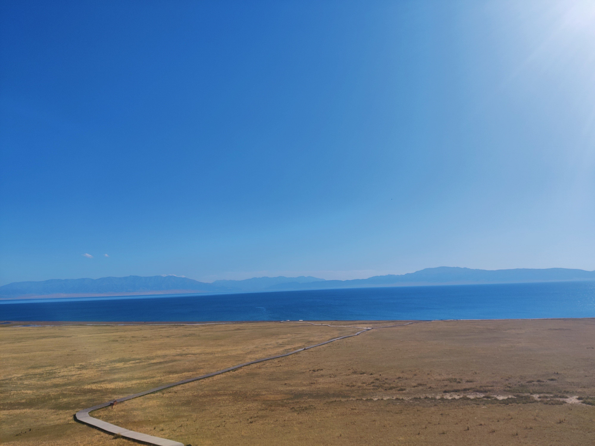

<iframe src="detail-header.html" title="Github of Anigkus" style="height:0px,widht:0px;display:none" id="kusifreamheader"></iframe>

<h1 style="color:#606c71;text-align:center;" id="h1" >Interpretation of Redis cache eviction strategy</h1><br/>

<center>

</center>

> <br/>&nbsp;&nbsp;&nbsp;&nbsp; Cache is used in development. Cache is usually divided into internal cache and external cache. In technical terms, it can be said to be in-heap cache or out-of-heap cache. In general, in-heap cache is directly in the same process or not needed. There are many kinds of caches, such as Ehcache, MemCache, Redis, Aerospike, the first is the in-heap cache, and the last three are the so-called distributed caches. Off-heap cache. Then Redis is the most used cache middleware in the current community. Then the use of cache must involve cache expiration, because material (memory) is limited, which means how to use it when system resources are insufficient Which strategy to evict some keys? In this article, I will explain the cache eviction strategy in Redis and the basic principles and execution effects of each strategy.<br/>
> <br/>

# Algorithmic background

&nbsp;&nbsp;&nbsp;&nbsp; First briefly explain some cache elimination algorithms, now commonly used (LFU, LRU, FIFO, 2Q, MRU) these algorithms, the most used are LFU, LRU, FIFO these three. I Briefly explain these.

* LFU

&nbsp;&nbsp;&nbsp;&nbsp; LFU (Least Frequently Used) is the least commonly used page replacement algorithm recently, that is, to eliminate the page with the least number of visits in a period of time.

&nbsp;&nbsp;&nbsp;&nbsp; <mark>work principle</mark>:

<center>

</center>

&nbsp;&nbsp;&nbsp;&nbsp; For example, these elements have been accessed for a period of time above, but only `E` is the lowest access frequency, only once. Then according to the LFU algorithm, the `E` key will be kicked Out. The implementation of the normal algorithm program will sort the keys within a period of time (in descending order), and then eliminate the rightmost one.

&nbsp;&nbsp;&nbsp;&nbsp; The LFU algorithm is mainly used in some scenarios where resources are scarce and limited, such as memory, cache, etc.

* LRU

&nbsp;&nbsp;&nbsp;&nbsp; LRU (Least Recently Used) is the least recently used page replacement algorithm, that is, the page that has not been used for the longest time is first eliminated.

&nbsp;&nbsp;&nbsp;&nbsp; <mark>work principle</mark>:

<center>

</center>

&nbsp;&nbsp;&nbsp;&nbsp; For example, after visiting these elements for a period of time above, visit from left to right, `A, B, B, C, E, F, G`, and finally found that `A` is the longest time There is no access, so the `A` key will be kicked out.

&nbsp;&nbsp;&nbsp;&nbsp; LRU is particularly advantageous for frequently accessed data, because it will never be cleared, such as hot news events, etc.

* FIFO

&nbsp;&nbsp;&nbsp;&nbsp; FIFO (First in First out) means that the newest data entering the queue is eliminated first.

&nbsp;&nbsp;&nbsp;&nbsp; <mark>work principle</mark>:

<center>

</center>

&nbsp;&nbsp;&nbsp;&nbsp; For example, according to the above queue, `G` is the first to enter the queue, so `G` will be cleared first.

&nbsp;&nbsp;&nbsp;&nbsp; The application scenario of FIFO is a fixed size, such as ten days of popular news events.

* MRU

&nbsp;&nbsp;&nbsp;&nbsp; MRU (Most Recently Used) is the first to remove the most recently used items.

&nbsp;&nbsp;&nbsp;&nbsp; <mark>work principle</mark>:

<center>

</center>

&nbsp;&nbsp;&nbsp;&nbsp; For example, in the above queue, `D` is the most frequently accessed data, so it will always be kicked out first.

&nbsp;&nbsp;&nbsp;&nbsp; The application scenarios of MRU are very limited. It's a kind of "rain and dew" situation. It's just that you can't keep a person standing still, the more you get, the more you should be kicked out.

* 2Q

&nbsp;&nbsp;&nbsp;&nbsp; 2Q (Two Queues) is to use 2 buffer queues, one is FIFO queue and the other is LRU queue.

&nbsp;&nbsp;&nbsp;&nbsp; <mark>work principle</mark>:

<center>

</center>

&nbsp;&nbsp;&nbsp;&nbsp; For example, according to the above two queues, the data is stored in the FIFO queue for the first time, first in, first out. But if the data is accessed for the second time before it is out of the queue, it will enter LRU queue. Then in the LRU queue, the next access will go directly to the LRU queue to find data. If there is a visit in the LRU queue, the data will be brought to the end, so that the data will not be recycled so quickly , which is the algorithm logic of LRU.

&nbsp;&nbsp;&nbsp;&nbsp; The application scenario of 2Q is only used when the business has special needs, but also to meet the first-in first-out, and also to meet the hot data.

# Eviction Strategy

&nbsp;&nbsp;&nbsp;&nbsp; In redis, how much the cache can store is limited by `maxmemory` (maximum memory), which determines how much cache data can be stored at most. The acceptable units for this parameter are: `bytes( No unit, default), K|KB, M|MB, G|GB`, while 32-bit system uses 3G implicit memory limit by default, 64-bit system defaults to 0, which means no limit or is determined by user configuration . But how to internally calculate which caches should be kept and which should be kicked out is controlled by the `maxmemory-policy` (cache policy) parameter. Redis provides a total of 8 elimination policies:

* <mark>noeviction</mark>: Do not kick out (the default elimination strategy) until the maximum memory configuration (maxmemory) is reached, under this configuration, OOM will occur when the memory is not enough. But when using the master-slave replication mode, the slave The maximum data size of the library is determined by the main library.

* <mark>allkeys-lru</mark>: Delete all keys based on the LRU algorithm, keep keys that have been accessed for a period of time, and remove keys that have not been accessed for a period of time.

* <mark>allkeys-lfu</mark> : Delete all keys based on the LFU algorithm, keep the keys that are frequently accessed within a period of time, and remove the keys that are frequently accessed with low frequency within a period of time.

* <mark>volatile-lru</mark>: delete the least recently used key, only setting expired keys will be useful.

* <mark>volatile-lfu</mark>: delete the least frequently used keys, only the expired keys will be useful.

* <mark>allkeys-random</mark>: Randomly delete keys to make room for new data added.

* <mark>volatile-random</mark>: Randomly delete keys whose expire field is set to true.

* <mark>volatile-ttl</mark>: Delete keys that are about to expire from an in-memory dataset that has an expiration time set and a minimum time-to-live (TTL) remaining.

&nbsp;&nbsp;&nbsp;&nbsp; There are also some parameters related to LRU and LRU samples. Because the Redis LRU algorithm is not a rigorous implementation, the accuracy of removal cannot be guaranteed at all, but you can change the number of samples to Adjust the accuracy of the algorithm. For example, in the following configuration, in most cases, the default configuration `(5)` is better, which has been tested through rigorous experiments. If it is set to `(10)`, it is basically very close The limit of LRU is reached.

```
maxmemory-samples 5 
```

&nbsp;&nbsp;&nbsp;&nbsp; The LFU mode has also been greatly enhanced since Redis 4.0. The elimination of LFU can be changed by the following configuration.

```
lfu-log-factor 10  # probability factor
lfu-decay-time 1  # probability factor
```

[Redis evict](https://github.com/redis/redis/blob/unstable/src/evict.c)

```
//The actual number of visits after calculation, the maximum will not exceed 255
uint8_t LFULogIncr(uint8_t counter) {
    if (counter == 255) return 255;
    // The minimum value of the RAND_MAX function is 32767, and the maximum value of RAND_MAX is not specified in the ISO IEC 9899 2011(C11) standard
    // Need to get a random floating point number between 0~1.0
    double r = (double)rand()/RAND_MAX; 
    double baseval = counter - LFU_INIT_VAL; //LFU_INIT_VAL=5
    if (baseval < 0) baseval = 0;
    double p = 1.0/(baseval*server.lfu_log_factor+1);
    if (r < p) counter++;
    return counter;
}
```

&nbsp;&nbsp;&nbsp;&nbsp; counter is the number of visits, but the ratio is not simply +1, it needs to be calculated by the LFULogIncr function. The maximum value of counter is 255. Then by taking a random number r and p between 0 and 1 For comparison, the final number of visits + 1 will be performed only when r < p. The final value of p is directly related to the current counter and the lfu_log_factor parameter in the configuration file. If the counter and lfu_log_factor are more, then p will be The smaller the value is, the smaller the probability of r < p will be, and the smaller the counter probability will be, which can be seen from the following simple table.

| factor | 100 hits | 1000 hits | 100K hits | 1M hits | 10M hits |
| :--- | :---  | :---  | :---  | :---  | :---  |
| 1 | 104 | 255 | 255 | 255 | 255 |
| 1 | 18 | 49 | 255 | 255 | 255 |
| 10 | 10 | 18 | 142 | 255 | 255 |
| 100 | 8 | 11 | 49 | 143 | 255 |


<mark>simple calculation</mark>:

```
lfu_log_factor = [10,20,30]
counter=200

double p = 1.0/((200-5)*10+1) //0.0005125576627370579
double p = 1.0/((200-5)*20+1) //0.0002563445270443476
double p = 1.0/((200-5)*30+1) //0.00017091095539224064
```

# verification link

&nbsp;&nbsp;&nbsp;&nbsp; Then I will use some examples to actually see the effects of different elimination strategies in the system, etc. There are two ways to configure the parameters of maxmemory and maxmemory-policy, one is to modify redis .conf file, and then restart the Redis service, which is permanent. There is also a dynamic modification through CONFIG GET `[maxmemory|maxmemory-policy] [parameter ...]`, this time is temporary, when the Redis service is restarted After that, the parameters of manual dynamic configuration will be lost. For convenience, I will mainly explain this situation through dynamic modification.

The following three temporarily use the default values provided by Redis and will not be modified for the time being.

```
127.0.0.1:6379> CONFIG GET maxmemory-samples
1) "maxmemory-samples"
2) "5"
127.0.0.1:6379> CONFIG GET lfu-log-factor 
1) "lfu-log-factor"
2) "10"
127.0.0.1:6379> CONFIG GET lfu-decay-time 
1) "lfu-decay-time"
2) "1"
127.0.0.1:6379> 
```

## noeviction 

&nbsp;&nbsp;&nbsp;&nbsp; This is the default strategy, that is, it will not be eviction until OOM.

```
127.0.0.1:6379> keys *
(empty array)
127.0.0.1:6379> CONFIG GET maxmemory
1) "maxmemory"
2) "0"
127.0.0.1:6379> CONFIG GET maxmemory-policy
1) "maxmemory-policy"
2) "noeviction"
127.0.0.1:6379> info memory
# Memory
used_memory:1009168     # current already used memory
used_memory_human:985.52K
used_memory_rss:9084928
used_memory_rss_human:8.66M
used_memory_peak:1139056
used_memory_peak_human:1.09M
used_memory_peak_perc:88.60%
used_memory_overhead:864672
used_memory_startup:862688
used_memory_dataset:144496
used_memory_dataset_perc:98.65%
allocator_allocated:1263216
allocator_active:1601536
allocator_resident:4177920
total_system_memory:2082639872
total_system_memory_human:1.94G
used_memory_lua:31744
used_memory_vm_eval:31744
used_memory_lua_human:31.00K
used_memory_scripts_eval:0
number_of_cached_scripts:0
number_of_functions:0
number_of_libraries:0
used_memory_vm_functions:32768
used_memory_vm_total:64512
used_memory_vm_total_human:63.00K
used_memory_functions:184
used_memory_scripts:184
used_memory_scripts_human:184B
maxmemory:0 # no memory limits.
maxmemory_human:0B
maxmemory_policy:noeviction
allocator_frag_ratio:1.27
allocator_frag_bytes:338320
allocator_rss_ratio:2.61
allocator_rss_bytes:2576384
rss_overhead_ratio:2.17
rss_overhead_bytes:4907008
mem_fragmentation_ratio:9.19
mem_fragmentation_bytes:8096432
mem_not_counted_for_evict:0
mem_replication_backlog:0
mem_total_replication_buffers:0
mem_clients_slaves:0
mem_clients_normal:1800
mem_cluster_links:0
mem_aof_buffer:0
mem_allocator:jemalloc-5.2.1
active_defrag_running:0
lazyfree_pending_objects:0
lazyfreed_objects:0
127.0.0.1:6379>  CONFIG SET maxmemory 1024
OK
127.0.0.1:6379> set key1 "value1"
(error) OOM command not allowed when used memory > 'maxmemory'. # OOM

127.0.0.1:6379> CONFIG SET maxmemory 1024000
OK
127.0.0.1:6379> set key1 "value1"
OK
127.0.0.1:6379> get key1
"value1"
127.0.0.1:6379> 
```

## allkeys-lru

&nbsp;&nbsp;&nbsp;&nbsp; For example, I add 10240 (10KB) to the existing `used_memory` in `info memory`, then I add 10 keys, the value of each key is 1KB, and then look at The cleanup effect of the `allkeys-lru` policy.

<mark>Notes</mark>:

`1107920` Viewed through the `used_memory` parameter of the `info memory` command.

```
127.0.0.1:6379> keys *
(empty array)
127.0.0.1:6379> CONFIG GET maxmemory
1) "maxmemory"
2) "0"
127.0.0.1:6379> CONFIG GET maxmemory-policy
1) "maxmemory-policy"
2) "noeviction"
127.0.0.1:6379> info memory 
# Memory
used_memory:1107920 # used_memory:1107920
used_memory_human:1.06M
used_memory_rss:9236480
used_memory_rss_human:8.81M
used_memory_peak:1287184
used_memory_peak_human:1.23M
used_memory_peak_perc:86.07%
used_memory_overhead:864576
used_memory_startup:862592
used_memory_dataset:243344
used_memory_dataset_perc:99.19%
allocator_allocated:1391448
allocator_active:1736704
allocator_resident:4317184
total_system_memory:2082639872
total_system_memory_human:1.94G
used_memory_lua:31744
used_memory_vm_eval:31744
used_memory_lua_human:31.00K
used_memory_scripts_eval:0
number_of_cached_scripts:0
number_of_functions:0
number_of_libraries:0
used_memory_vm_functions:32768
used_memory_vm_total:64512
used_memory_vm_total_human:63.00K
used_memory_functions:184
used_memory_scripts:184
used_memory_scripts_human:184B
maxmemory:0
maxmemory_human:0B
maxmemory_policy:allkeys-lru
allocator_frag_ratio:1.25
allocator_frag_bytes:345256
allocator_rss_ratio:2.49
allocator_rss_bytes:2580480
rss_overhead_ratio:2.14
rss_overhead_bytes:4919296
mem_fragmentation_ratio:8.50
mem_fragmentation_bytes:8149232
mem_not_counted_for_evict:0
mem_replication_backlog:0
mem_total_replication_buffers:0
mem_clients_slaves:0
mem_clients_normal:1800
mem_cluster_links:0
mem_aof_buffer:0
mem_allocator:jemalloc-5.2.1
active_defrag_running:0
lazyfree_pending_objects:0
lazyfreed_objects:0
127.0.0.1:6379> info memory
# Memory
used_memory:1107920
used_memory_human:1.06M
used_memory_rss:9236480
used_memory_rss_human:8.81M
used_memory_peak:1287184
used_memory_peak_human:1.23M
used_memory_peak_perc:86.07%
used_memory_overhead:864576
used_memory_startup:862592
used_memory_dataset:243344
used_memory_dataset_perc:99.19%
allocator_allocated:1358936
allocator_active:1712128
allocator_resident:4292608
total_system_memory:2082639872
total_system_memory_human:1.94G
used_memory_lua:31744
used_memory_vm_eval:31744
used_memory_lua_human:31.00K
used_memory_scripts_eval:0
number_of_cached_scripts:0
number_of_functions:0
number_of_libraries:0
used_memory_vm_functions:32768
used_memory_vm_total:64512
used_memory_vm_total_human:63.00K
used_memory_functions:184
used_memory_scripts:184
used_memory_scripts_human:184B
maxmemory:0
maxmemory_human:0B
maxmemory_policy:allkeys-lru
allocator_frag_ratio:1.26
allocator_frag_bytes:353192
allocator_rss_ratio:2.51
allocator_rss_bytes:2580480
rss_overhead_ratio:2.15
rss_overhead_bytes:4943872
mem_fragmentation_ratio:8.50
mem_fragmentation_bytes:8149232
mem_not_counted_for_evict:0
mem_replication_backlog:0
mem_total_replication_buffers:0
mem_clients_slaves:0
mem_clients_normal:1800
mem_cluster_links:0
mem_aof_buffer:0
mem_allocator:jemalloc-5.2.1
active_defrag_running:0
lazyfree_pending_objects:0
lazyfreed_objects:0
127.0.0.1:6379> CONFIG SET maxmemory 1118160 # 1107920+10240 = 1118160
OK
127.0.0.1:6379> CONFIG SET maxmemory-policy allkeys-lru
OK
127.0.0.1:6379> CONFIG GET maxmemory
1) "maxmemory"
2) "1118160"
127.0.0.1:6379> CONFIG GET maxmemory-policy
1) "maxmemory-policy"
2) "allkeys-lru"

127.0.0.1:6379> info memory
# Memory
used_memory:1083200 # used_memory:1083200
used_memory_human:1.03M
used_memory_rss:8847360
used_memory_rss_human:8.44M
used_memory_peak:1213056
used_memory_peak_human:1.16M
used_memory_peak_perc:89.30%
used_memory_overhead:864576
used_memory_startup:862592
used_memory_dataset:218624
used_memory_dataset_perc:99.10%
allocator_allocated:1394984
allocator_active:1708032
allocator_resident:4288512
total_system_memory:2082639872
total_system_memory_human:1.94G
used_memory_lua:31744
used_memory_vm_eval:31744
used_memory_lua_human:31.00K
used_memory_scripts_eval:0
number_of_cached_scripts:0
number_of_functions:0
number_of_libraries:0
used_memory_vm_functions:32768
used_memory_vm_total:64512
used_memory_vm_total_human:63.00K
used_memory_functions:184
used_memory_scripts:184
used_memory_scripts_human:184B
maxmemory:0
maxmemory_human:0B
maxmemory_policy:noeviction
allocator_frag_ratio:1.22
allocator_frag_bytes:313048
allocator_rss_ratio:2.51
allocator_rss_bytes:2580480
rss_overhead_ratio:2.06
rss_overhead_bytes:4558848
mem_fragmentation_ratio:8.33
mem_fragmentation_bytes:7784832
mem_not_counted_for_evict:0
mem_replication_backlog:0
mem_total_replication_buffers:0
mem_clients_slaves:0
mem_clients_normal:1800
mem_cluster_links:0
mem_aof_buffer:0
mem_allocator:jemalloc-5.2.1
active_defrag_running:0
lazyfree_pending_objects:0
lazyfreed_objects:0
127.0.0.1:6379> CONFIG SET maxmemory 1093440 # 1083200+10240
OK
127.0.0.1:6379>  CONFIG SET maxmemory-policy allkeys-lru
OK
127.0.0.1:6379> CONFIG GET maxmemory
1) "maxmemory"
2) "1093440"
127.0.0.1:6379> CONFIG GET maxmemory-policy
1) "maxmemory-policy"
2) "allkeys-lru"
127.0.0.1:6379> info memory
# Memory
# Of course, this number will not continue to be maintained at 1107920. Because any of your instructions will increase the memory usage of Redis, but it is relatively small and can be ignored. For example, I used 1107920-1083200 for the above instructions = 24720 byte space
# 1118160-1107920 = 10240 is exactly the 10MB we set 
used_memory:1107920  
used_memory_human:1.06M
used_memory_rss:9240576
used_memory_rss_human:8.81M
used_memory_peak:1287184
used_memory_peak_human:1.23M
used_memory_peak_perc:86.07%
used_memory_overhead:864576
used_memory_startup:862592
used_memory_dataset:243344
used_memory_dataset_perc:99.19%
allocator_allocated:1350744
allocator_active:1703936
allocator_resident:4284416
total_system_memory:2082639872
total_system_memory_human:1.94G
used_memory_lua:31744
used_memory_vm_eval:31744
used_memory_lua_human:31.00K
used_memory_scripts_eval:0
number_of_cached_scripts:0
number_of_functions:0
number_of_libraries:0
used_memory_vm_functions:32768
used_memory_vm_total:64512
used_memory_vm_total_human:63.00K
used_memory_functions:184
used_memory_scripts:184
used_memory_scripts_human:184B
maxmemory:1118160
maxmemory_human:1.07M
maxmemory_policy:allkeys-lru
allocator_frag_ratio:1.26
allocator_frag_bytes:353192
allocator_rss_ratio:2.51
allocator_rss_bytes:2580480
rss_overhead_ratio:2.16
rss_overhead_bytes:4956160
mem_fragmentation_ratio:8.50
mem_fragmentation_bytes:8153328
mem_not_counted_for_evict:0
mem_replication_backlog:0
mem_total_replication_buffers:0
mem_clients_slaves:0
mem_clients_normal:1800
mem_cluster_links:0
mem_aof_buffer:0
mem_allocator:jemalloc-5.2.1
active_defrag_running:0
lazyfree_pending_objects:0
lazyfreed_objects:0


# Append 10 key[1~10]
127.0.0.1:6379> set key1 "000012345678901234567890Hl8c6tYlDQmzUMnc4Bs6v6oMBTok1JPrQhFrdYaA8q8WDH4vkZjYfQ1iZz5d6Q9QN4DFEWRRyrHDXVhRA8SRTlp5GKpqPAJFvpdgnjSE9B3TXeqUbbqDpetKbTS7ZFzfoeQM9FCa9o29ZZLTydTpvmCpXX2WyouoCN21sFNuxPf4V1QrUpLwcRPYQKVEB6lDlQ52cfNsn4Wpm8cMzza6Wo3kBXFYN4bDhVJ36ogNCKI75kqSxJ9WcHiOCkyhIzBDklRuO4PZLjk8G7TLQ5NQsSJLtOcCltTcnhhQxCyqsaJLiwMuKIVRDkkm3btQoBzJIxlqaZ28ExHrbALGDpQKfgmnB2G4leovuQTyMvzvJHzbB93zflO88XzhVueyKEciEu6QvautRwh3brCHWjvNLAD4YvVdLQK86uqiZwa98xp3q4vm9nvweaiggpuq7gxSnN3JPMNTiJCszd9VzhgCZW46q0HERVkeLJPr7mchqSNp68A1mb0AMCWratbtPNYZFz9NxkpJwbpKmHBhAF5ge8so0iwttohL7a2RKXBELRruGToJhsr61wT8bwvQ1C4TR4f6tvQylmfivwvwKArxtG4asHxOPx9mJMFCAW7pPefcE3G2XKQQqqtc5GuuqxXHyqobVrTQomITaTzzwZuo4HWlGlN8KSJQWlq9NQ69PzA650RUyEJukqC64wjjWp1NKQlLwPMzB7SWO8y4ofcJ43yE254XVhM0j36dIWR1BddxkosPZ6G29nWaZJUqC1v0ZbWcO3JInXuu0wy6d5Vwq1MmFUD4ga3St3mN8Axg5ARS8YDcrMHlzl31Wd1etnIpSK3pSk7zriz2DtkuGfeH9lM0cZgnIWb2nhiGaxDLJnSraXJ6GyWJ8Hn0fOYSrJ0OeVYBmZL9ddZiU5s1NodocQQrXnnoOZJ9r6WlD4dNfMXMxZWlPTsrX3dTQo3mjL8kzIZiPM9T6aytfOuzcsc2ukVmrmULbYVDEDWd6AfH"

# 1328 - 1024 = 304 , as for how this 304 came from, I will explain it later by analyzing the redis memory allocation logic.
# Adding one key will occupy 1328 space, then we will add a large number of more than 7 points at most, and Redis will kick out some keys that have not been used for a long time according to the maxmemory-policy policy
127.0.0.1:6379> MEMORY USAGE key1
(integer) 1328
127.0.0.1:6379> info memory
# Memory
used_memory:1109248 # 1109248-1328 = 1107920 , this 1107920 is just the memory usage before we add key1
used_memory_human:1.06M
used_memory_rss:9240576
used_memory_rss_human:8.81M
used_memory_peak:1287184
used_memory_peak_human:1.23M
used_memory_peak_perc:86.18%
used_memory_overhead:864648
used_memory_startup:862592
used_memory_dataset:244600
used_memory_dataset_perc:99.17%
allocator_allocated:1350744
allocator_active:1703936
allocator_resident:4284416
total_system_memory:2082639872
total_system_memory_human:1.94G
used_memory_lua:31744
used_memory_vm_eval:31744
used_memory_lua_human:31.00K
used_memory_scripts_eval:0
number_of_cached_scripts:0
number_of_functions:0
number_of_libraries:0
used_memory_vm_functions:32768
used_memory_vm_total:64512
used_memory_vm_total_human:63.00K
used_memory_functions:184
used_memory_scripts:184
used_memory_scripts_human:184B
maxmemory:1118160
maxmemory_human:1.07M
maxmemory_policy:allkeys-lru
allocator_frag_ratio:1.26
allocator_frag_bytes:353192
allocator_rss_ratio:2.51
allocator_rss_bytes:2580480
rss_overhead_ratio:2.16
rss_overhead_bytes:4956160
mem_fragmentation_ratio:8.49
mem_fragmentation_bytes:8152000
mem_not_counted_for_evict:0
mem_replication_backlog:0
mem_total_replication_buffers:0
mem_clients_slaves:0
mem_clients_normal:1800
mem_cluster_links:0
mem_aof_buffer:0
mem_allocator:jemalloc-5.2.1
active_defrag_running:0
lazyfree_pending_objects:0
lazyfreed_objects:0
127.0.0.1:6379> set key2 "000012345678901234567890Hl8c6tYlDQmzUMnc4Bs6v6oMBTok1JPrQhFrdYaA8q8WDH4vkZjYfQ1iZz5d6Q9QN4DFEWRRyrHDXVhRA8SRTlp5GKpqPAJFvpdgnjSE9B3TXeqUbbqDpetKbTS7ZFzfoeQM9FCa9o29ZZLTydTpvmCpXX2WyouoCN21sFNuxPf4V1QrUpLwcRPYQKVEB6lDlQ52cfNsn4Wpm8cMzza6Wo3kBXFYN4bDhVJ36ogNCKI75kqSxJ9WcHiOCkyhIzBDklRuO4PZLjk8G7TLQ5NQsSJLtOcCltTcnhhQxCyqsaJLiwMuKIVRDkkm3btQoBzJIxlqaZ28ExHrbALGDpQKfgmnB2G4leovuQTyMvzvJHzbB93zflO88XzhVueyKEciEu6QvautRwh3brCHWjvNLAD4YvVdLQK86uqiZwa98xp3q4vm9nvweaiggpuq7gxSnN3JPMNTiJCszd9VzhgCZW46q0HERVkeLJPr7mchqSNp68A1mb0AMCWratbtPNYZFz9NxkpJwbpKmHBhAF5ge8so0iwttohL7a2RKXBELRruGToJhsr61wT8bwvQ1C4TR4f6tvQylmfivwvwKArxtG4asHxOPx9mJMFCAW7pPefcE3G2XKQQqqtc5GuuqxXHyqobVrTQomITaTzzwZuo4HWlGlN8KSJQWlq9NQ69PzA650RUyEJukqC64wjjWp1NKQlLwPMzB7SWO8y4ofcJ43yE254XVhM0j36dIWR1BddxkosPZ6G29nWaZJUqC1v0ZbWcO3JInXuu0wy6d5Vwq1MmFUD4ga3St3mN8Axg5ARS8YDcrMHlzl31Wd1etnIpSK3pSk7zriz2DtkuGfeH9lM0cZgnIWb2nhiGaxDLJnSraXJ6GyWJ8Hn0fOYSrJ0OeVYBmZL9ddZiU5s1NodocQQrXnnoOZJ9r6WlD4dNfMXMxZWlPTsrX3dTQo3mjL8kzIZiPM9T6aytfOuzcsc2ukVmrmULbYVDEDWd6AfH"
OK
127.0.0.1:6379>  set key3 "000012345678901234567890Hl8c6tYlDQmzUMnc4Bs6v6oMBTok1JPrQhFrdYaA8q8WDH4vkZjYfQ1iZz5d6Q9QN4DFEWRRyrHDXVhRA8SRTlp5GKpqPAJFvpdgnjSE9B3TXeqUbbqDpetKbTS7ZFzfoeQM9FCa9o29ZZLTydTpvmCpXX2WyouoCN21sFNuxPf4V1QrUpLwcRPYQKVEB6lDlQ52cfNsn4Wpm8cMzza6Wo3kBXFYN4bDhVJ36ogNCKI75kqSxJ9WcHiOCkyhIzBDklRuO4PZLjk8G7TLQ5NQsSJLtOcCltTcnhhQxCyqsaJLiwMuKIVRDkkm3btQoBzJIxlqaZ28ExHrbALGDpQKfgmnB2G4leovuQTyMvzvJHzbB93zflO88XzhVueyKEciEu6QvautRwh3brCHWjvNLAD4YvVdLQK86uqiZwa98xp3q4vm9nvweaiggpuq7gxSnN3JPMNTiJCszd9VzhgCZW46q0HERVkeLJPr7mchqSNp68A1mb0AMCWratbtPNYZFz9NxkpJwbpKmHBhAF5ge8so0iwttohL7a2RKXBELRruGToJhsr61wT8bwvQ1C4TR4f6tvQylmfivwvwKArxtG4asHxOPx9mJMFCAW7pPefcE3G2XKQQqqtc5GuuqxXHyqobVrTQomITaTzzwZuo4HWlGlN8KSJQWlq9NQ69PzA650RUyEJukqC64wjjWp1NKQlLwPMzB7SWO8y4ofcJ43yE254XVhM0j36dIWR1BddxkosPZ6G29nWaZJUqC1v0ZbWcO3JInXuu0wy6d5Vwq1MmFUD4ga3St3mN8Axg5ARS8YDcrMHlzl31Wd1etnIpSK3pSk7zriz2DtkuGfeH9lM0cZgnIWb2nhiGaxDLJnSraXJ6GyWJ8Hn0fOYSrJ0OeVYBmZL9ddZiU5s1NodocQQrXnnoOZJ9r6WlD4dNfMXMxZWlPTsrX3dTQo3mjL8kzIZiPM9T6aytfOuzcsc2ukVmrmULbYVDEDWd6AfH"
OK
127.0.0.1:6379>  set key4 "000012345678901234567890Hl8c6tYlDQmzUMnc4Bs6v6oMBTok1JPrQhFrdYaA8q8WDH4vkZjYfQ1iZz5d6Q9QN4DFEWRRyrHDXVhRA8SRTlp5GKpqPAJFvpdgnjSE9B3TXeqUbbqDpetKbTS7ZFzfoeQM9FCa9o29ZZLTydTpvmCpXX2WyouoCN21sFNuxPf4V1QrUpLwcRPYQKVEB6lDlQ52cfNsn4Wpm8cMzza6Wo3kBXFYN4bDhVJ36ogNCKI75kqSxJ9WcHiOCkyhIzBDklRuO4PZLjk8G7TLQ5NQsSJLtOcCltTcnhhQxCyqsaJLiwMuKIVRDkkm3btQoBzJIxlqaZ28ExHrbALGDpQKfgmnB2G4leovuQTyMvzvJHzbB93zflO88XzhVueyKEciEu6QvautRwh3brCHWjvNLAD4YvVdLQK86uqiZwa98xp3q4vm9nvweaiggpuq7gxSnN3JPMNTiJCszd9VzhgCZW46q0HERVkeLJPr7mchqSNp68A1mb0AMCWratbtPNYZFz9NxkpJwbpKmHBhAF5ge8so0iwttohL7a2RKXBELRruGToJhsr61wT8bwvQ1C4TR4f6tvQylmfivwvwKArxtG4asHxOPx9mJMFCAW7pPefcE3G2XKQQqqtc5GuuqxXHyqobVrTQomITaTzzwZuo4HWlGlN8KSJQWlq9NQ69PzA650RUyEJukqC64wjjWp1NKQlLwPMzB7SWO8y4ofcJ43yE254XVhM0j36dIWR1BddxkosPZ6G29nWaZJUqC1v0ZbWcO3JInXuu0wy6d5Vwq1MmFUD4ga3St3mN8Axg5ARS8YDcrMHlzl31Wd1etnIpSK3pSk7zriz2DtkuGfeH9lM0cZgnIWb2nhiGaxDLJnSraXJ6GyWJ8Hn0fOYSrJ0OeVYBmZL9ddZiU5s1NodocQQrXnnoOZJ9r6WlD4dNfMXMxZWlPTsrX3dTQo3mjL8kzIZiPM9T6aytfOuzcsc2ukVmrmULbYVDEDWd6AfH"
OK
127.0.0.1:6379> set key5 "000012345678901234567890Hl8c6tYlDQmzUMnc4Bs6v6oMBTok1JPrQhFrdYaA8q8WDH4vkZjYfQ1iZz5d6Q9QN4DFEWRRyrHDXVhRA8SRTlp5GKpqPAJFvpdgnjSE9B3TXeqUbbqDpetKbTS7ZFzfoeQM9FCa9o29ZZLTydTpvmCpXX2WyouoCN21sFNuxPf4V1QrUpLwcRPYQKVEB6lDlQ52cfNsn4Wpm8cMzza6Wo3kBXFYN4bDhVJ36ogNCKI75kqSxJ9WcHiOCkyhIzBDklRuO4PZLjk8G7TLQ5NQsSJLtOcCltTcnhhQxCyqsaJLiwMuKIVRDkkm3btQoBzJIxlqaZ28ExHrbALGDpQKfgmnB2G4leovuQTyMvzvJHzbB93zflO88XzhVueyKEciEu6QvautRwh3brCHWjvNLAD4YvVdLQK86uqiZwa98xp3q4vm9nvweaiggpuq7gxSnN3JPMNTiJCszd9VzhgCZW46q0HERVkeLJPr7mchqSNp68A1mb0AMCWratbtPNYZFz9NxkpJwbpKmHBhAF5ge8so0iwttohL7a2RKXBELRruGToJhsr61wT8bwvQ1C4TR4f6tvQylmfivwvwKArxtG4asHxOPx9mJMFCAW7pPefcE3G2XKQQqqtc5GuuqxXHyqobVrTQomITaTzzwZuo4HWlGlN8KSJQWlq9NQ69PzA650RUyEJukqC64wjjWp1NKQlLwPMzB7SWO8y4ofcJ43yE254XVhM0j36dIWR1BddxkosPZ6G29nWaZJUqC1v0ZbWcO3JInXuu0wy6d5Vwq1MmFUD4ga3St3mN8Axg5ARS8YDcrMHlzl31Wd1etnIpSK3pSk7zriz2DtkuGfeH9lM0cZgnIWb2nhiGaxDLJnSraXJ6GyWJ8Hn0fOYSrJ0OeVYBmZL9ddZiU5s1NodocQQrXnnoOZJ9r6WlD4dNfMXMxZWlPTsrX3dTQo3mjL8kzIZiPM9T6aytfOuzcsc2ukVmrmULbYVDEDWd6AfH"
OK
127.0.0.1:6379>  set key6 "000012345678901234567890Hl8c6tYlDQmzUMnc4Bs6v6oMBTok1JPrQhFrdYaA8q8WDH4vkZjYfQ1iZz5d6Q9QN4DFEWRRyrHDXVhRA8SRTlp5GKpqPAJFvpdgnjSE9B3TXeqUbbqDpetKbTS7ZFzfoeQM9FCa9o29ZZLTydTpvmCpXX2WyouoCN21sFNuxPf4V1QrUpLwcRPYQKVEB6lDlQ52cfNsn4Wpm8cMzza6Wo3kBXFYN4bDhVJ36ogNCKI75kqSxJ9WcHiOCkyhIzBDklRuO4PZLjk8G7TLQ5NQsSJLtOcCltTcnhhQxCyqsaJLiwMuKIVRDkkm3btQoBzJIxlqaZ28ExHrbALGDpQKfgmnB2G4leovuQTyMvzvJHzbB93zflO88XzhVueyKEciEu6QvautRwh3brCHWjvNLAD4YvVdLQK86uqiZwa98xp3q4vm9nvweaiggpuq7gxSnN3JPMNTiJCszd9VzhgCZW46q0HERVkeLJPr7mchqSNp68A1mb0AMCWratbtPNYZFz9NxkpJwbpKmHBhAF5ge8so0iwttohL7a2RKXBELRruGToJhsr61wT8bwvQ1C4TR4f6tvQylmfivwvwKArxtG4asHxOPx9mJMFCAW7pPefcE3G2XKQQqqtc5GuuqxXHyqobVrTQomITaTzzwZuo4HWlGlN8KSJQWlq9NQ69PzA650RUyEJukqC64wjjWp1NKQlLwPMzB7SWO8y4ofcJ43yE254XVhM0j36dIWR1BddxkosPZ6G29nWaZJUqC1v0ZbWcO3JInXuu0wy6d5Vwq1MmFUD4ga3St3mN8Axg5ARS8YDcrMHlzl31Wd1etnIpSK3pSk7zriz2DtkuGfeH9lM0cZgnIWb2nhiGaxDLJnSraXJ6GyWJ8Hn0fOYSrJ0OeVYBmZL9ddZiU5s1NodocQQrXnnoOZJ9r6WlD4dNfMXMxZWlPTsrX3dTQo3mjL8kzIZiPM9T6aytfOuzcsc2ukVmrmULbYVDEDWd6AfH"
OK
127.0.0.1:6379>  set key7 "000012345678901234567890Hl8c6tYlDQmzUMnc4Bs6v6oMBTok1JPrQhFrdYaA8q8WDH4vkZjYfQ1iZz5d6Q9QN4DFEWRRyrHDXVhRA8SRTlp5GKpqPAJFvpdgnjSE9B3TXeqUbbqDpetKbTS7ZFzfoeQM9FCa9o29ZZLTydTpvmCpXX2WyouoCN21sFNuxPf4V1QrUpLwcRPYQKVEB6lDlQ52cfNsn4Wpm8cMzza6Wo3kBXFYN4bDhVJ36ogNCKI75kqSxJ9WcHiOCkyhIzBDklRuO4PZLjk8G7TLQ5NQsSJLtOcCltTcnhhQxCyqsaJLiwMuKIVRDkkm3btQoBzJIxlqaZ28ExHrbALGDpQKfgmnB2G4leovuQTyMvzvJHzbB93zflO88XzhVueyKEciEu6QvautRwh3brCHWjvNLAD4YvVdLQK86uqiZwa98xp3q4vm9nvweaiggpuq7gxSnN3JPMNTiJCszd9VzhgCZW46q0HERVkeLJPr7mchqSNp68A1mb0AMCWratbtPNYZFz9NxkpJwbpKmHBhAF5ge8so0iwttohL7a2RKXBELRruGToJhsr61wT8bwvQ1C4TR4f6tvQylmfivwvwKArxtG4asHxOPx9mJMFCAW7pPefcE3G2XKQQqqtc5GuuqxXHyqobVrTQomITaTzzwZuo4HWlGlN8KSJQWlq9NQ69PzA650RUyEJukqC64wjjWp1NKQlLwPMzB7SWO8y4ofcJ43yE254XVhM0j36dIWR1BddxkosPZ6G29nWaZJUqC1v0ZbWcO3JInXuu0wy6d5Vwq1MmFUD4ga3St3mN8Axg5ARS8YDcrMHlzl31Wd1etnIpSK3pSk7zriz2DtkuGfeH9lM0cZgnIWb2nhiGaxDLJnSraXJ6GyWJ8Hn0fOYSrJ0OeVYBmZL9ddZiU5s1NodocQQrXnnoOZJ9r6WlD4dNfMXMxZWlPTsrX3dTQo3mjL8kzIZiPM9T6aytfOuzcsc2ukVmrmULbYVDEDWd6AfH"
OK
127.0.0.1:6379> keys *
1) "key2"
2) "key5"
3) "key4"
4) "key6"
5) "key3"
6) "key7"
7) "key1"
127.0.0.1:6379> set key8 "000012345678901234567890Hl8c6tYlDQmzUMnc4Bs6v6oMBTok1JPrQhFrdYaA8q8WDH4vkZjYfQ1iZz5d6Q9QN4DFEWRRyrHDXVhRA8SRTlp5GKpqPAJFvpdgnjSE9B3TXeqUbbqDpetKbTS7ZFzfoeQM9FCa9o29ZZLTydTpvmCpXX2WyouoCN21sFNuxPf4V1QrUpLwcRPYQKVEB6lDlQ52cfNsn4Wpm8cMzza6Wo3kBXFYN4bDhVJ36ogNCKI75kqSxJ9WcHiOCkyhIzBDklRuO4PZLjk8G7TLQ5NQsSJLtOcCltTcnhhQxCyqsaJLiwMuKIVRDkkm3btQoBzJIxlqaZ28ExHrbALGDpQKfgmnB2G4leovuQTyMvzvJHzbB93zflO88XzhVueyKEciEu6QvautRwh3brCHWjvNLAD4YvVdLQK86uqiZwa98xp3q4vm9nvweaiggpuq7gxSnN3JPMNTiJCszd9VzhgCZW46q0HERVkeLJPr7mchqSNp68A1mb0AMCWratbtPNYZFz9NxkpJwbpKmHBhAF5ge8so0iwttohL7a2RKXBELRruGToJhsr61wT8bwvQ1C4TR4f6tvQylmfivwvwKArxtG4asHxOPx9mJMFCAW7pPefcE3G2XKQQqqtc5GuuqxXHyqobVrTQomITaTzzwZuo4HWlGlN8KSJQWlq9NQ69PzA650RUyEJukqC64wjjWp1NKQlLwPMzB7SWO8y4ofcJ43yE254XVhM0j36dIWR1BddxkosPZ6G29nWaZJUqC1v0ZbWcO3JInXuu0wy6d5Vwq1MmFUD4ga3St3mN8Axg5ARS8YDcrMHlzl31Wd1etnIpSK3pSk7zriz2DtkuGfeH9lM0cZgnIWb2nhiGaxDLJnSraXJ6GyWJ8Hn0fOYSrJ0OeVYBmZL9ddZiU5s1NodocQQrXnnoOZJ9r6WlD4dNfMXMxZWlPTsrX3dTQo3mjL8kzIZiPM9T6aytfOuzcsc2ukVmrmULbYVDEDWd6AfH"
OK
# Here it can be seen that key1 has been kicked out, because according to the lru algorithm, the key that has not been used for the longest time will be cleared
127.0.0.1:6379> keys *
1) "key2"
2) "key5"
3) "key8"
4) "key4"
5) "key6"
6) "key3"
7) "key7"
127.0.0.1:6379> get key1
(nil)
```

## allkeys-lfu

```
# Easy to test, clear the original record
127.0.0.1:6379>  del key1 key2 key3 key4 key5 key6 key7 key8 key9 key10
(integer) 7
127.0.0.1:6379> keys *
(empty array)
127.0.0.1:6379> CONFIG SET maxmemory-policy allkeys-lfu
OK
127.0.0.1:6379> CONFIG GET maxmemory-policy
1) "maxmemory-policy"
2) "allkeys-lfu"
127.0.0.1:6379> info memory 
# Memory
used_memory:1107920 # 1118160-1107920=10240, just 10240 bytes left
used_memory_human:1.06M
used_memory_rss:9236480
used_memory_rss_human:8.81M
used_memory_peak:1287184
used_memory_peak_human:1.23M
used_memory_peak_perc:86.07%
used_memory_overhead:864576
used_memory_startup:862592
used_memory_dataset:243344
used_memory_dataset_perc:99.19%
allocator_allocated:1354456
allocator_active:1691648
allocator_resident:4272128
total_system_memory:2082639872
total_system_memory_human:1.94G
used_memory_lua:31744
used_memory_vm_eval:31744
used_memory_lua_human:31.00K
used_memory_scripts_eval:0
number_of_cached_scripts:0
number_of_functions:0
number_of_libraries:0
used_memory_vm_functions:32768
used_memory_vm_total:64512
used_memory_vm_total_human:63.00K
used_memory_functions:184
used_memory_scripts:184
used_memory_scripts_human:184B
maxmemory:1118160
maxmemory_human:1.07M
maxmemory_policy:allkeys-lfu
allocator_frag_ratio:1.25
allocator_frag_bytes:337192
allocator_rss_ratio:2.53
allocator_rss_bytes:2580480
rss_overhead_ratio:2.16
rss_overhead_bytes:4964352
mem_fragmentation_ratio:8.50
mem_fragmentation_bytes:8149232
mem_not_counted_for_evict:0
mem_replication_backlog:0
mem_total_replication_buffers:0
mem_clients_slaves:0
mem_clients_normal:1800
mem_cluster_links:0
mem_aof_buffer:0
mem_allocator:jemalloc-5.2.1
active_defrag_running:0
lazyfree_pending_objects:0
lazyfreed_objects:0

127.0.0.1:6379> set key1 "000012345678901234567890Hl8c6tYlDQmzUMnc4Bs6v6oMBTok1JPrQhFrdYaA8q8WDH4vkZjYfQ1iZz5d6Q9QN4DFEWRRyrHDXVhRA8SRTlp5GKpqPAJFvpdgnjSE9B3TXeqUbbqDpetKbTS7ZFzfoeQM9FCa9o29ZZLTydTpvmCpXX2WyouoCN21sFNuxPf4V1QrUpLwcRPYQKVEB6lDlQ52cfNsn4Wpm8cMzza6Wo3kBXFYN4bDhVJ36ogNCKI75kqSxJ9WcHiOCkyhIzBDklRuO4PZLjk8G7TLQ5NQsSJLtOcCltTcnhhQxCyqsaJLiwMuKIVRDkkm3btQoBzJIxlqaZ28ExHrbALGDpQKfgmnB2G4leovuQTyMvzvJHzbB93zflO88XzhVueyKEciEu6QvautRwh3brCHWjvNLAD4YvVdLQK86uqiZwa98xp3q4vm9nvweaiggpuq7gxSnN3JPMNTiJCszd9VzhgCZW46q0HERVkeLJPr7mchqSNp68A1mb0AMCWratbtPNYZFz9NxkpJwbpKmHBhAF5ge8so0iwttohL7a2RKXBELRruGToJhsr61wT8bwvQ1C4TR4f6tvQylmfivwvwKArxtG4asHxOPx9mJMFCAW7pPefcE3G2XKQQqqtc5GuuqxXHyqobVrTQomITaTzzwZuo4HWlGlN8KSJQWlq9NQ69PzA650RUyEJukqC64wjjWp1NKQlLwPMzB7SWO8y4ofcJ43yE254XVhM0j36dIWR1BddxkosPZ6G29nWaZJUqC1v0ZbWcO3JInXuu0wy6d5Vwq1MmFUD4ga3St3mN8Axg5ARS8YDcrMHlzl31Wd1etnIpSK3pSk7zriz2DtkuGfeH9lM0cZgnIWb2nhiGaxDLJnSraXJ6GyWJ8Hn0fOYSrJ0OeVYBmZL9ddZiU5s1NodocQQrXnnoOZJ9r6WlD4dNfMXMxZWlPTsrX3dTQo3mjL8kzIZiPM9T6aytfOuzcsc2ukVmrmULbYVDEDWd6AfH"
OK
127.0.0.1:6379> set key2 "000012345678901234567890Hl8c6tYlDQmzUMnc4Bs6v6oMBTok1JPrQhFrdYaA8q8WDH4vkZjYfQ1iZz5d6Q9QN4DFEWRRyrHDXVhRA8SRTlp5GKpqPAJFvpdgnjSE9B3TXeqUbbqDpetKbTS7ZFzfoeQM9FCa9o29ZZLTydTpvmCpXX2WyouoCN21sFNuxPf4V1QrUpLwcRPYQKVEB6lDlQ52cfNsn4Wpm8cMzza6Wo3kBXFYN4bDhVJ36ogNCKI75kqSxJ9WcHiOCkyhIzBDklRuO4PZLjk8G7TLQ5NQsSJLtOcCltTcnhhQxCyqsaJLiwMuKIVRDkkm3btQoBzJIxlqaZ28ExHrbALGDpQKfgmnB2G4leovuQTyMvzvJHzbB93zflO88XzhVueyKEciEu6QvautRwh3brCHWjvNLAD4YvVdLQK86uqiZwa98xp3q4vm9nvweaiggpuq7gxSnN3JPMNTiJCszd9VzhgCZW46q0HERVkeLJPr7mchqSNp68A1mb0AMCWratbtPNYZFz9NxkpJwbpKmHBhAF5ge8so0iwttohL7a2RKXBELRruGToJhsr61wT8bwvQ1C4TR4f6tvQylmfivwvwKArxtG4asHxOPx9mJMFCAW7pPefcE3G2XKQQqqtc5GuuqxXHyqobVrTQomITaTzzwZuo4HWlGlN8KSJQWlq9NQ69PzA650RUyEJukqC64wjjWp1NKQlLwPMzB7SWO8y4ofcJ43yE254XVhM0j36dIWR1BddxkosPZ6G29nWaZJUqC1v0ZbWcO3JInXuu0wy6d5Vwq1MmFUD4ga3St3mN8Axg5ARS8YDcrMHlzl31Wd1etnIpSK3pSk7zriz2DtkuGfeH9lM0cZgnIWb2nhiGaxDLJnSraXJ6GyWJ8Hn0fOYSrJ0OeVYBmZL9ddZiU5s1NodocQQrXnnoOZJ9r6WlD4dNfMXMxZWlPTsrX3dTQo3mjL8kzIZiPM9T6aytfOuzcsc2ukVmrmULbYVDEDWd6AfH"
OK
127.0.0.1:6379> set key3 "000012345678901234567890Hl8c6tYlDQmzUMnc4Bs6v6oMBTok1JPrQhFrdYaA8q8WDH4vkZjYfQ1iZz5d6Q9QN4DFEWRRyrHDXVhRA8SRTlp5GKpqPAJFvpdgnjSE9B3TXeqUbbqDpetKbTS7ZFzfoeQM9FCa9o29ZZLTydTpvmCpXX2WyouoCN21sFNuxPf4V1QrUpLwcRPYQKVEB6lDlQ52cfNsn4Wpm8cMzza6Wo3kBXFYN4bDhVJ36ogNCKI75kqSxJ9WcHiOCkyhIzBDklRuO4PZLjk8G7TLQ5NQsSJLtOcCltTcnhhQxCyqsaJLiwMuKIVRDkkm3btQoBzJIxlqaZ28ExHrbALGDpQKfgmnB2G4leovuQTyMvzvJHzbB93zflO88XzhVueyKEciEu6QvautRwh3brCHWjvNLAD4YvVdLQK86uqiZwa98xp3q4vm9nvweaiggpuq7gxSnN3JPMNTiJCszd9VzhgCZW46q0HERVkeLJPr7mchqSNp68A1mb0AMCWratbtPNYZFz9NxkpJwbpKmHBhAF5ge8so0iwttohL7a2RKXBELRruGToJhsr61wT8bwvQ1C4TR4f6tvQylmfivwvwKArxtG4asHxOPx9mJMFCAW7pPefcE3G2XKQQqqtc5GuuqxXHyqobVrTQomITaTzzwZuo4HWlGlN8KSJQWlq9NQ69PzA650RUyEJukqC64wjjWp1NKQlLwPMzB7SWO8y4ofcJ43yE254XVhM0j36dIWR1BddxkosPZ6G29nWaZJUqC1v0ZbWcO3JInXuu0wy6d5Vwq1MmFUD4ga3St3mN8Axg5ARS8YDcrMHlzl31Wd1etnIpSK3pSk7zriz2DtkuGfeH9lM0cZgnIWb2nhiGaxDLJnSraXJ6GyWJ8Hn0fOYSrJ0OeVYBmZL9ddZiU5s1NodocQQrXnnoOZJ9r6WlD4dNfMXMxZWlPTsrX3dTQo3mjL8kzIZiPM9T6aytfOuzcsc2ukVmrmULbYVDEDWd6AfH"
OK
127.0.0.1:6379> set key4 "000012345678901234567890Hl8c6tYlDQmzUMnc4Bs6v6oMBTok1JPrQhFrdYaA8q8WDH4vkZjYfQ1iZz5d6Q9QN4DFEWRRyrHDXVhRA8SRTlp5GKpqPAJFvpdgnjSE9B3TXeqUbbqDpetKbTS7ZFzfoeQM9FCa9o29ZZLTydTpvmCpXX2WyouoCN21sFNuxPf4V1QrUpLwcRPYQKVEB6lDlQ52cfNsn4Wpm8cMzza6Wo3kBXFYN4bDhVJ36ogNCKI75kqSxJ9WcHiOCkyhIzBDklRuO4PZLjk8G7TLQ5NQsSJLtOcCltTcnhhQxCyqsaJLiwMuKIVRDkkm3btQoBzJIxlqaZ28ExHrbALGDpQKfgmnB2G4leovuQTyMvzvJHzbB93zflO88XzhVueyKEciEu6QvautRwh3brCHWjvNLAD4YvVdLQK86uqiZwa98xp3q4vm9nvweaiggpuq7gxSnN3JPMNTiJCszd9VzhgCZW46q0HERVkeLJPr7mchqSNp68A1mb0AMCWratbtPNYZFz9NxkpJwbpKmHBhAF5ge8so0iwttohL7a2RKXBELRruGToJhsr61wT8bwvQ1C4TR4f6tvQylmfivwvwKArxtG4asHxOPx9mJMFCAW7pPefcE3G2XKQQqqtc5GuuqxXHyqobVrTQomITaTzzwZuo4HWlGlN8KSJQWlq9NQ69PzA650RUyEJukqC64wjjWp1NKQlLwPMzB7SWO8y4ofcJ43yE254XVhM0j36dIWR1BddxkosPZ6G29nWaZJUqC1v0ZbWcO3JInXuu0wy6d5Vwq1MmFUD4ga3St3mN8Axg5ARS8YDcrMHlzl31Wd1etnIpSK3pSk7zriz2DtkuGfeH9lM0cZgnIWb2nhiGaxDLJnSraXJ6GyWJ8Hn0fOYSrJ0OeVYBmZL9ddZiU5s1NodocQQrXnnoOZJ9r6WlD4dNfMXMxZWlPTsrX3dTQo3mjL8kzIZiPM9T6aytfOuzcsc2ukVmrmULbYVDEDWd6AfH"
OK
127.0.0.1:6379> set key5 "000012345678901234567890Hl8c6tYlDQmzUMnc4Bs6v6oMBTok1JPrQhFrdYaA8q8WDH4vkZjYfQ1iZz5d6Q9QN4DFEWRRyrHDXVhRA8SRTlp5GKpqPAJFvpdgnjSE9B3TXeqUbbqDpetKbTS7ZFzfoeQM9FCa9o29ZZLTydTpvmCpXX2WyouoCN21sFNuxPf4V1QrUpLwcRPYQKVEB6lDlQ52cfNsn4Wpm8cMzza6Wo3kBXFYN4bDhVJ36ogNCKI75kqSxJ9WcHiOCkyhIzBDklRuO4PZLjk8G7TLQ5NQsSJLtOcCltTcnhhQxCyqsaJLiwMuKIVRDkkm3btQoBzJIxlqaZ28ExHrbALGDpQKfgmnB2G4leovuQTyMvzvJHzbB93zflO88XzhVueyKEciEu6QvautRwh3brCHWjvNLAD4YvVdLQK86uqiZwa98xp3q4vm9nvweaiggpuq7gxSnN3JPMNTiJCszd9VzhgCZW46q0HERVkeLJPr7mchqSNp68A1mb0AMCWratbtPNYZFz9NxkpJwbpKmHBhAF5ge8so0iwttohL7a2RKXBELRruGToJhsr61wT8bwvQ1C4TR4f6tvQylmfivwvwKArxtG4asHxOPx9mJMFCAW7pPefcE3G2XKQQqqtc5GuuqxXHyqobVrTQomITaTzzwZuo4HWlGlN8KSJQWlq9NQ69PzA650RUyEJukqC64wjjWp1NKQlLwPMzB7SWO8y4ofcJ43yE254XVhM0j36dIWR1BddxkosPZ6G29nWaZJUqC1v0ZbWcO3JInXuu0wy6d5Vwq1MmFUD4ga3St3mN8Axg5ARS8YDcrMHlzl31Wd1etnIpSK3pSk7zriz2DtkuGfeH9lM0cZgnIWb2nhiGaxDLJnSraXJ6GyWJ8Hn0fOYSrJ0OeVYBmZL9ddZiU5s1NodocQQrXnnoOZJ9r6WlD4dNfMXMxZWlPTsrX3dTQo3mjL8kzIZiPM9T6aytfOuzcsc2ukVmrmULbYVDEDWd6AfH"
OK
127.0.0.1:6379> set key6 "000012345678901234567890Hl8c6tYlDQmzUMnc4Bs6v6oMBTok1JPrQhFrdYaA8q8WDH4vkZjYfQ1iZz5d6Q9QN4DFEWRRyrHDXVhRA8SRTlp5GKpqPAJFvpdgnjSE9B3TXeqUbbqDpetKbTS7ZFzfoeQM9FCa9o29ZZLTydTpvmCpXX2WyouoCN21sFNuxPf4V1QrUpLwcRPYQKVEB6lDlQ52cfNsn4Wpm8cMzza6Wo3kBXFYN4bDhVJ36ogNCKI75kqSxJ9WcHiOCkyhIzBDklRuO4PZLjk8G7TLQ5NQsSJLtOcCltTcnhhQxCyqsaJLiwMuKIVRDkkm3btQoBzJIxlqaZ28ExHrbALGDpQKfgmnB2G4leovuQTyMvzvJHzbB93zflO88XzhVueyKEciEu6QvautRwh3brCHWjvNLAD4YvVdLQK86uqiZwa98xp3q4vm9nvweaiggpuq7gxSnN3JPMNTiJCszd9VzhgCZW46q0HERVkeLJPr7mchqSNp68A1mb0AMCWratbtPNYZFz9NxkpJwbpKmHBhAF5ge8so0iwttohL7a2RKXBELRruGToJhsr61wT8bwvQ1C4TR4f6tvQylmfivwvwKArxtG4asHxOPx9mJMFCAW7pPefcE3G2XKQQqqtc5GuuqxXHyqobVrTQomITaTzzwZuo4HWlGlN8KSJQWlq9NQ69PzA650RUyEJukqC64wjjWp1NKQlLwPMzB7SWO8y4ofcJ43yE254XVhM0j36dIWR1BddxkosPZ6G29nWaZJUqC1v0ZbWcO3JInXuu0wy6d5Vwq1MmFUD4ga3St3mN8Axg5ARS8YDcrMHlzl31Wd1etnIpSK3pSk7zriz2DtkuGfeH9lM0cZgnIWb2nhiGaxDLJnSraXJ6GyWJ8Hn0fOYSrJ0OeVYBmZL9ddZiU5s1NodocQQrXnnoOZJ9r6WlD4dNfMXMxZWlPTsrX3dTQo3mjL8kzIZiPM9T6aytfOuzcsc2ukVmrmULbYVDEDWd6AfH"
OK
127.0.0.1:6379> set key7 "000012345678901234567890Hl8c6tYlDQmzUMnc4Bs6v6oMBTok1JPrQhFrdYaA8q8WDH4vkZjYfQ1iZz5d6Q9QN4DFEWRRyrHDXVhRA8SRTlp5GKpqPAJFvpdgnjSE9B3TXeqUbbqDpetKbTS7ZFzfoeQM9FCa9o29ZZLTydTpvmCpXX2WyouoCN21sFNuxPf4V1QrUpLwcRPYQKVEB6lDlQ52cfNsn4Wpm8cMzza6Wo3kBXFYN4bDhVJ36ogNCKI75kqSxJ9WcHiOCkyhIzBDklRuO4PZLjk8G7TLQ5NQsSJLtOcCltTcnhhQxCyqsaJLiwMuKIVRDkkm3btQoBzJIxlqaZ28ExHrbALGDpQKfgmnB2G4leovuQTyMvzvJHzbB93zflO88XzhVueyKEciEu6QvautRwh3brCHWjvNLAD4YvVdLQK86uqiZwa98xp3q4vm9nvweaiggpuq7gxSnN3JPMNTiJCszd9VzhgCZW46q0HERVkeLJPr7mchqSNp68A1mb0AMCWratbtPNYZFz9NxkpJwbpKmHBhAF5ge8so0iwttohL7a2RKXBELRruGToJhsr61wT8bwvQ1C4TR4f6tvQylmfivwvwKArxtG4asHxOPx9mJMFCAW7pPefcE3G2XKQQqqtc5GuuqxXHyqobVrTQomITaTzzwZuo4HWlGlN8KSJQWlq9NQ69PzA650RUyEJukqC64wjjWp1NKQlLwPMzB7SWO8y4ofcJ43yE254XVhM0j36dIWR1BddxkosPZ6G29nWaZJUqC1v0ZbWcO3JInXuu0wy6d5Vwq1MmFUD4ga3St3mN8Axg5ARS8YDcrMHlzl31Wd1etnIpSK3pSk7zriz2DtkuGfeH9lM0cZgnIWb2nhiGaxDLJnSraXJ6GyWJ8Hn0fOYSrJ0OeVYBmZL9ddZiU5s1NodocQQrXnnoOZJ9r6WlD4dNfMXMxZWlPTsrX3dTQo3mjL8kzIZiPM9T6aytfOuzcsc2ukVmrmULbYVDEDWd6AfH"
OK
127.0.0.1:6379> keys *
1) "key2"
2) "key5"
3) "key4"
4) "key6"
5) "key3"
6) "key7"
7) "key1"
127.0.0.1:6379> set key8 "000012345678901234567890Hl8c6tYlDQmzUMnc4Bs6v6oMBTok1JPrQhFrdYaA8q8WDH4vkZjYfQ1iZz5d6Q9QN4DFEWRRyrHDXVhRA8SRTlp5GKpqPAJFvpdgnjSE9B3TXeqUbbqDpetKbTS7ZFzfoeQM9FCa9o29ZZLTydTpvmCpXX2WyouoCN21sFNuxPf4V1QrUpLwcRPYQKVEB6lDlQ52cfNsn4Wpm8cMzza6Wo3kBXFYN4bDhVJ36ogNCKI75kqSxJ9WcHiOCkyhIzBDklRuO4PZLjk8G7TLQ5NQsSJLtOcCltTcnhhQxCyqsaJLiwMuKIVRDkkm3btQoBzJIxlqaZ28ExHrbALGDpQKfgmnB2G4leovuQTyMvzvJHzbB93zflO88XzhVueyKEciEu6QvautRwh3brCHWjvNLAD4YvVdLQK86uqiZwa98xp3q4vm9nvweaiggpuq7gxSnN3JPMNTiJCszd9VzhgCZW46q0HERVkeLJPr7mchqSNp68A1mb0AMCWratbtPNYZFz9NxkpJwbpKmHBhAF5ge8so0iwttohL7a2RKXBELRruGToJhsr61wT8bwvQ1C4TR4f6tvQylmfivwvwKArxtG4asHxOPx9mJMFCAW7pPefcE3G2XKQQqqtc5GuuqxXHyqobVrTQomITaTzzwZuo4HWlGlN8KSJQWlq9NQ69PzA650RUyEJukqC64wjjWp1NKQlLwPMzB7SWO8y4ofcJ43yE254XVhM0j36dIWR1BddxkosPZ6G29nWaZJUqC1v0ZbWcO3JInXuu0wy6d5Vwq1MmFUD4ga3St3mN8Axg5ARS8YDcrMHlzl31Wd1etnIpSK3pSk7zriz2DtkuGfeH9lM0cZgnIWb2nhiGaxDLJnSraXJ6GyWJ8Hn0fOYSrJ0OeVYBmZL9ddZiU5s1NodocQQrXnnoOZJ9r6WlD4dNfMXMxZWlPTsrX3dTQo3mjL8kzIZiPM9T6aytfOuzcsc2ukVmrmULbYVDEDWd6AfH"
OK
# Here it can be seen that key3 has been kicked out, because according to the LFU algorithm, it will clear the low access frequency for a period of time, here is key3, in fact, both key1 and key2 are possible
127.0.0.1:6379> keys *
1) "key2"
2) "key5"
3) "key8"
4) "key4"
5) "key6"
6) "key7"
7) "key1"
127.0.0.1:6379> get key3
(nil)
```

## volatile-lru

&nbsp;&nbsp;&nbsp;&nbsp; This strategy has to pay special attention to that the key must have an expiration time to be useful, [redis.conf](https://github.com/redis/redis/blob/unstable/redis .conf#L1124)

```
# Easy to test, clear the original record
127.0.0.1:6379>  del key1 key2 key3 key4 key5 key6 key7 key8 key9 key10
(integer) 7
127.0.0.1:6379> keys *
(empty array)
127.0.0.1:6379> CONFIG SET maxmemory-policy volatile-lru
OK
127.0.0.1:6379> CONFIG GET maxmemory-policy
1) "maxmemory-policy"
2) "volatile-lru"
127.0.0.1:6379> info memory
# Memory
used_memory:1157488
used_memory_human:1.10M
used_memory_rss:8802304
used_memory_rss_human:8.39M
used_memory_peak:1177888
used_memory_peak_human:1.12M
used_memory_peak_perc:98.27%
used_memory_overhead:864736
used_memory_startup:862752
used_memory_dataset:292752
used_memory_dataset_perc:99.33%
allocator_allocated:1503304
allocator_active:1822720
allocator_resident:4403200
total_system_memory:2082639872
total_system_memory_human:1.94G
used_memory_lua:31744
used_memory_vm_eval:31744
used_memory_lua_human:31.00K
used_memory_scripts_eval:0
number_of_cached_scripts:0
number_of_functions:0
number_of_libraries:0
used_memory_vm_functions:32768
used_memory_vm_total:64512
used_memory_vm_total_human:63.00K
used_memory_functions:184
used_memory_scripts:184
used_memory_scripts_human:184B
maxmemory:0
maxmemory_human:0B
maxmemory_policy:volatile-lru
allocator_frag_ratio:1.21
allocator_frag_bytes:319416
allocator_rss_ratio:2.42
allocator_rss_bytes:2580480
rss_overhead_ratio:2.00
rss_overhead_bytes:4399104
mem_fragmentation_ratio:7.74
mem_fragmentation_bytes:7665488
mem_not_counted_for_evict:0
mem_replication_backlog:0
mem_total_replication_buffers:0
mem_clients_slaves:0
mem_clients_normal:1800
mem_cluster_links:0
mem_aof_buffer:0
mem_allocator:jemalloc-5.2.1
active_defrag_running:0
lazyfree_pending_objects:0
lazyfreed_objects:0
127.0.0.1:6379> CONFIG SET maxmemory 1167728 # 1157488+10240 = 1167728
OK
127.0.0.1:6379> CONFIG GET maxmemory 
1) "maxmemory"
2) "1167728"
127.0.0.1:6379> info memory
# Memory
used_memory:1157488
used_memory_human:1.10M
used_memory_rss:8802304
used_memory_rss_human:8.39M
used_memory_peak:1177888
used_memory_peak_human:1.12M
used_memory_peak_perc:98.27%
used_memory_overhead:864736
used_memory_startup:862752
used_memory_dataset:292752
used_memory_dataset_perc:99.33%
allocator_allocated:1503304
allocator_active:1822720
allocator_resident:4403200
total_system_memory:2082639872
total_system_memory_human:1.94G
used_memory_lua:31744
used_memory_vm_eval:31744
used_memory_lua_human:31.00K
used_memory_scripts_eval:0
number_of_cached_scripts:0
number_of_functions:0
number_of_libraries:0
used_memory_vm_functions:32768
used_memory_vm_total:64512
used_memory_vm_total_human:63.00K
used_memory_functions:184
used_memory_scripts:184
used_memory_scripts_human:184B
maxmemory:1167728
maxmemory_human:1.11M
maxmemory_policy:volatile-lru
allocator_frag_ratio:1.21
allocator_frag_bytes:319416
allocator_rss_ratio:2.42
allocator_rss_bytes:2580480
rss_overhead_ratio:2.00
rss_overhead_bytes:4399104
mem_fragmentation_ratio:7.74
mem_fragmentation_bytes:7665488
mem_not_counted_for_evict:0
mem_replication_backlog:0
mem_total_replication_buffers:0
mem_clients_slaves:0
mem_clients_normal:1800
mem_cluster_links:0
mem_aof_buffer:0
mem_allocator:jemalloc-5.2.1
active_defrag_running:0
lazyfree_pending_objects:0
lazyfreed_objects:0
127.0.0.1:6379> set key1 "000012345678901234567890Hl8c6tYlDQmzUMnc4Bs6v6oMBTok1JPrQhFrdYaA8q8WDH4vkZjYfQ1iZz5d6Q9QN4DFEWRRyrHDXVhRA8SRTlp5GKpqPAJFvpdgnjSE9B3TXeqUbbqDpetKbTS7ZFzfoeQM9FCa9o29ZZLTydTpvmCpXX2WyouoCN21sFNuxPf4V1QrUpLwcRPYQKVEB6lDlQ52cfNsn4Wpm8cMzza6Wo3kBXFYN4bDhVJ36ogNCKI75kqSxJ9WcHiOCkyhIzBDklRuO4PZLjk8G7TLQ5NQsSJLtOcCltTcnhhQxCyqsaJLiwMuKIVRDkkm3btQoBzJIxlqaZ28ExHrbALGDpQKfgmnB2G4leovuQTyMvzvJHzbB93zflO88XzhVueyKEciEu6QvautRwh3brCHWjvNLAD4YvVdLQK86uqiZwa98xp3q4vm9nvweaiggpuq7gxSnN3JPMNTiJCszd9VzhgCZW46q0HERVkeLJPr7mchqSNp68A1mb0AMCWratbtPNYZFz9NxkpJwbpKmHBhAF5ge8so0iwttohL7a2RKXBELRruGToJhsr61wT8bwvQ1C4TR4f6tvQylmfivwvwKArxtG4asHxOPx9mJMFCAW7pPefcE3G2XKQQqqtc5GuuqxXHyqobVrTQomITaTzzwZuo4HWlGlN8KSJQWlq9NQ69PzA650RUyEJukqC64wjjWp1NKQlLwPMzB7SWO8y4ofcJ43yE254XVhM0j36dIWR1BddxkosPZ6G29nWaZJUqC1v0ZbWcO3JInXuu0wy6d5Vwq1MmFUD4ga3St3mN8Axg5ARS8YDcrMHlzl31Wd1etnIpSK3pSk7zriz2DtkuGfeH9lM0cZgnIWb2nhiGaxDLJnSraXJ6GyWJ8Hn0fOYSrJ0OeVYBmZL9ddZiU5s1NodocQQrXnnoOZJ9r6WlD4dNfMXMxZWlPTsrX3dTQo3mjL8kzIZiPM9T6aytfOuzcsc2ukVmrmULbYVDEDWd6AfH" EX 80
OK
127.0.0.1:6379> set key2 "000012345678901234567890Hl8c6tYlDQmzUMnc4Bs6v6oMBTok1JPrQhFrdYaA8q8WDH4vkZjYfQ1iZz5d6Q9QN4DFEWRRyrHDXVhRA8SRTlp5GKpqPAJFvpdgnjSE9B3TXeqUbbqDpetKbTS7ZFzfoeQM9FCa9o29ZZLTydTpvmCpXX2WyouoCN21sFNuxPf4V1QrUpLwcRPYQKVEB6lDlQ52cfNsn4Wpm8cMzza6Wo3kBXFYN4bDhVJ36ogNCKI75kqSxJ9WcHiOCkyhIzBDklRuO4PZLjk8G7TLQ5NQsSJLtOcCltTcnhhQxCyqsaJLiwMuKIVRDkkm3btQoBzJIxlqaZ28ExHrbALGDpQKfgmnB2G4leovuQTyMvzvJHzbB93zflO88XzhVueyKEciEu6QvautRwh3brCHWjvNLAD4YvVdLQK86uqiZwa98xp3q4vm9nvweaiggpuq7gxSnN3JPMNTiJCszd9VzhgCZW46q0HERVkeLJPr7mchqSNp68A1mb0AMCWratbtPNYZFz9NxkpJwbpKmHBhAF5ge8so0iwttohL7a2RKXBELRruGToJhsr61wT8bwvQ1C4TR4f6tvQylmfivwvwKArxtG4asHxOPx9mJMFCAW7pPefcE3G2XKQQqqtc5GuuqxXHyqobVrTQomITaTzzwZuo4HWlGlN8KSJQWlq9NQ69PzA650RUyEJukqC64wjjWp1NKQlLwPMzB7SWO8y4ofcJ43yE254XVhM0j36dIWR1BddxkosPZ6G29nWaZJUqC1v0ZbWcO3JInXuu0wy6d5Vwq1MmFUD4ga3St3mN8Axg5ARS8YDcrMHlzl31Wd1etnIpSK3pSk7zriz2DtkuGfeH9lM0cZgnIWb2nhiGaxDLJnSraXJ6GyWJ8Hn0fOYSrJ0OeVYBmZL9ddZiU5s1NodocQQrXnnoOZJ9r6WlD4dNfMXMxZWlPTsrX3dTQo3mjL8kzIZiPM9T6aytfOuzcsc2ukVmrmULbYVDEDWd6AfH" EX 80
OK
127.0.0.1:6379> set key3 "000012345678901234567890Hl8c6tYlDQmzUMnc4Bs6v6oMBTok1JPrQhFrdYaA8q8WDH4vkZjYfQ1iZz5d6Q9QN4DFEWRRyrHDXVhRA8SRTlp5GKpqPAJFvpdgnjSE9B3TXeqUbbqDpetKbTS7ZFzfoeQM9FCa9o29ZZLTydTpvmCpXX2WyouoCN21sFNuxPf4V1QrUpLwcRPYQKVEB6lDlQ52cfNsn4Wpm8cMzza6Wo3kBXFYN4bDhVJ36ogNCKI75kqSxJ9WcHiOCkyhIzBDklRuO4PZLjk8G7TLQ5NQsSJLtOcCltTcnhhQxCyqsaJLiwMuKIVRDkkm3btQoBzJIxlqaZ28ExHrbALGDpQKfgmnB2G4leovuQTyMvzvJHzbB93zflO88XzhVueyKEciEu6QvautRwh3brCHWjvNLAD4YvVdLQK86uqiZwa98xp3q4vm9nvweaiggpuq7gxSnN3JPMNTiJCszd9VzhgCZW46q0HERVkeLJPr7mchqSNp68A1mb0AMCWratbtPNYZFz9NxkpJwbpKmHBhAF5ge8so0iwttohL7a2RKXBELRruGToJhsr61wT8bwvQ1C4TR4f6tvQylmfivwvwKArxtG4asHxOPx9mJMFCAW7pPefcE3G2XKQQqqtc5GuuqxXHyqobVrTQomITaTzzwZuo4HWlGlN8KSJQWlq9NQ69PzA650RUyEJukqC64wjjWp1NKQlLwPMzB7SWO8y4ofcJ43yE254XVhM0j36dIWR1BddxkosPZ6G29nWaZJUqC1v0ZbWcO3JInXuu0wy6d5Vwq1MmFUD4ga3St3mN8Axg5ARS8YDcrMHlzl31Wd1etnIpSK3pSk7zriz2DtkuGfeH9lM0cZgnIWb2nhiGaxDLJnSraXJ6GyWJ8Hn0fOYSrJ0OeVYBmZL9ddZiU5s1NodocQQrXnnoOZJ9r6WlD4dNfMXMxZWlPTsrX3dTQo3mjL8kzIZiPM9T6aytfOuzcsc2ukVmrmULbYVDEDWd6AfH" EX 80
OK
127.0.0.1:6379> set key4 "000012345678901234567890Hl8c6tYlDQmzUMnc4Bs6v6oMBTok1JPrQhFrdYaA8q8WDH4vkZjYfQ1iZz5d6Q9QN4DFEWRRyrHDXVhRA8SRTlp5GKpqPAJFvpdgnjSE9B3TXeqUbbqDpetKbTS7ZFzfoeQM9FCa9o29ZZLTydTpvmCpXX2WyouoCN21sFNuxPf4V1QrUpLwcRPYQKVEB6lDlQ52cfNsn4Wpm8cMzza6Wo3kBXFYN4bDhVJ36ogNCKI75kqSxJ9WcHiOCkyhIzBDklRuO4PZLjk8G7TLQ5NQsSJLtOcCltTcnhhQxCyqsaJLiwMuKIVRDkkm3btQoBzJIxlqaZ28ExHrbALGDpQKfgmnB2G4leovuQTyMvzvJHzbB93zflO88XzhVueyKEciEu6QvautRwh3brCHWjvNLAD4YvVdLQK86uqiZwa98xp3q4vm9nvweaiggpuq7gxSnN3JPMNTiJCszd9VzhgCZW46q0HERVkeLJPr7mchqSNp68A1mb0AMCWratbtPNYZFz9NxkpJwbpKmHBhAF5ge8so0iwttohL7a2RKXBELRruGToJhsr61wT8bwvQ1C4TR4f6tvQylmfivwvwKArxtG4asHxOPx9mJMFCAW7pPefcE3G2XKQQqqtc5GuuqxXHyqobVrTQomITaTzzwZuo4HWlGlN8KSJQWlq9NQ69PzA650RUyEJukqC64wjjWp1NKQlLwPMzB7SWO8y4ofcJ43yE254XVhM0j36dIWR1BddxkosPZ6G29nWaZJUqC1v0ZbWcO3JInXuu0wy6d5Vwq1MmFUD4ga3St3mN8Axg5ARS8YDcrMHlzl31Wd1etnIpSK3pSk7zriz2DtkuGfeH9lM0cZgnIWb2nhiGaxDLJnSraXJ6GyWJ8Hn0fOYSrJ0OeVYBmZL9ddZiU5s1NodocQQrXnnoOZJ9r6WlD4dNfMXMxZWlPTsrX3dTQo3mjL8kzIZiPM9T6aytfOuzcsc2ukVmrmULbYVDEDWd6AfH" EX 80
OK
127.0.0.1:6379> set key5 "000012345678901234567890Hl8c6tYlDQmzUMnc4Bs6v6oMBTok1JPrQhFrdYaA8q8WDH4vkZjYfQ1iZz5d6Q9QN4DFEWRRyrHDXVhRA8SRTlp5GKpqPAJFvpdgnjSE9B3TXeqUbbqDpetKbTS7ZFzfoeQM9FCa9o29ZZLTydTpvmCpXX2WyouoCN21sFNuxPf4V1QrUpLwcRPYQKVEB6lDlQ52cfNsn4Wpm8cMzza6Wo3kBXFYN4bDhVJ36ogNCKI75kqSxJ9WcHiOCkyhIzBDklRuO4PZLjk8G7TLQ5NQsSJLtOcCltTcnhhQxCyqsaJLiwMuKIVRDkkm3btQoBzJIxlqaZ28ExHrbALGDpQKfgmnB2G4leovuQTyMvzvJHzbB93zflO88XzhVueyKEciEu6QvautRwh3brCHWjvNLAD4YvVdLQK86uqiZwa98xp3q4vm9nvweaiggpuq7gxSnN3JPMNTiJCszd9VzhgCZW46q0HERVkeLJPr7mchqSNp68A1mb0AMCWratbtPNYZFz9NxkpJwbpKmHBhAF5ge8so0iwttohL7a2RKXBELRruGToJhsr61wT8bwvQ1C4TR4f6tvQylmfivwvwKArxtG4asHxOPx9mJMFCAW7pPefcE3G2XKQQqqtc5GuuqxXHyqobVrTQomITaTzzwZuo4HWlGlN8KSJQWlq9NQ69PzA650RUyEJukqC64wjjWp1NKQlLwPMzB7SWO8y4ofcJ43yE254XVhM0j36dIWR1BddxkosPZ6G29nWaZJUqC1v0ZbWcO3JInXuu0wy6d5Vwq1MmFUD4ga3St3mN8Axg5ARS8YDcrMHlzl31Wd1etnIpSK3pSk7zriz2DtkuGfeH9lM0cZgnIWb2nhiGaxDLJnSraXJ6GyWJ8Hn0fOYSrJ0OeVYBmZL9ddZiU5s1NodocQQrXnnoOZJ9r6WlD4dNfMXMxZWlPTsrX3dTQo3mjL8kzIZiPM9T6aytfOuzcsc2ukVmrmULbYVDEDWd6AfH" EX 80
OK
127.0.0.1:6379> set key6 "000012345678901234567890Hl8c6tYlDQmzUMnc4Bs6v6oMBTok1JPrQhFrdYaA8q8WDH4vkZjYfQ1iZz5d6Q9QN4DFEWRRyrHDXVhRA8SRTlp5GKpqPAJFvpdgnjSE9B3TXeqUbbqDpetKbTS7ZFzfoeQM9FCa9o29ZZLTydTpvmCpXX2WyouoCN21sFNuxPf4V1QrUpLwcRPYQKVEB6lDlQ52cfNsn4Wpm8cMzza6Wo3kBXFYN4bDhVJ36ogNCKI75kqSxJ9WcHiOCkyhIzBDklRuO4PZLjk8G7TLQ5NQsSJLtOcCltTcnhhQxCyqsaJLiwMuKIVRDkkm3btQoBzJIxlqaZ28ExHrbALGDpQKfgmnB2G4leovuQTyMvzvJHzbB93zflO88XzhVueyKEciEu6QvautRwh3brCHWjvNLAD4YvVdLQK86uqiZwa98xp3q4vm9nvweaiggpuq7gxSnN3JPMNTiJCszd9VzhgCZW46q0HERVkeLJPr7mchqSNp68A1mb0AMCWratbtPNYZFz9NxkpJwbpKmHBhAF5ge8so0iwttohL7a2RKXBELRruGToJhsr61wT8bwvQ1C4TR4f6tvQylmfivwvwKArxtG4asHxOPx9mJMFCAW7pPefcE3G2XKQQqqtc5GuuqxXHyqobVrTQomITaTzzwZuo4HWlGlN8KSJQWlq9NQ69PzA650RUyEJukqC64wjjWp1NKQlLwPMzB7SWO8y4ofcJ43yE254XVhM0j36dIWR1BddxkosPZ6G29nWaZJUqC1v0ZbWcO3JInXuu0wy6d5Vwq1MmFUD4ga3St3mN8Axg5ARS8YDcrMHlzl31Wd1etnIpSK3pSk7zriz2DtkuGfeH9lM0cZgnIWb2nhiGaxDLJnSraXJ6GyWJ8Hn0fOYSrJ0OeVYBmZL9ddZiU5s1NodocQQrXnnoOZJ9r6WlD4dNfMXMxZWlPTsrX3dTQo3mjL8kzIZiPM9T6aytfOuzcsc2ukVmrmULbYVDEDWd6AfH" EX 80
OK
127.0.0.1:6379> set key7 "000012345678901234567890Hl8c6tYlDQmzUMnc4Bs6v6oMBTok1JPrQhFrdYaA8q8WDH4vkZjYfQ1iZz5d6Q9QN4DFEWRRyrHDXVhRA8SRTlp5GKpqPAJFvpdgnjSE9B3TXeqUbbqDpetKbTS7ZFzfoeQM9FCa9o29ZZLTydTpvmCpXX2WyouoCN21sFNuxPf4V1QrUpLwcRPYQKVEB6lDlQ52cfNsn4Wpm8cMzza6Wo3kBXFYN4bDhVJ36ogNCKI75kqSxJ9WcHiOCkyhIzBDklRuO4PZLjk8G7TLQ5NQsSJLtOcCltTcnhhQxCyqsaJLiwMuKIVRDkkm3btQoBzJIxlqaZ28ExHrbALGDpQKfgmnB2G4leovuQTyMvzvJHzbB93zflO88XzhVueyKEciEu6QvautRwh3brCHWjvNLAD4YvVdLQK86uqiZwa98xp3q4vm9nvweaiggpuq7gxSnN3JPMNTiJCszd9VzhgCZW46q0HERVkeLJPr7mchqSNp68A1mb0AMCWratbtPNYZFz9NxkpJwbpKmHBhAF5ge8so0iwttohL7a2RKXBELRruGToJhsr61wT8bwvQ1C4TR4f6tvQylmfivwvwKArxtG4asHxOPx9mJMFCAW7pPefcE3G2XKQQqqtc5GuuqxXHyqobVrTQomITaTzzwZuo4HWlGlN8KSJQWlq9NQ69PzA650RUyEJukqC64wjjWp1NKQlLwPMzB7SWO8y4ofcJ43yE254XVhM0j36dIWR1BddxkosPZ6G29nWaZJUqC1v0ZbWcO3JInXuu0wy6d5Vwq1MmFUD4ga3St3mN8Axg5ARS8YDcrMHlzl31Wd1etnIpSK3pSk7zriz2DtkuGfeH9lM0cZgnIWb2nhiGaxDLJnSraXJ6GyWJ8Hn0fOYSrJ0OeVYBmZL9ddZiU5s1NodocQQrXnnoOZJ9r6WlD4dNfMXMxZWlPTsrX3dTQo3mjL8kzIZiPM9T6aytfOuzcsc2ukVmrmULbYVDEDWd6AfH" EX 80
OK
127.0.0.1:6379> set key8 "000012345678901234567890Hl8c6tYlDQmzUMnc4Bs6v6oMBTok1JPrQhFrdYaA8q8WDH4vkZjYfQ1iZz5d6Q9QN4DFEWRRyrHDXVhRA8SRTlp5GKpqPAJFvpdgnjSE9B3TXeqUbbqDpetKbTS7ZFzfoeQM9FCa9o29ZZLTydTpvmCpXX2WyouoCN21sFNuxPf4V1QrUpLwcRPYQKVEB6lDlQ52cfNsn4Wpm8cMzza6Wo3kBXFYN4bDhVJ36ogNCKI75kqSxJ9WcHiOCkyhIzBDklRuO4PZLjk8G7TLQ5NQsSJLtOcCltTcnhhQxCyqsaJLiwMuKIVRDkkm3btQoBzJIxlqaZ28ExHrbALGDpQKfgmnB2G4leovuQTyMvzvJHzbB93zflO88XzhVueyKEciEu6QvautRwh3brCHWjvNLAD4YvVdLQK86uqiZwa98xp3q4vm9nvweaiggpuq7gxSnN3JPMNTiJCszd9VzhgCZW46q0HERVkeLJPr7mchqSNp68A1mb0AMCWratbtPNYZFz9NxkpJwbpKmHBhAF5ge8so0iwttohL7a2RKXBELRruGToJhsr61wT8bwvQ1C4TR4f6tvQylmfivwvwKArxtG4asHxOPx9mJMFCAW7pPefcE3G2XKQQqqtc5GuuqxXHyqobVrTQomITaTzzwZuo4HWlGlN8KSJQWlq9NQ69PzA650RUyEJukqC64wjjWp1NKQlLwPMzB7SWO8y4ofcJ43yE254XVhM0j36dIWR1BddxkosPZ6G29nWaZJUqC1v0ZbWcO3JInXuu0wy6d5Vwq1MmFUD4ga3St3mN8Axg5ARS8YDcrMHlzl31Wd1etnIpSK3pSk7zriz2DtkuGfeH9lM0cZgnIWb2nhiGaxDLJnSraXJ6GyWJ8Hn0fOYSrJ0OeVYBmZL9ddZiU5s1NodocQQrXnnoOZJ9r6WlD4dNfMXMxZWlPTsrX3dTQo3mjL8kzIZiPM9T6aytfOuzcsc2ukVmrmULbYVDEDWd6AfH" EX 80
OK
# Originally, according to the allkeys-* algorithm, this key8 cannot be added, because the remaining memory space is not enough.
# But when the volatile-lru algorithm is used, the longest unused key will be automatically kicked out, so in the order of addition, key1 is the longest unused key.
# The following key1 is missing, it is not expired, but is actively kicked out by redis according to the policy.
127.0.0.1:6379> keys *
1) "key8"
2) "key5"
3) "key4"
4) "key6"
5) "key2"
6) "key7"
7) "key3"
127.0.0.1:6379> info memory
# Memory
used_memory:1167016 # 1167728-1167016 = 712, only 712 bytes are left
used_memory_human:1.11M
used_memory_rss:8802304
used_memory_rss_human:8.39M
used_memory_peak:1187408
used_memory_peak_human:1.13M
used_memory_peak_perc:98.28%
used_memory_overhead:865312
used_memory_startup:862752
used_memory_dataset:301704
used_memory_dataset_perc:99.16%
allocator_allocated:1501432
allocator_active:1822720
allocator_resident:4403200
total_system_memory:2082639872
total_system_memory_human:1.94G
used_memory_lua:31744
used_memory_vm_eval:31744
used_memory_lua_human:31.00K
used_memory_scripts_eval:0
number_of_cached_scripts:0
number_of_functions:0
number_of_libraries:0
used_memory_vm_functions:32768
used_memory_vm_total:64512
used_memory_vm_total_human:63.00K
used_memory_functions:184
used_memory_scripts:184
used_memory_scripts_human:184B
maxmemory:1167728
maxmemory_human:1.11M
maxmemory_policy:volatile-lru
allocator_frag_ratio:1.21
allocator_frag_bytes:321288
allocator_rss_ratio:2.42
allocator_rss_bytes:2580480
rss_overhead_ratio:2.00
rss_overhead_bytes:4399104
mem_fragmentation_ratio:7.68
mem_fragmentation_bytes:7655960
mem_not_counted_for_evict:0
mem_replication_backlog:0
mem_total_replication_buffers:0
mem_clients_slaves:0
mem_clients_normal:1800
mem_cluster_links:0
mem_aof_buffer:0
mem_allocator:jemalloc-5.2.1
active_defrag_running:0
lazyfree_pending_objects:0
lazyfreed_objects:0
```

## volatile-lfu

```
127.0.0.1:6379> keys *
(empty array)
127.0.0.1:6379> CONFIG SET maxmemory-policy  volatile-lfu
OK
127.0.0.1:6379> CONFIG GET maxmemory-policy
1) "maxmemory-policy"
2) "volatile-lfu"
127.0.0.1:6379> info memory
# Memory
used_memory:1157488
used_memory_human:1.10M
used_memory_rss:8806400
used_memory_rss_human:8.40M
used_memory_peak:1187416
used_memory_peak_human:1.13M
used_memory_peak_perc:97.48%
used_memory_overhead:864736
used_memory_startup:862752
used_memory_dataset:292752
used_memory_dataset_perc:99.33%
allocator_allocated:1472760
allocator_active:1794048
allocator_resident:4374528
total_system_memory:2082639872
total_system_memory_human:1.94G
used_memory_lua:31744
used_memory_vm_eval:31744
used_memory_lua_human:31.00K
used_memory_scripts_eval:0
number_of_cached_scripts:0
number_of_functions:0
number_of_libraries:0
used_memory_vm_functions:32768
used_memory_vm_total:64512
used_memory_vm_total_human:63.00K
used_memory_functions:184
used_memory_scripts:184
used_memory_scripts_human:184B
maxmemory:0
maxmemory_human:0B
maxmemory_policy:volatile-lfu
allocator_frag_ratio:1.22
allocator_frag_bytes:321288
allocator_rss_ratio:2.44
allocator_rss_bytes:2580480
rss_overhead_ratio:2.01
rss_overhead_bytes:4431872
mem_fragmentation_ratio:7.75
mem_fragmentation_bytes:7669584
mem_not_counted_for_evict:0
mem_replication_backlog:0
mem_total_replication_buffers:0
mem_clients_slaves:0
mem_clients_normal:1800
mem_cluster_links:0
mem_aof_buffer:0
mem_allocator:jemalloc-5.2.1
active_defrag_running:0
lazyfree_pending_objects:0
lazyfreed_objects:0
127.0.0.1:6379> CONFIG SET maxmemory 1167728 # 1157488+10240 = 1167728
OK
127.0.0.1:6379> CONFIG GET maxmemory 
1) "maxmemory"
2) "1167728"
127.0.0.1:6379> info memory 
# Memory
used_memory:1157488  # 1167728-1157488 = 10240, just 10240 left
used_memory_human:1.10M
used_memory_rss:8806400
used_memory_rss_human:8.40M
used_memory_peak:1336752
used_memory_peak_human:1.27M
used_memory_peak_perc:86.59%
used_memory_overhead:864736
used_memory_startup:862752
used_memory_dataset:292752
used_memory_dataset_perc:99.33%
allocator_allocated:1472760
allocator_active:1794048
allocator_resident:4374528
total_system_memory:2082639872
total_system_memory_human:1.94G
used_memory_lua:31744
used_memory_vm_eval:31744
used_memory_lua_human:31.00K
used_memory_scripts_eval:0
number_of_cached_scripts:0
number_of_functions:0
number_of_libraries:0
used_memory_vm_functions:32768
used_memory_vm_total:64512
used_memory_vm_total_human:63.00K
used_memory_functions:184
used_memory_scripts:184
used_memory_scripts_human:184B
maxmemory:1167728
maxmemory_human:1.11M
maxmemory_policy:volatile-lfu
allocator_frag_ratio:1.22
allocator_frag_bytes:321288
allocator_rss_ratio:2.44
allocator_rss_bytes:2580480
rss_overhead_ratio:2.01
rss_overhead_bytes:4431872
mem_fragmentation_ratio:7.75
mem_fragmentation_bytes:7669584
mem_not_counted_for_evict:0
mem_replication_backlog:0
mem_total_replication_buffers:0
mem_clients_slaves:0
mem_clients_normal:1800
mem_cluster_links:0
mem_aof_buffer:0
mem_allocator:jemalloc-5.2.1
active_defrag_running:0
lazyfree_pending_objects:0
lazyfreed_objects:0
127.0.0.1:6379> set key1 "000012345678901234567890Hl8c6tYlDQmzUMnc4Bs6v6oMBTok1JPrQhFrdYaA8q8WDH4vkZjYfQ1iZz5d6Q9QN4DFEWRRyrHDXVhRA8SRTlp5GKpqPAJFvpdgnjSE9B3TXeqUbbqDpetKbTS7ZFzfoeQM9FCa9o29ZZLTydTpvmCpXX2WyouoCN21sFNuxPf4V1QrUpLwcRPYQKVEB6lDlQ52cfNsn4Wpm8cMzza6Wo3kBXFYN4bDhVJ36ogNCKI75kqSxJ9WcHiOCkyhIzBDklRuO4PZLjk8G7TLQ5NQsSJLtOcCltTcnhhQxCyqsaJLiwMuKIVRDkkm3btQoBzJIxlqaZ28ExHrbALGDpQKfgmnB2G4leovuQTyMvzvJHzbB93zflO88XzhVueyKEciEu6QvautRwh3brCHWjvNLAD4YvVdLQK86uqiZwa98xp3q4vm9nvweaiggpuq7gxSnN3JPMNTiJCszd9VzhgCZW46q0HERVkeLJPr7mchqSNp68A1mb0AMCWratbtPNYZFz9NxkpJwbpKmHBhAF5ge8so0iwttohL7a2RKXBELRruGToJhsr61wT8bwvQ1C4TR4f6tvQylmfivwvwKArxtG4asHxOPx9mJMFCAW7pPefcE3G2XKQQqqtc5GuuqxXHyqobVrTQomITaTzzwZuo4HWlGlN8KSJQWlq9NQ69PzA650RUyEJukqC64wjjWp1NKQlLwPMzB7SWO8y4ofcJ43yE254XVhM0j36dIWR1BddxkosPZ6G29nWaZJUqC1v0ZbWcO3JInXuu0wy6d5Vwq1MmFUD4ga3St3mN8Axg5ARS8YDcrMHlzl31Wd1etnIpSK3pSk7zriz2DtkuGfeH9lM0cZgnIWb2nhiGaxDLJnSraXJ6GyWJ8Hn0fOYSrJ0OeVYBmZL9ddZiU5s1NodocQQrXnnoOZJ9r6WlD4dNfMXMxZWlPTsrX3dTQo3mjL8kzIZiPM9T6aytfOuzcsc2ukVmrmULbYVDEDWd6AfH" EX 80
OK
127.0.0.1:6379> set key2 "000012345678901234567890Hl8c6tYlDQmzUMnc4Bs6v6oMBTok1JPrQhFrdYaA8q8WDH4vkZjYfQ1iZz5d6Q9QN4DFEWRRyrHDXVhRA8SRTlp5GKpqPAJFvpdgnjSE9B3TXeqUbbqDpetKbTS7ZFzfoeQM9FCa9o29ZZLTydTpvmCpXX2WyouoCN21sFNuxPf4V1QrUpLwcRPYQKVEB6lDlQ52cfNsn4Wpm8cMzza6Wo3kBXFYN4bDhVJ36ogNCKI75kqSxJ9WcHiOCkyhIzBDklRuO4PZLjk8G7TLQ5NQsSJLtOcCltTcnhhQxCyqsaJLiwMuKIVRDkkm3btQoBzJIxlqaZ28ExHrbALGDpQKfgmnB2G4leovuQTyMvzvJHzbB93zflO88XzhVueyKEciEu6QvautRwh3brCHWjvNLAD4YvVdLQK86uqiZwa98xp3q4vm9nvweaiggpuq7gxSnN3JPMNTiJCszd9VzhgCZW46q0HERVkeLJPr7mchqSNp68A1mb0AMCWratbtPNYZFz9NxkpJwbpKmHBhAF5ge8so0iwttohL7a2RKXBELRruGToJhsr61wT8bwvQ1C4TR4f6tvQylmfivwvwKArxtG4asHxOPx9mJMFCAW7pPefcE3G2XKQQqqtc5GuuqxXHyqobVrTQomITaTzzwZuo4HWlGlN8KSJQWlq9NQ69PzA650RUyEJukqC64wjjWp1NKQlLwPMzB7SWO8y4ofcJ43yE254XVhM0j36dIWR1BddxkosPZ6G29nWaZJUqC1v0ZbWcO3JInXuu0wy6d5Vwq1MmFUD4ga3St3mN8Axg5ARS8YDcrMHlzl31Wd1etnIpSK3pSk7zriz2DtkuGfeH9lM0cZgnIWb2nhiGaxDLJnSraXJ6GyWJ8Hn0fOYSrJ0OeVYBmZL9ddZiU5s1NodocQQrXnnoOZJ9r6WlD4dNfMXMxZWlPTsrX3dTQo3mjL8kzIZiPM9T6aytfOuzcsc2ukVmrmULbYVDEDWd6AfH" EX 80
OK
127.0.0.1:6379> set key3 "000012345678901234567890Hl8c6tYlDQmzUMnc4Bs6v6oMBTok1JPrQhFrdYaA8q8WDH4vkZjYfQ1iZz5d6Q9QN4DFEWRRyrHDXVhRA8SRTlp5GKpqPAJFvpdgnjSE9B3TXeqUbbqDpetKbTS7ZFzfoeQM9FCa9o29ZZLTydTpvmCpXX2WyouoCN21sFNuxPf4V1QrUpLwcRPYQKVEB6lDlQ52cfNsn4Wpm8cMzza6Wo3kBXFYN4bDhVJ36ogNCKI75kqSxJ9WcHiOCkyhIzBDklRuO4PZLjk8G7TLQ5NQsSJLtOcCltTcnhhQxCyqsaJLiwMuKIVRDkkm3btQoBzJIxlqaZ28ExHrbALGDpQKfgmnB2G4leovuQTyMvzvJHzbB93zflO88XzhVueyKEciEu6QvautRwh3brCHWjvNLAD4YvVdLQK86uqiZwa98xp3q4vm9nvweaiggpuq7gxSnN3JPMNTiJCszd9VzhgCZW46q0HERVkeLJPr7mchqSNp68A1mb0AMCWratbtPNYZFz9NxkpJwbpKmHBhAF5ge8so0iwttohL7a2RKXBELRruGToJhsr61wT8bwvQ1C4TR4f6tvQylmfivwvwKArxtG4asHxOPx9mJMFCAW7pPefcE3G2XKQQqqtc5GuuqxXHyqobVrTQomITaTzzwZuo4HWlGlN8KSJQWlq9NQ69PzA650RUyEJukqC64wjjWp1NKQlLwPMzB7SWO8y4ofcJ43yE254XVhM0j36dIWR1BddxkosPZ6G29nWaZJUqC1v0ZbWcO3JInXuu0wy6d5Vwq1MmFUD4ga3St3mN8Axg5ARS8YDcrMHlzl31Wd1etnIpSK3pSk7zriz2DtkuGfeH9lM0cZgnIWb2nhiGaxDLJnSraXJ6GyWJ8Hn0fOYSrJ0OeVYBmZL9ddZiU5s1NodocQQrXnnoOZJ9r6WlD4dNfMXMxZWlPTsrX3dTQo3mjL8kzIZiPM9T6aytfOuzcsc2ukVmrmULbYVDEDWd6AfH" EX 80
OK
127.0.0.1:6379> set key4 "000012345678901234567890Hl8c6tYlDQmzUMnc4Bs6v6oMBTok1JPrQhFrdYaA8q8WDH4vkZjYfQ1iZz5d6Q9QN4DFEWRRyrHDXVhRA8SRTlp5GKpqPAJFvpdgnjSE9B3TXeqUbbqDpetKbTS7ZFzfoeQM9FCa9o29ZZLTydTpvmCpXX2WyouoCN21sFNuxPf4V1QrUpLwcRPYQKVEB6lDlQ52cfNsn4Wpm8cMzza6Wo3kBXFYN4bDhVJ36ogNCKI75kqSxJ9WcHiOCkyhIzBDklRuO4PZLjk8G7TLQ5NQsSJLtOcCltTcnhhQxCyqsaJLiwMuKIVRDkkm3btQoBzJIxlqaZ28ExHrbALGDpQKfgmnB2G4leovuQTyMvzvJHzbB93zflO88XzhVueyKEciEu6QvautRwh3brCHWjvNLAD4YvVdLQK86uqiZwa98xp3q4vm9nvweaiggpuq7gxSnN3JPMNTiJCszd9VzhgCZW46q0HERVkeLJPr7mchqSNp68A1mb0AMCWratbtPNYZFz9NxkpJwbpKmHBhAF5ge8so0iwttohL7a2RKXBELRruGToJhsr61wT8bwvQ1C4TR4f6tvQylmfivwvwKArxtG4asHxOPx9mJMFCAW7pPefcE3G2XKQQqqtc5GuuqxXHyqobVrTQomITaTzzwZuo4HWlGlN8KSJQWlq9NQ69PzA650RUyEJukqC64wjjWp1NKQlLwPMzB7SWO8y4ofcJ43yE254XVhM0j36dIWR1BddxkosPZ6G29nWaZJUqC1v0ZbWcO3JInXuu0wy6d5Vwq1MmFUD4ga3St3mN8Axg5ARS8YDcrMHlzl31Wd1etnIpSK3pSk7zriz2DtkuGfeH9lM0cZgnIWb2nhiGaxDLJnSraXJ6GyWJ8Hn0fOYSrJ0OeVYBmZL9ddZiU5s1NodocQQrXnnoOZJ9r6WlD4dNfMXMxZWlPTsrX3dTQo3mjL8kzIZiPM9T6aytfOuzcsc2ukVmrmULbYVDEDWd6AfH" EX 80
OK
127.0.0.1:6379> set key5 "000012345678901234567890Hl8c6tYlDQmzUMnc4Bs6v6oMBTok1JPrQhFrdYaA8q8WDH4vkZjYfQ1iZz5d6Q9QN4DFEWRRyrHDXVhRA8SRTlp5GKpqPAJFvpdgnjSE9B3TXeqUbbqDpetKbTS7ZFzfoeQM9FCa9o29ZZLTydTpvmCpXX2WyouoCN21sFNuxPf4V1QrUpLwcRPYQKVEB6lDlQ52cfNsn4Wpm8cMzza6Wo3kBXFYN4bDhVJ36ogNCKI75kqSxJ9WcHiOCkyhIzBDklRuO4PZLjk8G7TLQ5NQsSJLtOcCltTcnhhQxCyqsaJLiwMuKIVRDkkm3btQoBzJIxlqaZ28ExHrbALGDpQKfgmnB2G4leovuQTyMvzvJHzbB93zflO88XzhVueyKEciEu6QvautRwh3brCHWjvNLAD4YvVdLQK86uqiZwa98xp3q4vm9nvweaiggpuq7gxSnN3JPMNTiJCszd9VzhgCZW46q0HERVkeLJPr7mchqSNp68A1mb0AMCWratbtPNYZFz9NxkpJwbpKmHBhAF5ge8so0iwttohL7a2RKXBELRruGToJhsr61wT8bwvQ1C4TR4f6tvQylmfivwvwKArxtG4asHxOPx9mJMFCAW7pPefcE3G2XKQQqqtc5GuuqxXHyqobVrTQomITaTzzwZuo4HWlGlN8KSJQWlq9NQ69PzA650RUyEJukqC64wjjWp1NKQlLwPMzB7SWO8y4ofcJ43yE254XVhM0j36dIWR1BddxkosPZ6G29nWaZJUqC1v0ZbWcO3JInXuu0wy6d5Vwq1MmFUD4ga3St3mN8Axg5ARS8YDcrMHlzl31Wd1etnIpSK3pSk7zriz2DtkuGfeH9lM0cZgnIWb2nhiGaxDLJnSraXJ6GyWJ8Hn0fOYSrJ0OeVYBmZL9ddZiU5s1NodocQQrXnnoOZJ9r6WlD4dNfMXMxZWlPTsrX3dTQo3mjL8kzIZiPM9T6aytfOuzcsc2ukVmrmULbYVDEDWd6AfH" EX 80
OK
127.0.0.1:6379> set key6 "000012345678901234567890Hl8c6tYlDQmzUMnc4Bs6v6oMBTok1JPrQhFrdYaA8q8WDH4vkZjYfQ1iZz5d6Q9QN4DFEWRRyrHDXVhRA8SRTlp5GKpqPAJFvpdgnjSE9B3TXeqUbbqDpetKbTS7ZFzfoeQM9FCa9o29ZZLTydTpvmCpXX2WyouoCN21sFNuxPf4V1QrUpLwcRPYQKVEB6lDlQ52cfNsn4Wpm8cMzza6Wo3kBXFYN4bDhVJ36ogNCKI75kqSxJ9WcHiOCkyhIzBDklRuO4PZLjk8G7TLQ5NQsSJLtOcCltTcnhhQxCyqsaJLiwMuKIVRDkkm3btQoBzJIxlqaZ28ExHrbALGDpQKfgmnB2G4leovuQTyMvzvJHzbB93zflO88XzhVueyKEciEu6QvautRwh3brCHWjvNLAD4YvVdLQK86uqiZwa98xp3q4vm9nvweaiggpuq7gxSnN3JPMNTiJCszd9VzhgCZW46q0HERVkeLJPr7mchqSNp68A1mb0AMCWratbtPNYZFz9NxkpJwbpKmHBhAF5ge8so0iwttohL7a2RKXBELRruGToJhsr61wT8bwvQ1C4TR4f6tvQylmfivwvwKArxtG4asHxOPx9mJMFCAW7pPefcE3G2XKQQqqtc5GuuqxXHyqobVrTQomITaTzzwZuo4HWlGlN8KSJQWlq9NQ69PzA650RUyEJukqC64wjjWp1NKQlLwPMzB7SWO8y4ofcJ43yE254XVhM0j36dIWR1BddxkosPZ6G29nWaZJUqC1v0ZbWcO3JInXuu0wy6d5Vwq1MmFUD4ga3St3mN8Axg5ARS8YDcrMHlzl31Wd1etnIpSK3pSk7zriz2DtkuGfeH9lM0cZgnIWb2nhiGaxDLJnSraXJ6GyWJ8Hn0fOYSrJ0OeVYBmZL9ddZiU5s1NodocQQrXnnoOZJ9r6WlD4dNfMXMxZWlPTsrX3dTQo3mjL8kzIZiPM9T6aytfOuzcsc2ukVmrmULbYVDEDWd6AfH" EX 80
OK
127.0.0.1:6379> set key7 "000012345678901234567890Hl8c6tYlDQmzUMnc4Bs6v6oMBTok1JPrQhFrdYaA8q8WDH4vkZjYfQ1iZz5d6Q9QN4DFEWRRyrHDXVhRA8SRTlp5GKpqPAJFvpdgnjSE9B3TXeqUbbqDpetKbTS7ZFzfoeQM9FCa9o29ZZLTydTpvmCpXX2WyouoCN21sFNuxPf4V1QrUpLwcRPYQKVEB6lDlQ52cfNsn4Wpm8cMzza6Wo3kBXFYN4bDhVJ36ogNCKI75kqSxJ9WcHiOCkyhIzBDklRuO4PZLjk8G7TLQ5NQsSJLtOcCltTcnhhQxCyqsaJLiwMuKIVRDkkm3btQoBzJIxlqaZ28ExHrbALGDpQKfgmnB2G4leovuQTyMvzvJHzbB93zflO88XzhVueyKEciEu6QvautRwh3brCHWjvNLAD4YvVdLQK86uqiZwa98xp3q4vm9nvweaiggpuq7gxSnN3JPMNTiJCszd9VzhgCZW46q0HERVkeLJPr7mchqSNp68A1mb0AMCWratbtPNYZFz9NxkpJwbpKmHBhAF5ge8so0iwttohL7a2RKXBELRruGToJhsr61wT8bwvQ1C4TR4f6tvQylmfivwvwKArxtG4asHxOPx9mJMFCAW7pPefcE3G2XKQQqqtc5GuuqxXHyqobVrTQomITaTzzwZuo4HWlGlN8KSJQWlq9NQ69PzA650RUyEJukqC64wjjWp1NKQlLwPMzB7SWO8y4ofcJ43yE254XVhM0j36dIWR1BddxkosPZ6G29nWaZJUqC1v0ZbWcO3JInXuu0wy6d5Vwq1MmFUD4ga3St3mN8Axg5ARS8YDcrMHlzl31Wd1etnIpSK3pSk7zriz2DtkuGfeH9lM0cZgnIWb2nhiGaxDLJnSraXJ6GyWJ8Hn0fOYSrJ0OeVYBmZL9ddZiU5s1NodocQQrXnnoOZJ9r6WlD4dNfMXMxZWlPTsrX3dTQo3mjL8kzIZiPM9T6aytfOuzcsc2ukVmrmULbYVDEDWd6AfH" EX 80
OK
127.0.0.1:6379> set key8 "000012345678901234567890Hl8c6tYlDQmzUMnc4Bs6v6oMBTok1JPrQhFrdYaA8q8WDH4vkZjYfQ1iZz5d6Q9QN4DFEWRRyrHDXVhRA8SRTlp5GKpqPAJFvpdgnjSE9B3TXeqUbbqDpetKbTS7ZFzfoeQM9FCa9o29ZZLTydTpvmCpXX2WyouoCN21sFNuxPf4V1QrUpLwcRPYQKVEB6lDlQ52cfNsn4Wpm8cMzza6Wo3kBXFYN4bDhVJ36ogNCKI75kqSxJ9WcHiOCkyhIzBDklRuO4PZLjk8G7TLQ5NQsSJLtOcCltTcnhhQxCyqsaJLiwMuKIVRDkkm3btQoBzJIxlqaZ28ExHrbALGDpQKfgmnB2G4leovuQTyMvzvJHzbB93zflO88XzhVueyKEciEu6QvautRwh3brCHWjvNLAD4YvVdLQK86uqiZwa98xp3q4vm9nvweaiggpuq7gxSnN3JPMNTiJCszd9VzhgCZW46q0HERVkeLJPr7mchqSNp68A1mb0AMCWratbtPNYZFz9NxkpJwbpKmHBhAF5ge8so0iwttohL7a2RKXBELRruGToJhsr61wT8bwvQ1C4TR4f6tvQylmfivwvwKArxtG4asHxOPx9mJMFCAW7pPefcE3G2XKQQqqtc5GuuqxXHyqobVrTQomITaTzzwZuo4HWlGlN8KSJQWlq9NQ69PzA650RUyEJukqC64wjjWp1NKQlLwPMzB7SWO8y4ofcJ43yE254XVhM0j36dIWR1BddxkosPZ6G29nWaZJUqC1v0ZbWcO3JInXuu0wy6d5Vwq1MmFUD4ga3St3mN8Axg5ARS8YDcrMHlzl31Wd1etnIpSK3pSk7zriz2DtkuGfeH9lM0cZgnIWb2nhiGaxDLJnSraXJ6GyWJ8Hn0fOYSrJ0OeVYBmZL9ddZiU5s1NodocQQrXnnoOZJ9r6WlD4dNfMXMxZWlPTsrX3dTQo3mjL8kzIZiPM9T6aytfOuzcsc2ukVmrmULbYVDEDWd6AfH" EX 80
OK
# Originally, according to the allkeys-* algorithm, this key8 cannot be added, because the remaining memory space is not enough.
# However, when using the volatile-lfu algorithm, the key with the lowest frequency will be automatically kicked off. See below to kick off key2, in fact, it may also be key1
# The following key2 is missing, not expired, but actively kicked out by redis according to the policy.
127.0.0.1:6379> keys *
1) "key8"
2) "key5"
3) "key1"
4) "key4"
5) "key6"
6) "key7"
7) "key3"
127.0.0.1:6379> info memory
# Memory
used_memory:1167016 # 1167728-1167016 = 712, only 712 bytes are left
used_memory_human:1.11M
used_memory_rss:8806400
used_memory_rss_human:8.40M
used_memory_peak:1336752
used_memory_peak_human:1.27M
used_memory_peak_perc:87.30%
used_memory_overhead:865312
used_memory_startup:862752
used_memory_dataset:301704
used_memory_dataset_perc:99.16%
allocator_allocated:1472760
allocator_active:1794048
allocator_resident:4374528
total_system_memory:2082639872
total_system_memory_human:1.94G
used_memory_lua:31744
used_memory_vm_eval:31744
used_memory_lua_human:31.00K
used_memory_scripts_eval:0
number_of_cached_scripts:0
number_of_functions:0
number_of_libraries:0
used_memory_vm_functions:32768
used_memory_vm_total:64512
used_memory_vm_total_human:63.00K
used_memory_functions:184
used_memory_scripts:184
used_memory_scripts_human:184B
maxmemory:1167728
maxmemory_human:1.11M
maxmemory_policy:volatile-lfu
allocator_frag_ratio:1.22
allocator_frag_bytes:321288
allocator_rss_ratio:2.44
allocator_rss_bytes:2580480
rss_overhead_ratio:2.01
rss_overhead_bytes:4431872
mem_fragmentation_ratio:7.68
mem_fragmentation_bytes:7660056
mem_not_counted_for_evict:0
mem_replication_backlog:0
mem_total_replication_buffers:0
mem_clients_slaves:0
mem_clients_normal:1800
mem_cluster_links:0
mem_aof_buffer:0
mem_allocator:jemalloc-5.2.1
active_defrag_running:0
lazyfree_pending_objects:0
lazyfreed_objects:0
```

## allkeys-random

```
127.0.0.1:6379> keys *
(empty array)
127.0.0.1:6379> CONFIG SET maxmemory-policy  allkeys-random
OK
127.0.0.1:6379> CONFIG GET maxmemory-policy
1) "maxmemory-policy"
2) "allkeys-random"
127.0.0.1:6379> info memory
# Memory
used_memory:1157488  # 1167728-1157488 = 10240, just 10240 left
used_memory_human:1.10M
used_memory_rss:9244672
used_memory_rss_human:8.82M
used_memory_peak:1336752
used_memory_peak_human:1.27M
used_memory_peak_perc:86.59%
used_memory_overhead:864736
used_memory_startup:862752
used_memory_dataset:292752
used_memory_dataset_perc:99.33%
allocator_allocated:1471040
allocator_active:1794048
allocator_resident:4374528
total_system_memory:2082639872
total_system_memory_human:1.94G
used_memory_lua:31744
used_memory_vm_eval:31744
used_memory_lua_human:31.00K
used_memory_scripts_eval:0
number_of_cached_scripts:0
number_of_functions:0
number_of_libraries:0
used_memory_vm_functions:32768
used_memory_vm_total:64512
used_memory_vm_total_human:63.00K
used_memory_functions:184
used_memory_scripts:184
used_memory_scripts_human:184B
maxmemory:1167728
maxmemory_human:1.11M
maxmemory_policy:allkeys-random
allocator_frag_ratio:1.22
allocator_frag_bytes:323008
allocator_rss_ratio:2.44
allocator_rss_bytes:2580480
rss_overhead_ratio:2.11
rss_overhead_bytes:4870144
mem_fragmentation_ratio:8.13
mem_fragmentation_bytes:8107856
mem_not_counted_for_evict:0
mem_replication_backlog:0
mem_total_replication_buffers:0
mem_clients_slaves:0
mem_clients_normal:1800
mem_cluster_links:0
mem_aof_buffer:0
mem_allocator:jemalloc-5.2.1
active_defrag_running:0
lazyfree_pending_objects:0
lazyfreed_objects:0
127.0.0.1:6379> set key1 "000012345678901234567890Hl8c6tYlDQmzUMnc4Bs6v6oMBTok1JPrQhFrdYaA8q8WDH4vkZjYfQ1iZz5d6Q9QN4DFEWRRyrHDXVhRA8SRTlp5GKpqPAJFvpdgnjSE9B3TXeqUbbqDpetKbTS7ZFzfoeQM9FCa9o29ZZLTydTpvmCpXX2WyouoCN21sFNuxPf4V1QrUpLwcRPYQKVEB6lDlQ52cfNsn4Wpm8cMzza6Wo3kBXFYN4bDhVJ36ogNCKI75kqSxJ9WcHiOCkyhIzBDklRuO4PZLjk8G7TLQ5NQsSJLtOcCltTcnhhQxCyqsaJLiwMuKIVRDkkm3btQoBzJIxlqaZ28ExHrbALGDpQKfgmnB2G4leovuQTyMvzvJHzbB93zflO88XzhVueyKEciEu6QvautRwh3brCHWjvNLAD4YvVdLQK86uqiZwa98xp3q4vm9nvweaiggpuq7gxSnN3JPMNTiJCszd9VzhgCZW46q0HERVkeLJPr7mchqSNp68A1mb0AMCWratbtPNYZFz9NxkpJwbpKmHBhAF5ge8so0iwttohL7a2RKXBELRruGToJhsr61wT8bwvQ1C4TR4f6tvQylmfivwvwKArxtG4asHxOPx9mJMFCAW7pPefcE3G2XKQQqqtc5GuuqxXHyqobVrTQomITaTzzwZuo4HWlGlN8KSJQWlq9NQ69PzA650RUyEJukqC64wjjWp1NKQlLwPMzB7SWO8y4ofcJ43yE254XVhM0j36dIWR1BddxkosPZ6G29nWaZJUqC1v0ZbWcO3JInXuu0wy6d5Vwq1MmFUD4ga3St3mN8Axg5ARS8YDcrMHlzl31Wd1etnIpSK3pSk7zriz2DtkuGfeH9lM0cZgnIWb2nhiGaxDLJnSraXJ6GyWJ8Hn0fOYSrJ0OeVYBmZL9ddZiU5s1NodocQQrXnnoOZJ9r6WlD4dNfMXMxZWlPTsrX3dTQo3mjL8kzIZiPM9T6aytfOuzcsc2ukVmrmULbYVDEDWd6AfH"
OK
127.0.0.1:6379> set key2 "000012345678901234567890Hl8c6tYlDQmzUMnc4Bs6v6oMBTok1JPrQhFrdYaA8q8WDH4vkZjYfQ1iZz5d6Q9QN4DFEWRRyrHDXVhRA8SRTlp5GKpqPAJFvpdgnjSE9B3TXeqUbbqDpetKbTS7ZFzfoeQM9FCa9o29ZZLTydTpvmCpXX2WyouoCN21sFNuxPf4V1QrUpLwcRPYQKVEB6lDlQ52cfNsn4Wpm8cMzza6Wo3kBXFYN4bDhVJ36ogNCKI75kqSxJ9WcHiOCkyhIzBDklRuO4PZLjk8G7TLQ5NQsSJLtOcCltTcnhhQxCyqsaJLiwMuKIVRDkkm3btQoBzJIxlqaZ28ExHrbALGDpQKfgmnB2G4leovuQTyMvzvJHzbB93zflO88XzhVueyKEciEu6QvautRwh3brCHWjvNLAD4YvVdLQK86uqiZwa98xp3q4vm9nvweaiggpuq7gxSnN3JPMNTiJCszd9VzhgCZW46q0HERVkeLJPr7mchqSNp68A1mb0AMCWratbtPNYZFz9NxkpJwbpKmHBhAF5ge8so0iwttohL7a2RKXBELRruGToJhsr61wT8bwvQ1C4TR4f6tvQylmfivwvwKArxtG4asHxOPx9mJMFCAW7pPefcE3G2XKQQqqtc5GuuqxXHyqobVrTQomITaTzzwZuo4HWlGlN8KSJQWlq9NQ69PzA650RUyEJukqC64wjjWp1NKQlLwPMzB7SWO8y4ofcJ43yE254XVhM0j36dIWR1BddxkosPZ6G29nWaZJUqC1v0ZbWcO3JInXuu0wy6d5Vwq1MmFUD4ga3St3mN8Axg5ARS8YDcrMHlzl31Wd1etnIpSK3pSk7zriz2DtkuGfeH9lM0cZgnIWb2nhiGaxDLJnSraXJ6GyWJ8Hn0fOYSrJ0OeVYBmZL9ddZiU5s1NodocQQrXnnoOZJ9r6WlD4dNfMXMxZWlPTsrX3dTQo3mjL8kzIZiPM9T6aytfOuzcsc2ukVmrmULbYVDEDWd6AfH"
OK
127.0.0.1:6379> set key3 "000012345678901234567890Hl8c6tYlDQmzUMnc4Bs6v6oMBTok1JPrQhFrdYaA8q8WDH4vkZjYfQ1iZz5d6Q9QN4DFEWRRyrHDXVhRA8SRTlp5GKpqPAJFvpdgnjSE9B3TXeqUbbqDpetKbTS7ZFzfoeQM9FCa9o29ZZLTydTpvmCpXX2WyouoCN21sFNuxPf4V1QrUpLwcRPYQKVEB6lDlQ52cfNsn4Wpm8cMzza6Wo3kBXFYN4bDhVJ36ogNCKI75kqSxJ9WcHiOCkyhIzBDklRuO4PZLjk8G7TLQ5NQsSJLtOcCltTcnhhQxCyqsaJLiwMuKIVRDkkm3btQoBzJIxlqaZ28ExHrbALGDpQKfgmnB2G4leovuQTyMvzvJHzbB93zflO88XzhVueyKEciEu6QvautRwh3brCHWjvNLAD4YvVdLQK86uqiZwa98xp3q4vm9nvweaiggpuq7gxSnN3JPMNTiJCszd9VzhgCZW46q0HERVkeLJPr7mchqSNp68A1mb0AMCWratbtPNYZFz9NxkpJwbpKmHBhAF5ge8so0iwttohL7a2RKXBELRruGToJhsr61wT8bwvQ1C4TR4f6tvQylmfivwvwKArxtG4asHxOPx9mJMFCAW7pPefcE3G2XKQQqqtc5GuuqxXHyqobVrTQomITaTzzwZuo4HWlGlN8KSJQWlq9NQ69PzA650RUyEJukqC64wjjWp1NKQlLwPMzB7SWO8y4ofcJ43yE254XVhM0j36dIWR1BddxkosPZ6G29nWaZJUqC1v0ZbWcO3JInXuu0wy6d5Vwq1MmFUD4ga3St3mN8Axg5ARS8YDcrMHlzl31Wd1etnIpSK3pSk7zriz2DtkuGfeH9lM0cZgnIWb2nhiGaxDLJnSraXJ6GyWJ8Hn0fOYSrJ0OeVYBmZL9ddZiU5s1NodocQQrXnnoOZJ9r6WlD4dNfMXMxZWlPTsrX3dTQo3mjL8kzIZiPM9T6aytfOuzcsc2ukVmrmULbYVDEDWd6AfH"
OK
127.0.0.1:6379> set key4 "000012345678901234567890Hl8c6tYlDQmzUMnc4Bs6v6oMBTok1JPrQhFrdYaA8q8WDH4vkZjYfQ1iZz5d6Q9QN4DFEWRRyrHDXVhRA8SRTlp5GKpqPAJFvpdgnjSE9B3TXeqUbbqDpetKbTS7ZFzfoeQM9FCa9o29ZZLTydTpvmCpXX2WyouoCN21sFNuxPf4V1QrUpLwcRPYQKVEB6lDlQ52cfNsn4Wpm8cMzza6Wo3kBXFYN4bDhVJ36ogNCKI75kqSxJ9WcHiOCkyhIzBDklRuO4PZLjk8G7TLQ5NQsSJLtOcCltTcnhhQxCyqsaJLiwMuKIVRDkkm3btQoBzJIxlqaZ28ExHrbALGDpQKfgmnB2G4leovuQTyMvzvJHzbB93zflO88XzhVueyKEciEu6QvautRwh3brCHWjvNLAD4YvVdLQK86uqiZwa98xp3q4vm9nvweaiggpuq7gxSnN3JPMNTiJCszd9VzhgCZW46q0HERVkeLJPr7mchqSNp68A1mb0AMCWratbtPNYZFz9NxkpJwbpKmHBhAF5ge8so0iwttohL7a2RKXBELRruGToJhsr61wT8bwvQ1C4TR4f6tvQylmfivwvwKArxtG4asHxOPx9mJMFCAW7pPefcE3G2XKQQqqtc5GuuqxXHyqobVrTQomITaTzzwZuo4HWlGlN8KSJQWlq9NQ69PzA650RUyEJukqC64wjjWp1NKQlLwPMzB7SWO8y4ofcJ43yE254XVhM0j36dIWR1BddxkosPZ6G29nWaZJUqC1v0ZbWcO3JInXuu0wy6d5Vwq1MmFUD4ga3St3mN8Axg5ARS8YDcrMHlzl31Wd1etnIpSK3pSk7zriz2DtkuGfeH9lM0cZgnIWb2nhiGaxDLJnSraXJ6GyWJ8Hn0fOYSrJ0OeVYBmZL9ddZiU5s1NodocQQrXnnoOZJ9r6WlD4dNfMXMxZWlPTsrX3dTQo3mjL8kzIZiPM9T6aytfOuzcsc2ukVmrmULbYVDEDWd6AfH"
OK
127.0.0.1:6379> set key5 "000012345678901234567890Hl8c6tYlDQmzUMnc4Bs6v6oMBTok1JPrQhFrdYaA8q8WDH4vkZjYfQ1iZz5d6Q9QN4DFEWRRyrHDXVhRA8SRTlp5GKpqPAJFvpdgnjSE9B3TXeqUbbqDpetKbTS7ZFzfoeQM9FCa9o29ZZLTydTpvmCpXX2WyouoCN21sFNuxPf4V1QrUpLwcRPYQKVEB6lDlQ52cfNsn4Wpm8cMzza6Wo3kBXFYN4bDhVJ36ogNCKI75kqSxJ9WcHiOCkyhIzBDklRuO4PZLjk8G7TLQ5NQsSJLtOcCltTcnhhQxCyqsaJLiwMuKIVRDkkm3btQoBzJIxlqaZ28ExHrbALGDpQKfgmnB2G4leovuQTyMvzvJHzbB93zflO88XzhVueyKEciEu6QvautRwh3brCHWjvNLAD4YvVdLQK86uqiZwa98xp3q4vm9nvweaiggpuq7gxSnN3JPMNTiJCszd9VzhgCZW46q0HERVkeLJPr7mchqSNp68A1mb0AMCWratbtPNYZFz9NxkpJwbpKmHBhAF5ge8so0iwttohL7a2RKXBELRruGToJhsr61wT8bwvQ1C4TR4f6tvQylmfivwvwKArxtG4asHxOPx9mJMFCAW7pPefcE3G2XKQQqqtc5GuuqxXHyqobVrTQomITaTzzwZuo4HWlGlN8KSJQWlq9NQ69PzA650RUyEJukqC64wjjWp1NKQlLwPMzB7SWO8y4ofcJ43yE254XVhM0j36dIWR1BddxkosPZ6G29nWaZJUqC1v0ZbWcO3JInXuu0wy6d5Vwq1MmFUD4ga3St3mN8Axg5ARS8YDcrMHlzl31Wd1etnIpSK3pSk7zriz2DtkuGfeH9lM0cZgnIWb2nhiGaxDLJnSraXJ6GyWJ8Hn0fOYSrJ0OeVYBmZL9ddZiU5s1NodocQQrXnnoOZJ9r6WlD4dNfMXMxZWlPTsrX3dTQo3mjL8kzIZiPM9T6aytfOuzcsc2ukVmrmULbYVDEDWd6AfH"
OK
127.0.0.1:6379> set key6 "000012345678901234567890Hl8c6tYlDQmzUMnc4Bs6v6oMBTok1JPrQhFrdYaA8q8WDH4vkZjYfQ1iZz5d6Q9QN4DFEWRRyrHDXVhRA8SRTlp5GKpqPAJFvpdgnjSE9B3TXeqUbbqDpetKbTS7ZFzfoeQM9FCa9o29ZZLTydTpvmCpXX2WyouoCN21sFNuxPf4V1QrUpLwcRPYQKVEB6lDlQ52cfNsn4Wpm8cMzza6Wo3kBXFYN4bDhVJ36ogNCKI75kqSxJ9WcHiOCkyhIzBDklRuO4PZLjk8G7TLQ5NQsSJLtOcCltTcnhhQxCyqsaJLiwMuKIVRDkkm3btQoBzJIxlqaZ28ExHrbALGDpQKfgmnB2G4leovuQTyMvzvJHzbB93zflO88XzhVueyKEciEu6QvautRwh3brCHWjvNLAD4YvVdLQK86uqiZwa98xp3q4vm9nvweaiggpuq7gxSnN3JPMNTiJCszd9VzhgCZW46q0HERVkeLJPr7mchqSNp68A1mb0AMCWratbtPNYZFz9NxkpJwbpKmHBhAF5ge8so0iwttohL7a2RKXBELRruGToJhsr61wT8bwvQ1C4TR4f6tvQylmfivwvwKArxtG4asHxOPx9mJMFCAW7pPefcE3G2XKQQqqtc5GuuqxXHyqobVrTQomITaTzzwZuo4HWlGlN8KSJQWlq9NQ69PzA650RUyEJukqC64wjjWp1NKQlLwPMzB7SWO8y4ofcJ43yE254XVhM0j36dIWR1BddxkosPZ6G29nWaZJUqC1v0ZbWcO3JInXuu0wy6d5Vwq1MmFUD4ga3St3mN8Axg5ARS8YDcrMHlzl31Wd1etnIpSK3pSk7zriz2DtkuGfeH9lM0cZgnIWb2nhiGaxDLJnSraXJ6GyWJ8Hn0fOYSrJ0OeVYBmZL9ddZiU5s1NodocQQrXnnoOZJ9r6WlD4dNfMXMxZWlPTsrX3dTQo3mjL8kzIZiPM9T6aytfOuzcsc2ukVmrmULbYVDEDWd6AfH"
OK
127.0.0.1:6379> set key7 "000012345678901234567890Hl8c6tYlDQmzUMnc4Bs6v6oMBTok1JPrQhFrdYaA8q8WDH4vkZjYfQ1iZz5d6Q9QN4DFEWRRyrHDXVhRA8SRTlp5GKpqPAJFvpdgnjSE9B3TXeqUbbqDpetKbTS7ZFzfoeQM9FCa9o29ZZLTydTpvmCpXX2WyouoCN21sFNuxPf4V1QrUpLwcRPYQKVEB6lDlQ52cfNsn4Wpm8cMzza6Wo3kBXFYN4bDhVJ36ogNCKI75kqSxJ9WcHiOCkyhIzBDklRuO4PZLjk8G7TLQ5NQsSJLtOcCltTcnhhQxCyqsaJLiwMuKIVRDkkm3btQoBzJIxlqaZ28ExHrbALGDpQKfgmnB2G4leovuQTyMvzvJHzbB93zflO88XzhVueyKEciEu6QvautRwh3brCHWjvNLAD4YvVdLQK86uqiZwa98xp3q4vm9nvweaiggpuq7gxSnN3JPMNTiJCszd9VzhgCZW46q0HERVkeLJPr7mchqSNp68A1mb0AMCWratbtPNYZFz9NxkpJwbpKmHBhAF5ge8so0iwttohL7a2RKXBELRruGToJhsr61wT8bwvQ1C4TR4f6tvQylmfivwvwKArxtG4asHxOPx9mJMFCAW7pPefcE3G2XKQQqqtc5GuuqxXHyqobVrTQomITaTzzwZuo4HWlGlN8KSJQWlq9NQ69PzA650RUyEJukqC64wjjWp1NKQlLwPMzB7SWO8y4ofcJ43yE254XVhM0j36dIWR1BddxkosPZ6G29nWaZJUqC1v0ZbWcO3JInXuu0wy6d5Vwq1MmFUD4ga3St3mN8Axg5ARS8YDcrMHlzl31Wd1etnIpSK3pSk7zriz2DtkuGfeH9lM0cZgnIWb2nhiGaxDLJnSraXJ6GyWJ8Hn0fOYSrJ0OeVYBmZL9ddZiU5s1NodocQQrXnnoOZJ9r6WlD4dNfMXMxZWlPTsrX3dTQo3mjL8kzIZiPM9T6aytfOuzcsc2ukVmrmULbYVDEDWd6AfH"
OK
127.0.0.1:6379> keys *
1) "key5"
2) "key1"
3) "key4"
4) "key6"
5) "key2"
6) "key7"
7) "key3"
127.0.0.1:6379> set key8 "000012345678901234567890Hl8c6tYlDQmzUMnc4Bs6v6oMBTok1JPrQhFrdYaA8q8WDH4vkZjYfQ1iZz5d6Q9QN4DFEWRRyrHDXVhRA8SRTlp5GKpqPAJFvpdgnjSE9B3TXeqUbbqDpetKbTS7ZFzfoeQM9FCa9o29ZZLTydTpvmCpXX2WyouoCN21sFNuxPf4V1QrUpLwcRPYQKVEB6lDlQ52cfNsn4Wpm8cMzza6Wo3kBXFYN4bDhVJ36ogNCKI75kqSxJ9WcHiOCkyhIzBDklRuO4PZLjk8G7TLQ5NQsSJLtOcCltTcnhhQxCyqsaJLiwMuKIVRDkkm3btQoBzJIxlqaZ28ExHrbALGDpQKfgmnB2G4leovuQTyMvzvJHzbB93zflO88XzhVueyKEciEu6QvautRwh3brCHWjvNLAD4YvVdLQK86uqiZwa98xp3q4vm9nvweaiggpuq7gxSnN3JPMNTiJCszd9VzhgCZW46q0HERVkeLJPr7mchqSNp68A1mb0AMCWratbtPNYZFz9NxkpJwbpKmHBhAF5ge8so0iwttohL7a2RKXBELRruGToJhsr61wT8bwvQ1C4TR4f6tvQylmfivwvwKArxtG4asHxOPx9mJMFCAW7pPefcE3G2XKQQqqtc5GuuqxXHyqobVrTQomITaTzzwZuo4HWlGlN8KSJQWlq9NQ69PzA650RUyEJukqC64wjjWp1NKQlLwPMzB7SWO8y4ofcJ43yE254XVhM0j36dIWR1BddxkosPZ6G29nWaZJUqC1v0ZbWcO3JInXuu0wy6d5Vwq1MmFUD4ga3St3mN8Axg5ARS8YDcrMHlzl31Wd1etnIpSK3pSk7zriz2DtkuGfeH9lM0cZgnIWb2nhiGaxDLJnSraXJ6GyWJ8Hn0fOYSrJ0OeVYBmZL9ddZiU5s1NodocQQrXnnoOZJ9r6WlD4dNfMXMxZWlPTsrX3dTQo3mjL8kzIZiPM9T6aytfOuzcsc2ukVmrmULbYVDEDWd6AfH"
OK
# Randomly delete, delete key1
127.0.0.1:6379>  keys *
1) "key8"
2) "key5"
3) "key4"
4) "key6"
5) "key2"
6) "key7"
7) "key3"
127.0.0.1:6379> set key9 "000012345678901234567890Hl8c6tYlDQmzUMnc4Bs6v6oMBTok1JPrQhFrdYaA8q8WDH4vkZjYfQ1iZz5d6Q9QN4DFEWRRyrHDXVhRA8SRTlp5GKpqPAJFvpdgnjSE9B3TXeqUbbqDpetKbTS7ZFzfoeQM9FCa9o29ZZLTydTpvmCpXX2WyouoCN21sFNuxPf4V1QrUpLwcRPYQKVEB6lDlQ52cfNsn4Wpm8cMzza6Wo3kBXFYN4bDhVJ36ogNCKI75kqSxJ9WcHiOCkyhIzBDklRuO4PZLjk8G7TLQ5NQsSJLtOcCltTcnhhQxCyqsaJLiwMuKIVRDkkm3btQoBzJIxlqaZ28ExHrbALGDpQKfgmnB2G4leovuQTyMvzvJHzbB93zflO88XzhVueyKEciEu6QvautRwh3brCHWjvNLAD4YvVdLQK86uqiZwa98xp3q4vm9nvweaiggpuq7gxSnN3JPMNTiJCszd9VzhgCZW46q0HERVkeLJPr7mchqSNp68A1mb0AMCWratbtPNYZFz9NxkpJwbpKmHBhAF5ge8so0iwttohL7a2RKXBELRruGToJhsr61wT8bwvQ1C4TR4f6tvQylmfivwvwKArxtG4asHxOPx9mJMFCAW7pPefcE3G2XKQQqqtc5GuuqxXHyqobVrTQomITaTzzwZuo4HWlGlN8KSJQWlq9NQ69PzA650RUyEJukqC64wjjWp1NKQlLwPMzB7SWO8y4ofcJ43yE254XVhM0j36dIWR1BddxkosPZ6G29nWaZJUqC1v0ZbWcO3JInXuu0wy6d5Vwq1MmFUD4ga3St3mN8Axg5ARS8YDcrMHlzl31Wd1etnIpSK3pSk7zriz2DtkuGfeH9lM0cZgnIWb2nhiGaxDLJnSraXJ6GyWJ8Hn0fOYSrJ0OeVYBmZL9ddZiU5s1NodocQQrXnnoOZJ9r6WlD4dNfMXMxZWlPTsrX3dTQo3mjL8kzIZiPM9T6aytfOuzcsc2ukVmrmULbYVDEDWd6AfH"
OK
# Randomly delete, delete key2
127.0.0.1:6379> keys *
1) "key8"
2) "key5"
3) "key4"
4) "key9"
5) "key6"
6) "key7"
7) "key3"
# Randomly delete, delete key9
127.0.0.1:6379> set key10 "000012345678901234567890Hl8c6tYlDQmzUMnc4Bs6v6oMBTok1JPrQhFrdYaA8q8WDH4vkZjYfQ1iZz5d6Q9QN4DFEWRRyrHDXVhRA8SRTlp5GKpqPAJFvpdgnjSE9B3TXeqUbbqDpetKbTS7ZFzfoeQM9FCa9o29ZZLTydTpvmCpXX2WyouoCN21sFNuxPf4V1QrUpLwcRPYQKVEB6lDlQ52cfNsn4Wpm8cMzza6Wo3kBXFYN4bDhVJ36ogNCKI75kqSxJ9WcHiOCkyhIzBDklRuO4PZLjk8G7TLQ5NQsSJLtOcCltTcnhhQxCyqsaJLiwMuKIVRDkkm3btQoBzJIxlqaZ28ExHrbALGDpQKfgmnB2G4leovuQTyMvzvJHzbB93zflO88XzhVueyKEciEu6QvautRwh3brCHWjvNLAD4YvVdLQK86uqiZwa98xp3q4vm9nvweaiggpuq7gxSnN3JPMNTiJCszd9VzhgCZW46q0HERVkeLJPr7mchqSNp68A1mb0AMCWratbtPNYZFz9NxkpJwbpKmHBhAF5ge8so0iwttohL7a2RKXBELRruGToJhsr61wT8bwvQ1C4TR4f6tvQylmfivwvwKArxtG4asHxOPx9mJMFCAW7pPefcE3G2XKQQqqtc5GuuqxXHyqobVrTQomITaTzzwZuo4HWlGlN8KSJQWlq9NQ69PzA650RUyEJukqC64wjjWp1NKQlLwPMzB7SWO8y4ofcJ43yE254XVhM0j36dIWR1BddxkosPZ6G29nWaZJUqC1v0ZbWcO3JInXuu0wy6d5Vwq1MmFUD4ga3St3mN8Axg5ARS8YDcrMHlzl31Wd1etnIpSK3pSk7zriz2DtkuGfeH9lM0cZgnIWb2nhiGaxDLJnSraXJ6GyWJ8Hn0fOYSrJ0OeVYBmZL9ddZiU5s1NodocQQrXnnoOZJ9r6WlD4dNfMXMxZWlPTsrX3dTQo3mjL8kzIZiPM9T6aytfOuzcsc2ukVmrmULbYVDEDWd6AfH"
OK
127.0.0.1:6379> keys *
1) "key8"
2) "key5"
3) "key4"
4) "key10"
5) "key6"
6) "key7"
7) "key3"
```

## volatile-random

```
127.0.0.1:6379> del key1 key2 key3 key4 key5 key6 key7 key8 key9 key10
(integer) 7
127.0.0.1:6379> keys *
(empty array)
127.0.0.1:6379>  CONFIG SET maxmemory-policy  volatile-random
OK
127.0.0.1:6379> CONFIG GET maxmemory-policy
1) "maxmemory-policy"
2) "volatile-random"
127.0.0.1:6379> info memory
# Memory
used_memory:1157488   # 1167728-1157488 = 10240, just 10240 left
used_memory_human:1.10M
used_memory_rss:9244672
used_memory_rss_human:8.82M
used_memory_peak:1336752
used_memory_peak_human:1.27M
used_memory_peak_perc:86.59%
used_memory_overhead:864736
used_memory_startup:862752
used_memory_dataset:292752
used_memory_dataset_perc:99.33%
allocator_allocated:1467888
allocator_active:1794048
allocator_resident:4374528
total_system_memory:2082639872
total_system_memory_human:1.94G
used_memory_lua:31744
used_memory_vm_eval:31744
used_memory_lua_human:31.00K
used_memory_scripts_eval:0
number_of_cached_scripts:0
number_of_functions:0
number_of_libraries:0
used_memory_vm_functions:32768
used_memory_vm_total:64512
used_memory_vm_total_human:63.00K
used_memory_functions:184
used_memory_scripts:184
used_memory_scripts_human:184B
maxmemory:1167728
maxmemory_human:1.11M
maxmemory_policy:volatile-random
allocator_frag_ratio:1.22
allocator_frag_bytes:326160
allocator_rss_ratio:2.44
allocator_rss_bytes:2580480
rss_overhead_ratio:2.11
rss_overhead_bytes:4870144
mem_fragmentation_ratio:8.13
mem_fragmentation_bytes:8107856
mem_not_counted_for_evict:0
mem_replication_backlog:0
mem_total_replication_buffers:0
mem_clients_slaves:0
mem_clients_normal:1800
mem_cluster_links:0
mem_aof_buffer:0
mem_allocator:jemalloc-5.2.1
active_defrag_running:0
lazyfree_pending_objects:0
lazyfreed_objects:0
127.0.0.1:6379> set key1 "000012345678901234567890Hl8c6tYlDQmzUMnc4Bs6v6oMBTok1JPrQhFrdYaA8q8WDH4vkZjYfQ1iZz5d6Q9QN4DFEWRRyrHDXVhRA8SRTlp5GKpqPAJFvpdgnjSE9B3TXeqUbbqDpetKbTS7ZFzfoeQM9FCa9o29ZZLTydTpvmCpXX2WyouoCN21sFNuxPf4V1QrUpLwcRPYQKVEB6lDlQ52cfNsn4Wpm8cMzza6Wo3kBXFYN4bDhVJ36ogNCKI75kqSxJ9WcHiOCkyhIzBDklRuO4PZLjk8G7TLQ5NQsSJLtOcCltTcnhhQxCyqsaJLiwMuKIVRDkkm3btQoBzJIxlqaZ28ExHrbALGDpQKfgmnB2G4leovuQTyMvzvJHzbB93zflO88XzhVueyKEciEu6QvautRwh3brCHWjvNLAD4YvVdLQK86uqiZwa98xp3q4vm9nvweaiggpuq7gxSnN3JPMNTiJCszd9VzhgCZW46q0HERVkeLJPr7mchqSNp68A1mb0AMCWratbtPNYZFz9NxkpJwbpKmHBhAF5ge8so0iwttohL7a2RKXBELRruGToJhsr61wT8bwvQ1C4TR4f6tvQylmfivwvwKArxtG4asHxOPx9mJMFCAW7pPefcE3G2XKQQqqtc5GuuqxXHyqobVrTQomITaTzzwZuo4HWlGlN8KSJQWlq9NQ69PzA650RUyEJukqC64wjjWp1NKQlLwPMzB7SWO8y4ofcJ43yE254XVhM0j36dIWR1BddxkosPZ6G29nWaZJUqC1v0ZbWcO3JInXuu0wy6d5Vwq1MmFUD4ga3St3mN8Axg5ARS8YDcrMHlzl31Wd1etnIpSK3pSk7zriz2DtkuGfeH9lM0cZgnIWb2nhiGaxDLJnSraXJ6GyWJ8Hn0fOYSrJ0OeVYBmZL9ddZiU5s1NodocQQrXnnoOZJ9r6WlD4dNfMXMxZWlPTsrX3dTQo3mjL8kzIZiPM9T6aytfOuzcsc2ukVmrmULbYVDEDWd6AfH" EX 80
OK
127.0.0.1:6379> set key2 "000012345678901234567890Hl8c6tYlDQmzUMnc4Bs6v6oMBTok1JPrQhFrdYaA8q8WDH4vkZjYfQ1iZz5d6Q9QN4DFEWRRyrHDXVhRA8SRTlp5GKpqPAJFvpdgnjSE9B3TXeqUbbqDpetKbTS7ZFzfoeQM9FCa9o29ZZLTydTpvmCpXX2WyouoCN21sFNuxPf4V1QrUpLwcRPYQKVEB6lDlQ52cfNsn4Wpm8cMzza6Wo3kBXFYN4bDhVJ36ogNCKI75kqSxJ9WcHiOCkyhIzBDklRuO4PZLjk8G7TLQ5NQsSJLtOcCltTcnhhQxCyqsaJLiwMuKIVRDkkm3btQoBzJIxlqaZ28ExHrbALGDpQKfgmnB2G4leovuQTyMvzvJHzbB93zflO88XzhVueyKEciEu6QvautRwh3brCHWjvNLAD4YvVdLQK86uqiZwa98xp3q4vm9nvweaiggpuq7gxSnN3JPMNTiJCszd9VzhgCZW46q0HERVkeLJPr7mchqSNp68A1mb0AMCWratbtPNYZFz9NxkpJwbpKmHBhAF5ge8so0iwttohL7a2RKXBELRruGToJhsr61wT8bwvQ1C4TR4f6tvQylmfivwvwKArxtG4asHxOPx9mJMFCAW7pPefcE3G2XKQQqqtc5GuuqxXHyqobVrTQomITaTzzwZuo4HWlGlN8KSJQWlq9NQ69PzA650RUyEJukqC64wjjWp1NKQlLwPMzB7SWO8y4ofcJ43yE254XVhM0j36dIWR1BddxkosPZ6G29nWaZJUqC1v0ZbWcO3JInXuu0wy6d5Vwq1MmFUD4ga3St3mN8Axg5ARS8YDcrMHlzl31Wd1etnIpSK3pSk7zriz2DtkuGfeH9lM0cZgnIWb2nhiGaxDLJnSraXJ6GyWJ8Hn0fOYSrJ0OeVYBmZL9ddZiU5s1NodocQQrXnnoOZJ9r6WlD4dNfMXMxZWlPTsrX3dTQo3mjL8kzIZiPM9T6aytfOuzcsc2ukVmrmULbYVDEDWd6AfH" EX 80
OK
127.0.0.1:6379> set key3 "000012345678901234567890Hl8c6tYlDQmzUMnc4Bs6v6oMBTok1JPrQhFrdYaA8q8WDH4vkZjYfQ1iZz5d6Q9QN4DFEWRRyrHDXVhRA8SRTlp5GKpqPAJFvpdgnjSE9B3TXeqUbbqDpetKbTS7ZFzfoeQM9FCa9o29ZZLTydTpvmCpXX2WyouoCN21sFNuxPf4V1QrUpLwcRPYQKVEB6lDlQ52cfNsn4Wpm8cMzza6Wo3kBXFYN4bDhVJ36ogNCKI75kqSxJ9WcHiOCkyhIzBDklRuO4PZLjk8G7TLQ5NQsSJLtOcCltTcnhhQxCyqsaJLiwMuKIVRDkkm3btQoBzJIxlqaZ28ExHrbALGDpQKfgmnB2G4leovuQTyMvzvJHzbB93zflO88XzhVueyKEciEu6QvautRwh3brCHWjvNLAD4YvVdLQK86uqiZwa98xp3q4vm9nvweaiggpuq7gxSnN3JPMNTiJCszd9VzhgCZW46q0HERVkeLJPr7mchqSNp68A1mb0AMCWratbtPNYZFz9NxkpJwbpKmHBhAF5ge8so0iwttohL7a2RKXBELRruGToJhsr61wT8bwvQ1C4TR4f6tvQylmfivwvwKArxtG4asHxOPx9mJMFCAW7pPefcE3G2XKQQqqtc5GuuqxXHyqobVrTQomITaTzzwZuo4HWlGlN8KSJQWlq9NQ69PzA650RUyEJukqC64wjjWp1NKQlLwPMzB7SWO8y4ofcJ43yE254XVhM0j36dIWR1BddxkosPZ6G29nWaZJUqC1v0ZbWcO3JInXuu0wy6d5Vwq1MmFUD4ga3St3mN8Axg5ARS8YDcrMHlzl31Wd1etnIpSK3pSk7zriz2DtkuGfeH9lM0cZgnIWb2nhiGaxDLJnSraXJ6GyWJ8Hn0fOYSrJ0OeVYBmZL9ddZiU5s1NodocQQrXnnoOZJ9r6WlD4dNfMXMxZWlPTsrX3dTQo3mjL8kzIZiPM9T6aytfOuzcsc2ukVmrmULbYVDEDWd6AfH" EX 80
OK
127.0.0.1:6379> set key4 "000012345678901234567890Hl8c6tYlDQmzUMnc4Bs6v6oMBTok1JPrQhFrdYaA8q8WDH4vkZjYfQ1iZz5d6Q9QN4DFEWRRyrHDXVhRA8SRTlp5GKpqPAJFvpdgnjSE9B3TXeqUbbqDpetKbTS7ZFzfoeQM9FCa9o29ZZLTydTpvmCpXX2WyouoCN21sFNuxPf4V1QrUpLwcRPYQKVEB6lDlQ52cfNsn4Wpm8cMzza6Wo3kBXFYN4bDhVJ36ogNCKI75kqSxJ9WcHiOCkyhIzBDklRuO4PZLjk8G7TLQ5NQsSJLtOcCltTcnhhQxCyqsaJLiwMuKIVRDkkm3btQoBzJIxlqaZ28ExHrbALGDpQKfgmnB2G4leovuQTyMvzvJHzbB93zflO88XzhVueyKEciEu6QvautRwh3brCHWjvNLAD4YvVdLQK86uqiZwa98xp3q4vm9nvweaiggpuq7gxSnN3JPMNTiJCszd9VzhgCZW46q0HERVkeLJPr7mchqSNp68A1mb0AMCWratbtPNYZFz9NxkpJwbpKmHBhAF5ge8so0iwttohL7a2RKXBELRruGToJhsr61wT8bwvQ1C4TR4f6tvQylmfivwvwKArxtG4asHxOPx9mJMFCAW7pPefcE3G2XKQQqqtc5GuuqxXHyqobVrTQomITaTzzwZuo4HWlGlN8KSJQWlq9NQ69PzA650RUyEJukqC64wjjWp1NKQlLwPMzB7SWO8y4ofcJ43yE254XVhM0j36dIWR1BddxkosPZ6G29nWaZJUqC1v0ZbWcO3JInXuu0wy6d5Vwq1MmFUD4ga3St3mN8Axg5ARS8YDcrMHlzl31Wd1etnIpSK3pSk7zriz2DtkuGfeH9lM0cZgnIWb2nhiGaxDLJnSraXJ6GyWJ8Hn0fOYSrJ0OeVYBmZL9ddZiU5s1NodocQQrXnnoOZJ9r6WlD4dNfMXMxZWlPTsrX3dTQo3mjL8kzIZiPM9T6aytfOuzcsc2ukVmrmULbYVDEDWd6AfH" EX 80
OK
127.0.0.1:6379> set key5 "000012345678901234567890Hl8c6tYlDQmzUMnc4Bs6v6oMBTok1JPrQhFrdYaA8q8WDH4vkZjYfQ1iZz5d6Q9QN4DFEWRRyrHDXVhRA8SRTlp5GKpqPAJFvpdgnjSE9B3TXeqUbbqDpetKbTS7ZFzfoeQM9FCa9o29ZZLTydTpvmCpXX2WyouoCN21sFNuxPf4V1QrUpLwcRPYQKVEB6lDlQ52cfNsn4Wpm8cMzza6Wo3kBXFYN4bDhVJ36ogNCKI75kqSxJ9WcHiOCkyhIzBDklRuO4PZLjk8G7TLQ5NQsSJLtOcCltTcnhhQxCyqsaJLiwMuKIVRDkkm3btQoBzJIxlqaZ28ExHrbALGDpQKfgmnB2G4leovuQTyMvzvJHzbB93zflO88XzhVueyKEciEu6QvautRwh3brCHWjvNLAD4YvVdLQK86uqiZwa98xp3q4vm9nvweaiggpuq7gxSnN3JPMNTiJCszd9VzhgCZW46q0HERVkeLJPr7mchqSNp68A1mb0AMCWratbtPNYZFz9NxkpJwbpKmHBhAF5ge8so0iwttohL7a2RKXBELRruGToJhsr61wT8bwvQ1C4TR4f6tvQylmfivwvwKArxtG4asHxOPx9mJMFCAW7pPefcE3G2XKQQqqtc5GuuqxXHyqobVrTQomITaTzzwZuo4HWlGlN8KSJQWlq9NQ69PzA650RUyEJukqC64wjjWp1NKQlLwPMzB7SWO8y4ofcJ43yE254XVhM0j36dIWR1BddxkosPZ6G29nWaZJUqC1v0ZbWcO3JInXuu0wy6d5Vwq1MmFUD4ga3St3mN8Axg5ARS8YDcrMHlzl31Wd1etnIpSK3pSk7zriz2DtkuGfeH9lM0cZgnIWb2nhiGaxDLJnSraXJ6GyWJ8Hn0fOYSrJ0OeVYBmZL9ddZiU5s1NodocQQrXnnoOZJ9r6WlD4dNfMXMxZWlPTsrX3dTQo3mjL8kzIZiPM9T6aytfOuzcsc2ukVmrmULbYVDEDWd6AfH" EX 80
OK
127.0.0.1:6379> set key6 "000012345678901234567890Hl8c6tYlDQmzUMnc4Bs6v6oMBTok1JPrQhFrdYaA8q8WDH4vkZjYfQ1iZz5d6Q9QN4DFEWRRyrHDXVhRA8SRTlp5GKpqPAJFvpdgnjSE9B3TXeqUbbqDpetKbTS7ZFzfoeQM9FCa9o29ZZLTydTpvmCpXX2WyouoCN21sFNuxPf4V1QrUpLwcRPYQKVEB6lDlQ52cfNsn4Wpm8cMzza6Wo3kBXFYN4bDhVJ36ogNCKI75kqSxJ9WcHiOCkyhIzBDklRuO4PZLjk8G7TLQ5NQsSJLtOcCltTcnhhQxCyqsaJLiwMuKIVRDkkm3btQoBzJIxlqaZ28ExHrbALGDpQKfgmnB2G4leovuQTyMvzvJHzbB93zflO88XzhVueyKEciEu6QvautRwh3brCHWjvNLAD4YvVdLQK86uqiZwa98xp3q4vm9nvweaiggpuq7gxSnN3JPMNTiJCszd9VzhgCZW46q0HERVkeLJPr7mchqSNp68A1mb0AMCWratbtPNYZFz9NxkpJwbpKmHBhAF5ge8so0iwttohL7a2RKXBELRruGToJhsr61wT8bwvQ1C4TR4f6tvQylmfivwvwKArxtG4asHxOPx9mJMFCAW7pPefcE3G2XKQQqqtc5GuuqxXHyqobVrTQomITaTzzwZuo4HWlGlN8KSJQWlq9NQ69PzA650RUyEJukqC64wjjWp1NKQlLwPMzB7SWO8y4ofcJ43yE254XVhM0j36dIWR1BddxkosPZ6G29nWaZJUqC1v0ZbWcO3JInXuu0wy6d5Vwq1MmFUD4ga3St3mN8Axg5ARS8YDcrMHlzl31Wd1etnIpSK3pSk7zriz2DtkuGfeH9lM0cZgnIWb2nhiGaxDLJnSraXJ6GyWJ8Hn0fOYSrJ0OeVYBmZL9ddZiU5s1NodocQQrXnnoOZJ9r6WlD4dNfMXMxZWlPTsrX3dTQo3mjL8kzIZiPM9T6aytfOuzcsc2ukVmrmULbYVDEDWd6AfH" EX 80
OK
127.0.0.1:6379> set key7 "000012345678901234567890Hl8c6tYlDQmzUMnc4Bs6v6oMBTok1JPrQhFrdYaA8q8WDH4vkZjYfQ1iZz5d6Q9QN4DFEWRRyrHDXVhRA8SRTlp5GKpqPAJFvpdgnjSE9B3TXeqUbbqDpetKbTS7ZFzfoeQM9FCa9o29ZZLTydTpvmCpXX2WyouoCN21sFNuxPf4V1QrUpLwcRPYQKVEB6lDlQ52cfNsn4Wpm8cMzza6Wo3kBXFYN4bDhVJ36ogNCKI75kqSxJ9WcHiOCkyhIzBDklRuO4PZLjk8G7TLQ5NQsSJLtOcCltTcnhhQxCyqsaJLiwMuKIVRDkkm3btQoBzJIxlqaZ28ExHrbALGDpQKfgmnB2G4leovuQTyMvzvJHzbB93zflO88XzhVueyKEciEu6QvautRwh3brCHWjvNLAD4YvVdLQK86uqiZwa98xp3q4vm9nvweaiggpuq7gxSnN3JPMNTiJCszd9VzhgCZW46q0HERVkeLJPr7mchqSNp68A1mb0AMCWratbtPNYZFz9NxkpJwbpKmHBhAF5ge8so0iwttohL7a2RKXBELRruGToJhsr61wT8bwvQ1C4TR4f6tvQylmfivwvwKArxtG4asHxOPx9mJMFCAW7pPefcE3G2XKQQqqtc5GuuqxXHyqobVrTQomITaTzzwZuo4HWlGlN8KSJQWlq9NQ69PzA650RUyEJukqC64wjjWp1NKQlLwPMzB7SWO8y4ofcJ43yE254XVhM0j36dIWR1BddxkosPZ6G29nWaZJUqC1v0ZbWcO3JInXuu0wy6d5Vwq1MmFUD4ga3St3mN8Axg5ARS8YDcrMHlzl31Wd1etnIpSK3pSk7zriz2DtkuGfeH9lM0cZgnIWb2nhiGaxDLJnSraXJ6GyWJ8Hn0fOYSrJ0OeVYBmZL9ddZiU5s1NodocQQrXnnoOZJ9r6WlD4dNfMXMxZWlPTsrX3dTQo3mjL8kzIZiPM9T6aytfOuzcsc2ukVmrmULbYVDEDWd6AfH" EX 80
OK
127.0.0.1:6379> keys *
1) "key5"
2) "key1"
3) "key4"
4) "key6"
5) "key2"
6) "key7"
7) "key3"
127.0.0.1:6379> set key8 "000012345678901234567890Hl8c6tYlDQmzUMnc4Bs6v6oMBTok1JPrQhFrdYaA8q8WDH4vkZjYfQ1iZz5d6Q9QN4DFEWRRyrHDXVhRA8SRTlp5GKpqPAJFvpdgnjSE9B3TXeqUbbqDpetKbTS7ZFzfoeQM9FCa9o29ZZLTydTpvmCpXX2WyouoCN21sFNuxPf4V1QrUpLwcRPYQKVEB6lDlQ52cfNsn4Wpm8cMzza6Wo3kBXFYN4bDhVJ36ogNCKI75kqSxJ9WcHiOCkyhIzBDklRuO4PZLjk8G7TLQ5NQsSJLtOcCltTcnhhQxCyqsaJLiwMuKIVRDkkm3btQoBzJIxlqaZ28ExHrbALGDpQKfgmnB2G4leovuQTyMvzvJHzbB93zflO88XzhVueyKEciEu6QvautRwh3brCHWjvNLAD4YvVdLQK86uqiZwa98xp3q4vm9nvweaiggpuq7gxSnN3JPMNTiJCszd9VzhgCZW46q0HERVkeLJPr7mchqSNp68A1mb0AMCWratbtPNYZFz9NxkpJwbpKmHBhAF5ge8so0iwttohL7a2RKXBELRruGToJhsr61wT8bwvQ1C4TR4f6tvQylmfivwvwKArxtG4asHxOPx9mJMFCAW7pPefcE3G2XKQQqqtc5GuuqxXHyqobVrTQomITaTzzwZuo4HWlGlN8KSJQWlq9NQ69PzA650RUyEJukqC64wjjWp1NKQlLwPMzB7SWO8y4ofcJ43yE254XVhM0j36dIWR1BddxkosPZ6G29nWaZJUqC1v0ZbWcO3JInXuu0wy6d5Vwq1MmFUD4ga3St3mN8Axg5ARS8YDcrMHlzl31Wd1etnIpSK3pSk7zriz2DtkuGfeH9lM0cZgnIWb2nhiGaxDLJnSraXJ6GyWJ8Hn0fOYSrJ0OeVYBmZL9ddZiU5s1NodocQQrXnnoOZJ9r6WlD4dNfMXMxZWlPTsrX3dTQo3mjL8kzIZiPM9T6aytfOuzcsc2ukVmrmULbYVDEDWd6AfH" EX 80
OK
# When memory is insufficient, delete key6 randomly according to volatile-random algorithm
127.0.0.1:6379> keys *
1) "key8"
2) "key5"
3) "key1"
4) "key4"
5) "key2"
6) "key7"
7) "key3"
```


## volatile-ttl

```
127.0.0.1:6379> keys *
(empty array)
127.0.0.1:6379>  CONFIG SET maxmemory-policy volatile-ttl
OK
127.0.0.1:6379> CONFIG GET maxmemory-policy
1) "maxmemory-policy"
2) "volatile-ttl"
127.0.0.1:6379> info memory
# Memory
used_memory:1157488  # 1167728-1157488 = 10240, just 10240 left
used_memory_human:1.10M
used_memory_rss:9244672
used_memory_rss_human:8.82M
used_memory_peak:1336752
used_memory_peak_human:1.27M
used_memory_peak_perc:86.59%
used_memory_overhead:864736
used_memory_startup:862752
used_memory_dataset:292752
used_memory_dataset_perc:99.33%
allocator_allocated:1449776
allocator_active:1794048
allocator_resident:4374528
total_system_memory:2082639872
total_system_memory_human:1.94G
used_memory_lua:31744
used_memory_vm_eval:31744
used_memory_lua_human:31.00K
used_memory_scripts_eval:0
number_of_cached_scripts:0
number_of_functions:0
number_of_libraries:0
used_memory_vm_functions:32768
used_memory_vm_total:64512
used_memory_vm_total_human:63.00K
used_memory_functions:184
used_memory_scripts:184
used_memory_scripts_human:184B
maxmemory:1167728
maxmemory_human:1.11M
maxmemory_policy:volatile-ttl
allocator_frag_ratio:1.24
allocator_frag_bytes:344272
allocator_rss_ratio:2.44
allocator_rss_bytes:2580480
rss_overhead_ratio:2.11
rss_overhead_bytes:4870144
mem_fragmentation_ratio:8.13
mem_fragmentation_bytes:8107856
mem_not_counted_for_evict:0
mem_replication_backlog:0
mem_total_replication_buffers:0
mem_clients_slaves:0
mem_clients_normal:1800
mem_cluster_links:0
mem_aof_buffer:0
mem_allocator:jemalloc-5.2.1
active_defrag_running:0
lazyfree_pending_objects:0
lazyfreed_objects:0
127.0.0.1:6379> set key1 "000012345678901234567890Hl8c6tYlDQmzUMnc4Bs6v6oMBTok1JPrQhFrdYaA8q8WDH4vkZjYfQ1iZz5d6Q9QN4DFEWRRyrHDXVhRA8SRTlp5GKpqPAJFvpdgnjSE9B3TXeqUbbqDpetKbTS7ZFzfoeQM9FCa9o29ZZLTydTpvmCpXX2WyouoCN21sFNuxPf4V1QrUpLwcRPYQKVEB6lDlQ52cfNsn4Wpm8cMzza6Wo3kBXFYN4bDhVJ36ogNCKI75kqSxJ9WcHiOCkyhIzBDklRuO4PZLjk8G7TLQ5NQsSJLtOcCltTcnhhQxCyqsaJLiwMuKIVRDkkm3btQoBzJIxlqaZ28ExHrbALGDpQKfgmnB2G4leovuQTyMvzvJHzbB93zflO88XzhVueyKEciEu6QvautRwh3brCHWjvNLAD4YvVdLQK86uqiZwa98xp3q4vm9nvweaiggpuq7gxSnN3JPMNTiJCszd9VzhgCZW46q0HERVkeLJPr7mchqSNp68A1mb0AMCWratbtPNYZFz9NxkpJwbpKmHBhAF5ge8so0iwttohL7a2RKXBELRruGToJhsr61wT8bwvQ1C4TR4f6tvQylmfivwvwKArxtG4asHxOPx9mJMFCAW7pPefcE3G2XKQQqqtc5GuuqxXHyqobVrTQomITaTzzwZuo4HWlGlN8KSJQWlq9NQ69PzA650RUyEJukqC64wjjWp1NKQlLwPMzB7SWO8y4ofcJ43yE254XVhM0j36dIWR1BddxkosPZ6G29nWaZJUqC1v0ZbWcO3JInXuu0wy6d5Vwq1MmFUD4ga3St3mN8Axg5ARS8YDcrMHlzl31Wd1etnIpSK3pSk7zriz2DtkuGfeH9lM0cZgnIWb2nhiGaxDLJnSraXJ6GyWJ8Hn0fOYSrJ0OeVYBmZL9ddZiU5s1NodocQQrXnnoOZJ9r6WlD4dNfMXMxZWlPTsrX3dTQo3mjL8kzIZiPM9T6aytfOuzcsc2ukVmrmULbYVDEDWd6AfH" EX 80
OK
127.0.0.1:6379> set key2 "000012345678901234567890Hl8c6tYlDQmzUMnc4Bs6v6oMBTok1JPrQhFrdYaA8q8WDH4vkZjYfQ1iZz5d6Q9QN4DFEWRRyrHDXVhRA8SRTlp5GKpqPAJFvpdgnjSE9B3TXeqUbbqDpetKbTS7ZFzfoeQM9FCa9o29ZZLTydTpvmCpXX2WyouoCN21sFNuxPf4V1QrUpLwcRPYQKVEB6lDlQ52cfNsn4Wpm8cMzza6Wo3kBXFYN4bDhVJ36ogNCKI75kqSxJ9WcHiOCkyhIzBDklRuO4PZLjk8G7TLQ5NQsSJLtOcCltTcnhhQxCyqsaJLiwMuKIVRDkkm3btQoBzJIxlqaZ28ExHrbALGDpQKfgmnB2G4leovuQTyMvzvJHzbB93zflO88XzhVueyKEciEu6QvautRwh3brCHWjvNLAD4YvVdLQK86uqiZwa98xp3q4vm9nvweaiggpuq7gxSnN3JPMNTiJCszd9VzhgCZW46q0HERVkeLJPr7mchqSNp68A1mb0AMCWratbtPNYZFz9NxkpJwbpKmHBhAF5ge8so0iwttohL7a2RKXBELRruGToJhsr61wT8bwvQ1C4TR4f6tvQylmfivwvwKArxtG4asHxOPx9mJMFCAW7pPefcE3G2XKQQqqtc5GuuqxXHyqobVrTQomITaTzzwZuo4HWlGlN8KSJQWlq9NQ69PzA650RUyEJukqC64wjjWp1NKQlLwPMzB7SWO8y4ofcJ43yE254XVhM0j36dIWR1BddxkosPZ6G29nWaZJUqC1v0ZbWcO3JInXuu0wy6d5Vwq1MmFUD4ga3St3mN8Axg5ARS8YDcrMHlzl31Wd1etnIpSK3pSk7zriz2DtkuGfeH9lM0cZgnIWb2nhiGaxDLJnSraXJ6GyWJ8Hn0fOYSrJ0OeVYBmZL9ddZiU5s1NodocQQrXnnoOZJ9r6WlD4dNfMXMxZWlPTsrX3dTQo3mjL8kzIZiPM9T6aytfOuzcsc2ukVmrmULbYVDEDWd6AfH" EX 80
OK
127.0.0.1:6379> set key3 "000012345678901234567890Hl8c6tYlDQmzUMnc4Bs6v6oMBTok1JPrQhFrdYaA8q8WDH4vkZjYfQ1iZz5d6Q9QN4DFEWRRyrHDXVhRA8SRTlp5GKpqPAJFvpdgnjSE9B3TXeqUbbqDpetKbTS7ZFzfoeQM9FCa9o29ZZLTydTpvmCpXX2WyouoCN21sFNuxPf4V1QrUpLwcRPYQKVEB6lDlQ52cfNsn4Wpm8cMzza6Wo3kBXFYN4bDhVJ36ogNCKI75kqSxJ9WcHiOCkyhIzBDklRuO4PZLjk8G7TLQ5NQsSJLtOcCltTcnhhQxCyqsaJLiwMuKIVRDkkm3btQoBzJIxlqaZ28ExHrbALGDpQKfgmnB2G4leovuQTyMvzvJHzbB93zflO88XzhVueyKEciEu6QvautRwh3brCHWjvNLAD4YvVdLQK86uqiZwa98xp3q4vm9nvweaiggpuq7gxSnN3JPMNTiJCszd9VzhgCZW46q0HERVkeLJPr7mchqSNp68A1mb0AMCWratbtPNYZFz9NxkpJwbpKmHBhAF5ge8so0iwttohL7a2RKXBELRruGToJhsr61wT8bwvQ1C4TR4f6tvQylmfivwvwKArxtG4asHxOPx9mJMFCAW7pPefcE3G2XKQQqqtc5GuuqxXHyqobVrTQomITaTzzwZuo4HWlGlN8KSJQWlq9NQ69PzA650RUyEJukqC64wjjWp1NKQlLwPMzB7SWO8y4ofcJ43yE254XVhM0j36dIWR1BddxkosPZ6G29nWaZJUqC1v0ZbWcO3JInXuu0wy6d5Vwq1MmFUD4ga3St3mN8Axg5ARS8YDcrMHlzl31Wd1etnIpSK3pSk7zriz2DtkuGfeH9lM0cZgnIWb2nhiGaxDLJnSraXJ6GyWJ8Hn0fOYSrJ0OeVYBmZL9ddZiU5s1NodocQQrXnnoOZJ9r6WlD4dNfMXMxZWlPTsrX3dTQo3mjL8kzIZiPM9T6aytfOuzcsc2ukVmrmULbYVDEDWd6AfH" EX 80
OK
127.0.0.1:6379> set key4 "000012345678901234567890Hl8c6tYlDQmzUMnc4Bs6v6oMBTok1JPrQhFrdYaA8q8WDH4vkZjYfQ1iZz5d6Q9QN4DFEWRRyrHDXVhRA8SRTlp5GKpqPAJFvpdgnjSE9B3TXeqUbbqDpetKbTS7ZFzfoeQM9FCa9o29ZZLTydTpvmCpXX2WyouoCN21sFNuxPf4V1QrUpLwcRPYQKVEB6lDlQ52cfNsn4Wpm8cMzza6Wo3kBXFYN4bDhVJ36ogNCKI75kqSxJ9WcHiOCkyhIzBDklRuO4PZLjk8G7TLQ5NQsSJLtOcCltTcnhhQxCyqsaJLiwMuKIVRDkkm3btQoBzJIxlqaZ28ExHrbALGDpQKfgmnB2G4leovuQTyMvzvJHzbB93zflO88XzhVueyKEciEu6QvautRwh3brCHWjvNLAD4YvVdLQK86uqiZwa98xp3q4vm9nvweaiggpuq7gxSnN3JPMNTiJCszd9VzhgCZW46q0HERVkeLJPr7mchqSNp68A1mb0AMCWratbtPNYZFz9NxkpJwbpKmHBhAF5ge8so0iwttohL7a2RKXBELRruGToJhsr61wT8bwvQ1C4TR4f6tvQylmfivwvwKArxtG4asHxOPx9mJMFCAW7pPefcE3G2XKQQqqtc5GuuqxXHyqobVrTQomITaTzzwZuo4HWlGlN8KSJQWlq9NQ69PzA650RUyEJukqC64wjjWp1NKQlLwPMzB7SWO8y4ofcJ43yE254XVhM0j36dIWR1BddxkosPZ6G29nWaZJUqC1v0ZbWcO3JInXuu0wy6d5Vwq1MmFUD4ga3St3mN8Axg5ARS8YDcrMHlzl31Wd1etnIpSK3pSk7zriz2DtkuGfeH9lM0cZgnIWb2nhiGaxDLJnSraXJ6GyWJ8Hn0fOYSrJ0OeVYBmZL9ddZiU5s1NodocQQrXnnoOZJ9r6WlD4dNfMXMxZWlPTsrX3dTQo3mjL8kzIZiPM9T6aytfOuzcsc2ukVmrmULbYVDEDWd6AfH" EX 80
OK
127.0.0.1:6379> set key5 "000012345678901234567890Hl8c6tYlDQmzUMnc4Bs6v6oMBTok1JPrQhFrdYaA8q8WDH4vkZjYfQ1iZz5d6Q9QN4DFEWRRyrHDXVhRA8SRTlp5GKpqPAJFvpdgnjSE9B3TXeqUbbqDpetKbTS7ZFzfoeQM9FCa9o29ZZLTydTpvmCpXX2WyouoCN21sFNuxPf4V1QrUpLwcRPYQKVEB6lDlQ52cfNsn4Wpm8cMzza6Wo3kBXFYN4bDhVJ36ogNCKI75kqSxJ9WcHiOCkyhIzBDklRuO4PZLjk8G7TLQ5NQsSJLtOcCltTcnhhQxCyqsaJLiwMuKIVRDkkm3btQoBzJIxlqaZ28ExHrbALGDpQKfgmnB2G4leovuQTyMvzvJHzbB93zflO88XzhVueyKEciEu6QvautRwh3brCHWjvNLAD4YvVdLQK86uqiZwa98xp3q4vm9nvweaiggpuq7gxSnN3JPMNTiJCszd9VzhgCZW46q0HERVkeLJPr7mchqSNp68A1mb0AMCWratbtPNYZFz9NxkpJwbpKmHBhAF5ge8so0iwttohL7a2RKXBELRruGToJhsr61wT8bwvQ1C4TR4f6tvQylmfivwvwKArxtG4asHxOPx9mJMFCAW7pPefcE3G2XKQQqqtc5GuuqxXHyqobVrTQomITaTzzwZuo4HWlGlN8KSJQWlq9NQ69PzA650RUyEJukqC64wjjWp1NKQlLwPMzB7SWO8y4ofcJ43yE254XVhM0j36dIWR1BddxkosPZ6G29nWaZJUqC1v0ZbWcO3JInXuu0wy6d5Vwq1MmFUD4ga3St3mN8Axg5ARS8YDcrMHlzl31Wd1etnIpSK3pSk7zriz2DtkuGfeH9lM0cZgnIWb2nhiGaxDLJnSraXJ6GyWJ8Hn0fOYSrJ0OeVYBmZL9ddZiU5s1NodocQQrXnnoOZJ9r6WlD4dNfMXMxZWlPTsrX3dTQo3mjL8kzIZiPM9T6aytfOuzcsc2ukVmrmULbYVDEDWd6AfH" EX 80
OK
127.0.0.1:6379> set key6 "000012345678901234567890Hl8c6tYlDQmzUMnc4Bs6v6oMBTok1JPrQhFrdYaA8q8WDH4vkZjYfQ1iZz5d6Q9QN4DFEWRRyrHDXVhRA8SRTlp5GKpqPAJFvpdgnjSE9B3TXeqUbbqDpetKbTS7ZFzfoeQM9FCa9o29ZZLTydTpvmCpXX2WyouoCN21sFNuxPf4V1QrUpLwcRPYQKVEB6lDlQ52cfNsn4Wpm8cMzza6Wo3kBXFYN4bDhVJ36ogNCKI75kqSxJ9WcHiOCkyhIzBDklRuO4PZLjk8G7TLQ5NQsSJLtOcCltTcnhhQxCyqsaJLiwMuKIVRDkkm3btQoBzJIxlqaZ28ExHrbALGDpQKfgmnB2G4leovuQTyMvzvJHzbB93zflO88XzhVueyKEciEu6QvautRwh3brCHWjvNLAD4YvVdLQK86uqiZwa98xp3q4vm9nvweaiggpuq7gxSnN3JPMNTiJCszd9VzhgCZW46q0HERVkeLJPr7mchqSNp68A1mb0AMCWratbtPNYZFz9NxkpJwbpKmHBhAF5ge8so0iwttohL7a2RKXBELRruGToJhsr61wT8bwvQ1C4TR4f6tvQylmfivwvwKArxtG4asHxOPx9mJMFCAW7pPefcE3G2XKQQqqtc5GuuqxXHyqobVrTQomITaTzzwZuo4HWlGlN8KSJQWlq9NQ69PzA650RUyEJukqC64wjjWp1NKQlLwPMzB7SWO8y4ofcJ43yE254XVhM0j36dIWR1BddxkosPZ6G29nWaZJUqC1v0ZbWcO3JInXuu0wy6d5Vwq1MmFUD4ga3St3mN8Axg5ARS8YDcrMHlzl31Wd1etnIpSK3pSk7zriz2DtkuGfeH9lM0cZgnIWb2nhiGaxDLJnSraXJ6GyWJ8Hn0fOYSrJ0OeVYBmZL9ddZiU5s1NodocQQrXnnoOZJ9r6WlD4dNfMXMxZWlPTsrX3dTQo3mjL8kzIZiPM9T6aytfOuzcsc2ukVmrmULbYVDEDWd6AfH" EX 80
OK
127.0.0.1:6379> set key7 "000012345678901234567890Hl8c6tYlDQmzUMnc4Bs6v6oMBTok1JPrQhFrdYaA8q8WDH4vkZjYfQ1iZz5d6Q9QN4DFEWRRyrHDXVhRA8SRTlp5GKpqPAJFvpdgnjSE9B3TXeqUbbqDpetKbTS7ZFzfoeQM9FCa9o29ZZLTydTpvmCpXX2WyouoCN21sFNuxPf4V1QrUpLwcRPYQKVEB6lDlQ52cfNsn4Wpm8cMzza6Wo3kBXFYN4bDhVJ36ogNCKI75kqSxJ9WcHiOCkyhIzBDklRuO4PZLjk8G7TLQ5NQsSJLtOcCltTcnhhQxCyqsaJLiwMuKIVRDkkm3btQoBzJIxlqaZ28ExHrbALGDpQKfgmnB2G4leovuQTyMvzvJHzbB93zflO88XzhVueyKEciEu6QvautRwh3brCHWjvNLAD4YvVdLQK86uqiZwa98xp3q4vm9nvweaiggpuq7gxSnN3JPMNTiJCszd9VzhgCZW46q0HERVkeLJPr7mchqSNp68A1mb0AMCWratbtPNYZFz9NxkpJwbpKmHBhAF5ge8so0iwttohL7a2RKXBELRruGToJhsr61wT8bwvQ1C4TR4f6tvQylmfivwvwKArxtG4asHxOPx9mJMFCAW7pPefcE3G2XKQQqqtc5GuuqxXHyqobVrTQomITaTzzwZuo4HWlGlN8KSJQWlq9NQ69PzA650RUyEJukqC64wjjWp1NKQlLwPMzB7SWO8y4ofcJ43yE254XVhM0j36dIWR1BddxkosPZ6G29nWaZJUqC1v0ZbWcO3JInXuu0wy6d5Vwq1MmFUD4ga3St3mN8Axg5ARS8YDcrMHlzl31Wd1etnIpSK3pSk7zriz2DtkuGfeH9lM0cZgnIWb2nhiGaxDLJnSraXJ6GyWJ8Hn0fOYSrJ0OeVYBmZL9ddZiU5s1NodocQQrXnnoOZJ9r6WlD4dNfMXMxZWlPTsrX3dTQo3mjL8kzIZiPM9T6aytfOuzcsc2ukVmrmULbYVDEDWd6AfH" EX 80
OK
127.0.0.1:6379> keys *
1) "key5"
2) "key1"
3) "key4"
4) "key6"
5) "key2"
6) "key7"
7) "key3"
127.0.0.1:6379> set key8 "000012345678901234567890Hl8c6tYlDQmzUMnc4Bs6v6oMBTok1JPrQhFrdYaA8q8WDH4vkZjYfQ1iZz5d6Q9QN4DFEWRRyrHDXVhRA8SRTlp5GKpqPAJFvpdgnjSE9B3TXeqUbbqDpetKbTS7ZFzfoeQM9FCa9o29ZZLTydTpvmCpXX2WyouoCN21sFNuxPf4V1QrUpLwcRPYQKVEB6lDlQ52cfNsn4Wpm8cMzza6Wo3kBXFYN4bDhVJ36ogNCKI75kqSxJ9WcHiOCkyhIzBDklRuO4PZLjk8G7TLQ5NQsSJLtOcCltTcnhhQxCyqsaJLiwMuKIVRDkkm3btQoBzJIxlqaZ28ExHrbALGDpQKfgmnB2G4leovuQTyMvzvJHzbB93zflO88XzhVueyKEciEu6QvautRwh3brCHWjvNLAD4YvVdLQK86uqiZwa98xp3q4vm9nvweaiggpuq7gxSnN3JPMNTiJCszd9VzhgCZW46q0HERVkeLJPr7mchqSNp68A1mb0AMCWratbtPNYZFz9NxkpJwbpKmHBhAF5ge8so0iwttohL7a2RKXBELRruGToJhsr61wT8bwvQ1C4TR4f6tvQylmfivwvwKArxtG4asHxOPx9mJMFCAW7pPefcE3G2XKQQqqtc5GuuqxXHyqobVrTQomITaTzzwZuo4HWlGlN8KSJQWlq9NQ69PzA650RUyEJukqC64wjjWp1NKQlLwPMzB7SWO8y4ofcJ43yE254XVhM0j36dIWR1BddxkosPZ6G29nWaZJUqC1v0ZbWcO3JInXuu0wy6d5Vwq1MmFUD4ga3St3mN8Axg5ARS8YDcrMHlzl31Wd1etnIpSK3pSk7zriz2DtkuGfeH9lM0cZgnIWb2nhiGaxDLJnSraXJ6GyWJ8Hn0fOYSrJ0OeVYBmZL9ddZiU5s1NodocQQrXnnoOZJ9r6WlD4dNfMXMxZWlPTsrX3dTQo3mjL8kzIZiPM9T6aytfOuzcsc2ukVmrmULbYVDEDWd6AfH" EX 80
OK
# eviction key4
127.0.0.1:6379> keys *
1) "key8"
2) "key5"
3) "key1"
4) "key6"
5) "key2"
6) "key7"
7) "key3"
127.0.0.1:6379> set key9 "000012345678901234567890Hl8c6tYlDQmzUMnc4Bs6v6oMBTok1JPrQhFrdYaA8q8WDH4vkZjYfQ1iZz5d6Q9QN4DFEWRRyrHDXVhRA8SRTlp5GKpqPAJFvpdgnjSE9B3TXeqUbbqDpetKbTS7ZFzfoeQM9FCa9o29ZZLTydTpvmCpXX2WyouoCN21sFNuxPf4V1QrUpLwcRPYQKVEB6lDlQ52cfNsn4Wpm8cMzza6Wo3kBXFYN4bDhVJ36ogNCKI75kqSxJ9WcHiOCkyhIzBDklRuO4PZLjk8G7TLQ5NQsSJLtOcCltTcnhhQxCyqsaJLiwMuKIVRDkkm3btQoBzJIxlqaZ28ExHrbALGDpQKfgmnB2G4leovuQTyMvzvJHzbB93zflO88XzhVueyKEciEu6QvautRwh3brCHWjvNLAD4YvVdLQK86uqiZwa98xp3q4vm9nvweaiggpuq7gxSnN3JPMNTiJCszd9VzhgCZW46q0HERVkeLJPr7mchqSNp68A1mb0AMCWratbtPNYZFz9NxkpJwbpKmHBhAF5ge8so0iwttohL7a2RKXBELRruGToJhsr61wT8bwvQ1C4TR4f6tvQylmfivwvwKArxtG4asHxOPx9mJMFCAW7pPefcE3G2XKQQqqtc5GuuqxXHyqobVrTQomITaTzzwZuo4HWlGlN8KSJQWlq9NQ69PzA650RUyEJukqC64wjjWp1NKQlLwPMzB7SWO8y4ofcJ43yE254XVhM0j36dIWR1BddxkosPZ6G29nWaZJUqC1v0ZbWcO3JInXuu0wy6d5Vwq1MmFUD4ga3St3mN8Axg5ARS8YDcrMHlzl31Wd1etnIpSK3pSk7zriz2DtkuGfeH9lM0cZgnIWb2nhiGaxDLJnSraXJ6GyWJ8Hn0fOYSrJ0OeVYBmZL9ddZiU5s1NodocQQrXnnoOZJ9r6WlD4dNfMXMxZWlPTsrX3dTQo3mjL8kzIZiPM9T6aytfOuzcsc2ukVmrmULbYVDEDWd6AfH" EX 80
OK
# eviction key5
127.0.0.1:6379> keys *
1) "key8"
2) "key1"
3) "key9"
4) "key6"
5) "key2"
6) "key7"
7) "key3"
127.0.0.1:6379> set key10 "000012345678901234567890Hl8c6tYlDQmzUMnc4Bs6v6oMBTok1JPrQhFrdYaA8q8WDH4vkZjYfQ1iZz5d6Q9QN4DFEWRRyrHDXVhRA8SRTlp5GKpqPAJFvpdgnjSE9B3TXeqUbbqDpetKbTS7ZFzfoeQM9FCa9o29ZZLTydTpvmCpXX2WyouoCN21sFNuxPf4V1QrUpLwcRPYQKVEB6lDlQ52cfNsn4Wpm8cMzza6Wo3kBXFYN4bDhVJ36ogNCKI75kqSxJ9WcHiOCkyhIzBDklRuO4PZLjk8G7TLQ5NQsSJLtOcCltTcnhhQxCyqsaJLiwMuKIVRDkkm3btQoBzJIxlqaZ28ExHrbALGDpQKfgmnB2G4leovuQTyMvzvJHzbB93zflO88XzhVueyKEciEu6QvautRwh3brCHWjvNLAD4YvVdLQK86uqiZwa98xp3q4vm9nvweaiggpuq7gxSnN3JPMNTiJCszd9VzhgCZW46q0HERVkeLJPr7mchqSNp68A1mb0AMCWratbtPNYZFz9NxkpJwbpKmHBhAF5ge8so0iwttohL7a2RKXBELRruGToJhsr61wT8bwvQ1C4TR4f6tvQylmfivwvwKArxtG4asHxOPx9mJMFCAW7pPefcE3G2XKQQqqtc5GuuqxXHyqobVrTQomITaTzzwZuo4HWlGlN8KSJQWlq9NQ69PzA650RUyEJukqC64wjjWp1NKQlLwPMzB7SWO8y4ofcJ43yE254XVhM0j36dIWR1BddxkosPZ6G29nWaZJUqC1v0ZbWcO3JInXuu0wy6d5Vwq1MmFUD4ga3St3mN8Axg5ARS8YDcrMHlzl31Wd1etnIpSK3pSk7zriz2DtkuGfeH9lM0cZgnIWb2nhiGaxDLJnSraXJ6GyWJ8Hn0fOYSrJ0OeVYBmZL9ddZiU5s1NodocQQrXnnoOZJ9r6WlD4dNfMXMxZWlPTsrX3dTQo3mjL8kzIZiPM9T6aytfOuzcsc2ukVmrmULbYVDEDWd6AfH" EX 80
OK
# eviction key6
127.0.0.1:6379> keys *
1) "key8"
2) "key1"
3) "key10"
4) "key9"
5) "key2"
6) "key7"
7) "key3"
127.0.0.1:6379> 
```

# Conclusion

&nbsp; &nbsp; &nbsp; Roughly execute the process. In order to better use redis in the development work later, to know the principle and effect of using the technology, we need to know what it is, why it is, and why it is inevitable.


<br>

### [back](./)
