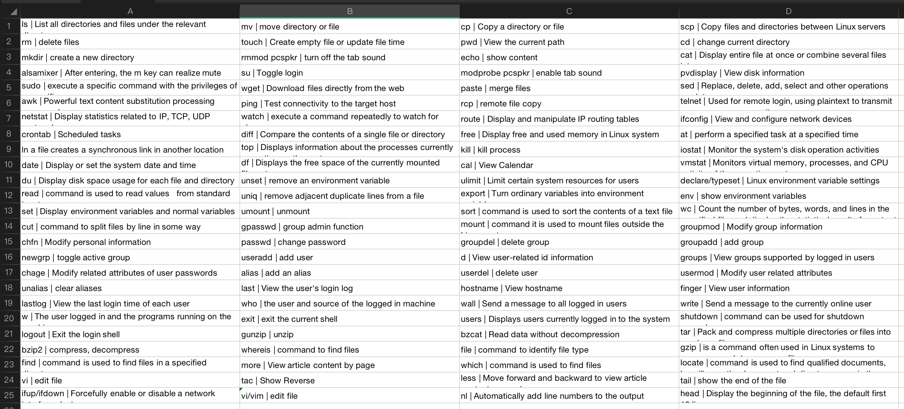

<h1 style="color:#606c71;text-align:center;" >Operation and Maintenance Engineer These Skills You Should Know</h1> 

>  &nbsp;&nbsp;&nbsp;&nbsp; The operation and maintenance engineer is a bit like the after-sales role in the traditional industry (don't get me wrong, no other meaning). It is a product researcher who provides an idea (product manager), and then to product designers or industrial manufacturers Turn the idea of ​​the product into a finished product (R&D staff), and then the sales staff sell the finished product to the customer (operation staff). But the product has been put on the market. If there is a problem, our after-sales customer service will receive feedback from the market , and then let the technical after-sales be responsible for assisting the solution (operation and maintenance personnel). If this problem or this phenomenon has already occurred, and there is a corresponding solution in the specification document or historical archived data, then repair the product and let the product Return to normal (for example, the application hangs automatically and needs to be restarted (Don't be rude). If it is not specified in the after-sales document or you do not know how to repair it, you may need to give feedback to the product design. Therefore, after-sales engineers need rich experience and skills, otherwise they will find designers in any situation, and the company will stay in place and cannot produce new products (design->maintenance-> Design...cycle). So in IT engineering too, our operations engineers also need to integrate a variety of expertise to maintain applications running in production. Let's take a look at what skills an operations engineer should have? 
>  

# O&M responsibilities

&nbsp;&nbsp;&nbsp;&nbsp; Operation and maintenance engineer, responsible for maintaining and ensuring the high availability of the entire service, while continuously optimizing the system architecture to improve deployment efficiency, optimizing resource utilization and improving the overall ROI.

&nbsp;&nbsp;&nbsp;&nbsp; The biggest challenge faced by operation and maintenance engineers is the management of large-scale clusters, how to manage services on tens of thousands or even hundreds of thousands of servers, and at the same time ensure the high availability of services. The biggest challenge.

&nbsp;&nbsp;&nbsp;&nbsp; No matter what operation and maintenance do, the most basic responsibility of the operation and maintenance engineer is to be responsible for the stability of the service, to ensure that the service can provide services to users 7*24H uninterrupted. On top of this, the operation and maintenance The main responsibilities of an engineer are as follows:

* Scope: Assess the impact boundary of the problem, and make the scope of the accident as small as possible on the overall project.

* Progress: Guarantee service availability and use the most practical and fastest solution to solve ongoing problems.

* Cost: Optimize service architecture and performance tuning through technical means; reduce costs and improve ROI (return on investment) through resource optimization combinations

* Quality: Guarantee and continuously improve the availability of services, ensure user data security, and improve user experience.

<mark>Project Management Golden Triangle:</mark>

 

By Job

 

By Role

 

 
By Career

# Linux Basics

&nbsp;&nbsp;&nbsp;&nbsp; The Linux operating system is definitely the king of the current online server. Therefore, you must be familiar with some principles of the underlying system model in order to better analyze the problem when you encounter a problem. For example, the Linux kernel, File system model, Linux C programming, common network IO model, system security model, Linux device model, Linux permission model, and commonly used Linux distributions, etc.

* Linux distributions: Debian GNU/Linux, Deepin, Ubuntu, Red Hat Enterprise Linux, CentOS, Fedora, SUSE/openSUSE, etc.

* Linux permission model: The basic permission system of linux is based on UGO (U: user permission\G: permission of the group\O: other user permission), and files and folders RWX (read/write/execute) Permissions can be represented by 7 (4+2+1)) permissions and extended permissions (suid, sgid, sticky), etc.

* Linux device model: Four important concepts in the Linux device model: Bus (bus)/Class (classification)/Device (device)/Driver (driver) and which data are stored and the basic operations of their respective interactions, etc.

* Linux security model: understand SELinux mandatory access control, kernel security, network security, remote authentication, file system security, local authentication, security policy, basic theoretical knowledge of security control, etc., and know the application and configuration of basic system security\physical security and login security\disable root login and sudo\pluggable authentication module (PAM)\PAM-based password security and password policy\PAM-based access control.

* Common network IO models: There are 6 network modes available under Linux: synchronous model \ blocking IO \ non-blocking IO \ IO multiplexing \ signal-driven IO (SIGIO) \ asynchronous IO, to understand user space and kernel The idea of ​​space receipt exchange, etc.

* Linux C programming: Because many functions at the bottom of Linux are written in C language, basic knowledge of C language programming is required.

* File system model: Differences between Linux file systems (ext2/ext3/ext4/xfs/tmpfs) and file system levels, file system classifications, file system storage structures, differences between different storage media (RAM, ROM, Flash), Storage node inode, etc.

* Linux kernel: It is necessary to understand the differences between i386 and x86-64 different CPU architecture models in registers, instruction sets, memory addressing, working modes, paging management and other related functions, as well as the differences supported by different operating system manufacturers and hardware Wait.

# Common commands

&nbsp;&nbsp;&nbsp;&nbsp; Operating Linux is basically operating commands, so some commonly used names in daily life and parameters commonly used in each command must be known, even if you don’t need to memorize them all, you must know how to view the help Documents, such as man or -h, etc., I will post 100 commands commonly used in Linux. These must be basically mastered, which is very convenient and improves the efficiency in daily work.

# scripting language

&nbsp;&nbsp;&nbsp;&nbsp; Operation and maintenance basically requires at least one or two scripting languages, because many middleware or system log analysis functions on Linux are implemented through scripts. If you do not know the simple operation of several languages , it will bring a lot of inconvenience to your work, and it will also affect your analysis of the cause of the problem. Because many Linux software are open source, you can directly view the source code. If you don't know the language, you may not understand where the problem is. I don't know what caused it. So at least you should be familiar with one of the two scripting languages Shell or Python. In fact, Shell can do many things on Linux. You see that many commands under Linux are directly written by Shell , enough to see the importance, Python can analyze some files or deal with some one-time tasks is very convenient. Others such as Perl\Ruby depends on your own interests and abilities. If you have the energy to spend time learning, the more the better. But if you are familiar with Shell or Python, most of the script processing problems on the server can be solved.

# Basic Platform

&nbsp;&nbsp;&nbsp;&nbsp; Operation and maintenance need to understand some commonly used middleware, such as what functions, differences in the same functions, advantages and disadvantages, basic installation methods, cluster deployment, start/stop scripts, middleware security Access control, firewall control, etc. What middleware Linux runs has a lot to do with the direction of the company, team technology, and project background. I will talk about some common middleware, which will be used in most companies.

* Databases: MySQL, HBase, Mariadb

* Web server: Apache, Tomcat, Jboss

* Cache middleware: Redis, MongoDB, MemCached

* search engine: ElasticSearch, Solr

* Server monitoring: Zabbix, Cacti, Nagios, Openfalcon

* Bastion: JumpServer, Teleport

* Message middleware: ActiveMQ, Kafka, RocketMQ

* Proxy middleware: LVS, Nginx, Keepalive, HAProxy

* Machine system management: Puppet, SaltStackSalt, ssh, dsh, pssh

* Other software: FTP, DNS, EMAIL, NTP (unified clock server), DHCP, SSH certificate.

* AMP/LNMP(Linux+Apache/Nginx+MySQL+PHP)

# virtual technology

&nbsp;&nbsp;&nbsp;&nbsp; When it comes to servers, we have to mention virtualization technology. Virtualization is divided into full virtualization (software-assisted full virtualization & hardware-assisted full virtualization) and paravirtualization. There is more than a bit of complexity in it. It can’t be explained clearly in one or two sentences. It is estimated that several books are required. However, KVM in the field of virtualization definitely plays a pivotal role in the market. It is on the x86 hardware platform under Linux. A full-featured virtualization solution. KVM (Kernel-based Virtual Machine) is a kernel-based virtual machine. KVM is a Hypervisor integrated into the Linux kernel. It is a Linux with X86 architecture and hardware supports virtualization technology (Intel VT or AMD-V). It is a small module of Linux, which uses Linux to do a lot of things, such as task scheduling, memory management and hardware device interaction. Now many Linux virtualization on the cloud bottom layer is KVM technology, Then KVM-related knowledge points must be mastered.

* Virtualization classification: The difference between full virtualization and paravirtualization.

* KVM principle: The difference between kernel mode and user mode, how is the KVM Driver responsible for simulating the virtual machine's CPU operation, memory management, device management, etc.

* KVM basic functions: network, storage, memory, CPU, input\output, driver.

* KVM advanced features: paravirtualized driver, hot plug, VirtIO, difference between dynamic migration and static migration, KSM (shared memory), etc.

* KVM management tools: Virsh, OpenStack, CloudStack, OpenNebula, ZStack, WebVirtMgr, virt-manager, ConVirt.

# hardware related

&nbsp;&nbsp;&nbsp;&nbsp; Although there is a cloud and a professional IDC room, there is no need to build an IDC room from scratch. However, there are still many companies that choose to buy their own microcontrollers and host them in the IDC, so that some At times, the company needs to go to the computer room for operation and maintenance to cooperate or install it by itself, or some companies build a small cabinet internally and put a few microcontrollers for internal testing, etc. The related equipment includes network equipment, routers, switches, telephone equipment, etc. These They all need to be installed and maintained by operation and maintenance. Also, in the operating system, if you want to see the manufacturer and model of a certain device of a certain machine, you need to know the corresponding commands to view this information.] :#

&nbsp;&nbsp;&nbsp;&nbsp;For example, check the difference between rack, blade, tower, and cabinet of various types of servers, check the network interface type, check the hardware information of CPU, memory, hard disk, etc.

# Security

&nbsp;&nbsp;&nbsp;&nbsp; IT technology can be said to be a double-edged sword, bringing us convenience and threats at the same time. Network security is one of them. Today, with the development of hacking technology , it is not uncommon for the server to be attacked. How to ensure the security of the server is an issue that is widely concerned by the operation and maintenance community. We cannot completely solve the network security problem, but we can continuously strengthen the protection and improve the resistance of the server. So how do we improve the security of the server What about sex? IT operation and maintenance experts provide you with eight tips for maintaining server security.

* Start from the basics and install system patches in time

* Install and setup firewall

* Install network antivirus software

* Close unnecessary services and ports

* Regularly back up the server

* Set account and password protection

* Monitoring system log

* Authorization follows the principle of target responsibility

# Cloud vendors

&nbsp;&nbsp;&nbsp;&nbsp; Now the cloud platform is very mature and stable, the cloud platform products are simple and efficient, and the processing capacity is elastically scalable computing services. Help you quickly build more stable and secure applications, improve operation and maintenance efficiency, reduce IT costs make you more focused on core business innovation. Therefore, you must be familiar with and use the products of current mainstream cloud vendors, including cloud servers, databases, load balancing, elastic scaling, CDN, etc., and large cloud vendors have relevant certifications , For example, Ali has ACA/ACP/ACE. Amazon has SAA/SAP, Tencent has TCA/TCP/TCE, Google's PCA/PCD, Microsoft AZ-300/AZ-301, etc. If you have passed several cloud platform advanced The certification qualification will definitely give you a lot of points in the job search process. It is enough to use Alibaba Cloud for domestic business, and the market share of other cloud vendors can basically be ignored (too little), and Amazon Cloud is enough for foreign business.

# Conclusion 

&nbsp;&nbsp;&nbsp;&nbsp; The operation and maintenance technical aspects listed above are mainly based on my working experience and frequent dealings with operation and maintenance personnel in these years. Terminal, testing, server operation and maintenance, database operation and maintenance, computer room operation and maintenance, etc. are all one-stop services. But the salary is only one (🤬). At that time The screenwriters in the domestic technical circle have not been divided so clearly. Now they can be divided into more detail. It is the development of technology and the progress of the market. I hope that each type of work can be more focused and deeply specialized. Operation and maintenance technical work is also divided now. There are several. Therefore, you must clarify your own operation and maintenance positioning, whether it is operation and maintenance research and development (DevOps), system assurance operation and maintenance (SRE), or security operation and maintenance architecture and management (Expert&Manager). The road to technology is long. You should learn to be motivated to move forward!

 

### [back](./)
