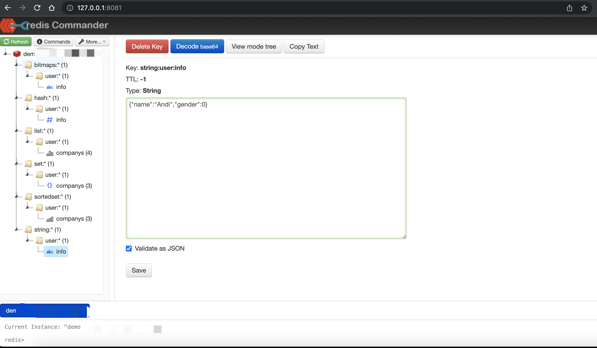

<iframe src="detail-header.html" title="Github of Anigkus" style="height:0px,widht:0px;display:none" id="kusifreamheader"></iframe>

<h1 style="color:#606c71;text-align:center;" id="h1" >Redis data visualization management tool recommendation</h1><br/>

<center>

</center>

> <br/>&nbsp;&nbsp;&nbsp;&nbsp; As programmers, Redis is not unfamiliar to us, and almost all of us have dealt with it. Redis is a NoSQL type of key-value pair memory database, which is particularly important in scenarios with large data volumes and high concurrency , but most of the time it is used as a cache to reduce the IO pressure of the back-end relational database. Redis itself is not intuitive enough to query data display, and only a `redis-cli` command line tool is provided in the installation package. There are a lot of graphical management tools in the community, and sometimes it is more comfortable to use graphics (when you just want to click the mouse, 😄). The tools are basically divided into management tools or monitoring tools, which I will talk about below. Then I recommend several open source graphical tools here. The following applications have been personally verified by me, and you can try them when you are free.<br/>
> <br/>

# Demo Data

```
127.0.0.1:6379> keys *
(empty array)
127.0.0.1:6379> info server
# Server
redis_version:6.2.7
redis_git_sha1:00000000
redis_git_dirty:0
redis_build_id:f300021a674a92d6
redis_mode:standalone
os:Linux 4.18.0-277.el8.x86_64 x86_64
arch_bits:64
monotonic_clock:POSIX clock_gettime
multiplexing_api:epoll
atomicvar_api:c11-builtin
gcc_version:8.5.0
process_id:568483
process_supervised:no
run_id:920f24df4f0321d047e6d1aa2ca7900bb16109f5
tcp_port:6379
server_time_usec:1654074930873401
uptime_in_seconds:181028
uptime_in_days:2
hz:10
configured_hz:10
lru_clock:9907762
executable:/usr/local/redis-627/bin/redis-server
config_file:
io_threads_active:0

# Sting
127.0.0.1:6379> SET string:user:info '{"name":"Andi","gender":0}'
OK
127.0.0.1:6379> GET  string:user:info
"{\"name\":\"Andi\",\"gender\":0}"

# List
127.0.0.1:6379> LPUSH list:user:companys "facebook"
(integer) 1
127.0.0.1:6379> LPUSH list:user:companys "twitter"
(integer) 2
127.0.0.1:6379> LPUSH list:user:companys "microsoft"
(integer) 3
127.0.0.1:6379> LPUSH list:user:companys "facebook"
(integer) 4
127.0.0.1:6379> 
127.0.0.1:6379> LRANGE list:user:companys 0 -1
1) "facebook"
2) "microsoft"
3) "twitter"
4) "facebook"

# Hash
127.0.0.1:6379> HMSET hash:user:info username Andi company Facebook gender 0
OK
127.0.0.1:6379> HGETALL hash:user:info
1) "username"
2) "Andi"
3) "company"
4) "Facebook"
5) "gender"
6) "0"

# Set
127.0.0.1:6379> SADD set:user:companys "facebook"
(integer) 1
127.0.0.1:6379> SADD set:user:companys "twitter"
(integer) 1
127.0.0.1:6379> SADD set:user:companys "microsoft"
(integer) 1
127.0.0.1:6379> SADD set:user:companys "facebook"
(integer) 0
127.0.0.1:6379> SMEMBERS set:user:companys
1) "microsoft"
2) "facebook"
3) "twitter"

# Sorted Set
127.0.0.1:6379> ZADD  sortedset:user:companys 10 facebook
(integer) 1
127.0.0.1:6379> ZADD  sortedset:user:companys 60 twitter
(integer) 1
127.0.0.1:6379> ZADD  sortedset:user:companys 40 microsoft
(integer) 1
127.0.0.1:6379> ZRANGE sortedset:user:companys 0 -1
1) "facebook"
2) "microsoft"
3) "twitter"

# Bitmaps
127.0.0.1:6379> setbit bitmaps:user:info 1001 1
(integer) 0
127.0.0.1:6379> setbit bitmaps:user:info 1002 0
(integer) 0
127.0.0.1:6379> setbit bitmaps:user:info 1003 1
(integer) 0
127.0.0.1:6379> getbit  bitmaps:user:info 1001
(integer) 1
127.0.0.1:6379> getbit  bitmaps:user:info 1002
(integer) 0
127.0.0.1:6379> getbit  bitmaps:user:info 1003
(integer) 1
127.0.0.1:6379> bitcount bitmaps:user:info
(integer) 2
```

# RedisInsight

&nbsp;&nbsp;&nbsp;&nbsp; RedisInsight is produced by RedisLab. Redis Labs is a cloud database service provider dedicated to providing cloud hosting service platforms for popular NoSQL open source databases such as Redis and Memcached. Officially provides a lot of Redis Integration plug-ins, such as RediSearch, RedisJSON, RedisGears, RedisAI, RedisGraph, RedisTimeSeries, RedisBloom, etc. These are integrated with Redis in the form of `.so` packages, and they are very well received in the community and have high performance. RedisInsight core code It is developed using TypeScript, and then built into distribution packages for different platforms, that is, a shell for different platforms is put on the outside, and the HTML rendering engine is integrated inside.

## Features

* RedisLab

* Built-in support for Redis modules

* Memory analysis of Redis

* Trace Redis command

* Redis resource monitoring

* Supports major operating systems

* Support stand-alone version, Redis Sentinel, Redis Enterprise Cluster, Redis Enterprise Cloud, etc.

* Support automatic selection of database, SSL protocol, new version of Auth authentication mode

* Support CLI operation

## software screenshots

<center>

</center>

## Review experience

* The interface is very beautiful

* Function at a glance

* The operation is very simple

* Various resource reports

* Support RedisJSON format

* Easy to browse, filter and visualize key values in Redis data structures

* Advanced Command Line Interface (Workbench)

<mark>Recommended</mark> : 🌟🌟🌟🌟🌟🌟🌟🌟🌟🌟

<mark>Repository</mark> : https://github.com/RedisInsight/RedisInsight

<mark>Download</mark> : https://redis.com/redis-enterprise/redis-insight/

<mark>Developer languages</mark> : TypeScript

<mark>Support platform</mark> : Mac App Intel、Mac App M1、Windows、Linux、Docker

# p3x-redis-ui

&nbsp;&nbsp;&nbsp;&nbsp; P3X Redis UI is a very functional handy database GUI and works in your pocket on the responsive web or as a desktop app

## Features

* Server resource monitoring

* View keys in tree form

* View and edit key values

* Support CLI operation

* Provide command line help function

* Cross-platform support

## software screenshots

<center>

</center>

## Review experience

* The interface is not bad, it supports key value search

* Support master-slave, cluster mode, do not support sentry mode

* Support RedisJSON format

* Supports multiple languages

* Support multi-skin switching

<mark>Recommended</mark> : 🌟🌟🌟🌟🌟🌟🌟🌟🌟

<mark>Repository</mark> : https://github.com/patrikx3/redis-ui

<mark>Download</mark> : https://www.corifeus.com/redis-ui

<mark>Developer languages</mark> : JavaScript、HTML

<mark>Support platform</mark> : Mac App 、Windows、Linux

# AnotherRedisDesktopManager

&nbsp;&nbsp;&nbsp;&nbsp; A faster, better and more stable redis desktop manager, compatible with Linux, windows, mac. What's more, it won't crash when loading massive keys 

## Features

* View keys in tree form

* Support CLI operation

* Supports different DB selections

* Support server configuration information display

* Supports direct, sentinel and cluster modes

## software screenshots

<center>

</center>

## Review experience

* The interface is general, the function is OK

* Support server resource information monitoring

* Support key filtering

* It is very convenient to support different Tab page switching

<mark>Recommended</mark> : 🌟🌟🌟🌟🌟🌟🌟🌟

<mark>Repository</mark> : https://github.com/qishibo/AnotherRedisDesktopManager

<mark>Download</mark> : https://github.com/qishibo/AnotherRedisDesktopManager

<mark>Developer languages</mark> : C++ ,C

<mark>Support platform</mark> : Windows、Mac App、Linux

# RESP.app

&nbsp;&nbsp;&nbsp;&nbsp; RESP.app (previously known as RedisDesktopManager), is a cross-platform open source GUI application for Redis developed by a Ukraine company that can be used on Windows, Linux and macOS. Provides an easy-to-use interface to access your Redis and perform some basic operations, etc., and can also connect to Redis instances on mainstream clouds. This tool needs to be paid, only the Linux version is fully functional and free, other versions are based on different The function charges are not the same, but you can use it for 14 days with a free subscription.

## Features

* View keys in tree form

* Supports CRUD operations

* Support SSL/TLS encryption

* Supports connecting to Redis instances on the cloud through SSH tunnels

## software screenshots

<center>

</center>

## Review experience

* The interface is general, the function can meet the basic use

* Paid software (free for linux), and different platforms and different functions have different charges

* No resource monitoring function

* Support RedisJSON format

* Support import and export number

* Disadvantage: cluster mode support is not enough, it seems to be master-slave by default

<mark>Recommended</mark> : 🌟🌟🌟🌟🌟🌟🌟

<mark>Repository</mark> : https://github.com/uglide/RedisDesktopManager

<mark>Download</mark> : https://resp.app/ , https://docs.resp.app/en/latest/install/

<mark>Developer languages</mark> : C++、QML

<mark>Support platform</mark> : Mac App 、Windows、Linux

# Redis Commander

&nbsp;&nbsp;&nbsp;&nbsp; Redis-Commander is a node.js web application used to view, edit, and manage a Redis Database

## Features

* server information

* View keys in tree form

* View and edit key values

* Support CLI operation

* Provide command line help function

## software screenshots

<center>

</center>

## Evaluation experience

* The interface is general, the function can meet the basic use

* Clusters that support master-slave mode

* Serverless resource monitoring

* Node installation, support cross-platform

* Disadvantage: The default startup will connect to port 6379 of the local machine. If there is no error log, it is just a bit of a bad experience

<mark>Recommended</mark> : 🌟🌟🌟🌟🌟🌟

<mark>Repository</mark> : https://github.com/joeferner/redis-commander

<mark>Download</mark> : http://joeferner.github.io/redis-commander/

<mark>Developer languages</mark> : JavaScript、EJS

<mark>Support platform</mark> : Web browser

# QRedis

&nbsp;&nbsp;&nbsp;&nbsp; QRedis is a small GUI tool developed with Python +Qt, the command line installation method.

## Features

* View keys in tree form

* Support CLI operation

* Support connecting TCP and Socket

* Support display server configuration information

## software screenshots

<center>

</center>

## Review experience

* The interface is ok, compared to the Qt skin, but only the basic functions

* The program itself is a bit unstable and easy to exit abnormally

* Resource monitoring, import and export, cluster mode are not supported

* Support key filtering and segmentation when connecting, which can reduce the amount of loaded data

<mark>Recommended</mark> : 🌟🌟🌟🌟🌟

<mark>Repository</mark> : https://github.com/tiagocoutinho/qredis

<mark>Download</mark> : https://github.com/tiagocoutinho/qredis

<mark>Developer languages</mark> : Python+Qt 

<mark>Support platform</mark> : Mac App 、Windows、Linux

# QuickRedis

&nbsp;&nbsp;&nbsp;&nbsp; QuickRedis is a permanent free Redis visual management tool. It supports direct connection, sentinel, cluster mode, supports hundreds of millions of keys, and an exciting UI. QuickRedis supports Windows, Runs on Mac OS X and Linux. QuickRedis is a productivity tool, while others are struggling to type commands while you're already drinking tea.

## Features

* View keys in tree form

* Support CLI operation

* Supports different DB selections

* Support server configuration information display

* Support server grouping

* Supports direct, sentinel and cluster modes

## software screenshots

<center>

</center>

## Review experience

* The interface is ok, to meet the basic functions

* There is a bug in the grouping function on the left

* `Auth User Password` mode of Redis 6 is not supported, only `Password` mode is supported

* Support key filtering

* Server resource monitoring function is not supported

<mark>Recommended</mark> : 🌟🌟🌟🌟

<mark>Repository</mark> : https://github.com/quick123official/quick_redis_blog

<mark>Download</mark> : https://quick123.net/

<mark>Developer languages</mark> : JavaScript

<mark>Support platform</mark> : Windows 、 Mac OS X 、 Linux

# RedisStudio

&nbsp;&nbsp;&nbsp;&nbsp; Redis Studio is Redis GUI Client, supports Windows xp\Vista\7\8\8.1\10 and other versions, the kernel is MSOpenhiredis, GUILIB is duilib, supports official Redis 2.6 2.7 2.8 and the latest version. 

## Features

* View keys in tree form

* Support CLI operation

* Supports different DB selections

* Support server configuration information display

## software screenshots

<center>

</center>

## Review experience

* The interface is ok, the function is simple

* Cluster mode is not supported, master-slave support

* key filtering is not supported

* No cross-platform, just Windows system

<mark>Recommended</mark> : 🌟🌟🌟

<mark>Repository</mark> : https://github.com/cinience/RedisStudio

<mark>Download</mark> : https://github.com/cinience/RedisStudio

<mark>Developer languages</mark> : C++ ,C

<mark>Support platform</mark> : Windows

# Redis Explorer

&nbsp;&nbsp;&nbsp;&nbsp; Redis Explorer is a simple desktop Redis client developed in C#.

## Features

* View keys in tree form

* Support CLI operation

* Supports different DB selections

## software screenshots

<center>

</center>

## Review experience

* The interface is ok, the function is simple

* Password connection not supported

* Cluster mode is not supported, master-slave support

* Does not support key filtering, but supports configuring the maximum number of loaded keys

* No cross-platform, just Windows system

<mark>Recommended</mark> : 🌟🌟

<mark>Repository</mark> : https://github.com/leegould/RedisExplorer

<mark>Download</mark> : https://github.com/leegould/RedisExplorer

<mark>Developer languages</mark> : C#

<mark>Support platform</mark> : Windows 


# Redis Browser

&nbsp;&nbsp;&nbsp;&nbsp; A web application developed based on Ruby+JavaScript, the function is really simple.

## Features

* View keys in tree form

* View all redis types of content

* List pagination

* Support key value lookup

* formatted JSON

* Can connect to multiple databases

* Can be integrated with Rails applications

## software screenshots

<center>

</center>

## Review experience

* The interface is too simple, the function is too simple

* The connection information is loaded according to the startup parameters or configuration files, which is inconvenient

* In addition to viewing basic key values, there are no other functions, it is just a demo

<mark>Recommended</mark> : 🌟

<mark>Repository</mark> : https://github.com/humante/redis-browser

<mark>Download</mark> : https://github.com/humante/redis-browser

<mark>Developer languages</mark> : JavaScript、Ruby

<mark>Support platform</mark> :Linux、Mac OS、Windows

# Conclusion

&nbsp;&nbsp;&nbsp;&nbsp; There are about ten Redis GUI tools introduced above. Some of them support multi-platform applications, and some need to be started by themselves through the command line. Some only support Windows systems. You can see your own needs. You can refer to `Recommended` Index, hope you like these.


<br>

### [back](./)


