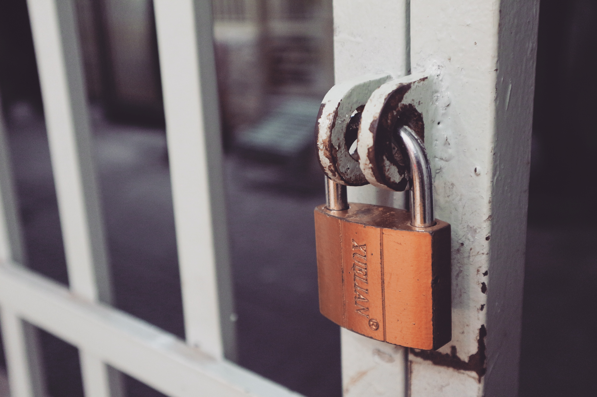

<h1 style="color:#606c71;text-align:center;" >Some suggestions for improving mysql database security</h1> 

>  
> &nbsp;&nbsp;&nbsp;&nbsp; MySQL is the most popular RDBMS (Relational Database Management System) relational database management system. It was developed by the Swedish MySQL AB company and eventually acquired by Oracle. Later, a number of open source branches appeared one after another,the more popular ones being XtraDB, Percona, MariaDB (The main creator of MariaDB is Monty Widenius,Who is also the original creator of MySQL). MySQL and the open source version are both popular relational OLTP databases, helping users solve OLTP-related problems in countless enterprises, so how to How to improve the security of MySQL itself?This article will lead you to do a good job of MySQL security. 
>  

## Upgrade the operating system
&nbsp;&nbsp;&nbsp;&nbsp;The first step in improving MySQL security is to upgrade the operating system of the server where MySQL is located. The operating system itself will have security vulnerabilities and other problems, and the operating system suppliers will also regularly release upgrade patches, so in order to avoid security risks caused by system vulnerabilities , we must regularly upgrade the operating system kernel and patches. We need to consider the compatibility of the patch version, do a good job of all database-related backups, and make multiple sets of plans in advance, and we need to test the database with the kernel and the same version of the database server first. Patch verification, then be sure to implement relevant stress tests and carefully analyze whether the system vulnerability has been fixed, verify the difference between before and after the upgrade, and then gradually upgrade to the database machine system in the production environment to avoid major security incidents in the company. Now, DB and operation and maintenance can basically start running, and developers can update their resumes, ready to start a new life (😄)... 

## 升级MySQL

## 升级MySQL依赖组件

## 操作系统的安全组件

## 提高密码复杂度

## 使用SSL协议

## 最小授权原则

## 授权遵循原则

## 安全审计日志

## 数据备份策略
 

[back](./)