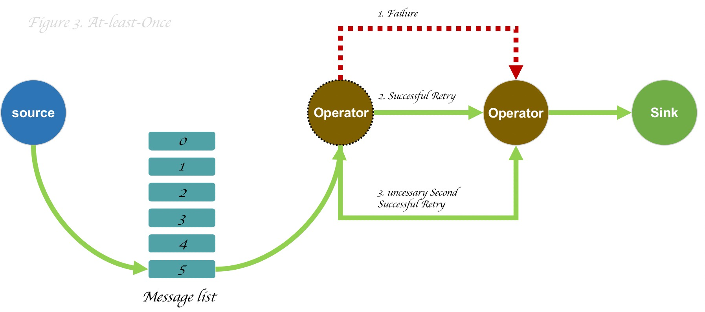
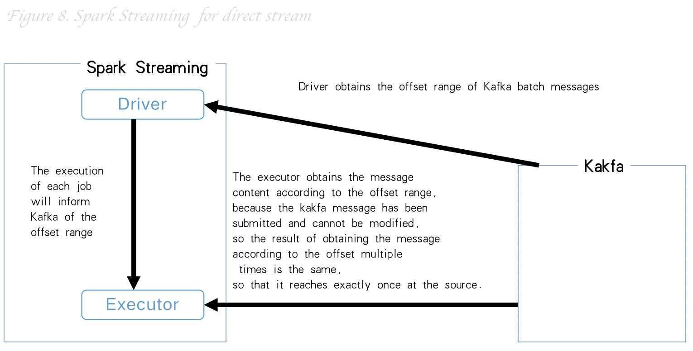

<iframe src="detail-header.html" title="Github of Anigkus" style="height:0px,widht:0px;display:none" id="kusifreamheader"></iframe>

<h1 style="color:#606c71;text-align:center;" id="h1"  >Talk about delivery semantics in message middleware</h1> 

>  &nbsp;&nbsp;&nbsp;&nbsp; Stream computing in distributed systems has become an increasingly popular topic in the field of big data processing. Popular stream processing engines (SPE) in the industry community include Flink (Flink DataStream), Spark (Spark Streaming), Storm (Storm Streams), Pulsar (Pulsar Functions), Kafka (Kafka Streams), etc. One of the most widely discussed features is their message processing semantics, but now there are three types of delivery semantics recognized by the industry (At Least Once, At Most Once, Exactly Once ). Among them, the most discussed and most complex semantics is Exactly Once. Exactly Once is usually understood as "there is and only once, the message is not lost, not repeated, and only consumed once". I actually prefer to call the processing semantics of Exactly Once "Exactly once", no more, no less, just right. The following content will be compiled based on my personal understanding and some articles. The following is a brief talk about the characteristics of these three semantics and the semantic implementation ideas in each message middleware, etc. . 
>  

# Background

&nbsp;&nbsp;&nbsp;&nbsp; Stream processing, sometimes called event processing, can be succinctly described as the continuous processing of infinite data or events. Stream or event processing applications can be described more or less as directed graphs (Directed Graph), but is often described as a (Directed Acyclic Graph) DAG. In such a graph, each edge represents a data or event flow, Each vertex represents one or more computational operations that use application-defined logic to process data or events from adjacent edges. There are two special types of vertices, commonly referred to as data sources and sinks. Data sources Consume external data/events and inject them into the application, while the receiver usually collects the results produced by the application. The following figure depicts an example of a typical processing topology application.

&nbsp;&nbsp;&nbsp;&nbsp;Application handlers that execute streams or events often allow the user to specify reliability modes or processing semantics to express what guarantees it will provide for graph data processing throughout the application flow. These guarantees make sense , because you can always assume data loss due to the possibility of a failure over the network, machine, etc. There are three patterns involved here: at most once, at least once, exactly once, usually used to describe what a Stream Processing Engine (SPE) provides to The data processing semantics of the application.

* At-Most-Once: at most once, the message may be lost, but not repeated
* At-least-Once: at least once, the message is definitely not lost, but may be repeated
* Exactly-Once: there is and only once, the message is not lost or repeated, and it is only consumed once
  
# At-Most-Once

&nbsp;&nbsp;&nbsp;&nbsp; At most once means that the message is delivered at most once, and once delivered, there is no chance to deliver it again. If the consumer cannot process the message due to some exception, the message is lost, so it may appear that the message is not consumed. This is essentially a "best effort" approach. The data or event is guaranteed to be processed at most once by all operations in the application. This means that if in a streaming application it may be lost before it is fully processed If the event has been retrieved, then no additional attempts will be made to retry or retransmit the event. The following diagram depicts a simple At-Most-Once example.

This is the cheapest and most performant because it uses the least performance overhead, as it can be done in a fire-and-forget fashion without maintaining state on the sender or transport mechanism.

# At-Most-Once

&nbsp;&nbsp;&nbsp;&nbsp; Data or events are guaranteed to be manipulated at least once by all operators in the application graph. This usually means that events may be retransmitted if they are lost or fail before the streaming application is fully processed. However, since it can be retransmitted, an event can sometimes be processed more than once, hence the "at least once" semantics. As shown in the figure below, the second operation is processed the first time, right, and then the first operation It only succeeds when it retries, then it turns out to be an unnecessary second (async cross-network) operation, but it succeeds when it retries again (successful 2 times).

This mode requires each operator to solve the logic of repeated processing of data (idempotent problem), and there are redundant invalid requests and logical processing.

# Exactly-Once

&nbsp;&nbsp;&nbsp;&nbsp; In fact, in the event processing process, various abnormal situations may occur, so it is impossible to guarantee 100% that each message will only be processed once Data operation consistency is generally guaranteed by the 2PC protocol (weighing 3PC).

Generally, there are two schemes commonly used in the industry to achieve the so-called "exactly once":
* Distributed checkpoint
* Deduplication

&nbsp;&nbsp;&nbsp;&nbsp; The mechanism of distributed checkpointing is that all states of each operator in the streaming application will be periodically saved as snapshot points. If a failure occurs anywhere in the system, then the All state is rolled back to the most recent globally consistent checkpoint. The advantage is a lower performance overhead (memory level). The disadvantage is that it can potentially affect performance as the cluster grows.

As shown in the figure above, under normal circumstances, the stream processing program periodically saves the current checkpoint (Figure 4). S=2 has been permanently stored, and the operation operator of the current checkpoint S=24 is only stored in memory (Figure 5). In order to solve this abnormal situation , the state of multiple internal operators will be rolled back to the most recent persistent checkpoint (Figure 6), so although some operations have been processed multiple times, this is not will affect the result, because the end result is always the same.

The mechanism of deduplication is actually to maintain a transaction log for each operation in combination with the event log. The advantage of this mechanism is that the performance impact is relatively low, and it will not increase with the scale of the cluster. The disadvantage is that it needs to be redundant. Disk space is used to store operation logs. (Kafka and Pulsar both use this mechanism to implement).

Exactly-Once is the most expensive and requires a lot of mechanisms and storage costs to ensure accuracy. For most systems, At-Most-Once is sufficient.

# The respective implementations and differences of streaming batch processing and streaming messages

&nbsp;&nbsp;&nbsp;&nbsp; Each middleware implements a variety of semantics, and the implementation of each semantics is necessarily related to performance and efficiency, so the following description will only describe the general idea of the implementation of Exactly-Once in each middleware, and the other two (At-Most-Once&At-Most-Once) will not be explained here.

## Flink

&nbsp;&nbsp;&nbsp;&nbsp; Flink claims to implement Exactly Once semantics, the core function of which is the Checkpoint fault tolerance mechanism. It will periodically generate snapshots of the state of each operator in the stream according to the user's configuration, and then persist The implementation semantics of different connectors in Flink are different, and third-party storage components are required to support transaction implementation, so the official end-to-end consistency semantics can be realized. The following is an example of kafka:

<mark>Actually, there are 3 important roles in the second stage:</mark>

* Client (AP): It is the kafka source in the picture
* Coordinator (TM): It is the JobManager in the figure
* Participant (RM): It is the operator `(source|Operator|Sink)` in the graph, etc.

The general process in the above figure is divided into the following three execution steps:

* Start
&nbsp;&nbsp;&nbsp;&nbsp; The JobManager injects Checkpoint into the kafka source node, and then initializes some data internally and starts a new transaction, and also reports the data between the current barriers to the checkout state (A commit will submit all data between two checkpoint barriers) .

* Pre-Commit
&nbsp;&nbsp;&nbsp;&nbsp; kafka source will broadcast the checkpoint barrier to each downstream operator node, and will also execute the local checkout snapshot to the state machine at the same time, and so on, until all computing nodes in the link have received After the barrier and the checkpoint execution, finally when the kafka sink executes the checkpoint, the transaction pre-commit (one-stage transaction) is submitted to kafka, and the state checkout machine will also persist periodically. hard disk.

* Commit
&nbsp;&nbsp;&nbsp;&nbsp; When all nodes of the flow graph complete the checkpoint, the JobManager will notify all operators that the checkpoint of this complete process has been completed. At this time, the kafka sink submits the transaction commit(Second-phase final transaction submission and relying on the connector to achieve on-the-ground storage).

## Spark

&nbsp;&nbsp;&nbsp;&nbsp; The Exactly Once semantics in Spark is implemented using Spark Streaming. Streaming is a real-time computing framework, so it is divided into three steps: source (input), operator (operator), and sink (output). The three steps need to cooperate with each other, and the implementation methods of different integration components are also different. Spark Streaming integration now has two solutions: the old receiver-based method and the new direct stream-based method. The following figure is Spark Streaming is based on the example of direct stream (introduced by Spark 1.3) combined with Kafka.

* ource: input terminal, as shown above
* operator: The processing side, the processing logic is implemented using Spark RDD, because RDD has the characteristics of immutable, partitionable, parallel computing, and fault tolerance.
* sink: The output end, the output requires the business to support idempotent writing or transactional writing to ensure the so-called exactly once.

## Storm

&nbsp;&nbsp;&nbsp;&nbsp; The Exactly Once semantics in Storm is implemented using the Trident API. The core mechanism is to track the state of the tuple (Tuple) in the topology, so as to achieve the so-called Exactly Once, Tuple uses Spout (source), Bolt (which can be understood as an operator or next-stage processor) and Acker (confirmation point, similar to a two-stage TM) coordinate to complete the processing.

Send Tuple data from the Spout source to the downstream Bolt operator, and also inform Acker of related information. If a node in the entire Tuple tree is processed, it will also inform Acker of related information, whether it succeeds or fails. All Bolts are processed successfully, then Acker will notify Tuple of success, and if there is a failure in the process, Acker will also tell Spout to determine whether to retransmit the message;

## Pulsar

&nbsp;&nbsp;&nbsp;&nbsp; Pulsar was donated to Apache by Yahoo in 2016, and became the top-level project of Apache in 2018. Why do I say this project, because the Pulsar community has developed rapidly in recent years, and an open source basic software company has also been established to operate . Pulsar is a cloud-native, multi-tenant, storage-computing separation, and elastically scalable distributed stream processing platform.

&nbsp;&nbsp;&nbsp;&nbsp; The Exactly Once semantics in Pulsar implements the mechanism of message deduplication and deduplication.

In a distributed system, there will be various problems (network, disk, power supply), etc. As shown in the figure above, when the first operation fails to pass data to the downstream, the system will perform the second operation. The retry is successful (successful once), but the system is distributed or the downstream operation business logic has not had time to feed back to the upstream, then the system will retry here successfully (successfully twice), then at this time the downstream will It is known that it has been processed once (global transaction TxnID, pulsar transaction ID is 128 bits), then it will be discarded and the response information will be recorded in the transaction log, then the current downstream upstream node will go to the log to delete the excess Process the records so that the operation is "exactly once", neither over nor under.

## Kafka

&nbsp;&nbsp;&nbsp;&nbsp; The Exactly Once semantics in Kafka uses a transaction mechanism, which supports atomic writes across multiple partitions, and is guaranteed in combination with a data deduplication mechanism.

Kafka is atomic for a single partition or across partitions in a transaction, so each operation will have a global transaction ID. If a transaction ID is sent multiple times by the producer, then when the message Kafka consumer broker will know that it is a duplicate message, it will ignore the record and return a DUP response to the client, and will delete the duplicate log information.

# Conclusion

&nbsp;&nbsp;&nbsp;&nbsp; This article is mainly to briefly explain the three implementation principles and ideas of At-Most-Once, At-least-Once and Exactly-Once in message processing semantics and why there are these three, different processing The semantic mechanism is closely related to the goal that the current component wants to achieve. There are performance priorities (At-Most-Once), messages are not lost but idempotent (At-least-Once), and strongly guaranteed (Exactly- Once), the difficulty and application scenarios of different implementation ideas. And also analyzed the corresponding internal semantic implementation mechanism of several current mainstream distributed stream batch processing frameworks and stream processing message middleware.

 

### [back](./)
