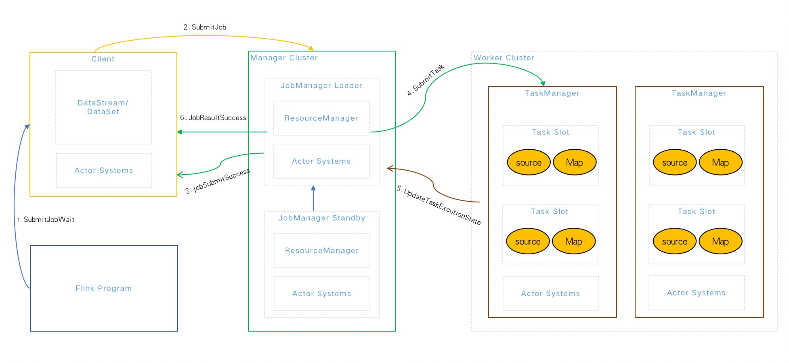
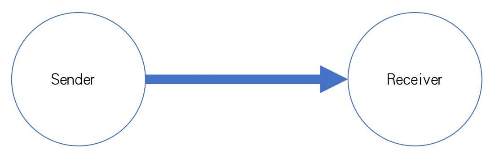

<h1 style="color:#606c71;text-align:center;" >Talk about the three highs in the integration of flink streaming and batching</h1> 

>  &nbsp;&nbsp;&nbsp;&nbsp; The "three highs" mentioned here are not "[three hights](https://baike.baidu.com/item/三高/2898551)"(😂) Oh,there have always been three pursuit goals in the iterative history of software development: high performance, high concurrency, and higt availability, commonly known as three hights. The there are both different and related. From the perspective of software development history, I personally think that the development process is high performance ( Single core) -> high concurrency (multi-core) -> high availability (multi-machine). 
>  &nbsp;&nbsp;&nbsp;&nbsp; Of course, it is high performance first. From the very old DOS as as single-user operating system, to the later Window98 as a multi-tasking system (actually a single process), and later UNIX supports a multi-user multi-tasking operating system (the real meaning of multi-process, multi-threaded system),the purpose is how to process the program with the highest performance in the case of a CPU.
>  &nbsp;&nbsp;&nbsp;&nbsp; The second is high concurrency. Of course, what needs to the broken is the processing limit of a single machine. If the memory of CPU of a single machine is insufficient, the hardware configuration os a single machine can be increased  by vertical expansion to maximize concurrency, and single-core becomes multi-core, so that parallelism can be achieved at the same time. Multiple tasks, thereby speeding up the overall thime cost of processing. 
>  &nbsp;&nbsp;&nbsp;&nbsp; Then when the performance of the single-machine processing reaches a certain bottleneck, it must scale horizontally, that is, to develop and distributed involves high availability, that is, the possibility of a single node hanging up must be considered. The industry's usual middleware deployment 3 nodes, which is designed for high availability.  
>  

Flink architecture and process

All distributed RPC communication in Flink relies on the [Akka framework](https://doc.akka.io/docs/akka/current/general/terminology.html) (a high-performance, fault-tolerant distributed Concurrent Application Framework).
* Flink Program: Submit tasks using CLI, WebUI, Code(Java&Scala), etc.;
* Client: Use DataStream (stream computing), DataSet (batch computing) for business logic development, etc.;
* JobManager: Responsible for resource allocation, CheckPoint coordination, task stats maintenance, etc. (JobManager Standby needs to be implemented with Zookeeper or Yarn); 
* TaskManager: equivalent to Slave, responsible for specific task execution and resource application and management of corresponding tasks in echo node, etc.

# High Performance

## Flink Cache Mechanism

### Distributed Cache

&nbsp;&nbsp;&nbsp;&nbsp; In batch computing, most of the data to be processed comes from external files, which may come from systems like HDFS or S3 file systems in AWS, but Flink is not like MapReduce In the same way, the calculation can be performed with the location of the data, so in most cases, the network frequently copies files. Therefore, for some frequently used files, you can use a distributed cache mechanism provided  by Flink internally, Placing it in the local memory of each computing node instance allows users to easily read the local file in parallel functions, and put it in the taskmanager node to prevent tasks from being repeatedly pulled. The working mechanism of this cache is The program registers a file or directory (local or remote file system, such as hdfs or s3), registers the cache file with the ExecutionEnvironment and  gives it a name. Then when the program is executed, Flink automatically copies the file or directory to the local file system of all taskmanager nodes, which will only be executed once. Users can search for the file or directory by this specified name, and then access it from the local file system of the taskmanager node. In fact The distributed cache is equivalent to the broadcast mode in the message queue, which broadcasts a variable to all taskmanagers, except that a file is broadcast here. This can effectively avoid reading some files and having to obtain them through a remote network The situation of the file content, thereby improving the execution efficiency of the entire task. 

### Network Buffer

&nbsp;&nbsp;&nbsp;&nbsp; Network Buffer is the Buffer used in network transmission (actually non-network transmission will also be used). Students who understand the Flink network stack should know better that Flink transmits the upstream and downstream tasks through the network. The design will be similar to the producer-consumer model. Without this buffer, the producer or consumer will spend a lot of time waiting for the downstream to get data and the upstream to send data. With this buffer, the producer and consumer In theory, the jitter of one party in a short time will not have much impact on the data processing of the other party.

There are three situations in Flink where the Netty server can consume the cache:
* Refrsh when the buffer is full
* Refresh after buffer timeout
* Refresh after special events

## Flink back pressure machanism

Let's about what back pressure is, as shown below:

&nbsp;&nbsp;&nbsp;&nbsp; Under normal circumstances, if the message processing speed (Receiver) >= the message sending speed (Sender), there will be no message congestion. The system runs smoothly, but when the message is sent too fast, the message is received too slowly, resulting in message congestion. It can automatically reduce the speed of message sending, which is the back pressure mechanism.

&nbsp;&nbsp;&nbsp;&nbsp;How does Flink trade off between throughput and latency? In a streaming system, if the speed of downstream consumption cannot keep up with the speed of upstream production data, this phenomenon is called back pressure .When backpressure occurs, it is reasonable to limit the speed of upstream producers so that the downstream speed can keep up with the upstream speed. Backpressure will increase the data delay of stream processing jobs, and will also affect Checkpoint. Flink naturally supports streaming It can process one piece of data every time it comes, instead of a complete micro-batch like Spark Streaming. However, in order to improve throughput, the default Flink used does not process one piece of data every time. How to control it? Flink uses an efficient and bounded distributed blocking queue.

&nbsp;&nbsp;&nbsp;&nbsp;For example, after the upstream Subtask S2 sends data, there are still 4 Buffers that are backlogged, then the sent data and Backlog size = 4 will be sent to the downstream Subtask S5. After receiving the data, the downstream knows There is a backlog of 4 Buffers in the upstream, so apply for Buffers from the Buffer Pool. Due to the limited capacity, the downstream InputChannel currently has only 2 Buffer spaces. Therefore, Subtask S6 will feedback Channel Credit = 2 to the upstream Subtask S2. Then the upstream will only give at most the next time. The data of 2 Buffers is sent downstream, so that the data sent upstream each time is the amount of data that the Buffer of the downstream InputChannel can bear. Therefore, through this feedback strategy, it is ensured that data will not accumulate in the shared Netty and TCP layers. Affects other Subtask communications.

How to locate back pressure:
* [Monitoring Back Pressure](https://nightlies.apache.org/flink/flink-docs-release-1.14/docs/ops/monitoring/back_pressure/)
* [Monitoring, Metrics](https://flink.apache.org/2019/07/23/flink-network-stack-2.html)

## Flink Memory Management

&nbsp;&nbsp;&nbsp;&nbsp;For memory management, Flink implements its own independent memory mechanism (out-of-heap memory), which has the advantage of minimizing the impact of JVM GC on the system. The Java ecosystem provides many serialization frameworks : Java serialization, Kryo, Apache Avro, etc. But Flink implements its own serialization framework. Flink converts all data objects into binary and stores them in memory through serialization and deserialization. While reducing the size of data storage, it can More effective use of memory space, reducing performance degradation or special task exceptions caused by GC, so Flink will be more stable than other distributed frameworks sharing JVM memory, and will not affect the entire application due to JVM GC and other problems. Operating status. 

* Benefits of off-heap memory: allocation of very large memory is not affected by GC, off-heap memory is zero-copy when writing to disk or network transmission, off-heap memory is shared between processes;
* Disadvantages of off-heap memory: memory management is more complicated (need to allocate and release by yourself), the allocation speed is slower than on-heap memory, and the efficiency of short-lived memory allocation is not high;

High Concurrency

## Akka Framework

&nbsp;&nbsp;&nbsp;&nbsp;As we mentioned earlier, all distributed RPC communication in Flink relies on the [Akka framework](https://doc.akka.io/docs/akka/current/general/terminology .html), the implementation of [Akka distributed communication](https://cwiki.apache.org/confluence/display/FLINK/Akka+and+actors) adopted by Flink from version 0.9. With Akka, all Remote Procedure Calls (RPC) are implemented as asynchronous messages. This mainly affects the three components JobManager, TaskManager and JobClient. In the future, it is likely that more components will be converted into an actor, allowing them to send and process asynchronous messages.

&nbsp;&nbsp;&nbsp;&nbsp;Akka main features:
* High concurrency and distribution: mainly implemented by Akka Streams API.
* Elastic design is scalable: based on Akka Cluster library and Cluster Sharding mechanism.
* Fault tolerance: Akka's fault tolerance is based on a hierarchy.
* Decentralization: Distributed systems with no single point of failure, automatic load and adaptive routing across nodes.
* Actors model: Actor mode is a concurrency model, which is completely opposite to another model of sharing memory. Actor model shares nothing. This model has been developed for some years. Simple understanding is pipeline, which is very suitable in streaming computing scenarios. 
* Transactional Actors: Guaranteed eventual consistency based on CRDT.
* Supports JAVA and Scala: API library that supports both languages.
* High performance: up to 50 million messages/sec on a single machine. Small memory footprint; ~2.5M actors per GB heap.

## Low Latency

&nbsp;&nbsp;&nbsp;&nbsp; This basically also uses a bounded distributed blocking queue, that is, using a backpressure mechanism to achieve low latency and improve response speed, thereby increasing the number of concurrency;

## Flink Concurrently Executes 

&nbsp;&nbsp;&nbsp;&nbsp;When it comes to concurrent execution, we have to talk about slot and parallelism in Flink. Let's first understand the relationship between slot and parallelism

&nbsp;&nbsp;&nbsp;&nbsp; There are two Task Managers in the image below, each with 2 slots, so that the maximum parallelism of our operators can reach 4, and 1 to multiple subtasks can be executed in the same slot.

### slot refers to the concurrent execution capability of taskmanager
&nbsp;&nbsp;&nbsp;&nbsp;As shown in the figure below: taskmanager.numberOfTaskSlots:3; That is, each taskmanager is allocated 3 TaskSlots, and 4 taskmanagers have a total of 12 TaskSlots.

### parallelism refers to the concurrency capability actually used by taskmanager
&nbsp;&nbsp;&nbsp;&nbsp; As shown in the figure below: parallelism.default:1; That is, the default parallelism of the running program is 1, only 1 of the 12 TaskSlots are used, and 11 are idle. Setting the appropriate parallelism can improve efficiency.

The above two concepts can be understood as follows:
* Slot determines how many slots the taskmanager has. Each task represents a set of resources allocated to the task slot. A slot can be considered as a resource group in Flink. Flink divides each task into subtasks and assigns these subtasks to slots. Execute programs in parallel.
* Parallelism determines how many taskmanager can run in parallel, which can be understood as the number of concurrent threads or the number of concurrent operators.

We try not to set it from the system as much as possible, but to set it internally for different tasks. So the precautionary priority for setting parallelism is:
Operator level > Runtime environment level > Client level > System level

# High Availability

## JobManager high availability
&nbsp;&nbsp;&nbsp;&nbsp; Currently Flink high availability can support Standalone Cluster and Yarn Cluster two cluster modes, and Flink high availability is mainly aimed at JobManager, because JobManager is the management node of the entire cluster, responsible for task scheduling, Task allocation, resource management, etc. If there is a problem with the JobManager, the new job will not be submitted, and the existing jobs will all fail. Therefore, the high availability guarantee of the JobManager is particularly important. Flink does not enable the JobManager high availability by default. Configurable, (Leave a small question, what about Kubernetes!).

### Standalone Cluster
&nbsp;&nbsp;&nbsp;&nbsp; In Zookeeper, and through [Zookeepe](https://nightlies.apache.org/flink/flink-docs-master/docs/deployment/ha/zookeeper_ha/) to complete the election of the JobManager Leader. There will be multiple JobManagers in the Standalone cluster at the same time , but only one provides services, and the others are in the Standby state. When the Active JobManager loses connection (node ​​disappears or network timeout, etc.), Zookeeper will automatically elect a new JobManager from the other Standby lists to take over the Flink cluster and provide services.

### Yarn Cluster

&nbsp;&nbsp;&nbsp;&nbsp; The high availability of the Flink Yarn Session cluster mode relies on the assistance of Yarn, mainly because Yarn itself has a certain fault tolerance guarantee for the applications running on it. The Flink On Yarn mode is actually a The JobManager is executed in the container where the ApplicationMaster is located, and Yarn will not start multiple JobManagers (similar to the zookeeper mechanism), but it does not decide which Standby becomes the Leader through zookeeper election, but ensures the high availability of the JobManager by restarting.

## Checkpoints and Savepoints mechanism

&nbsp;&nbsp;&nbsp;&nbsp; We all know that independent components need high availability, and tasks also need high availability, such as abnormal situations or machine expansion and upgrades. The computing state of the task can achieve semantic guarantee or a similar transaction guarantee mechanism. Flink provides two methods for tasks, one is automatic (Checkpoints) and manual (Savepoints). [Savepoint different from a Checkpoint?](https: //nightlies.apache.org/flink/flink-docs-master/docs/ops/state/savepoints/).

&nbsp;&nbsp;&nbsp;&nbsp; [Checkpoints](https://nightlies.apache.org/flink/flink-docs-master/docs/ops/state/checkpoints/) means save points, which means that Flink will Checkout barriers (demarcation points) are generated at intervals on the input data set or in the process, and the data in the interval time is divided into corresponding save points through the barrier, so that when an abnormal situation occurs in the application, it can start from the last time. The state before the task is restored in the snapshot, but the space size of the current state is directly related to the application. If the current computing task is large, the saving time will be very long, and it will also affect the throughput. Supports Memory, FileSystem, RocksDB, but the data is usually stored on the JobManager node or HDFS, the performance difference is Memory>FileSystem>RocksDB (the worst performance), and three settings (global, task, instance) levels are supported.

As shown, there are a total of 4 savepoints:
* The first Checkpoint saves 1 Event
* The second Checkpoint saves 3 Events
* The third Checkpoint saves 6 Events
* The fourth Checkpoint saves 4 Events

The new data will not trigger the scheduled task to save the Checkpoint because the time has not yet come.

Checkpoint mechanism

&nbsp;&nbsp;&nbsp;&nbsp; [Savepoints](https://nightlies.apache.org/flink/flink-docs-master/docs/ops/state/savepoints/) is actually a special implementation of checkpoints. The Checkpoints mechanism is still used, except that Savepoints are manually triggered by the user and persist the data to the specified storage path. The main purpose is the status data in the process of system upgrade or cluster maintenance, avoiding operation and maintenance due to downtime or normal termination, etc. The system cannot be restored to the original computing state due to the operation.

# Conclusion

&nbsp;&nbsp;&nbsp;&nbsp;This article mainly analyzes and discusses some technologies and mechanisms of Flink in stream computing. Flink is the only set of distribution in the open source community that integrates high throughput, low latency and high performance Streaming data processing framework. Like Apache Spark, it can only take into account the characteristics of high throughput and high performance, mainly because there is no guarantee of low latency in Spark Streaming stream computing (because Spark Streaming does not support low latency); while streaming The computing framework Apache Storm can only support low-latency and high-performance features, but it cannot meet the requirements of high throughput (the framework itself and semantic logic); while satisfying the three goals of high throughput, low latency, and high performance is critical to the distributed stream computing framework is very important.

 

### [back](./)
