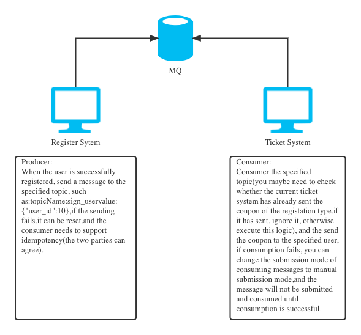
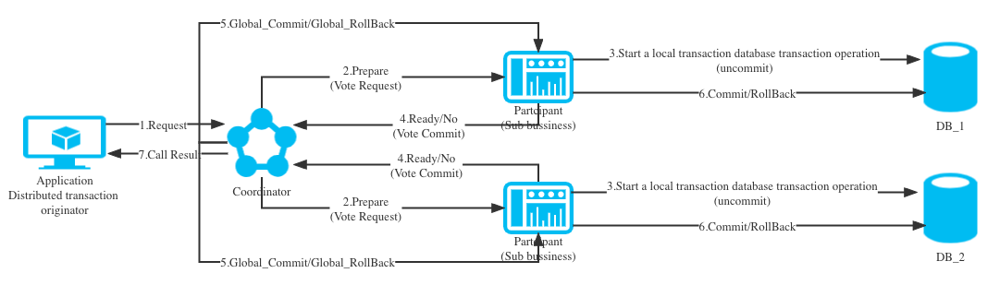
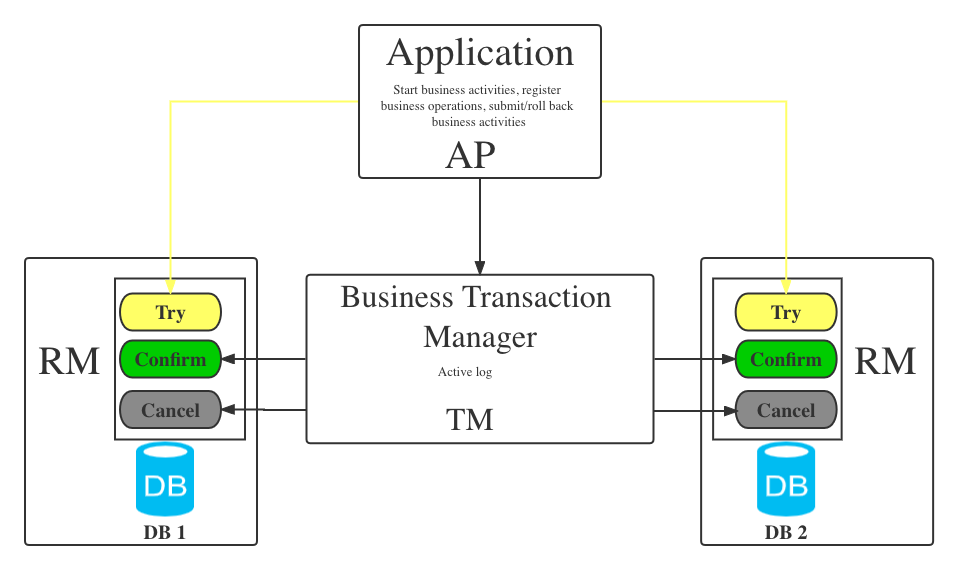

<h1 style="color:#606c71;text-align:center;" >The concept of distributed transaction and several implementation ideas</h1> 

>  &nbsp;&nbsp;&nbsp;&nbsp;After serviceization, the single system is split into multiple service systems,and each service accesses its own database. Our one request operation is likely so span multiple services, and we need to operate the data of multilple databases at the same time. We found that the previously used Database transactions are not easy to use. So how can ensure data consistency again after the split architecture based on microservices? 
>  

## Some nouns and concepts in distributed transactions

* Transaction: A transaction is a reliable and independent unit of work composed of a set of operations, and transaction has the charecteristics of ACID,namely atomicity, consistency, isolation and durability.

* Local Transaction: When the transaction is managed locally by the resource manager, it is called local transaction. The advantages of local transaction are that it supports strict ACID charecteristics, is efficient, reliable,the state can be maintained only in the resource manager, and the application programming modle is simple. But local transaction do not have the processiong capabilities of distributed transactions, and the smallest unit of isolation is limited by the resource manager.

* Global Transaction: When a transaction is globally managed by the global transaction manager, it becomes a global transaction. and the transaction manage is responsible for managing the global transaction state and participating resources, and coordinating the consistent commit or rollback of resources.

* TX Protocel: The interface between  the application or application server and the transaction manager.

* XA Protocol: The interface between the global transaction manager and the resource manager. XA(eXtended Architecture) is a distributed transaction specification proposed by the X/Open organization. The specification mainly defines the interface between the global transaction manager and the local resource manager. Mainstream database products all implement the XA interface. The XA interface is a didirectional system interface that acts as a communication bridge between the transaction manager and multiple resource managers. The reason why XA is needed is theoretically in a distributed system. It is said that two machines cannot achieve a fully consistent state at the same time, so a single point is introduced for coordination. Transactions managed and coordinated by the global transaction manager can span multiple resources and processes. The global transaction manager generally uses XA two The phase protocol interacts with the database.

* AP: Application program`(Application Program)`.

* RM: Resource Manager, here can be a DBMS or a messsage server management system, the application controls resources throught the resource manager, and the resource must implement the interface defined by XA. The resource manager is responsible for controlling and manager the actual resources`(Resource Manager)`.

* TM: Transaction manager, responsible for coordinating and managing transactions, prividing API programming interfaces and managing resource manager. The transaction manager controls global transactions, manages the life cycle of transactions, and coordinates resource`(Transaction Manager)`

* Two-phase commit protocol: XA is a mechanism for coordinating multiple resources in a global transaction. A two-phase commit scheme is adopted between TM and RM to solve the consistency problem. Two-node commit requires a coordinator (TM: Transaction Manager) to Controls the operation results of all participants (RM: Resource Manager) nodes and guides whether these nodes need final submission. The limitations of two-phase submission are the protocol cost, the persistence cost of the preparation phase, the persistence cost of the global transaction state, and the multiple potential failure points. The vulnerability, after preparation, and failure before submission cause a series of isolation and recovery problems. 

* BASE thory: BASE theory was proposed by eBay architects. BA (Basically Available) refers to the basic business availability, supports partition failure, S (Soft State) represents a flexible state, that is, allows a short time out of synchronization, E (Eventually Consistent) means eventual consistency, the data is eventually consistent, but the real-time is inconsistent. Atomicity and durability must be fundamentally guaranteed. For the needs of availability, performance and service degradation, only the requirements for consistency and isolation are reduced. 

* CAP theorem: CAP theorem, also known as Brewer's theorem. For a shared data system, at most two of the CAP can be satisfied at the same time, and any two have their own suitable scenarios. The most important thing in distributed systems is to meet business requirements, rather than to pursue highly abstract, absolute system characteristics. C (Consistence) means consistency, that is, all users see the data is the same. A (Availability) means availability, which means that an available copy of the data can always be found. P (Partition tolerance) means partition fault tolerance, which can tolerate network interruptions and other failures. 

## The general ideas of distributed transactions are as follows

### Eventually consistent transactions (MQ middleware decoupling) 

<mark>Advantage</mark>:

* Independent storage of message data, independent scaling, reducing the coupling between the business system and the message system.
* It is highly sensitive to eventual consistency time and reduces the implementation cost of the passive side of the business.
* Compatible with all MQ middleware that implements the JMS standard, and on the premise of ensuring the reliability of business data, realizes the eventual consistency of the business, ideally quasi-real-time consistency.

<mark>defect</mark>:

* High dependency coupling, poor component commonality.
* Need to maintain a set of scheduled tasks.

### Transactional messages (single-respoitory transactions or MQ middleware transactional messages)

<mark>Features</mark>:

DB:Basically, all mainstream OLTP database products in a single database support transaction consistency, and a single database transaction must have the characteristics of ACID, namely atomicity, consistency, isolation and durability.

MQ:For example, both kafka and rocketMQ support the function of transactional production and consumption of message types. In theory, this can also be guaranteed for transaction security. In fact, this is basically the same thing as the first final consistency.

### Two-phase commit（2PC）

&nbsp;&nbsp;&nbsp;&nbsp;In fact, when it comes to two-phase commit, or three-phase commit and XA transaction (also two-phase commit), there are several roles in it:

* Executor: Also called business sponsor.
* Coordinator: Also called Transaction Manager (TM).
* Participant: Also called Resource Manager (RM).

Compared with 2PC, 3PC sets a timeout for both the coordinator (Coordinator) and the participant (Partcipant), while 2PC only has a timeout mechanism for the coordinator. What problem does this solve? This optimization point is mainly to avoid the problem that the participants cannot release resources when they cannot communicate with the coordinator node for a long time (the coordinator hangs up), because the participants themselves have a timeout mechanism, which will automatically execute after the timeout. Local commit/rollback is used to release resources. This mechanism also reduces the blocking time and scope of the entire transaction, but performance problems and inconsistency problems are still not fundamentally resolved.
  
#### Preparation phase

1. The business initiator initiates a request to the coordinator to obtain the Connection connection.
2. The coordinator asks each participant if they can start a new business now, and returns Ready/No.
3. If the participant can start new business, start a transaction (but not commit).
4. If the participant cannot start a new business, it will return to the coordinator No. If the coordinator receives the result that any participant returns No or does not receive the result within a certain period of time, it will return to the business initiator saying that this time The request failed (may be retried).

#### Commit/Rollback phase

5. At this time, the business initiator can issue a commit/rollback transaction command to the coordinator (in the 2PC stage, the coordinator has the logic of timeout check).
6. Then the coordinator sends an instruction to the business participant, and the business participant can commit or roll back the local transaction.
7. The coordinator and the coordinator return the result to the business initiator whether the result of this operation is a success or a failure.

<mark>Known issues</mark>:

1. Synchronous blocking: All transaction participants are in a synchronous blocking state while waiting for responses from other participants and cannot perform other operations.
2. Single point problem: The coordinator plays a very important role in 2PC, and a failure will have a great impact. Especially when a failure occurs in Phase 2, all participants will be in a waiting state and cannot complete other operations.
3. Data inconsistency: In Phase 2, if the coordinator only sends part of the Commit message and the network is abnormal, then only some participants receive the Commit message, that is to say, only some participants submit the transaction, making the system data inconsistent .
4. Too conservative: the failure of any node will lead to the failure of the entire transaction, and there is no perfect fault tolerance mechanism.

## TCC Distributed transaction

 

<mark>Features</mark>:

&nbsp;&nbsp;&nbsp;&nbsp;It is not coupled with a specific service framework, and is located in the business service layer, not the resource layer, and can flexibly choose the locking granularity of business resources. TCC operates local transactions for each service resource, and the data is locked for a short time, which can be It has good scalability and can be said to be designed for independently deployed SOA services.

## Some frameworks for distributed microservice transactions in Java

&nbsp;&nbsp;&nbsp;&nbsp;Some frameworks commonly used in distributed microservice transactions in Java include Hmily, Byte-TCC, Tcc-Transaction, Seata, etc.

 

[back](./)