<iframe src="../detail-header.html" title="Github of Anigkus" style="height:0px,widht:0px;display:none" id="kusifreamheader"></iframe>

<h1 style="color:#606c71;text-align:center;" id="h1" >Curator 内部实现机制</h1><br/>

[<h1 style="color:#606c71;text-align:center;" >Curator internal implementation mechanism</h1><br/>]:#

<center>

</center>

> <br/>&nbsp;&nbsp;&nbsp;&nbsp; [Zookeeper](https://zookeeper.apache.org/) 对大家都不是很陌生,现在好多开源的中间件都在使用 Zookeeper 来作为分布式协调中心服务.那么Java中操作 Zookeeper的客户端有 Zookeeper 原生提供的、开源 [zkclient](https://github.com/sgroschupf/zkclient) 以及 [Apache Curator](https://curator.apache.org/). 而 Zookeeper 原生算是比较底层,操作起来特别不方便,接口和方法表达的方式不够直接,并且还有不少问题.而 zkclient 是对 Zookeeper 原生封装了一层,但是其中的文档不足,以及重试、异常等机制有不少问题,也一直被社区所诟病.那么有没有一款现在比较好的客户端呢,那就是 Curator.这篇文章我将从内部角度来分析下 Curator 的实现机制.<br/>
> <br/>

[> <br/>&nbsp;&nbsp;&nbsp;&nbsp; &nbsp;&nbsp;&nbsp;&nbsp; ???Zookeeper+++(https://zookeeper.apache.org/) is not very unfamiliar to everyone. Now many open source middleware are using Zookeeper as a distributed coordination center service. Then the client that operates Zookeeper in Java has Zookeeper Natively provided, open source ???zkclient+++(https://github.com/sgroschupf/zkclient) and ???pache Curator+++(https://curator.apache.org/). Zookeeper is relatively low-level, and it is very difficult to operate. Convenience, the way of expressing interfaces and methods is not direct enough, and there are still many problems. The zkclient is a native encapsulation of Zookeeper, but the documentation is insufficient, and there are many problems in the retry, exception and other mechanisms, and it has been used for a long time. The community criticized. So is there a better client now, that is Curator. In this article, I will analyze the implementation mechanism of Curator from an internal perspective.<br/>]:#
[> <br/>]:#

# 什么是使用开源的正确姿势?

[# What's the right posture to use open source?]:#

<center>
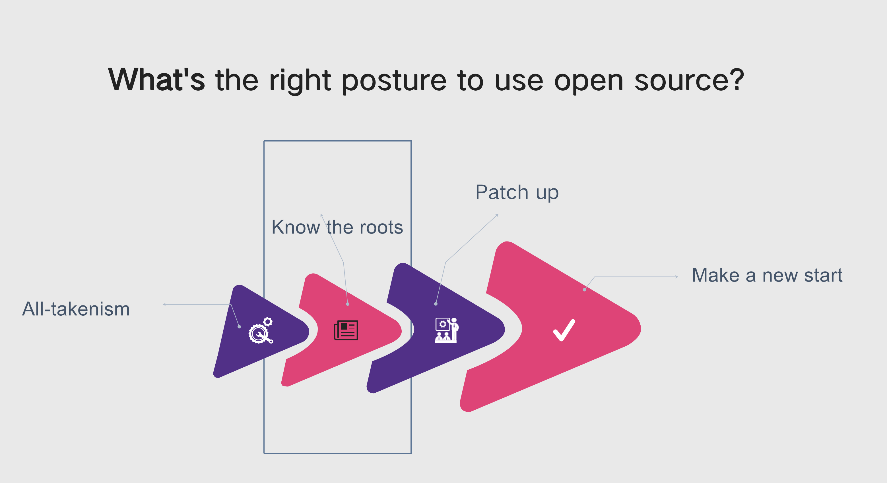
</center>

* All-takenism: 称之“拿来主义”阶段,不管它是怎么样的,先用着再说.

* Know the roots: 到后来用着用着时间九了,也就越来约熟悉了,对些原理和问题也了解的差不多了,称之“知根知底”阶段.

* Patch up: 再到后来用的过程中,总会发现些问题或者某些功能不如意.由于我们知道了它怎么弄的,就会尝试着去更改它的问题或者增加功能,这个阶段称之为“修修补补”.

* Make a new start: 等到完全吃透了,发现简单的修改或者增加功能根本没法改变底层越来不足的地方.这个时候发现投入的补丁时间比越来越多,而换来的结果又有点不理想.想着想着还不如重新’造一个‘,反正已经完全弄懂了它的原理,并且还可以为未来增加新功能或者维护带来诸多方便,那就造一个呗,这个阶段称之为“推到重来”.

[* All-takenism: Call it the stage of "All-takenism", no matter what it is, use it first and then talk about it.]:#

[* Know the roots: After using it for nine years, I became more and more familiar with it, and I have a good understanding of some principles and problems, which is called the "knowing the roots" stage.]:#

[* Patch up: In the process of later use, there will always be some problems or some unsatisfactory functions. Since we know how it is done, we will try to change its problems or add functions. This stage is called "Patch up".]:#

[* Make a new start: Wait until it is completely understood, and find that simple modifications or adding functions can't change the underlying shortcomings. At this time, it is found that the patch time invested is more and more, and the results are a little different. Ideal. If you think about it, it might be better to 'build one' again. Anyway, you have fully understood its principle, and it can also bring a lot of convenience for adding new functions or maintenance in the future. Then build one. This stage is called "Make a new start".]:#

# Curator 简要指南

[# Introduction to Curator]:#

&nbsp;&nbsp;&nbsp;&nbsp; Apache Curator 是一个用于 Apache ZooKeeper 的 Java/JVM 客户端库,它是一种分布式协调服务.它包括一个高级 API 框架和实用程序,使 Apache ZooKeeper 的使用更加轻松和可靠.它还包括常见用例和扩展的秘诀,例如服务发现和 Java 8 异步 DSL.

&nbsp;&nbsp;&nbsp;&nbsp; 以至于 Zookeeper 的创建者 Patrick Hunt 对 Curator 框架的评价是: `Guava is to Java What Curator is to Zookeeper`. 由此可见 Curator 的优秀程度.


[&nbsp;&nbsp;&nbsp;&nbsp; Apache Curator is a Java/JVM client library for Apache ZooKeeper, a distributed coordination service. It includes a highlevel API framework and utilities to make using Apache ZooKeeper much easier and more reliable. It also includes recipes for common use cases and extensions such as service discovery and a Java 8 asynchronous DSL.]:#

[&nbsp;&nbsp;&nbsp;&nbsp; So much so that Patrick Hunt, the creator of Zookeeper, commented on the Curator framework: `Guava is to Java What Curator is to Zookeeper`. This shows how excellent Curator is.]:#

## Curator简介

[## Introduction to Curator]:#

* 封装并简化了Zookeeper原生API

* 自动化连接管理

* Watcher反复注册

* 流式编程方式

* 失败重试机制 

* 强大的分布式环境工具菜谱

* 易测试,快速启动嵌入集群

[* Wraps and simplifies Zookeeper native API]:#

[* Automated connection management]:#

[*  Watcher repeated registration]:#

[* Stream programming]:#

[* Failure retry mechanism]:# 

[* Powerful Distributed Environment Tools Recipe]:#

[* Easy to test, quickly start embedded cluster]:#

<center>
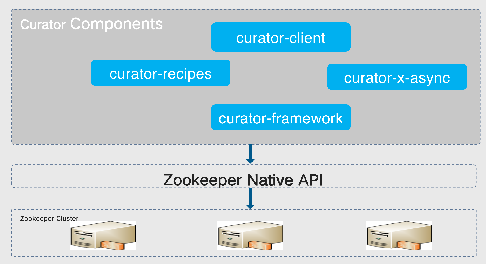
</center>

* curator-framework：对zookeeper的底层api的一些封装.

* curator-client：提供一些客户端的操作,例如重试策略等.

* curator-recipes：封装了一些高级特性,如：Cache事件监听、选举、分布式锁、分布式计数器、分布式Barrier等.

* curator-async：Curator异步操作封装类,就像Java 8's lambdas表达式那样.

[* curator-framework: some encapsulation of zookeeper's underlying api.]:#

[* curator-client: Provides some client-side operations, such as retry strategies, etc.]:#

[* curator-recipes: encapsulates some advanced features, such as: Cache event monitoring, election, distributed lock, distributed counter, distributed Barrier, etc.]:#

[* curator-async: Curator wrapper class for asynchronous operations, just like Java 8's lambdas.]:#

## Curator 版本兼容

[## Curator Compatibility]:# 

&nbsp;&nbsp;&nbsp;&nbsp; Curator 现在市面上用的比较多的版本有 `5.X`、`4.X`、`2.X`这些.所有典型应用场景需要依赖client和framework.

* 5.x支持 ZooKeeper 3.5和3.6(优先3.6),现在zookeeper最后一个Release 是3.6.2.

* 4.x支持 ZooKeeper 3.5和3.6,现在zookeeper最后一个Release 是3.5.8.

* 2.x支持 ZooKeeper 3.x及以下,现在zookeeper最后一个Release 是3.4.14

[&nbsp;&nbsp;&nbsp;&nbsp; There are many versions of Curator currently on the market, such as `5.X`, `4.X`, `2.X`. All typical application scenarios need to rely on client and framework.]:#

[* 5.x supports ZooKeeper 3.5 and 3.6 (3.6 is preferred), now the last release of zookeeper is 3.6.2.]:#

[* 4.x supports ZooKeeper 3.5 and 3.6, now the last release of zookeeper is 3.5.8.]:#

[* 2.x supports ZooKeeper 3.x and below, now the last release of zookeeper is 3.4.14.]:#

```
<dependency>
  <groupId>org.apache.curator</groupId>
    <artifactId>curator-recipes</artifactId>
    <version>x.x</version>
</dependency>
```

## Curator快速指南（一）：创建会话

[## Curator Quick Guide (1): Creating a Session]:#

&nbsp;&nbsp;&nbsp;&nbsp; 两种方式使用,一种是通过工厂方法,一种是通过流式的builder方法.

[&nbsp;&nbsp;&nbsp;&nbsp; It is used in two ways, one is through the factory method, the other is through the flow builder method]:#

### 1.Factory

```
CuratorFramework  curatorClient = CuratorFrameworkFactory .newClient(connectString,  sessionTimeoutMs,  connectionTimeoutMs, retryPolicy)
```

### 2.Stream

```
CuratorFramework curatorClient = CuratorFrameworkFactory.builder().
connectString(connectString).
sessionTimeoutMs(sessionTimeoutMs)
.connectionTimeoutMs(connectionTimeoutMs).
retryPolicy(retryPolicy).
build()
```

参数解释:

connectString: zk集群连接字符串,格式host1:port1,host2:port2,host3:port3

connectionTimeoutMs: 连接超时时间

sessionTimeoutMs: 会话超时时间

retryPolicy: 失败重试策略


[Parameter explanation:]:#

[connectString: zk cluster connection string, format host1:port1,host2:port2,host3:port3]:#

[connectionTimeoutMs: connection timeout time]:#

[sessionTimeoutMs: session timeout]:#

[retryPolicy: Failed retry policy]:#

## Curator快速指南（二）：启动

[## Curator Quick Guide (2): Getting Started ]:#

Curator会话创建好之后,就直接启动,启动成功之后就可以进行各种操作.

[After the Curator session is created, it will be started directly. Various operations can be performed after the startup is successful.]:#

```
curatorClient.start();

curatorClient.blockUntilConnected();
```

## Curator快速指南（三）：结点操作

[## Curator Quick Guide (3): Node Operations]:#

```
curatorClient.create().withMode(CreateMode.EPHEMERAL).forPath(“/temp”);  //Create a temporary node

curatorClient.delete().forPath("/todelete");  //Delete node

curatorClient.setData().forPath("/update", "value".getBytes());  //Update Data

curatorClient.getChildren().forPath("/parentNodes");  // Get Nodes
```

## Curator快速指南（四）：Retry策略

[## Curator Quick Guide (4): Retry Strategy]:#

&nbsp;&nbsp;&nbsp;&nbsp; Curator所有的操作,包括setData create delete等等.如果失败,都允许重试系统内部了几种重试策略.开发人员可以根据需要,实现RetryPolicy接口定制自己的策略.

[&nbsp;&nbsp;&nbsp;&nbsp; All operations of Curator, including setData create delete, etc. If it fails, it is allowed to retry several retry strategies within the system. Developers can customize their own strategies by implementing the RetryPolicy interface as needed.]:#

默认重试策略:

* RetryNTimes(int n, int sleepMsBetweenRetries)
n: 最大重试次数.
sleepMsBetweenRetry: 重试间隔的时间.

* RetryOneTime(int sleepMsBetweenRetry)
sleepMsBetweenRetry: 重试间隔的时间

* RetryUntilElapsed(int maxElapsedTimeMs, int sleepMsBetweenRetries)
重试的时间超过最大时间后,就不再重试.
maxElapsedTimeMs: 最大重试时间.
sleepMsBetweenRetriees: 每次重试的间隔时间.

* ExponentialBackoffRetry(int baseSleepTimeMs, int maxRetries, int maxSleepMs)
baseSleepTimeMs: 初始sleep时间.
maxRetries: 最大重试次数.
maxSleepMs: 最大重试时间.

当前应该 sleep 的时间: baseSleepTimeMs*Math.max(1,random.nextInt(1 << retryCount+1)),随着重试次数,增加重试时间间隔,指数增加.

[Default retry policy:]:#

[* RetryNTimes(int n, int sleepMsBetweenRetries)]:#
[n: maximum number of retries.]:#
[sleepMsBetweenRetry: time between retry.]:#

[* RetryOneTime(int sleepMsBetweenRetry)]:#
[sleepMsBetweenRetry: time between retry]:#

[* RetryUntilElapsed(int maxElapsedTimeMs, int sleepMsBetweenRetries)]:#
[After the retry time exceeds the maximum time, no more retries.]:#
[maxElapsedTimeMs: Maximum retry time.]:#
[sleepMsBetweenRetriees: The interval between each retry.]:#

[* ExponentialBackoffRetry(int baseSleepTimeMs, int maxRetries, int maxSleepMs)]:#
[baseSleepTimeMs: initial sleep time.]:#
[maxRetries: Maximum number of retries.]:#
[maxSleepMs: Maximum retry time.]:#

[The current time for sleep: baseSleepTimeMs*Math.max(1, random.nextInt(1 << retryCount+1)), with the number of retries, increase the retry interval, and the index increases.]:#

## Zk结点操作核心API

[## Core API for Zk Node Operations]:#

&nbsp;&nbsp;&nbsp;&nbsp; Curator所有的zk结点操作都是通过Builder完成.每一种操作后台对应一个Builder.负责zk结点的操作.
由于所有的操作都雷同,下面以`CreateBuilderImpl`为例,说明其内部的实现.

[&nbsp;&nbsp;&nbsp;&nbsp; All zk node operations of Curator are done through Builder. Each operation background corresponds to a Builder, which is responsible for the operation of the zk node.]:#
[Since all operations are the same, the following takes `CreateBuilderImpl` as an example to illustrate its internal implementation.]:#

| 核心API | 内部实现机制 | 描述 |
| :--- | :---  | :---  |
| create() | CreateBuilderImpl | 开始创建操作, 在最后调用`forPath()`指定要操作的ZNode |
| delete() | DeleteBuilderImpl | 开始删除操作,在最后调用`forPath()`指定要操作的ZNode |
| checkExists() | ExistsBuilderImpl | 开始检查ZNode是否存在的操作, 在最后调用`forPath()`指定要操作ZNode |
| getData() | GetDataBuilderImpl | 开始获得ZNode节点数据的操作,在最后调用`forPath()`指定要操作ZNode |
| setData() | SetDataBuilderImpl | 开始设置ZNode节点数据的操作,在最后调用`forPath()`指定要操作ZNode |
| getChildren() | GetChildrenBuilderImpl | 开始获得ZNode的子节点列表,在最后调用`forPath()`指定要操作ZNode |

###### &nbsp;
[| Core API | Internal implementation | Describe |]:#
[| :--- | :---  | :---  |]:#
[| create() | CreateBuilderImpl | Start creating the operation, and call f`orPath()` at the end to specify the ZNode to operate |]:#
[| delete() | DeleteBuilderImpl | Start the delete operation, Call `forPath()` at the end to specify the ZNode to be operated on |]:#
[| checkExists() | ExistsBuilderImpl | Begin the operation of checking whether the ZNode exists,At the end, call `forPath()` to specify that the ZNode is to be operated]:#
[| getData() | GetDataBuilderImpl | Start the operation to get the data of the ZNode node. At the end, call `forPath()` to specify that the ZNode is to be operated |]:#
[| setData() | SetDataBuilderImpl | Start the operation of setting the ZNode node data. At the end, call `forPath()` to specify the ZNode to be operated |]:#
[| getChildren() | GetChildrenBuilderImpl | Start getting the list of child nodes of ZNode, Call `forPath()` at the end to specify the ZNode to be manipulated |]:#

# Curator 应用场合

[# Curator Application Scenario]:#

## 分布式原子值

[## Distributed Atomic Values]:#

<center>

同一个进程内,多个线程通过java并发包提供的原子值进行操作,保证了多个线程的并发原子性.
</center>

[In the same process, multiple threads operate through the atomic value provided by the java concurrent package, ensuring the concurrent atomicity of multiple threads]:#

<center>
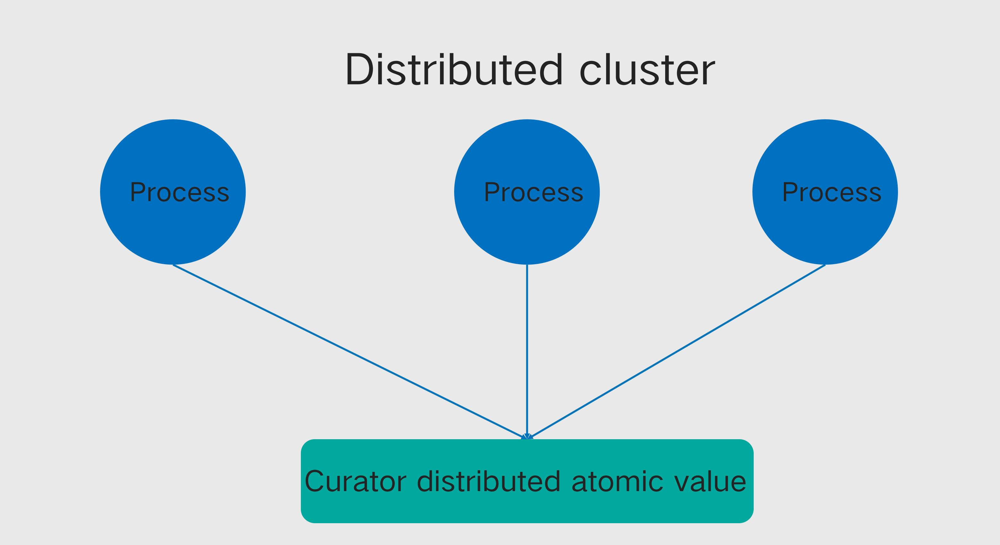
不同进程无法利用jdk的并发包的原子值.Curator的atomic提供了类似的功能,在分布式环境内共享同一个原子值.
</center>

[Different processes cannot use the atomic value of jdk's concurrent packets. Curator's atomic provides a similar function, sharing the same atomic value in a distributed environment.]:#

## 分布式原子值代码片段实例

[## Distributed Atomic Value Code Snippet Example]:#

多个分布在不同机器,对同一个原子变量进行并发操作,其它机器都能看到最新的值.

[Multiple distributions on different machines perform concurrent operations on the same atomic variable, All other machines can see the latest value.]:#

```
RetryPolicy retryPolicy = new ExponentialBackoffRetry(1000, 10);
CuratorFramework cf = CuratorFrameworkFactory.builder().connectString(CONNECT_ADDR).sessionTimeoutMs(SESSION_OUTTIME).retryPolicy(retryPolicy).build();
cf.start();

DistributedAtomicInteger atomicIntger = new DistributedAtomicInteger(cf, "/atomicValue",new RetryNTimes(3, 1000));
System.out.println(atomicIntger.get().preValue()); 
AtomicValue<Integer> value = atomicIntger.add(1);
System.out.println(value.postValue()); 
```

## 分布式锁

[## Distributed Lock]:#

<center>
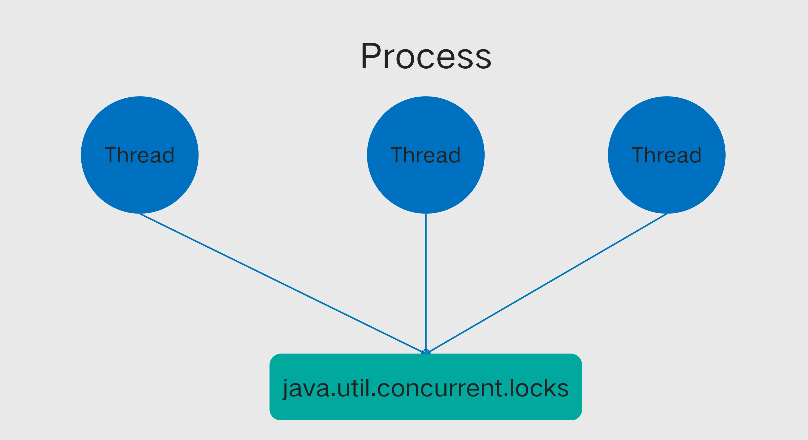
同一个进程内,多个线程通过java并发包提供的锁,保证多线程的共享锁.
</center>

[In the same process, multiple threads use the lock provided by java concurrent package to ensure the shared lock of multiple threads.]:#

<center>

不同进程无法利用jdk的并发包的锁,Curator的locks提供了类似的功能,在分布式环境内进行全局锁的处理.
</center>

[Different processes cannot use the locks of JDK's concurrent packets. Curator's locks provide a similar function to process global locks in a distributed environment.]:#

## 分布式锁代码片段实例

[## Distributed lock code snippet]:#

多个分布在不同机器,只要得到锁才能执行循环里面的代码,因此就能避免重复执行的逻辑.

[Multiple distributed in different machines, the code in the loop can be executed only if the lock is obtained, so the logic of repeated execution can be avoided.]:#

```
RetryPolicy retryPolicy = new ExponentialBackoffRetry(1000, 10);
CuratorFramework cf = CuratorFrameworkFactory.builder().connectString(CONNECT_ADDR)
			.sessionTimeoutMs(SESSION_OUTTIME).retryPolicy(retryPolicy).build();
cf.start();
InterProcessMutex lock = new InterProcessMutex(cf, "/lock");

try {
	lock.acquire();
	for (int i = 0; i < 1000000; i++) {
		SimpleDateFormat sdf = new SimpleDateFormat("HH:mm:ss|SSS");
		System.out.println(sdf.format(new Date()));
		TimeUnit.SECONDS.sleep(1);
}
} finally {
	lock.release();
}
```

## 主从选举片段实例

[## Master-slave election fragment instance]:#

&nbsp;&nbsp;&nbsp;&nbsp; 在分布式系统设计中，选主是一个常见的场景。选主是一个这样的过程，通过选主，主节点被选择出来控制其他节点或者是分配任务。
选主算法要满足的几个特征：
1. 各个节点均衡的获得成为主节点的权利，一旦主节点被选出，其他的节点可以感知到谁是主节点
2. 主节点是唯一存在的
3. 一旦主节点失效，宕机或者断开连接，其他的节点能够感知，并且重新进行选主算法。

[&nbsp;&nbsp;&nbsp;&nbsp; In distributed system design, master election is a common scenario. Master election is a process by which the master node is selected to control other nodes or assign tasks.]:#
[Several characteristics to be satisfied by the main election algorithm:]:#
[1. Each node obtains the right to become the master node in a balanced manner.Once the master node is selected, other nodes can perceive who is the master node. ]:#
[2. The master node is the only one that exists]:#
[3. Once the master node fails, goes down or disconnects, other nodes can sense it and re-select the master algorithm.]:#

```
RetryPolicy retryPolicy = new ExponentialBackoffRetry(1000, 10);
CuratorFramework cf = CuratorFrameworkFactory.builder().connectString(CONNECT_ADDR)
			.sessionTimeoutMs(SESSION_OUTTIME).retryPolicy(retryPolicy).build();
cf.start();

LeaderLatch leaderLatch = new LeaderLatch(cf, "/latch");
leaderLatch.start();
leaderLatch.await(10, TimeUnit.SECONDS);
if (leaderLatch.hasLeadership()) {
	System.out.println("yes, i am leader");
}
leaderLatch.close();
```

## 分布式栅栏 DistributedBarrier

[## Distributed DistributedBarrier]:#

必须等全部任务就绪之后,才能启动事务处理.在单进程中,java.util.concurrent包提供了Barrier.那么假如是控制所有分布在不同机器的进程或线程呢？

Curator为我们提供全局的分布式栅栏.

[You must wait for all tasks to be ready before you can start transaction processing. In a single process, the java.util.concurrent package provides Barrier. So what if you control all processes or threads distributed across different machines?]:#

[Curator provides us with a global distributed fence.]:#


## 分布式栅栏DistributedBarrier代码片段

[## Distributed DistributedBarrier code snippet]:#

```
RetryPolicy retryPolicy = new ExponentialBackoffRetry(1000, 10);
CuratorFramework cf = CuratorFrameworkFactory.builder().connectString(CONNECT_ADDR)
		.sessionTimeoutMs(SESSION_OUTTIME).retryPolicy(retryPolicy).build();
cf.start();
ExecutorService service = Executors.newFixedThreadPool(10);
DistributedBarrier controlBarrier = new DistributedBarrier(cf, "/barrier");
controlBarrier.setBarrier();

for (int i = 0; i < 10; ++i) {
final int index = i;
Callable<Void> task = () -> {
	Thread.sleep((long) (3 * Math.random()));				controlBarrier.waitOnBarrier();
	System.out.println("Client #" + index + " begins");
	return null;
	};
service.submit(task);
}
Thread.sleep(10000);
System.out.println("all Barrier instances should wait the condition");
controlBarrier.removeBarrier();
service.shutdown();
```

# Curator 内部剖析

[# Curator Internal Anatomy]:#

## 超时检查和重试机制：以创建结点为例

[## Timeout Check and Retry Mechanism: Take Creating Nodes as an Example]:#

<center>
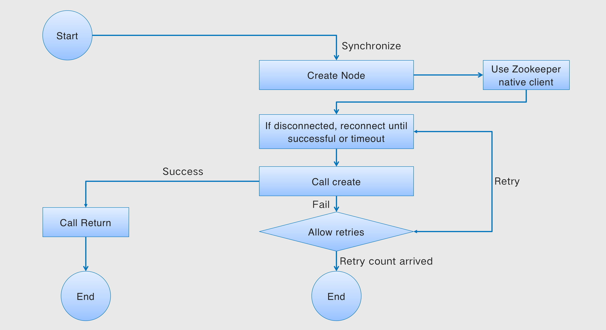
</center>

备注:

其中超时时间为创建Curator客户端的时候设置的connectionTimeoutMs.

Curator中任何的操作都需要等待连接完成就是等待connectionTimeoutMs的时间,如果在该时间没连上,则操作失败,那么操作是否继续就要根据Retry策略.

Background的异步create由于时间篇幅关系,不展开讲,具体实现类似.

[Remark:]:#

[The timeout is the connectionTimeoutMs set when the Curator client was created.]:#

[Any operation in Curator needs to wait for the connection to complete, which is the time to wait for connectionTimeoutMs. If it is not connected within this time, the operation fails. Then whether the operation continues depends on the Retry policy.]:#

[The asynchronous create of Background will not be discussed due to the time and space. The specific implementation is similar.]:#

## 会话超时和会话重建

[## Session timeout and session rebuild]:#

<center>
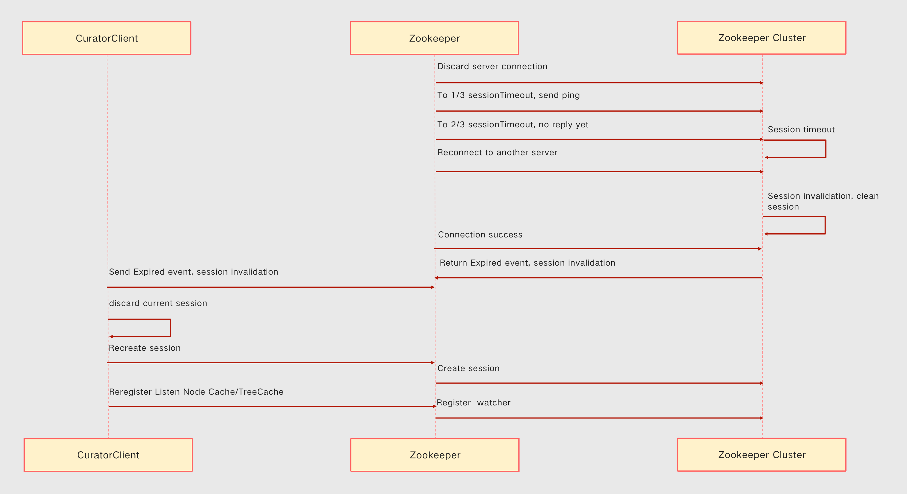
</center>

`sessionTimeoutMs`则是指当前客户端和服务器断开超时的时间.当客户端和服务器断连的时间超过该时间,会话将`Expired`.

会话超时,那么存储在`ZK`上的所有临时数据与注册的订阅者都会被移除,此时需要重新创建一个ZooKeeper客户端实例,需要自己编码做一些额外的处理.

幸运的是,`Curator`会帮我们做如下的事情:
A.先关闭旧的`zookeeper`客户端,B.获取连接串,通过`zookeeperFactory`工厂重新创建新的`Zookeeper`客户端.

sessionTimeoutMs为30秒.

第10秒ping server.

第20秒开始尝试重连其它服务器.

第29秒后重连上,那么该session还有效.

第31秒重连上之后,该Session将标记为Expired,Curator帮我们重建会话,NodeCache/TreeCache等监听器依然有效,但是一次性消费的Watcher将失效。

[`sessionTimeoutMs` refers to the current client and server disconnection timeout time. When the client and server are disconnected for longer than this time, the session will be `Expired`.]:#

[If the session times out, all temporary data stored on `ZK` and registered subscribers will be removed. In this case, a ZooKeeper client instance needs to be recreated, and some additional processing needs to be coded by yourself.]:#

[Fortunately, `Curator` does the following for us:]:#
[A. First close the old zookeeper client,B. Get the connection string and recreate the new `zookeeper` client through the `zookeeperFactory` factory.]:#

[sessionTimeoutMs is 30 seconds.]:#

[10 seconds ping server.]:#

[At 20 seconds, try to reconnect to other servers.]:#

[If you reconnect after 29 seconds, the session is still valid.]:#

[After the 31st second reconnection, the session will be marked as Expired. Curator helps us rebuild the session. Listeners such as NodeCache/TreeCache are still valid. But the one-time consumption Watcher will be invalid.]:#

## Curator事件监听

事件监听是Zookeeper最核心功能,也是Curator的核心功能.离开了事件监听,zooekeeper什么也不是.

由于zookeeper原生处理是一次性消费,非常不方便.
Curator对Zookeeper事件处理做了封装,主要如下:

* ConnectionStateListener: 生命周期事件.
* Watcher: CuratorWatcher.
* NodeCache: 监听结点本身内容变化和结点的增删事件.
* TreeCache: 监听结点本身的增删改以及子结点的增删改.

[## Curator event listener]:#

[Event monitoring is the core function of Zookeeper and the core function of Curator. Without event listeners, zooekeeper is nothing.]:#

[Since the native processing of zookeeper is a one-time consumption, it is very inconvenient.]:#
[Curator encapsulates Zookeeper event processing, mainly as follows:]:#

[* ConnectionStateListener：Lifecycle Events.]:#
[* Watcher: CuratorWatcher.]:#
[* NodeCache：Monitor the content changes of the node itself and the addition and deletion events of the node.]:#
[* TreeCache：Monitor the additions, deletions and changes of the node itself and the additions, deletions and changes of child nodes.]:#

## Curator生命周期事件: ConnectionStateListener

[## Curator life cycle events: ConnectionStateListener]:#

<center>
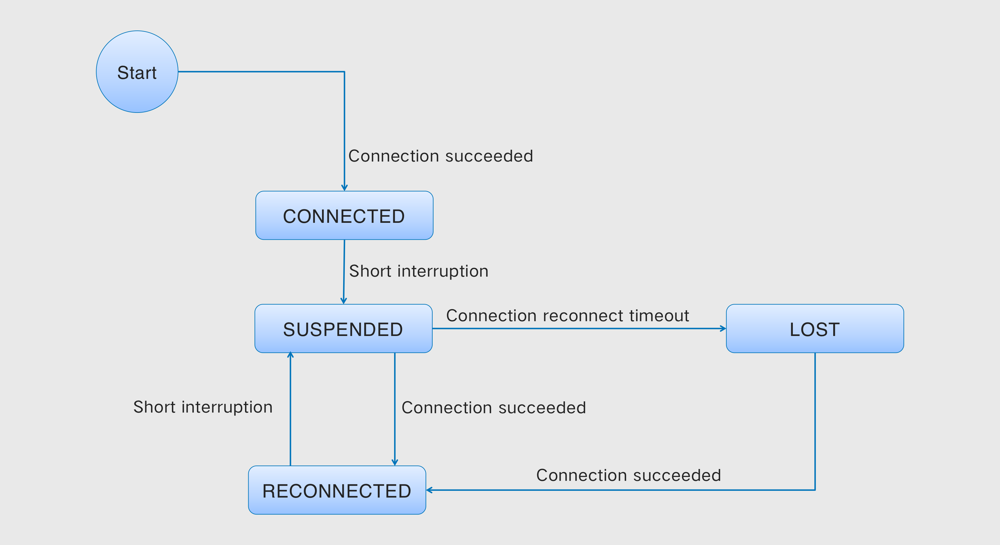
</center>

CONNECTED:整个生命周期只会进入一次.

SUSPENDED:每次中断都会进入此状态.

RECONNECTED:重新连接成功.

LOST:当重连超时或者Session超时的时候.当下列的情况下会出现LOST事件:

* 重连的时候connectionTimeoutMs超时
* 重连的时候超过了sessionTimeoutMs超时


注意:由于curator3.0版本以下有个bug,假如connectionTimeoutMs和sessionTimeoutMs一样的情况,需要超过两倍时间,才能收到LOST状态和事件.

关于LOST事件的抛出,可参考CuratorFrameworkImpl.doSyncForSuspendedConnection方法.

[CONNECTED: Entire lifetime will only be entered once.]:#

[SUSPENDED: This state is entered on every interrupt.]:#

[RECONNECTED: reconnected successfully.]:#

[LOST: When the reconnection times out or the Session times out. The LOST event occurs in the following cases:]:#

[* connectionTimeoutMs times out when reconnecting.]:#
[* The sessionTimeoutMs timeout exceeded when reconnecting.]:#

[Note: Due to a bug in curator version 3.0 and below, if connectionTimeoutMs is the same as sessionTimeoutMs, it will take more than twice the time to receive LOST status and events.]:#

[For the throwing of the LOST event, please refer to CuratorFrameworkImpl.doSyncForSuspendedConnection method.]:#

## NodeCache事件监听

[## NodeCache event listener]:#

NodeCache比较简单,只监听当前结点的变化.

[NodeCache is relatively simple, and only listens for changes in the current node.]:#

| 事件 | 操作 | 操作 | 操作 |
| :--- | :---  | :---  |:---  |
| nodeChanged事件 | 当前结点创建 | 当前结点删除 | 当前结点内容更改 |

###### &nbsp;
[| Event | Operate | Operate | Operate |]:#
[| :--- | :---  | :---  |:---  |]:#
[| nodeChanged Event | Create the current node | Delete the current node | Changes the Current node |]:#

## NodeCache事件实现原理

[## NodeCache event implementation principle]:#

<center>
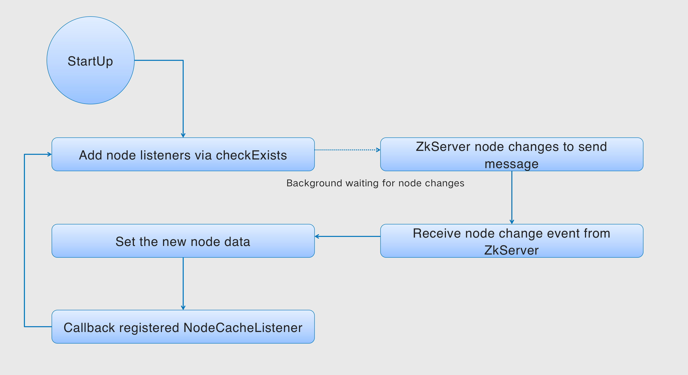
</center>

## TreeCache事件监听

[## TreeCache event listener]:#

TreeCache监听当前结点的变化(增删改),以及子节点的变化(增删改).

[TreeCache listens to the changes of the current node (Create/Delete/Change), as well as the changes of child nodes (Create/Delete/Change).]:#

| 节点事件 | 当前结点增加 | 当前结点删除 | 当前节点修改 | 子结点增加 | 子结点删除 | 子节点修改 |
| :--- | :---  | :---  |:---  |:---  |:---  |:---  |
| NODE_ADDED | 👌 |  |  | 👌 |  |  |
| NODE_REMOVED |  | 👌 |  |  | 👌 |  |
| NODE_UPDATED |  |  | 👌 |  |  | 👌 |

###### &nbsp;
[| Node Event | Create the current node | Delete the current node | Change the current node | Create the child node | Delete the child node | Change the child node |]:#
[| :--- | :---  | :---  |:---  |:---  |:---  |:---  |]:#
[| NODE_ADDED | 👌 |  |  | 👌 |  |  |]:#
[| NODE_REMOVED |  | 👌 |  |  | 👌 |  |]:#
[| NODE_UPDATED |  |  | 👌 |  |  | 👌 |]:#

## TreeCache事件原理

[## TreeCache event principle]:#

<center>
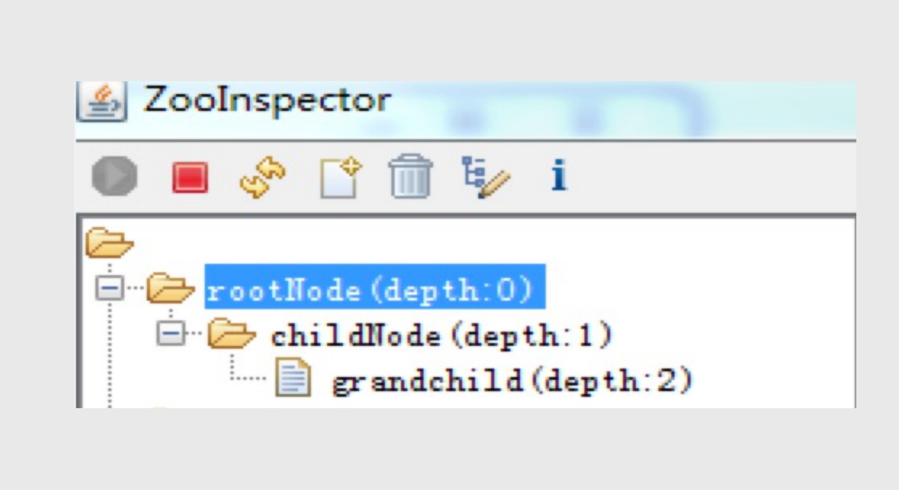
</center>

maxDepth监听可以控制监听树的哪一级节点.

0 只监听本节点

1 监听本节点+子节点

以此类推.

[maxDepth monitoring can control the monitoring tree which level node.]:#

[0 only listen to this node]:#

[1 Monitor this node + child nodes]:#

[and so on]:#

<center>
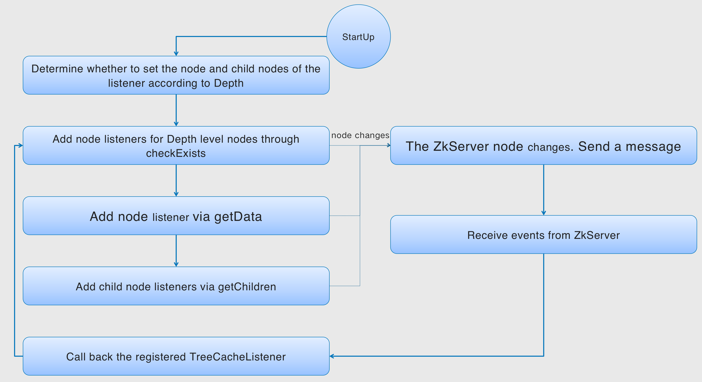
</center>

# Curator 最佳实践

[# Curator Best Practices]:#

## 最佳实践1：使用流式编程模式

[## Best Practice 1: Use Streaming Programming Patterns]:#

```
CuratorFrameworkFactory.Builder builder = CuratorFrameworkFactory.builder().connectString("localhost:2181").sessionTimeoutMs(30000).connectionTimeoutMs(5000).retryPolicy(new ExponentialBackoffRetry(5000, 3, 10000)). namespace("a.b.c");
CuratorFramework curatorFramework = builder.build();

curatorFramework.create().creatingParentContainersIfNeeded().withMode(CreateMode.EPHEMERAL).forPath("/a/b/c");
```

## 最佳实践2：保存并复用CuratorFrameImpl客户端

[## Best Practice 2: Save and reuse the CuratorFrameImpl client]:#

CuratorFrameImpl就是对zookeeper客户端的一个包装,创建和销毁都比较昂贵.创建好之后可以复用,甚至全局共用一个实例.

[CuratorFrameImpl is a wrapper around the zookeeper client, which is expensive to create and destroy.After it is created, it can be reused, or even share an instance globally.]:#

## 最佳实践3：善用处理跨机器的分布式并发同步

[## Best Practice 3: Take Advantage of Distributed Concurrent Objects]:#

Curator提供的Locks、Barrier、Queue、Leader能够解决很多跨机器的分布式同步问题.

[The Locks, Barrier, Queue, and Leader provided by Curator can solve many distributed synchronization problems across machines.]:#

## 最佳实践4：合理设置connectonTimeoutMs和sessionTimeoutMs

[## Best practice 4: Set connectonTimeoutMs and sessionTimeoutMs reasonably]:#

1. connectionTimeoutMs和sessionTimeoutMs根据集群网络的情况设置,不宜太大,也不宜太小.

2. connectionTimeoutMs设置要比sessionTimeoutMs小,connectionTimeoutMs比sessionTimeoutMs没意义.

[1. connectionTimeoutMs and sessionTimeoutMs are set according to the cluster network conditions. Neither too big nor too small.]:#

[2. The connectionTimeoutMs setting is smaller than the sessionTimeoutMs. connectionTimeoutMs is less meaningful than sessionTimeoutMs.]:#

## 最佳实践5：监听sessionExpired事件。会话超时，重新连上，需要重建会话

[## Best Practice 5: Listen to the sessionExpired event]:#

Curator的Session一旦超时,zk服务器将清除所有监听器,并会立刻删除empmeral结点.

如果重新成功,服务器发现已经超过了session设置的超时时限,那么客户端将会收到一个Expired event,表示会话已经终止,需要重建客户端.Curator已为我们做好这些.

但是需要我们自己重新创建相应的临时结点,并重新注册Watcher监听 器(非NodeCache/TreeCache监听器）等等.

[Once the Curator's Session times out, the zk server will clear all listeners and delete the emperal node immediately.]:#

[If successful again. The server finds that the timeout period set by the session has been exceeded, then the client will receive an Expired event, indicating that the session has been terminated and the client needs to be rebuilt. Curator has done this for us.]:#

[But we need to recreate the corresponding temporary nodes ourselves, and re-register the Watcher listeners (non-NodeCache/TreeCache listeners) and so on.]:#

## 最佳实践6：谨慎使用LOST事件

[## Best practice 6: Use LOST events with caution]:#

LOST大部分为客户端与zk服务端连接超时,并非Session超时.收到LOST事件,不一定代表Session超时.很多人都会误用,包括网上的很多文档.LOST为Curator客户端发送出来的事件,Session_Expired为服务器发给客户端的事件,两者不要混淆.

[Most of the LOST is the connection timeout between the client and the zk server, not the session timeout. The received LOST event does not necessarily mean the session timeout. Many people misuse it, including many documents on the Internet. LOST is an event sent by the Curator client. Session_Expired is an event sent by the server to the client, and the two should not be confused.]:#

## 最佳实践7：优先使用NodeCache/TreeCache，而不是Watcher

[## Best Practice 7: Prefer NodeCache/TreeCache over Watcher]:#

Watcher 是一次性消费,消费之后必须重新注册,容易出错.通过 NodeCache/TreeCache ,让 Curator 为我们管理监听器.包括断开ReConnected/Session超时等,都会注册监听器.

[Watcher is a one-time consumption, and it must be re-registered after consumption, which is prone to errors. Through NodeCache/TreeCache, let Curator manage the listener for us. Including disconnection of ReConnected/Session timeout, etc., the listener will be registered.]:#

## 介绍最佳实践8之前,先针对一个场景提出一个疑问.

[## Before introducing Best Practice 8, let's ask a question about a scenario.]:#

<center>
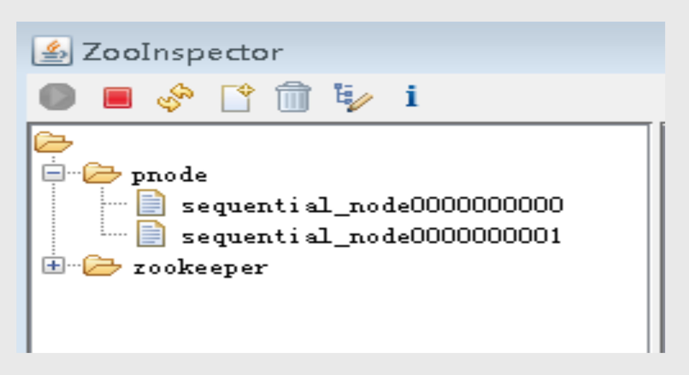
</center>

设想一个场景:

1. 客户端创建一个顺序结点00000000.
2. 服务器创建成功,并且服务器集群事务提交成功.
3. 返回给客户端.
4. 数据包发送到线路之前网络异常断开,此次客户端请求就会执行失败.那么客户端无法确定是成功还是失败.
5. Curator会为我们在此重试,那么就会创建00000001.

显然这不是我们要的结果。

[Consider a scenario:]:#

[1. The client creates a sequence node 00000000.]:#
[2. The server was created successfully, and the server cluster transaction was submitted successfully.]:#
[3. Return to the client.]:#
[4. The network is abnormally disconnected before the data packet is sent to the line, and the client request will fail to execute this time. Then the client cannot determine success or failure.]:#
[5. Curator will retry for us here, then it will create 00000001.]:#

[Obviously this is not the result we want]:#

## 最佳实践8: 创建顺序结点使用withProtection

[## Best Practice 8: Use withProtection to create sequential nodes]:#

```
curatorFramework.create().creatingParentsIfNeeded().withProtection().withMode(CreateMode.EPHEMERAL_SEQUENTIAL).forPath(path);
```

CreateBuilder 提供了一个 withProtection 方法来通知Curator客户端,在创建的有序节点前添加一个唯一标识符,如果create操作失败了,客户端就会开始重试操作,而重试操作的一个步骤就是验证是否存在一个节点包含这个唯一标识符.

Curator客户端中提供了一个方法,对应用程序的delete操作的执行提供了保障,Curator客户端会重新执行操作,直到成功为止,或Curator客户端实例不可用时.使用该功能,只需要使用DeleteBuilder接口中定义的 guaranteed 方法.

[CreateBuilder provides a withProtection method to notify the Curator client to add a unique identifier before the created ordered node. If the create operation fails, the client will start to retry the operation, and one step of the retry operation is to verify whether There exists a node containing this unique identifier.]:#

[A method is provided in the Curator client to guarantee the execution of the application's delete operation, and the Curator client will re-execute the operation until it succeeds, or when the Curator client instance is unavailable. To use this feature, it is only necessary to use the guaranteed method defined in the DeleteBuilder interface.]:#


<br>

### [back](./)
