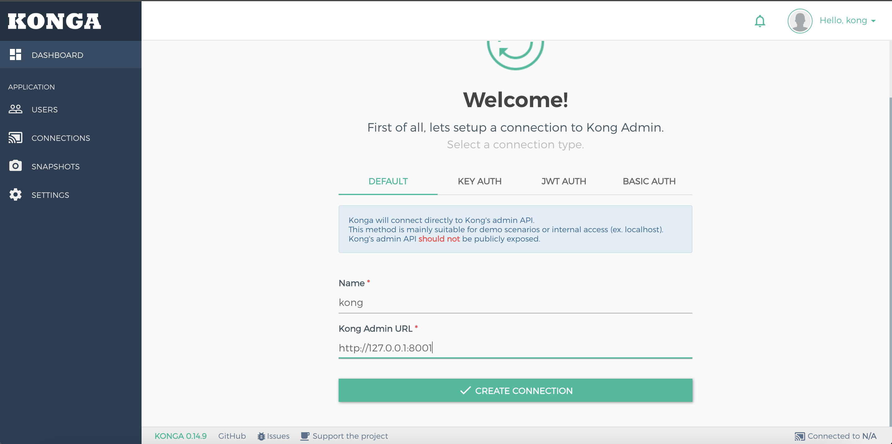

<h1 style="color:#606c71;text-align:center;" >短地址架构设计与实现</h1> 

[<h1 style="color:#606c71;text-align:center;" >Design and Implementation of Short Address Architecture</h1> ]:#

>  &nbsp;&nbsp;&nbsp;&nbsp; 短地址的作用是解决 URL 过长的问题而产生的.虽然目前网上提供很多免费短地址的服务,但是这毕竟受制于对方服务的稳定性.后续如果对方短地址解析服务变更或者关闭了,那么前期已经提供出去的地址就全部无效了,这对前期已经投入广告成本就基本打水漂了.因此一般来说都会自建短地址服务,毕竟这东西的复杂性没那么难.本文就简单说明下短地址服务的一些实现架构和思路,以供自建短地址来作为技术参考. 
>  

[>  &nbsp;&nbsp;&nbsp;&nbsp; Some general notes on article. ]:#
[>  ]:#

# 短地址提供服务

&nbsp;&nbsp;&nbsp;&nbsp; 短地址主要的功能是将长地址转换为短地址,并提供短地址访问转发,具体包含以下几部分:

## 地址转换

&nbsp;&nbsp;&nbsp;&nbsp; 即为长地址生成对应的短地址,例如:

长地址["https://cn.engadget.com/2018/04/01/google-shutting-down-goo-gl-url-shortening-service/"] 通过转换生成 短地址["url.cn/2E3A4D"]

## 地址访问

&nbsp;&nbsp;&nbsp;&nbsp; 接受短地址访问,利用映射关系重定向.例如:
访问短地址["url.cn/2E3A4D"]重定向到原始地址["https://cn.engadget.com/2018/04/01/google-shutting-down-goo-gl-url-shortening-service/"]

# 服务设计

## 短地址功能模型

&nbsp;&nbsp;&nbsp;&nbsp; 在上述短地址提供的服务基础上,拆解为短地址模型如下所示:

## 短地址服务技术点:

* 支持多机无状态水平扩展

* 提供近redis级别访问性能

* 支持600亿数据规模(1期支持60亿)

* 支持http协议

# 实现

## 短地址格式:

&nbsp;&nbsp;&nbsp;&nbsp; 域名+6位字符串(数字+字母),形如“xx.xxx/AOYKUa"的格式,6位62进制数,对应的号码空间为6的26次方,约568亿的空间.

<mark>系统视图:</mark>

采用spring-boot承载服务,使用redis作为缓存,使用mysql持久化.

## 扩展性

&nbsp;&nbsp;&nbsp;&nbsp; 服务无状态,支持水平伸缩.mysql数据表设计采用预先估算方式,扩展只需新增表即可,无需进行数据迁移

## 存储

&nbsp;&nbsp;&nbsp;&nbsp; redis作为缓存,利用redis过期时间机制存储热点数据,热点数据默认保留一小时.

&nbsp;&nbsp;&nbsp;&nbsp; mysql作为持久化存储,采用独立单库分表方案支持600亿数据量持久化,单表(二字段,单索引)最大记录量6000w,共计1000张表,首期支持100张表60亿数据.

# 地址转换映射

&nbsp;&nbsp;&nbsp;&nbsp; 地址转换映射常用的方法有hash计算和发号器,下面分别说明这两种方式的优缺点:

## hash计算

&nbsp;&nbsp;&nbsp;&nbsp; hash就是通过MD5、SHA或取模等方式计算得到较短的字符串,其优缺点如下:

* 优点:无需依赖第三方组件和服务

* 缺点:可能产生重复,依赖hash算法

## 发号器

&nbsp;&nbsp;&nbsp;&nbsp; 通过发号器产生不重复的号码序列,然后将号码与长地址映射产生一对一绑定关系,采用mysql主键自增功能完成发号,其优缺点如下:

* 优点:应用无需关注发号逻辑,利用mysql自增机制保证不重复,复杂度低,易于维护.

* 缺点:需要预估系统容量,做好表承载的号码段的划分

# 分配规则

&nbsp;&nbsp;&nbsp;&nbsp; mysql表承载号码段范围分配规则:

每张表负责6000W号码的发放,表名和号码段对应关系为:

表[基础表名_表名下标] 承载范围:(表名下标)*6000w~(表名下标+1)*6000w-1

| 表名 | 号码段 |
| :--- | :--- |
| url_mapping_0 | 0~6000w-1 |
| url_mapping_1 | 6000w~12000w-1 |
| ... | ... |

<mark>注</mark>: mysql bigint的最大值和java中long类型的最大值都是9223372036854775807,可以覆盖600亿的数据范围.综合考量倾向使用发号器实现,更加容易维护和修改.

## url访问

&nbsp;&nbsp;&nbsp;&nbsp; 利用http-302状态码重定向实现跳转.[302](https://en.wikipedia.org/wiki/HTTP_302)

## 安全机制

&nbsp;&nbsp;&nbsp;&nbsp; 建立在整个微服务环境安全机制基础之上,针对短地址服务业务本身,主要支持:

1. IP白名单

首期暂不考虑.

2. 基于url正则的白名单

采用配置的方式提供正则白名单过滤,只有白名单中的url才支持重定向访问.

# 资源以及运维相关

## 资源需求:

| 表名 | 号码段 | 特殊备注 |
| :--- | :--- | :--- |
| 1 | mysql独立实例 数量:1 | 预创建100张表 | 
| 2 | redis独立节点 数量:1 | 不开启持久化,无需主 | 
| 3 | spring boot应用资源 数量:2 | spring boot 纳入现有微服务体系 |
| 4 | sa.io 域名申请 |   |

## 监控

| 表名 | 号码段 | 特殊备注 |
| :--- | :--- | :--- |
| 1 | mysql | 利用现有监控手段 | 
| 2 | redis | 云服务提供监控手段 | 
| 3 | spring-boot | 利用现有监控手段 |
| 4 | 业务监控/报表 | 暂时不提供  |

 

### [back](./)
