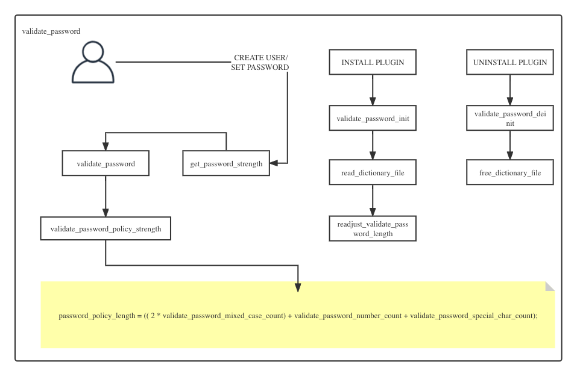

<script>
var pageHeader=document.getElementsByClassName("page-header")[0].innerHTML;
 pageHeader="<center></center>"+pageHeader;
document.getElementsByClassName("page-header")[0].innerHTML=pageHeader;
</script>

<h1 style="color:#606c71;text-align:center;" >如何在MySQL中使用外部插件功能</h1><br/>

[<h1 style="color:#606c71;text-align:center;" >How to use external plugin functionality in MySQL</h1><br/>]:#

<center>

</center>

> <br/> &nbsp;&nbsp;&nbsp;&nbsp; MySQL中很多功能都是使用插件的形式来完成的,MySQL插件功能可以在不修改源码的情况下对功能进行扩展.在MySQL整个运行圣母周期中,插件能够支持的切入点可以有状态、参数、函数等. 比如大家实用特别多的`InnoDB`、`CSV`等存储引擎,都是使用插件的形式来提供的,还有一些功能半同步复制、MGR、日志审计、数据回收、密码强度等.这篇文章我就以怎样在MySQL中使用 `密码强度` 插件来说明下.<br/>
> <br/>

[> <br/>&nbsp;&nbsp;&nbsp;&nbsp; Some general notes on article.<br/>]:#
[> <br/>]:#

# 背景

&nbsp;&nbsp;&nbsp;&nbsp; MySQL 支持服务端和客户端插件,两种插件时协同工作的.插件支持在服务启动时加载,也可以通过后续动态加载.插件本身的功能比UDF函数更通用.并且插件的API 接口是通用的.插件的目的就是为了更利于MySQL在社区发展和更加丰富MySQL的功能,就想kubernates中的sigs一样.


# 安装插件

## 查看插件目录

```
mysql> SHOW VARIABLES LIKE 'plugin_dir%';
+---------------+--------------------------+
| Variable_name | Value                    |
+---------------+--------------------------+
| plugin_dir    | /usr/lib64/mysql/plugin/ |
+---------------+--------------------------+
1 row in set (0.00 sec)
``` 
## 确认插件文件

&nbsp;&nbsp;&nbsp;&nbsp; 首先确认 `/usr/lib64/mysql/plugin/` 有 `validate_password.so` 文件是否存在.

```
$ ll  /usr/lib64/mysql/plugin/validate_password.so
-rwxr-xr-x 1 root root   217202 Jun 22 23:01 /usr/lib64/mysql/plugin/validate_password.so
```
## 插件安装方式

&nbsp;&nbsp;&nbsp;&nbsp; 插件的安装方式有两种:一种编辑文件(永久),一种动态加载(临时).

### 方式1:

&nbsp;&nbsp;&nbsp;&nbsp; 编辑/etc/my.cnf,重启服务即可看到插件的插件状态.

```
[mysqld]
#validate_password=OFF #我暂时注释掉禁用插件,这个时MySQL提供一个更为快捷的方式启用validate_password插件
plugin-load-add=validate_password.so #这种方式加载只能通过SHOW PLUGINS  ;
```

### 方式2:

```
mysql> INSTALL PLUGIN validate_password SONAME 'validate_password.so';  
```

# 查看插件

&nbsp;&nbsp;&nbsp;&nbsp; 插件查看方式有三种.

## 方式1

```
mysql> SHOW PLUGINS;
+----------------------------+----------+--------------------+----------------------+---------+
| Name                       | Status   | Type               | Library              | License |
+----------------------------+----------+--------------------+----------------------+---------+
| binlog                     | ACTIVE   | STORAGE ENGINE     | NULL                 | GPL     |
| mysql_native_password      | ACTIVE   | AUTHENTICATION     | NULL                 | GPL     |
| sha256_password            | ACTIVE   | AUTHENTICATION     | NULL                 | GPL     |
| MRG_MYISAM                 | ACTIVE   | STORAGE ENGINE     | NULL                 | GPL     |
| PERFORMANCE_SCHEMA         | ACTIVE   | STORAGE ENGINE     | NULL                 | GPL     |
| MEMORY                     | ACTIVE   | STORAGE ENGINE     | NULL                 | GPL     |
| InnoDB                     | ACTIVE   | STORAGE ENGINE     | NULL                 | GPL     |
| INNODB_TRX                 | ACTIVE   | INFORMATION SCHEMA | NULL                 | GPL     |
| INNODB_LOCKS               | ACTIVE   | INFORMATION SCHEMA | NULL                 | GPL     |
| INNODB_LOCK_WAITS          | ACTIVE   | INFORMATION SCHEMA | NULL                 | GPL     |
| INNODB_CMP                 | ACTIVE   | INFORMATION SCHEMA | NULL                 | GPL     |
| INNODB_CMP_RESET           | ACTIVE   | INFORMATION SCHEMA | NULL                 | GPL     |
| INNODB_CMPMEM              | ACTIVE   | INFORMATION SCHEMA | NULL                 | GPL     |
| INNODB_CMPMEM_RESET        | ACTIVE   | INFORMATION SCHEMA | NULL                 | GPL     |
| INNODB_CMP_PER_INDEX       | ACTIVE   | INFORMATION SCHEMA | NULL                 | GPL     |
| INNODB_CMP_PER_INDEX_RESET | ACTIVE   | INFORMATION SCHEMA | NULL                 | GPL     |
| INNODB_BUFFER_PAGE         | ACTIVE   | INFORMATION SCHEMA | NULL                 | GPL     |
| INNODB_BUFFER_PAGE_LRU     | ACTIVE   | INFORMATION SCHEMA | NULL                 | GPL     |
| INNODB_BUFFER_POOL_STATS   | ACTIVE   | INFORMATION SCHEMA | NULL                 | GPL     |
| INNODB_TEMP_TABLE_INFO     | ACTIVE   | INFORMATION SCHEMA | NULL                 | GPL     |
| INNODB_METRICS             | ACTIVE   | INFORMATION SCHEMA | NULL                 | GPL     |
| INNODB_FT_DEFAULT_STOPWORD | ACTIVE   | INFORMATION SCHEMA | NULL                 | GPL     |
| INNODB_FT_DELETED          | ACTIVE   | INFORMATION SCHEMA | NULL                 | GPL     |
| INNODB_FT_BEING_DELETED    | ACTIVE   | INFORMATION SCHEMA | NULL                 | GPL     |
| INNODB_FT_CONFIG           | ACTIVE   | INFORMATION SCHEMA | NULL                 | GPL     |
| INNODB_FT_INDEX_CACHE      | ACTIVE   | INFORMATION SCHEMA | NULL                 | GPL     |
| INNODB_FT_INDEX_TABLE      | ACTIVE   | INFORMATION SCHEMA | NULL                 | GPL     |
| INNODB_SYS_TABLES          | ACTIVE   | INFORMATION SCHEMA | NULL                 | GPL     |
| INNODB_SYS_TABLESTATS      | ACTIVE   | INFORMATION SCHEMA | NULL                 | GPL     |
| INNODB_SYS_INDEXES         | ACTIVE   | INFORMATION SCHEMA | NULL                 | GPL     |
| INNODB_SYS_COLUMNS         | ACTIVE   | INFORMATION SCHEMA | NULL                 | GPL     |
| INNODB_SYS_FIELDS          | ACTIVE   | INFORMATION SCHEMA | NULL                 | GPL     |
| INNODB_SYS_FOREIGN         | ACTIVE   | INFORMATION SCHEMA | NULL                 | GPL     |
| INNODB_SYS_FOREIGN_COLS    | ACTIVE   | INFORMATION SCHEMA | NULL                 | GPL     |
| INNODB_SYS_TABLESPACES     | ACTIVE   | INFORMATION SCHEMA | NULL                 | GPL     |
| INNODB_SYS_DATAFILES       | ACTIVE   | INFORMATION SCHEMA | NULL                 | GPL     |
| INNODB_SYS_VIRTUAL         | ACTIVE   | INFORMATION SCHEMA | NULL                 | GPL     |
| CSV                        | ACTIVE   | STORAGE ENGINE     | NULL                 | GPL     |
| MyISAM                     | ACTIVE   | STORAGE ENGINE     | NULL                 | GPL     |
| FEDERATED                  | DISABLED | STORAGE ENGINE     | NULL                 | GPL     |
| BLACKHOLE                  | ACTIVE   | STORAGE ENGINE     | NULL                 | GPL     |
| partition                  | ACTIVE   | STORAGE ENGINE     | NULL                 | GPL     |
| ARCHIVE                    | ACTIVE   | STORAGE ENGINE     | NULL                 | GPL     |
| ngram                      | ACTIVE   | FTPARSER           | NULL                 | GPL     |
| validate_password          | DISABLED | VALIDATE PASSWORD  | validate_password.so | GPL     |
| test_plugin_server         | ACTIVE   | AUTHENTICATION     | auth_test_plugin.so  | GPL     |
+----------------------------+----------+--------------------+----------------------+---------+
46 rows in set (0.00 sec)
```

## 方式2

```
mysql> SELECT MPL.PLUGIN_NAME,MPL.PLUGIN_LIBRARY,MPL.PLUGIN_STATUS FROM  INFORMATION_SCHEMA.PLUGINS MPL WHERE MPL.PLUGIN_NAME  LIKE '%validate_password%';
+--------------------+---------------------+---------------+
| PLUGIN_NAME        | PLUGIN_LIBRARY      | PLUGIN_STATUS |
+--------------------+---------------------+---------------+
| validate_password | validate_password.so | ACTIVE        |
+--------------------+---------------------+---------------+
1 row in set (0.00 sec)
```

## 方式3

```
mysql> select * from mysql.plugin;
+--------------------+----------------------+
| name               | dl                   |
+--------------------+----------------------+
| validate_password  | validate_password.so |
+--------------------+----------------------+
1 rows in set (0.00 sec)
```

# 插件说明

简单说明下`validate_password`各种参数的含义.下面那些变量可以通过 my.cnf 或者 SET GLOBAL 设置,前提是要安装并加载这个插件,如果加载了.查看这个插件就会显示如下信息.

```
mysql> SHOW VARIABLES LIKE 'validate_password%';
+--------------------------------------+--------+
| Variable_name                        | Value  |
+--------------------------------------+--------+

| validate_password_check_user_name    | OFF    |    

| validate_password_dictionary_file    | /var/lib/mysql/password_file.txt       |

| validate_password_length             | 8      |

| validate_password_mixed_case_count   | 1      |

| validate_password_number_count       | 1      |

| validate_password_policy             | MEDIUM |

| validate_password_special_char_count | 1      |
+--------------------------------------+--------+
```

* validate_password_check_user_name #1或者ON为打开，0或者OFF为关闭,意思就是是否在创建密码时把密码和当前用户去做一个比较,如果它们匹配则拒绝创建

* validate_password_dictionary_file #当validate_password_policy 为2是,也就是STRONG时才有效果.当密码匹配这个文件里面每行的的数据时,文件内容全是小写,如果匹配,就拒绝设置,这个文件最后为绝对路径,并且启动mysql服务的那个用户能有这个文件的读取权限

* validate_password_length #密码的最小长度

* validate_password_mixed_case_count #最少有一个大写字符

* validate_password_number_count #最少有一个数字字符

* validate_password_policy #密码策略,0 or LOW、1 or MEDIUM、2 or STRONG

* validate_password_special_char_count #最少有一个特殊字符

# 插件逻辑
&nbsp;&nbsp;&nbsp;&nbsp;简单的代码调用逻辑如图.

<center>

</center>

# 卸载插件

&nbsp;&nbsp;&nbsp;&nbsp; 卸载插件的方式也有两种.

## 方式1

&nbsp;&nbsp;&nbsp;&nbsp;如果有在/etc/my.cnf显示加载插件,删除加载插件那行代码即可.然后重启服务,再次通过以下命令如果看不到插件了就表示卸载成功了

```
mysql> SHOW PLUGINS;
```

## 方式2

&nbsp;&nbsp;&nbsp;&nbsp;如果通过INSTALL PLUGIN 安装的插件，需要通过使用以下方式卸载:

```
UNINSTALL PLUGIN validate_password; # 这样在mysql.plugin表中就是空的了
```

# 总结

&nbsp;&nbsp;&nbsp;&nbsp; 通过以上使用`validate_password`举例说明和梳理,基本了解了怎么在MySQL中加载外部已经编写的`.so`形式插件.也知道的validate_password的一些配置参数和原理.后续如果需要编写自己的插件,可以阅读<MySQL 5.1 Plugin Development>一书.


<br>

### [back](./)
