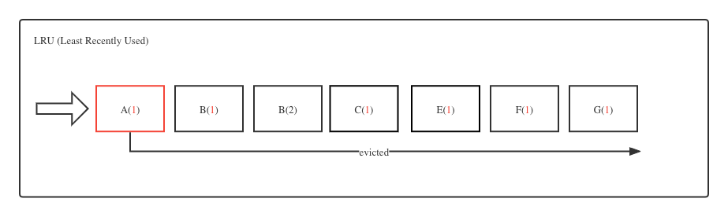
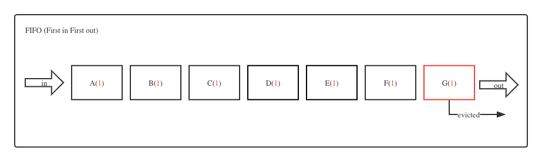

<script>
var pageHeader=document.getElementsByClassName("page-header")[0].innerHTML;
 pageHeader="<center></center>"+pageHeader;
document.getElementsByClassName("page-header")[0].innerHTML=pageHeader;
</script>

<h1 style="color:#606c71;text-align:center;" >解读Redis 缓存逐出策略</h1><br/>

[<h1 style="color:#606c71;text-align:center;" >Interpretation of Redis cache eviction strategy</h1><br/>]:#

<center>

</center>

> <br/>&nbsp;&nbsp;&nbsp;&nbsp; 开发当中都会使用到缓存,缓存通常分内部缓存和外部缓存,专业术语来可以说堆内缓存或者说堆外缓存.通俗理解一点来讲就是堆内缓存就是直接在同一个进程中或者说无需要去跨网络访问的缓存,而堆外缓存基本就是需要跨网络访问的.缓存有多种,比如Ehcache、MemCache、Redis、 Aerospike,第一种算堆内缓存,而后三种就是所称的分布式堆外缓存.那么其中Redis是当前社区使用最多的缓存中间件.那么使用缓存就一定涉及到缓存过期,因为物质(内存)都是有限的,也就说所说当系统资源不足时是如何使用哪种策略去逐出一些Key的呢?这篇文章我将说明下在Redis中的缓存逐出策略以及每种策略的基本原理和执行效果等.<br/>
> <br/>

[> <br/>&nbsp;&nbsp;&nbsp;&nbsp; Some general notes on article.<br/>]:#
[> <br/>]:#

# 算法背景
&nbsp;&nbsp;&nbsp;&nbsp; 先简单说明下一些缓存淘汰算法,现在常用有(LFU、LRU、FIFO、2Q、MRU)这些算法,用的最多的还是LFU、LRU、FIFO这三种.我把这几种都用一些例子解释下

* LFU

&nbsp;&nbsp;&nbsp;&nbsp; LFU (Least Frequently Used) 就是最近最不常用页面置换算法,也就是淘汰一段时间内被访问次数最少的页.

&nbsp;&nbsp;&nbsp;&nbsp; <mark>工作原理</mark>:

<center>

</center>

&nbsp;&nbsp;&nbsp;&nbsp; 比如以上一段时间访问了这些元素,但是只有 `E` 这个访问频率是最低的,仅有一次.那么按照LFU的算法,因此 `E` 这个key是会被踢出.正常算法程序的实现会把一段时间内的 key 排好序(降序),然后把淘汰掉最右边的.

L&nbsp;&nbsp;&nbsp;&nbsp; LFU算法的主要是在一些资源比较稀少且设限制的场景下使用,比如内存、缓存等.

* LRU

&nbsp;&nbsp;&nbsp;&nbsp; LRU (Least Recently Used) 就是最近最少使用页面置换算法,也就是首先淘汰最长时间未被使用的页面.

&nbsp;&nbsp;&nbsp;&nbsp; <mark>工作原理</mark>:

<center>

</center>

&nbsp;&nbsp;&nbsp;&nbsp; 比如以上一段时间访问了这些元素,从左开始向右访问, `A|B|B|C|E|F|G` ,最后发现 `A` 是最长时间没有访问了,因此 `A` 这个key是会被踢出.

&nbsp;&nbsp;&nbsp;&nbsp; LRU对于频繁访问的数据优势特别大,因为一直不会被清除掉,比如热点新闻事件等.

* FIFO

&nbsp;&nbsp;&nbsp;&nbsp; FIFO (First in First out) 就是最新进入队列的数据就最先被淘汰.

&nbsp;&nbsp;&nbsp;&nbsp; <mark>工作原理</mark>:

<center>

</center>

&nbsp;&nbsp;&nbsp;&nbsp; 比如按照以上队列, `G` 是最先入队的,因此 `G` 会最早被清除掉.

&nbsp;&nbsp;&nbsp;&nbsp; FIFO的应用场景比如是固定的大小,比如十天的热门新闻事件.

* MRU

&nbsp;&nbsp;&nbsp;&nbsp; MRU (Most Recently Used) 就是最先移除最近最常使用的条目.

&nbsp;&nbsp;&nbsp;&nbsp; <mark>工作原理</mark>:

<center>

</center>

&nbsp;&nbsp;&nbsp;&nbsp;  比如上面的队列, `D` 是访问最频繁的数据,因此总是会优先被踢掉,

&nbsp;&nbsp;&nbsp;&nbsp; MRU的应用场景感觉很有限啊,有点不明白,为什么使用的越多就越要被踢掉呢.这个感觉不是用在缓存场景下的,更多用在那种“雨露均沾”的情况下.就是不能总是让一个人一直在哪里不动,得到的越多,就更应该踢掉.

* 2Q

&nbsp;&nbsp;&nbsp;&nbsp; 2Q (Two Queues) 就是使用2个缓存队列,一个是FIFO队列,一个是LRU队列.

&nbsp;&nbsp;&nbsp;&nbsp; <mark>工作原理</mark>:

<center>

</center>

&nbsp;&nbsp;&nbsp;&nbsp; 比如按照以上两个队列,数据第一次是按照FIFO队列存储,先进先出.但是如果这个数据还没有出队之前第二次又有访问,那么就会进入LRU队列.然后在LRU队列中,那么下次访问就会直接去LRU队列中找数据.如果在LRU队列中有被访问过一次,就会把数据提到最后,让数据不那么快被回收掉,这是LRU的算法逻辑.

&nbsp;&nbsp;&nbsp;&nbsp; 2Q的应用场景是业务有特殊需求时才会用到,又要满足先进先出,还得满足热点数据.

# 逐出策略

&nbsp;&nbsp;&nbsp;&nbsp; 在redis中,允许用户设置最大使用内存大小 maxmemory（需要配合maxmemory-policy使用），设置为0表示不限制；当redis内存数据集快到达maxmemory时，redis会实行数据淘汰策略。Redis提供6种数据淘汰策略：

&nbsp;&nbsp;&nbsp;&nbsp; 在redis中,缓存能够存储多少是设 `maxmemory` (最大内存) 限制的,这个参数决定最多能够存储多少缓存数据.这个参数可以接受的单位有: `bytes(不带单位,默认)、K|KB、M|MB、G|GB` 这些,而32位系统使用3G 的隐式内存限制,64位系统按默认为0表示不限制或者根据用户配置决定.但是内部怎么计算哪些缓存应该保留,哪些应该踢掉,是由 `maxmemory-policy` (缓存策略) 参数控制的.Redis总共提供8种淘汰策略:

* <mark>noeviction</mark>:  不踢除(默认淘汰策,),直到达到内存最大配置 (maxmemory),该配置下当内存不够时会发生OOM. 但是当使用主从复制模式时,从库的最大数据量由主库来决定.

* <mark>allkeys-lru</mark>:  基于LRU算法对所有的key进行删除,保留一段时间内访问过的键,移除一段时间内未被访问的键.

* <mark>allkeys-lfu</mark> : 基于LFU算法对所有的key进行删除,保留一段时间内访问次数频繁的键,移除一段时间内访问频繁低的键.

* <mark>volatile-lru</mark>: 删除最近使用最少的键,只有设置过期的键才会有用.

* <mark>volatile-lfu</mark>:  删除使用频率最低的键,只有设置过期的键才会有用.

* <mark>allkeys-random</mark>:  随机删除键以便为增加的新数据腾出空间.

* <mark>volatile-random</mark>:  随机删除过期字段中设置为true的键.

* <mark>volatile-ttl</mark>:  删除从已设置过期时间且剩余最短生存时间(TTL)的内存数据集中挑选即将过期的键；

&nbsp;&nbsp;&nbsp;&nbsp; 还有一些参数也和LRU以及LRU的采用样本有关.因为Redis LRU算法并不是一个严谨的实现,根本无法保证清除的精确性,但是您可以通过更改样本数量来调整算法的精度.比如下面这个配置,大多数情况下按默认配置`(5)`已经是比较好的,这是经过严格实验测试过的.如果设置为`(10)`的话基本已经非常接近LRU的极限值了.

```
maxmemory-samples 5 
```

&nbsp;&nbsp;&nbsp;&nbsp; 从Redis 4.0开始 LFU 模式也得到了极大的增强.可以通过以下配置更改LFU的淘汰.

```
lfu-log-factor 10  # 概率因子
lfu-decay-time 1  # 即上次访问时间,单位分钟
```

[Redis evict](https://github.com/redis/redis/blob/unstable/src/evict.c)

```
//计算过后的实际访问次数,最大不会超过255
uint8_t LFULogIncr(uint8_t counter) {
    if (counter == 255) return 255;
    // RAND_MAX 函数最小为 32767,RAND_MAX 最大值在 ISO IEC 9899 2011(C11) 标准中并未规定具体数值
    // 需要得到一个 0~1.0 之间的随机浮点数
    double r = (double)rand()/RAND_MAX; 
    double baseval = counter - LFU_INIT_VAL; //LFU_INIT_VAL=5
    if (baseval < 0) baseval = 0;
    double p = 1.0/(baseval*server.lfu_log_factor+1);
    if (r < p) counter++;
    return counter;
}
```

&nbsp;&nbsp;&nbsp;&nbsp; counter 便是访问次数,但是比不是简单的 +1 而已,需要通过 LFULogIncr 函数计算.counter 最大值为 255.然后通过取一个 0~1 之间的随机数 r 与 p 进行比较,只有当 r < p 时,才会执行最终的访问次数 +1. p 的最终值与当前的 counter 以及配置文件中的 lfu_log_factor 参数有着直接的联系,如果 counter 和 lfu_log_factor 越到,那么 p 就会越小,那么反之就是 r < p 的概率也会越小,越到后面增长的 counter 概率也就越小,通过以下的简单表格就可以看出来.

| factor | 100 hits | 1000 hits | 100K hits | 1M hits | 10M hits |
| :--- | :---  | :---  | :---  | :---  | :---  |
| 1 | 104 | 255 | 255 | 255 | 255 |
| 1 | 18 | 49 | 255 | 255 | 255 |
| 10 | 10 | 18 | 142 | 255 | 255 |
| 100 | 8 | 11 | 49 | 143 | 255 |


<mark>简单计算</mark>:

```
lfu_log_factor = [10,20,30]
counter=200

double p = 1.0/((200-5)*10+1) //0.0005125576627370579
double p = 1.0/((200-5)*20+1) //0.0002563445270443476
double p = 1.0/((200-5)*30+1) //0.00017091095539224064
```

# 验证环节

&nbsp;&nbsp;&nbsp;&nbsp; 那么我将通过一些例子说实际看看不同的淘汰策略在系统的效果等,关于maxmemory和maxmemory-policy两个参数有两种方法可以配置,一种是修改redis.conf文件,然后重启Redis服务,这个时永久性的.还有一种是通过CONFIG GET [maxmemory|maxmemory-policy] [parameter ...]动态修改,这个时临时的,当Redis服务被重启后会丢失手工动态配置的参数.我下面为了方便主要还是通过动态修改来讲解这种情况.

以下这三个就暂时用Redis提供的默认值,暂时不修改.

```
127.0.0.1:6379> CONFIG GET maxmemory-samples
1) "maxmemory-samples"
2) "5"
127.0.0.1:6379> CONFIG GET lfu-log-factor 
1) "lfu-log-factor"
2) "10"
127.0.0.1:6379> CONFIG GET lfu-decay-time 
1) "lfu-decay-time"
2) "1"
127.0.0.1:6379> 
```

## noeviction 
&nbsp;&nbsp;&nbsp;&nbsp; 这是默认的策略,就是不踢除,直到OOM为止.

```
127.0.0.1:6379> keys *
(empty array)
127.0.0.1:6379> CONFIG GET maxmemory
1) "maxmemory"
2) "0"
127.0.0.1:6379> CONFIG GET maxmemory-policy
1) "maxmemory-policy"
2) "noeviction"
127.0.0.1:6379> info memory
# Memory
used_memory:1009168     # current already used memory
used_memory_human:985.52K
used_memory_rss:9084928
used_memory_rss_human:8.66M
used_memory_peak:1139056
used_memory_peak_human:1.09M
used_memory_peak_perc:88.60%
used_memory_overhead:864672
used_memory_startup:862688
used_memory_dataset:144496
used_memory_dataset_perc:98.65%
allocator_allocated:1263216
allocator_active:1601536
allocator_resident:4177920
total_system_memory:2082639872
total_system_memory_human:1.94G
used_memory_lua:31744
used_memory_vm_eval:31744
used_memory_lua_human:31.00K
used_memory_scripts_eval:0
number_of_cached_scripts:0
number_of_functions:0
number_of_libraries:0
used_memory_vm_functions:32768
used_memory_vm_total:64512
used_memory_vm_total_human:63.00K
used_memory_functions:184
used_memory_scripts:184
used_memory_scripts_human:184B
maxmemory:0 # no memory limits.
maxmemory_human:0B
maxmemory_policy:noeviction
allocator_frag_ratio:1.27
allocator_frag_bytes:338320
allocator_rss_ratio:2.61
allocator_rss_bytes:2576384
rss_overhead_ratio:2.17
rss_overhead_bytes:4907008
mem_fragmentation_ratio:9.19
mem_fragmentation_bytes:8096432
mem_not_counted_for_evict:0
mem_replication_backlog:0
mem_total_replication_buffers:0
mem_clients_slaves:0
mem_clients_normal:1800
mem_cluster_links:0
mem_aof_buffer:0
mem_allocator:jemalloc-5.2.1
active_defrag_running:0
lazyfree_pending_objects:0
lazyfreed_objects:0
127.0.0.1:6379>  CONFIG SET maxmemory 1024
OK
127.0.0.1:6379> set key1 "value1"
(error) OOM command not allowed when used memory > 'maxmemory'. # OOM

127.0.0.1:6379> CONFIG SET maxmemory 1024000
OK
127.0.0.1:6379> set key1 "value1"
OK
127.0.0.1:6379> get key1
"value1"
127.0.0.1:6379> 
```

## allkeys-lru

&nbsp;&nbsp;&nbsp;&nbsp;  比如我在`info memory`中`used_memory`现有的基础上增加10240(10KB)的数量,然后我添加10个Key,每个key的值时1KB,然后看下`allkeys-lru`策略的清除效果.
<mark>Notes</mark>:

`1107920` 通过 `info memory` 命令中`used_memory`参数查看.

```
127.0.0.1:6379> keys *
(empty array)
127.0.0.1:6379> CONFIG GET maxmemory
1) "maxmemory"
2) "0"
127.0.0.1:6379> CONFIG GET maxmemory-policy
1) "maxmemory-policy"
2) "noeviction"
127.0.0.1:6379> info memory 
# Memory
used_memory:1107920 # used_memory:1107920
used_memory_human:1.06M
used_memory_rss:9236480
used_memory_rss_human:8.81M
used_memory_peak:1287184
used_memory_peak_human:1.23M
used_memory_peak_perc:86.07%
used_memory_overhead:864576
used_memory_startup:862592
used_memory_dataset:243344
used_memory_dataset_perc:99.19%
allocator_allocated:1391448
allocator_active:1736704
allocator_resident:4317184
total_system_memory:2082639872
total_system_memory_human:1.94G
used_memory_lua:31744
used_memory_vm_eval:31744
used_memory_lua_human:31.00K
used_memory_scripts_eval:0
number_of_cached_scripts:0
number_of_functions:0
number_of_libraries:0
used_memory_vm_functions:32768
used_memory_vm_total:64512
used_memory_vm_total_human:63.00K
used_memory_functions:184
used_memory_scripts:184
used_memory_scripts_human:184B
maxmemory:0
maxmemory_human:0B
maxmemory_policy:allkeys-lru
allocator_frag_ratio:1.25
allocator_frag_bytes:345256
allocator_rss_ratio:2.49
allocator_rss_bytes:2580480
rss_overhead_ratio:2.14
rss_overhead_bytes:4919296
mem_fragmentation_ratio:8.50
mem_fragmentation_bytes:8149232
mem_not_counted_for_evict:0
mem_replication_backlog:0
mem_total_replication_buffers:0
mem_clients_slaves:0
mem_clients_normal:1800
mem_cluster_links:0
mem_aof_buffer:0
mem_allocator:jemalloc-5.2.1
active_defrag_running:0
lazyfree_pending_objects:0
lazyfreed_objects:0
127.0.0.1:6379> info memory
# Memory
used_memory:1107920
used_memory_human:1.06M
used_memory_rss:9236480
used_memory_rss_human:8.81M
used_memory_peak:1287184
used_memory_peak_human:1.23M
used_memory_peak_perc:86.07%
used_memory_overhead:864576
used_memory_startup:862592
used_memory_dataset:243344
used_memory_dataset_perc:99.19%
allocator_allocated:1358936
allocator_active:1712128
allocator_resident:4292608
total_system_memory:2082639872
total_system_memory_human:1.94G
used_memory_lua:31744
used_memory_vm_eval:31744
used_memory_lua_human:31.00K
used_memory_scripts_eval:0
number_of_cached_scripts:0
number_of_functions:0
number_of_libraries:0
used_memory_vm_functions:32768
used_memory_vm_total:64512
used_memory_vm_total_human:63.00K
used_memory_functions:184
used_memory_scripts:184
used_memory_scripts_human:184B
maxmemory:0
maxmemory_human:0B
maxmemory_policy:allkeys-lru
allocator_frag_ratio:1.26
allocator_frag_bytes:353192
allocator_rss_ratio:2.51
allocator_rss_bytes:2580480
rss_overhead_ratio:2.15
rss_overhead_bytes:4943872
mem_fragmentation_ratio:8.50
mem_fragmentation_bytes:8149232
mem_not_counted_for_evict:0
mem_replication_backlog:0
mem_total_replication_buffers:0
mem_clients_slaves:0
mem_clients_normal:1800
mem_cluster_links:0
mem_aof_buffer:0
mem_allocator:jemalloc-5.2.1
active_defrag_running:0
lazyfree_pending_objects:0
lazyfreed_objects:0
127.0.0.1:6379> CONFIG SET maxmemory 1118160 # 1107920+10240 = 1118160
OK
127.0.0.1:6379> CONFIG SET maxmemory-policy allkeys-lru
OK
127.0.0.1:6379> CONFIG GET maxmemory
1) "maxmemory"
2) "1118160"
127.0.0.1:6379> CONFIG GET maxmemory-policy
1) "maxmemory-policy"
2) "allkeys-lru"

127.0.0.1:6379> info memory
# Memory
used_memory:1083200 # used_memory:1083200
used_memory_human:1.03M
used_memory_rss:8847360
used_memory_rss_human:8.44M
used_memory_peak:1213056
used_memory_peak_human:1.16M
used_memory_peak_perc:89.30%
used_memory_overhead:864576
used_memory_startup:862592
used_memory_dataset:218624
used_memory_dataset_perc:99.10%
allocator_allocated:1394984
allocator_active:1708032
allocator_resident:4288512
total_system_memory:2082639872
total_system_memory_human:1.94G
used_memory_lua:31744
used_memory_vm_eval:31744
used_memory_lua_human:31.00K
used_memory_scripts_eval:0
number_of_cached_scripts:0
number_of_functions:0
number_of_libraries:0
used_memory_vm_functions:32768
used_memory_vm_total:64512
used_memory_vm_total_human:63.00K
used_memory_functions:184
used_memory_scripts:184
used_memory_scripts_human:184B
maxmemory:0
maxmemory_human:0B
maxmemory_policy:noeviction
allocator_frag_ratio:1.22
allocator_frag_bytes:313048
allocator_rss_ratio:2.51
allocator_rss_bytes:2580480
rss_overhead_ratio:2.06
rss_overhead_bytes:4558848
mem_fragmentation_ratio:8.33
mem_fragmentation_bytes:7784832
mem_not_counted_for_evict:0
mem_replication_backlog:0
mem_total_replication_buffers:0
mem_clients_slaves:0
mem_clients_normal:1800
mem_cluster_links:0
mem_aof_buffer:0
mem_allocator:jemalloc-5.2.1
active_defrag_running:0
lazyfree_pending_objects:0
lazyfreed_objects:0
127.0.0.1:6379> CONFIG SET maxmemory 1093440 # 1083200+10240
OK
127.0.0.1:6379>  CONFIG SET maxmemory-policy allkeys-lru
OK
127.0.0.1:6379> CONFIG GET maxmemory
1) "maxmemory"
2) "1093440"
127.0.0.1:6379> CONFIG GET maxmemory-policy
1) "maxmemory-policy"
2) "allkeys-lru"
127.0.0.1:6379> info memory
# Memory
# 这个当然不会继续维持在 1107920 这个数字了.因为你的任何指令都会增加Redis的内存使用量,只是用的比较小,可以忽略不计而已.比如我上面这几条指令用了 1107920-1083200 = 24720 byte 空间
# 1118160-1107920 = 10240 刚好是我们设置的 10MB 
used_memory:1107920  
used_memory_human:1.06M
used_memory_rss:9240576
used_memory_rss_human:8.81M
used_memory_peak:1287184
used_memory_peak_human:1.23M
used_memory_peak_perc:86.07%
used_memory_overhead:864576
used_memory_startup:862592
used_memory_dataset:243344
used_memory_dataset_perc:99.19%
allocator_allocated:1350744
allocator_active:1703936
allocator_resident:4284416
total_system_memory:2082639872
total_system_memory_human:1.94G
used_memory_lua:31744
used_memory_vm_eval:31744
used_memory_lua_human:31.00K
used_memory_scripts_eval:0
number_of_cached_scripts:0
number_of_functions:0
number_of_libraries:0
used_memory_vm_functions:32768
used_memory_vm_total:64512
used_memory_vm_total_human:63.00K
used_memory_functions:184
used_memory_scripts:184
used_memory_scripts_human:184B
maxmemory:1118160
maxmemory_human:1.07M
maxmemory_policy:allkeys-lru
allocator_frag_ratio:1.26
allocator_frag_bytes:353192
allocator_rss_ratio:2.51
allocator_rss_bytes:2580480
rss_overhead_ratio:2.16
rss_overhead_bytes:4956160
mem_fragmentation_ratio:8.50
mem_fragmentation_bytes:8153328
mem_not_counted_for_evict:0
mem_replication_backlog:0
mem_total_replication_buffers:0
mem_clients_slaves:0
mem_clients_normal:1800
mem_cluster_links:0
mem_aof_buffer:0
mem_allocator:jemalloc-5.2.1
active_defrag_running:0
lazyfree_pending_objects:0
lazyfreed_objects:0


# 添加10 key[1~10]
127.0.0.1:6379> set key1 "000012345678901234567890Hl8c6tYlDQmzUMnc4Bs6v6oMBTok1JPrQhFrdYaA8q8WDH4vkZjYfQ1iZz5d6Q9QN4DFEWRRyrHDXVhRA8SRTlp5GKpqPAJFvpdgnjSE9B3TXeqUbbqDpetKbTS7ZFzfoeQM9FCa9o29ZZLTydTpvmCpXX2WyouoCN21sFNuxPf4V1QrUpLwcRPYQKVEB6lDlQ52cfNsn4Wpm8cMzza6Wo3kBXFYN4bDhVJ36ogNCKI75kqSxJ9WcHiOCkyhIzBDklRuO4PZLjk8G7TLQ5NQsSJLtOcCltTcnhhQxCyqsaJLiwMuKIVRDkkm3btQoBzJIxlqaZ28ExHrbALGDpQKfgmnB2G4leovuQTyMvzvJHzbB93zflO88XzhVueyKEciEu6QvautRwh3brCHWjvNLAD4YvVdLQK86uqiZwa98xp3q4vm9nvweaiggpuq7gxSnN3JPMNTiJCszd9VzhgCZW46q0HERVkeLJPr7mchqSNp68A1mb0AMCWratbtPNYZFz9NxkpJwbpKmHBhAF5ge8so0iwttohL7a2RKXBELRruGToJhsr61wT8bwvQ1C4TR4f6tvQylmfivwvwKArxtG4asHxOPx9mJMFCAW7pPefcE3G2XKQQqqtc5GuuqxXHyqobVrTQomITaTzzwZuo4HWlGlN8KSJQWlq9NQ69PzA650RUyEJukqC64wjjWp1NKQlLwPMzB7SWO8y4ofcJ43yE254XVhM0j36dIWR1BddxkosPZ6G29nWaZJUqC1v0ZbWcO3JInXuu0wy6d5Vwq1MmFUD4ga3St3mN8Axg5ARS8YDcrMHlzl31Wd1etnIpSK3pSk7zriz2DtkuGfeH9lM0cZgnIWb2nhiGaxDLJnSraXJ6GyWJ8Hn0fOYSrJ0OeVYBmZL9ddZiU5s1NodocQQrXnnoOZJ9r6WlD4dNfMXMxZWlPTsrX3dTQo3mjL8kzIZiPM9T6aytfOuzcsc2ukVmrmULbYVDEDWd6AfH"

# 1328 - 1024 = 304 ,至于这个304怎么来的,后续通过分析redis内存分配逻辑在讲解.
# 增加一个key就占用1328空间,那么我们就最多增加大量7个多点,Redis内部就会根据 maxmemory-policy 策略就会踢掉一些很久不使用的key
127.0.0.1:6379> MEMORY USAGE key1
(integer) 1328
127.0.0.1:6379> info memory
# Memory
used_memory:1109248 # 1109248-1328 = 1107920 ,这个 1107920 刚好是我们添加 key1 前的内存使用量
used_memory_human:1.06M
used_memory_rss:9240576
used_memory_rss_human:8.81M
used_memory_peak:1287184
used_memory_peak_human:1.23M
used_memory_peak_perc:86.18%
used_memory_overhead:864648
used_memory_startup:862592
used_memory_dataset:244600
used_memory_dataset_perc:99.17%
allocator_allocated:1350744
allocator_active:1703936
allocator_resident:4284416
total_system_memory:2082639872
total_system_memory_human:1.94G
used_memory_lua:31744
used_memory_vm_eval:31744
used_memory_lua_human:31.00K
used_memory_scripts_eval:0
number_of_cached_scripts:0
number_of_functions:0
number_of_libraries:0
used_memory_vm_functions:32768
used_memory_vm_total:64512
used_memory_vm_total_human:63.00K
used_memory_functions:184
used_memory_scripts:184
used_memory_scripts_human:184B
maxmemory:1118160
maxmemory_human:1.07M
maxmemory_policy:allkeys-lru
allocator_frag_ratio:1.26
allocator_frag_bytes:353192
allocator_rss_ratio:2.51
allocator_rss_bytes:2580480
rss_overhead_ratio:2.16
rss_overhead_bytes:4956160
mem_fragmentation_ratio:8.49
mem_fragmentation_bytes:8152000
mem_not_counted_for_evict:0
mem_replication_backlog:0
mem_total_replication_buffers:0
mem_clients_slaves:0
mem_clients_normal:1800
mem_cluster_links:0
mem_aof_buffer:0
mem_allocator:jemalloc-5.2.1
active_defrag_running:0
lazyfree_pending_objects:0
lazyfreed_objects:0
127.0.0.1:6379> set key2 "000012345678901234567890Hl8c6tYlDQmzUMnc4Bs6v6oMBTok1JPrQhFrdYaA8q8WDH4vkZjYfQ1iZz5d6Q9QN4DFEWRRyrHDXVhRA8SRTlp5GKpqPAJFvpdgnjSE9B3TXeqUbbqDpetKbTS7ZFzfoeQM9FCa9o29ZZLTydTpvmCpXX2WyouoCN21sFNuxPf4V1QrUpLwcRPYQKVEB6lDlQ52cfNsn4Wpm8cMzza6Wo3kBXFYN4bDhVJ36ogNCKI75kqSxJ9WcHiOCkyhIzBDklRuO4PZLjk8G7TLQ5NQsSJLtOcCltTcnhhQxCyqsaJLiwMuKIVRDkkm3btQoBzJIxlqaZ28ExHrbALGDpQKfgmnB2G4leovuQTyMvzvJHzbB93zflO88XzhVueyKEciEu6QvautRwh3brCHWjvNLAD4YvVdLQK86uqiZwa98xp3q4vm9nvweaiggpuq7gxSnN3JPMNTiJCszd9VzhgCZW46q0HERVkeLJPr7mchqSNp68A1mb0AMCWratbtPNYZFz9NxkpJwbpKmHBhAF5ge8so0iwttohL7a2RKXBELRruGToJhsr61wT8bwvQ1C4TR4f6tvQylmfivwvwKArxtG4asHxOPx9mJMFCAW7pPefcE3G2XKQQqqtc5GuuqxXHyqobVrTQomITaTzzwZuo4HWlGlN8KSJQWlq9NQ69PzA650RUyEJukqC64wjjWp1NKQlLwPMzB7SWO8y4ofcJ43yE254XVhM0j36dIWR1BddxkosPZ6G29nWaZJUqC1v0ZbWcO3JInXuu0wy6d5Vwq1MmFUD4ga3St3mN8Axg5ARS8YDcrMHlzl31Wd1etnIpSK3pSk7zriz2DtkuGfeH9lM0cZgnIWb2nhiGaxDLJnSraXJ6GyWJ8Hn0fOYSrJ0OeVYBmZL9ddZiU5s1NodocQQrXnnoOZJ9r6WlD4dNfMXMxZWlPTsrX3dTQo3mjL8kzIZiPM9T6aytfOuzcsc2ukVmrmULbYVDEDWd6AfH"
OK
127.0.0.1:6379>  set key3 "000012345678901234567890Hl8c6tYlDQmzUMnc4Bs6v6oMBTok1JPrQhFrdYaA8q8WDH4vkZjYfQ1iZz5d6Q9QN4DFEWRRyrHDXVhRA8SRTlp5GKpqPAJFvpdgnjSE9B3TXeqUbbqDpetKbTS7ZFzfoeQM9FCa9o29ZZLTydTpvmCpXX2WyouoCN21sFNuxPf4V1QrUpLwcRPYQKVEB6lDlQ52cfNsn4Wpm8cMzza6Wo3kBXFYN4bDhVJ36ogNCKI75kqSxJ9WcHiOCkyhIzBDklRuO4PZLjk8G7TLQ5NQsSJLtOcCltTcnhhQxCyqsaJLiwMuKIVRDkkm3btQoBzJIxlqaZ28ExHrbALGDpQKfgmnB2G4leovuQTyMvzvJHzbB93zflO88XzhVueyKEciEu6QvautRwh3brCHWjvNLAD4YvVdLQK86uqiZwa98xp3q4vm9nvweaiggpuq7gxSnN3JPMNTiJCszd9VzhgCZW46q0HERVkeLJPr7mchqSNp68A1mb0AMCWratbtPNYZFz9NxkpJwbpKmHBhAF5ge8so0iwttohL7a2RKXBELRruGToJhsr61wT8bwvQ1C4TR4f6tvQylmfivwvwKArxtG4asHxOPx9mJMFCAW7pPefcE3G2XKQQqqtc5GuuqxXHyqobVrTQomITaTzzwZuo4HWlGlN8KSJQWlq9NQ69PzA650RUyEJukqC64wjjWp1NKQlLwPMzB7SWO8y4ofcJ43yE254XVhM0j36dIWR1BddxkosPZ6G29nWaZJUqC1v0ZbWcO3JInXuu0wy6d5Vwq1MmFUD4ga3St3mN8Axg5ARS8YDcrMHlzl31Wd1etnIpSK3pSk7zriz2DtkuGfeH9lM0cZgnIWb2nhiGaxDLJnSraXJ6GyWJ8Hn0fOYSrJ0OeVYBmZL9ddZiU5s1NodocQQrXnnoOZJ9r6WlD4dNfMXMxZWlPTsrX3dTQo3mjL8kzIZiPM9T6aytfOuzcsc2ukVmrmULbYVDEDWd6AfH"
OK
127.0.0.1:6379>  set key4 "000012345678901234567890Hl8c6tYlDQmzUMnc4Bs6v6oMBTok1JPrQhFrdYaA8q8WDH4vkZjYfQ1iZz5d6Q9QN4DFEWRRyrHDXVhRA8SRTlp5GKpqPAJFvpdgnjSE9B3TXeqUbbqDpetKbTS7ZFzfoeQM9FCa9o29ZZLTydTpvmCpXX2WyouoCN21sFNuxPf4V1QrUpLwcRPYQKVEB6lDlQ52cfNsn4Wpm8cMzza6Wo3kBXFYN4bDhVJ36ogNCKI75kqSxJ9WcHiOCkyhIzBDklRuO4PZLjk8G7TLQ5NQsSJLtOcCltTcnhhQxCyqsaJLiwMuKIVRDkkm3btQoBzJIxlqaZ28ExHrbALGDpQKfgmnB2G4leovuQTyMvzvJHzbB93zflO88XzhVueyKEciEu6QvautRwh3brCHWjvNLAD4YvVdLQK86uqiZwa98xp3q4vm9nvweaiggpuq7gxSnN3JPMNTiJCszd9VzhgCZW46q0HERVkeLJPr7mchqSNp68A1mb0AMCWratbtPNYZFz9NxkpJwbpKmHBhAF5ge8so0iwttohL7a2RKXBELRruGToJhsr61wT8bwvQ1C4TR4f6tvQylmfivwvwKArxtG4asHxOPx9mJMFCAW7pPefcE3G2XKQQqqtc5GuuqxXHyqobVrTQomITaTzzwZuo4HWlGlN8KSJQWlq9NQ69PzA650RUyEJukqC64wjjWp1NKQlLwPMzB7SWO8y4ofcJ43yE254XVhM0j36dIWR1BddxkosPZ6G29nWaZJUqC1v0ZbWcO3JInXuu0wy6d5Vwq1MmFUD4ga3St3mN8Axg5ARS8YDcrMHlzl31Wd1etnIpSK3pSk7zriz2DtkuGfeH9lM0cZgnIWb2nhiGaxDLJnSraXJ6GyWJ8Hn0fOYSrJ0OeVYBmZL9ddZiU5s1NodocQQrXnnoOZJ9r6WlD4dNfMXMxZWlPTsrX3dTQo3mjL8kzIZiPM9T6aytfOuzcsc2ukVmrmULbYVDEDWd6AfH"
OK
127.0.0.1:6379> set key5 "000012345678901234567890Hl8c6tYlDQmzUMnc4Bs6v6oMBTok1JPrQhFrdYaA8q8WDH4vkZjYfQ1iZz5d6Q9QN4DFEWRRyrHDXVhRA8SRTlp5GKpqPAJFvpdgnjSE9B3TXeqUbbqDpetKbTS7ZFzfoeQM9FCa9o29ZZLTydTpvmCpXX2WyouoCN21sFNuxPf4V1QrUpLwcRPYQKVEB6lDlQ52cfNsn4Wpm8cMzza6Wo3kBXFYN4bDhVJ36ogNCKI75kqSxJ9WcHiOCkyhIzBDklRuO4PZLjk8G7TLQ5NQsSJLtOcCltTcnhhQxCyqsaJLiwMuKIVRDkkm3btQoBzJIxlqaZ28ExHrbALGDpQKfgmnB2G4leovuQTyMvzvJHzbB93zflO88XzhVueyKEciEu6QvautRwh3brCHWjvNLAD4YvVdLQK86uqiZwa98xp3q4vm9nvweaiggpuq7gxSnN3JPMNTiJCszd9VzhgCZW46q0HERVkeLJPr7mchqSNp68A1mb0AMCWratbtPNYZFz9NxkpJwbpKmHBhAF5ge8so0iwttohL7a2RKXBELRruGToJhsr61wT8bwvQ1C4TR4f6tvQylmfivwvwKArxtG4asHxOPx9mJMFCAW7pPefcE3G2XKQQqqtc5GuuqxXHyqobVrTQomITaTzzwZuo4HWlGlN8KSJQWlq9NQ69PzA650RUyEJukqC64wjjWp1NKQlLwPMzB7SWO8y4ofcJ43yE254XVhM0j36dIWR1BddxkosPZ6G29nWaZJUqC1v0ZbWcO3JInXuu0wy6d5Vwq1MmFUD4ga3St3mN8Axg5ARS8YDcrMHlzl31Wd1etnIpSK3pSk7zriz2DtkuGfeH9lM0cZgnIWb2nhiGaxDLJnSraXJ6GyWJ8Hn0fOYSrJ0OeVYBmZL9ddZiU5s1NodocQQrXnnoOZJ9r6WlD4dNfMXMxZWlPTsrX3dTQo3mjL8kzIZiPM9T6aytfOuzcsc2ukVmrmULbYVDEDWd6AfH"
OK
127.0.0.1:6379>  set key6 "000012345678901234567890Hl8c6tYlDQmzUMnc4Bs6v6oMBTok1JPrQhFrdYaA8q8WDH4vkZjYfQ1iZz5d6Q9QN4DFEWRRyrHDXVhRA8SRTlp5GKpqPAJFvpdgnjSE9B3TXeqUbbqDpetKbTS7ZFzfoeQM9FCa9o29ZZLTydTpvmCpXX2WyouoCN21sFNuxPf4V1QrUpLwcRPYQKVEB6lDlQ52cfNsn4Wpm8cMzza6Wo3kBXFYN4bDhVJ36ogNCKI75kqSxJ9WcHiOCkyhIzBDklRuO4PZLjk8G7TLQ5NQsSJLtOcCltTcnhhQxCyqsaJLiwMuKIVRDkkm3btQoBzJIxlqaZ28ExHrbALGDpQKfgmnB2G4leovuQTyMvzvJHzbB93zflO88XzhVueyKEciEu6QvautRwh3brCHWjvNLAD4YvVdLQK86uqiZwa98xp3q4vm9nvweaiggpuq7gxSnN3JPMNTiJCszd9VzhgCZW46q0HERVkeLJPr7mchqSNp68A1mb0AMCWratbtPNYZFz9NxkpJwbpKmHBhAF5ge8so0iwttohL7a2RKXBELRruGToJhsr61wT8bwvQ1C4TR4f6tvQylmfivwvwKArxtG4asHxOPx9mJMFCAW7pPefcE3G2XKQQqqtc5GuuqxXHyqobVrTQomITaTzzwZuo4HWlGlN8KSJQWlq9NQ69PzA650RUyEJukqC64wjjWp1NKQlLwPMzB7SWO8y4ofcJ43yE254XVhM0j36dIWR1BddxkosPZ6G29nWaZJUqC1v0ZbWcO3JInXuu0wy6d5Vwq1MmFUD4ga3St3mN8Axg5ARS8YDcrMHlzl31Wd1etnIpSK3pSk7zriz2DtkuGfeH9lM0cZgnIWb2nhiGaxDLJnSraXJ6GyWJ8Hn0fOYSrJ0OeVYBmZL9ddZiU5s1NodocQQrXnnoOZJ9r6WlD4dNfMXMxZWlPTsrX3dTQo3mjL8kzIZiPM9T6aytfOuzcsc2ukVmrmULbYVDEDWd6AfH"
OK
127.0.0.1:6379>  set key7 "000012345678901234567890Hl8c6tYlDQmzUMnc4Bs6v6oMBTok1JPrQhFrdYaA8q8WDH4vkZjYfQ1iZz5d6Q9QN4DFEWRRyrHDXVhRA8SRTlp5GKpqPAJFvpdgnjSE9B3TXeqUbbqDpetKbTS7ZFzfoeQM9FCa9o29ZZLTydTpvmCpXX2WyouoCN21sFNuxPf4V1QrUpLwcRPYQKVEB6lDlQ52cfNsn4Wpm8cMzza6Wo3kBXFYN4bDhVJ36ogNCKI75kqSxJ9WcHiOCkyhIzBDklRuO4PZLjk8G7TLQ5NQsSJLtOcCltTcnhhQxCyqsaJLiwMuKIVRDkkm3btQoBzJIxlqaZ28ExHrbALGDpQKfgmnB2G4leovuQTyMvzvJHzbB93zflO88XzhVueyKEciEu6QvautRwh3brCHWjvNLAD4YvVdLQK86uqiZwa98xp3q4vm9nvweaiggpuq7gxSnN3JPMNTiJCszd9VzhgCZW46q0HERVkeLJPr7mchqSNp68A1mb0AMCWratbtPNYZFz9NxkpJwbpKmHBhAF5ge8so0iwttohL7a2RKXBELRruGToJhsr61wT8bwvQ1C4TR4f6tvQylmfivwvwKArxtG4asHxOPx9mJMFCAW7pPefcE3G2XKQQqqtc5GuuqxXHyqobVrTQomITaTzzwZuo4HWlGlN8KSJQWlq9NQ69PzA650RUyEJukqC64wjjWp1NKQlLwPMzB7SWO8y4ofcJ43yE254XVhM0j36dIWR1BddxkosPZ6G29nWaZJUqC1v0ZbWcO3JInXuu0wy6d5Vwq1MmFUD4ga3St3mN8Axg5ARS8YDcrMHlzl31Wd1etnIpSK3pSk7zriz2DtkuGfeH9lM0cZgnIWb2nhiGaxDLJnSraXJ6GyWJ8Hn0fOYSrJ0OeVYBmZL9ddZiU5s1NodocQQrXnnoOZJ9r6WlD4dNfMXMxZWlPTsrX3dTQo3mjL8kzIZiPM9T6aytfOuzcsc2ukVmrmULbYVDEDWd6AfH"
OK
127.0.0.1:6379> keys *
1) "key2"
2) "key5"
3) "key4"
4) "key6"
5) "key3"
6) "key7"
7) "key1"
127.0.0.1:6379> set key8 "000012345678901234567890Hl8c6tYlDQmzUMnc4Bs6v6oMBTok1JPrQhFrdYaA8q8WDH4vkZjYfQ1iZz5d6Q9QN4DFEWRRyrHDXVhRA8SRTlp5GKpqPAJFvpdgnjSE9B3TXeqUbbqDpetKbTS7ZFzfoeQM9FCa9o29ZZLTydTpvmCpXX2WyouoCN21sFNuxPf4V1QrUpLwcRPYQKVEB6lDlQ52cfNsn4Wpm8cMzza6Wo3kBXFYN4bDhVJ36ogNCKI75kqSxJ9WcHiOCkyhIzBDklRuO4PZLjk8G7TLQ5NQsSJLtOcCltTcnhhQxCyqsaJLiwMuKIVRDkkm3btQoBzJIxlqaZ28ExHrbALGDpQKfgmnB2G4leovuQTyMvzvJHzbB93zflO88XzhVueyKEciEu6QvautRwh3brCHWjvNLAD4YvVdLQK86uqiZwa98xp3q4vm9nvweaiggpuq7gxSnN3JPMNTiJCszd9VzhgCZW46q0HERVkeLJPr7mchqSNp68A1mb0AMCWratbtPNYZFz9NxkpJwbpKmHBhAF5ge8so0iwttohL7a2RKXBELRruGToJhsr61wT8bwvQ1C4TR4f6tvQylmfivwvwKArxtG4asHxOPx9mJMFCAW7pPefcE3G2XKQQqqtc5GuuqxXHyqobVrTQomITaTzzwZuo4HWlGlN8KSJQWlq9NQ69PzA650RUyEJukqC64wjjWp1NKQlLwPMzB7SWO8y4ofcJ43yE254XVhM0j36dIWR1BddxkosPZ6G29nWaZJUqC1v0ZbWcO3JInXuu0wy6d5Vwq1MmFUD4ga3St3mN8Axg5ARS8YDcrMHlzl31Wd1etnIpSK3pSk7zriz2DtkuGfeH9lM0cZgnIWb2nhiGaxDLJnSraXJ6GyWJ8Hn0fOYSrJ0OeVYBmZL9ddZiU5s1NodocQQrXnnoOZJ9r6WlD4dNfMXMxZWlPTsrX3dTQo3mjL8kzIZiPM9T6aytfOuzcsc2ukVmrmULbYVDEDWd6AfH"
OK
# 这里就可以看出 key1 被踢掉了,因为按照 lru 算法,最久未被使用的key就会被清除掉
127.0.0.1:6379> keys *
1) "key2"
2) "key5"
3) "key8"
4) "key4"
5) "key6"
6) "key3"
7) "key7"
127.0.0.1:6379> get key1
(nil)
```

## allkeys-lfu

```
# 方便测试,清除原来的记录
127.0.0.1:6379>  del key1 key2 key3 key4 key5 key6 key7 key8 key9 key10
(integer) 7
127.0.0.1:6379> keys *
(empty array)
127.0.0.1:6379> CONFIG SET maxmemory-policy allkeys-lfu
OK
127.0.0.1:6379> CONFIG GET maxmemory-policy
1) "maxmemory-policy"
2) "allkeys-lfu"
127.0.0.1:6379> info memory 
# Memory
used_memory:1107920 # 1118160-1107920=10240,刚好还剩下 10240 个字节
used_memory_human:1.06M
used_memory_rss:9236480
used_memory_rss_human:8.81M
used_memory_peak:1287184
used_memory_peak_human:1.23M
used_memory_peak_perc:86.07%
used_memory_overhead:864576
used_memory_startup:862592
used_memory_dataset:243344
used_memory_dataset_perc:99.19%
allocator_allocated:1354456
allocator_active:1691648
allocator_resident:4272128
total_system_memory:2082639872
total_system_memory_human:1.94G
used_memory_lua:31744
used_memory_vm_eval:31744
used_memory_lua_human:31.00K
used_memory_scripts_eval:0
number_of_cached_scripts:0
number_of_functions:0
number_of_libraries:0
used_memory_vm_functions:32768
used_memory_vm_total:64512
used_memory_vm_total_human:63.00K
used_memory_functions:184
used_memory_scripts:184
used_memory_scripts_human:184B
maxmemory:1118160
maxmemory_human:1.07M
maxmemory_policy:allkeys-lfu
allocator_frag_ratio:1.25
allocator_frag_bytes:337192
allocator_rss_ratio:2.53
allocator_rss_bytes:2580480
rss_overhead_ratio:2.16
rss_overhead_bytes:4964352
mem_fragmentation_ratio:8.50
mem_fragmentation_bytes:8149232
mem_not_counted_for_evict:0
mem_replication_backlog:0
mem_total_replication_buffers:0
mem_clients_slaves:0
mem_clients_normal:1800
mem_cluster_links:0
mem_aof_buffer:0
mem_allocator:jemalloc-5.2.1
active_defrag_running:0
lazyfree_pending_objects:0
lazyfreed_objects:0

127.0.0.1:6379> set key1 "000012345678901234567890Hl8c6tYlDQmzUMnc4Bs6v6oMBTok1JPrQhFrdYaA8q8WDH4vkZjYfQ1iZz5d6Q9QN4DFEWRRyrHDXVhRA8SRTlp5GKpqPAJFvpdgnjSE9B3TXeqUbbqDpetKbTS7ZFzfoeQM9FCa9o29ZZLTydTpvmCpXX2WyouoCN21sFNuxPf4V1QrUpLwcRPYQKVEB6lDlQ52cfNsn4Wpm8cMzza6Wo3kBXFYN4bDhVJ36ogNCKI75kqSxJ9WcHiOCkyhIzBDklRuO4PZLjk8G7TLQ5NQsSJLtOcCltTcnhhQxCyqsaJLiwMuKIVRDkkm3btQoBzJIxlqaZ28ExHrbALGDpQKfgmnB2G4leovuQTyMvzvJHzbB93zflO88XzhVueyKEciEu6QvautRwh3brCHWjvNLAD4YvVdLQK86uqiZwa98xp3q4vm9nvweaiggpuq7gxSnN3JPMNTiJCszd9VzhgCZW46q0HERVkeLJPr7mchqSNp68A1mb0AMCWratbtPNYZFz9NxkpJwbpKmHBhAF5ge8so0iwttohL7a2RKXBELRruGToJhsr61wT8bwvQ1C4TR4f6tvQylmfivwvwKArxtG4asHxOPx9mJMFCAW7pPefcE3G2XKQQqqtc5GuuqxXHyqobVrTQomITaTzzwZuo4HWlGlN8KSJQWlq9NQ69PzA650RUyEJukqC64wjjWp1NKQlLwPMzB7SWO8y4ofcJ43yE254XVhM0j36dIWR1BddxkosPZ6G29nWaZJUqC1v0ZbWcO3JInXuu0wy6d5Vwq1MmFUD4ga3St3mN8Axg5ARS8YDcrMHlzl31Wd1etnIpSK3pSk7zriz2DtkuGfeH9lM0cZgnIWb2nhiGaxDLJnSraXJ6GyWJ8Hn0fOYSrJ0OeVYBmZL9ddZiU5s1NodocQQrXnnoOZJ9r6WlD4dNfMXMxZWlPTsrX3dTQo3mjL8kzIZiPM9T6aytfOuzcsc2ukVmrmULbYVDEDWd6AfH"
OK
127.0.0.1:6379> set key2 "000012345678901234567890Hl8c6tYlDQmzUMnc4Bs6v6oMBTok1JPrQhFrdYaA8q8WDH4vkZjYfQ1iZz5d6Q9QN4DFEWRRyrHDXVhRA8SRTlp5GKpqPAJFvpdgnjSE9B3TXeqUbbqDpetKbTS7ZFzfoeQM9FCa9o29ZZLTydTpvmCpXX2WyouoCN21sFNuxPf4V1QrUpLwcRPYQKVEB6lDlQ52cfNsn4Wpm8cMzza6Wo3kBXFYN4bDhVJ36ogNCKI75kqSxJ9WcHiOCkyhIzBDklRuO4PZLjk8G7TLQ5NQsSJLtOcCltTcnhhQxCyqsaJLiwMuKIVRDkkm3btQoBzJIxlqaZ28ExHrbALGDpQKfgmnB2G4leovuQTyMvzvJHzbB93zflO88XzhVueyKEciEu6QvautRwh3brCHWjvNLAD4YvVdLQK86uqiZwa98xp3q4vm9nvweaiggpuq7gxSnN3JPMNTiJCszd9VzhgCZW46q0HERVkeLJPr7mchqSNp68A1mb0AMCWratbtPNYZFz9NxkpJwbpKmHBhAF5ge8so0iwttohL7a2RKXBELRruGToJhsr61wT8bwvQ1C4TR4f6tvQylmfivwvwKArxtG4asHxOPx9mJMFCAW7pPefcE3G2XKQQqqtc5GuuqxXHyqobVrTQomITaTzzwZuo4HWlGlN8KSJQWlq9NQ69PzA650RUyEJukqC64wjjWp1NKQlLwPMzB7SWO8y4ofcJ43yE254XVhM0j36dIWR1BddxkosPZ6G29nWaZJUqC1v0ZbWcO3JInXuu0wy6d5Vwq1MmFUD4ga3St3mN8Axg5ARS8YDcrMHlzl31Wd1etnIpSK3pSk7zriz2DtkuGfeH9lM0cZgnIWb2nhiGaxDLJnSraXJ6GyWJ8Hn0fOYSrJ0OeVYBmZL9ddZiU5s1NodocQQrXnnoOZJ9r6WlD4dNfMXMxZWlPTsrX3dTQo3mjL8kzIZiPM9T6aytfOuzcsc2ukVmrmULbYVDEDWd6AfH"
OK
127.0.0.1:6379> set key3 "000012345678901234567890Hl8c6tYlDQmzUMnc4Bs6v6oMBTok1JPrQhFrdYaA8q8WDH4vkZjYfQ1iZz5d6Q9QN4DFEWRRyrHDXVhRA8SRTlp5GKpqPAJFvpdgnjSE9B3TXeqUbbqDpetKbTS7ZFzfoeQM9FCa9o29ZZLTydTpvmCpXX2WyouoCN21sFNuxPf4V1QrUpLwcRPYQKVEB6lDlQ52cfNsn4Wpm8cMzza6Wo3kBXFYN4bDhVJ36ogNCKI75kqSxJ9WcHiOCkyhIzBDklRuO4PZLjk8G7TLQ5NQsSJLtOcCltTcnhhQxCyqsaJLiwMuKIVRDkkm3btQoBzJIxlqaZ28ExHrbALGDpQKfgmnB2G4leovuQTyMvzvJHzbB93zflO88XzhVueyKEciEu6QvautRwh3brCHWjvNLAD4YvVdLQK86uqiZwa98xp3q4vm9nvweaiggpuq7gxSnN3JPMNTiJCszd9VzhgCZW46q0HERVkeLJPr7mchqSNp68A1mb0AMCWratbtPNYZFz9NxkpJwbpKmHBhAF5ge8so0iwttohL7a2RKXBELRruGToJhsr61wT8bwvQ1C4TR4f6tvQylmfivwvwKArxtG4asHxOPx9mJMFCAW7pPefcE3G2XKQQqqtc5GuuqxXHyqobVrTQomITaTzzwZuo4HWlGlN8KSJQWlq9NQ69PzA650RUyEJukqC64wjjWp1NKQlLwPMzB7SWO8y4ofcJ43yE254XVhM0j36dIWR1BddxkosPZ6G29nWaZJUqC1v0ZbWcO3JInXuu0wy6d5Vwq1MmFUD4ga3St3mN8Axg5ARS8YDcrMHlzl31Wd1etnIpSK3pSk7zriz2DtkuGfeH9lM0cZgnIWb2nhiGaxDLJnSraXJ6GyWJ8Hn0fOYSrJ0OeVYBmZL9ddZiU5s1NodocQQrXnnoOZJ9r6WlD4dNfMXMxZWlPTsrX3dTQo3mjL8kzIZiPM9T6aytfOuzcsc2ukVmrmULbYVDEDWd6AfH"
OK
127.0.0.1:6379> set key4 "000012345678901234567890Hl8c6tYlDQmzUMnc4Bs6v6oMBTok1JPrQhFrdYaA8q8WDH4vkZjYfQ1iZz5d6Q9QN4DFEWRRyrHDXVhRA8SRTlp5GKpqPAJFvpdgnjSE9B3TXeqUbbqDpetKbTS7ZFzfoeQM9FCa9o29ZZLTydTpvmCpXX2WyouoCN21sFNuxPf4V1QrUpLwcRPYQKVEB6lDlQ52cfNsn4Wpm8cMzza6Wo3kBXFYN4bDhVJ36ogNCKI75kqSxJ9WcHiOCkyhIzBDklRuO4PZLjk8G7TLQ5NQsSJLtOcCltTcnhhQxCyqsaJLiwMuKIVRDkkm3btQoBzJIxlqaZ28ExHrbALGDpQKfgmnB2G4leovuQTyMvzvJHzbB93zflO88XzhVueyKEciEu6QvautRwh3brCHWjvNLAD4YvVdLQK86uqiZwa98xp3q4vm9nvweaiggpuq7gxSnN3JPMNTiJCszd9VzhgCZW46q0HERVkeLJPr7mchqSNp68A1mb0AMCWratbtPNYZFz9NxkpJwbpKmHBhAF5ge8so0iwttohL7a2RKXBELRruGToJhsr61wT8bwvQ1C4TR4f6tvQylmfivwvwKArxtG4asHxOPx9mJMFCAW7pPefcE3G2XKQQqqtc5GuuqxXHyqobVrTQomITaTzzwZuo4HWlGlN8KSJQWlq9NQ69PzA650RUyEJukqC64wjjWp1NKQlLwPMzB7SWO8y4ofcJ43yE254XVhM0j36dIWR1BddxkosPZ6G29nWaZJUqC1v0ZbWcO3JInXuu0wy6d5Vwq1MmFUD4ga3St3mN8Axg5ARS8YDcrMHlzl31Wd1etnIpSK3pSk7zriz2DtkuGfeH9lM0cZgnIWb2nhiGaxDLJnSraXJ6GyWJ8Hn0fOYSrJ0OeVYBmZL9ddZiU5s1NodocQQrXnnoOZJ9r6WlD4dNfMXMxZWlPTsrX3dTQo3mjL8kzIZiPM9T6aytfOuzcsc2ukVmrmULbYVDEDWd6AfH"
OK
127.0.0.1:6379> set key5 "000012345678901234567890Hl8c6tYlDQmzUMnc4Bs6v6oMBTok1JPrQhFrdYaA8q8WDH4vkZjYfQ1iZz5d6Q9QN4DFEWRRyrHDXVhRA8SRTlp5GKpqPAJFvpdgnjSE9B3TXeqUbbqDpetKbTS7ZFzfoeQM9FCa9o29ZZLTydTpvmCpXX2WyouoCN21sFNuxPf4V1QrUpLwcRPYQKVEB6lDlQ52cfNsn4Wpm8cMzza6Wo3kBXFYN4bDhVJ36ogNCKI75kqSxJ9WcHiOCkyhIzBDklRuO4PZLjk8G7TLQ5NQsSJLtOcCltTcnhhQxCyqsaJLiwMuKIVRDkkm3btQoBzJIxlqaZ28ExHrbALGDpQKfgmnB2G4leovuQTyMvzvJHzbB93zflO88XzhVueyKEciEu6QvautRwh3brCHWjvNLAD4YvVdLQK86uqiZwa98xp3q4vm9nvweaiggpuq7gxSnN3JPMNTiJCszd9VzhgCZW46q0HERVkeLJPr7mchqSNp68A1mb0AMCWratbtPNYZFz9NxkpJwbpKmHBhAF5ge8so0iwttohL7a2RKXBELRruGToJhsr61wT8bwvQ1C4TR4f6tvQylmfivwvwKArxtG4asHxOPx9mJMFCAW7pPefcE3G2XKQQqqtc5GuuqxXHyqobVrTQomITaTzzwZuo4HWlGlN8KSJQWlq9NQ69PzA650RUyEJukqC64wjjWp1NKQlLwPMzB7SWO8y4ofcJ43yE254XVhM0j36dIWR1BddxkosPZ6G29nWaZJUqC1v0ZbWcO3JInXuu0wy6d5Vwq1MmFUD4ga3St3mN8Axg5ARS8YDcrMHlzl31Wd1etnIpSK3pSk7zriz2DtkuGfeH9lM0cZgnIWb2nhiGaxDLJnSraXJ6GyWJ8Hn0fOYSrJ0OeVYBmZL9ddZiU5s1NodocQQrXnnoOZJ9r6WlD4dNfMXMxZWlPTsrX3dTQo3mjL8kzIZiPM9T6aytfOuzcsc2ukVmrmULbYVDEDWd6AfH"
OK
127.0.0.1:6379> set key6 "000012345678901234567890Hl8c6tYlDQmzUMnc4Bs6v6oMBTok1JPrQhFrdYaA8q8WDH4vkZjYfQ1iZz5d6Q9QN4DFEWRRyrHDXVhRA8SRTlp5GKpqPAJFvpdgnjSE9B3TXeqUbbqDpetKbTS7ZFzfoeQM9FCa9o29ZZLTydTpvmCpXX2WyouoCN21sFNuxPf4V1QrUpLwcRPYQKVEB6lDlQ52cfNsn4Wpm8cMzza6Wo3kBXFYN4bDhVJ36ogNCKI75kqSxJ9WcHiOCkyhIzBDklRuO4PZLjk8G7TLQ5NQsSJLtOcCltTcnhhQxCyqsaJLiwMuKIVRDkkm3btQoBzJIxlqaZ28ExHrbALGDpQKfgmnB2G4leovuQTyMvzvJHzbB93zflO88XzhVueyKEciEu6QvautRwh3brCHWjvNLAD4YvVdLQK86uqiZwa98xp3q4vm9nvweaiggpuq7gxSnN3JPMNTiJCszd9VzhgCZW46q0HERVkeLJPr7mchqSNp68A1mb0AMCWratbtPNYZFz9NxkpJwbpKmHBhAF5ge8so0iwttohL7a2RKXBELRruGToJhsr61wT8bwvQ1C4TR4f6tvQylmfivwvwKArxtG4asHxOPx9mJMFCAW7pPefcE3G2XKQQqqtc5GuuqxXHyqobVrTQomITaTzzwZuo4HWlGlN8KSJQWlq9NQ69PzA650RUyEJukqC64wjjWp1NKQlLwPMzB7SWO8y4ofcJ43yE254XVhM0j36dIWR1BddxkosPZ6G29nWaZJUqC1v0ZbWcO3JInXuu0wy6d5Vwq1MmFUD4ga3St3mN8Axg5ARS8YDcrMHlzl31Wd1etnIpSK3pSk7zriz2DtkuGfeH9lM0cZgnIWb2nhiGaxDLJnSraXJ6GyWJ8Hn0fOYSrJ0OeVYBmZL9ddZiU5s1NodocQQrXnnoOZJ9r6WlD4dNfMXMxZWlPTsrX3dTQo3mjL8kzIZiPM9T6aytfOuzcsc2ukVmrmULbYVDEDWd6AfH"
OK
127.0.0.1:6379> set key7 "000012345678901234567890Hl8c6tYlDQmzUMnc4Bs6v6oMBTok1JPrQhFrdYaA8q8WDH4vkZjYfQ1iZz5d6Q9QN4DFEWRRyrHDXVhRA8SRTlp5GKpqPAJFvpdgnjSE9B3TXeqUbbqDpetKbTS7ZFzfoeQM9FCa9o29ZZLTydTpvmCpXX2WyouoCN21sFNuxPf4V1QrUpLwcRPYQKVEB6lDlQ52cfNsn4Wpm8cMzza6Wo3kBXFYN4bDhVJ36ogNCKI75kqSxJ9WcHiOCkyhIzBDklRuO4PZLjk8G7TLQ5NQsSJLtOcCltTcnhhQxCyqsaJLiwMuKIVRDkkm3btQoBzJIxlqaZ28ExHrbALGDpQKfgmnB2G4leovuQTyMvzvJHzbB93zflO88XzhVueyKEciEu6QvautRwh3brCHWjvNLAD4YvVdLQK86uqiZwa98xp3q4vm9nvweaiggpuq7gxSnN3JPMNTiJCszd9VzhgCZW46q0HERVkeLJPr7mchqSNp68A1mb0AMCWratbtPNYZFz9NxkpJwbpKmHBhAF5ge8so0iwttohL7a2RKXBELRruGToJhsr61wT8bwvQ1C4TR4f6tvQylmfivwvwKArxtG4asHxOPx9mJMFCAW7pPefcE3G2XKQQqqtc5GuuqxXHyqobVrTQomITaTzzwZuo4HWlGlN8KSJQWlq9NQ69PzA650RUyEJukqC64wjjWp1NKQlLwPMzB7SWO8y4ofcJ43yE254XVhM0j36dIWR1BddxkosPZ6G29nWaZJUqC1v0ZbWcO3JInXuu0wy6d5Vwq1MmFUD4ga3St3mN8Axg5ARS8YDcrMHlzl31Wd1etnIpSK3pSk7zriz2DtkuGfeH9lM0cZgnIWb2nhiGaxDLJnSraXJ6GyWJ8Hn0fOYSrJ0OeVYBmZL9ddZiU5s1NodocQQrXnnoOZJ9r6WlD4dNfMXMxZWlPTsrX3dTQo3mjL8kzIZiPM9T6aytfOuzcsc2ukVmrmULbYVDEDWd6AfH"
OK
127.0.0.1:6379> keys *
1) "key2"
2) "key5"
3) "key4"
4) "key6"
5) "key3"
6) "key7"
7) "key1"
127.0.0.1:6379> set key8 "000012345678901234567890Hl8c6tYlDQmzUMnc4Bs6v6oMBTok1JPrQhFrdYaA8q8WDH4vkZjYfQ1iZz5d6Q9QN4DFEWRRyrHDXVhRA8SRTlp5GKpqPAJFvpdgnjSE9B3TXeqUbbqDpetKbTS7ZFzfoeQM9FCa9o29ZZLTydTpvmCpXX2WyouoCN21sFNuxPf4V1QrUpLwcRPYQKVEB6lDlQ52cfNsn4Wpm8cMzza6Wo3kBXFYN4bDhVJ36ogNCKI75kqSxJ9WcHiOCkyhIzBDklRuO4PZLjk8G7TLQ5NQsSJLtOcCltTcnhhQxCyqsaJLiwMuKIVRDkkm3btQoBzJIxlqaZ28ExHrbALGDpQKfgmnB2G4leovuQTyMvzvJHzbB93zflO88XzhVueyKEciEu6QvautRwh3brCHWjvNLAD4YvVdLQK86uqiZwa98xp3q4vm9nvweaiggpuq7gxSnN3JPMNTiJCszd9VzhgCZW46q0HERVkeLJPr7mchqSNp68A1mb0AMCWratbtPNYZFz9NxkpJwbpKmHBhAF5ge8so0iwttohL7a2RKXBELRruGToJhsr61wT8bwvQ1C4TR4f6tvQylmfivwvwKArxtG4asHxOPx9mJMFCAW7pPefcE3G2XKQQqqtc5GuuqxXHyqobVrTQomITaTzzwZuo4HWlGlN8KSJQWlq9NQ69PzA650RUyEJukqC64wjjWp1NKQlLwPMzB7SWO8y4ofcJ43yE254XVhM0j36dIWR1BddxkosPZ6G29nWaZJUqC1v0ZbWcO3JInXuu0wy6d5Vwq1MmFUD4ga3St3mN8Axg5ARS8YDcrMHlzl31Wd1etnIpSK3pSk7zriz2DtkuGfeH9lM0cZgnIWb2nhiGaxDLJnSraXJ6GyWJ8Hn0fOYSrJ0OeVYBmZL9ddZiU5s1NodocQQrXnnoOZJ9r6WlD4dNfMXMxZWlPTsrX3dTQo3mjL8kzIZiPM9T6aytfOuzcsc2ukVmrmULbYVDEDWd6AfH"
OK
# 这里就可以看出 key3 被踢掉了,因为按照 LFU 算法,会清除一段时间内访问频率比较低的建,这里是 key3,其实 key1、key2 都有可能,
127.0.0.1:6379> keys *
1) "key2"
2) "key5"
3) "key8"
4) "key4"
5) "key6"
6) "key7"
7) "key1"
127.0.0.1:6379> get key3
(nil)
```

## volatile-lru

&nbsp;&nbsp;&nbsp;&nbsp; 这个策略有个需要特别注意地方就是key必须有设置过期时间才会有用, [redis.conf](https://github.com/redis/redis/blob/unstable/redis.conf#L1124)

```
# 方便测试,清除原来的记录
127.0.0.1:6379>  del key1 key2 key3 key4 key5 key6 key7 key8 key9 key10
(integer) 7
127.0.0.1:6379> keys *
(empty array)
127.0.0.1:6379> CONFIG SET maxmemory-policy volatile-lru
OK
127.0.0.1:6379> CONFIG GET maxmemory-policy
1) "maxmemory-policy"
2) "volatile-lru"
127.0.0.1:6379> info memory
# Memory
used_memory:1157488
used_memory_human:1.10M
used_memory_rss:8802304
used_memory_rss_human:8.39M
used_memory_peak:1177888
used_memory_peak_human:1.12M
used_memory_peak_perc:98.27%
used_memory_overhead:864736
used_memory_startup:862752
used_memory_dataset:292752
used_memory_dataset_perc:99.33%
allocator_allocated:1503304
allocator_active:1822720
allocator_resident:4403200
total_system_memory:2082639872
total_system_memory_human:1.94G
used_memory_lua:31744
used_memory_vm_eval:31744
used_memory_lua_human:31.00K
used_memory_scripts_eval:0
number_of_cached_scripts:0
number_of_functions:0
number_of_libraries:0
used_memory_vm_functions:32768
used_memory_vm_total:64512
used_memory_vm_total_human:63.00K
used_memory_functions:184
used_memory_scripts:184
used_memory_scripts_human:184B
maxmemory:0
maxmemory_human:0B
maxmemory_policy:volatile-lru
allocator_frag_ratio:1.21
allocator_frag_bytes:319416
allocator_rss_ratio:2.42
allocator_rss_bytes:2580480
rss_overhead_ratio:2.00
rss_overhead_bytes:4399104
mem_fragmentation_ratio:7.74
mem_fragmentation_bytes:7665488
mem_not_counted_for_evict:0
mem_replication_backlog:0
mem_total_replication_buffers:0
mem_clients_slaves:0
mem_clients_normal:1800
mem_cluster_links:0
mem_aof_buffer:0
mem_allocator:jemalloc-5.2.1
active_defrag_running:0
lazyfree_pending_objects:0
lazyfreed_objects:0
127.0.0.1:6379> CONFIG SET maxmemory 1167728 # 1157488+10240 = 1167728
OK
127.0.0.1:6379> CONFIG GET maxmemory 
1) "maxmemory"
2) "1167728"
127.0.0.1:6379> info memory
# Memory
used_memory:1157488
used_memory_human:1.10M
used_memory_rss:8802304
used_memory_rss_human:8.39M
used_memory_peak:1177888
used_memory_peak_human:1.12M
used_memory_peak_perc:98.27%
used_memory_overhead:864736
used_memory_startup:862752
used_memory_dataset:292752
used_memory_dataset_perc:99.33%
allocator_allocated:1503304
allocator_active:1822720
allocator_resident:4403200
total_system_memory:2082639872
total_system_memory_human:1.94G
used_memory_lua:31744
used_memory_vm_eval:31744
used_memory_lua_human:31.00K
used_memory_scripts_eval:0
number_of_cached_scripts:0
number_of_functions:0
number_of_libraries:0
used_memory_vm_functions:32768
used_memory_vm_total:64512
used_memory_vm_total_human:63.00K
used_memory_functions:184
used_memory_scripts:184
used_memory_scripts_human:184B
maxmemory:1167728
maxmemory_human:1.11M
maxmemory_policy:volatile-lru
allocator_frag_ratio:1.21
allocator_frag_bytes:319416
allocator_rss_ratio:2.42
allocator_rss_bytes:2580480
rss_overhead_ratio:2.00
rss_overhead_bytes:4399104
mem_fragmentation_ratio:7.74
mem_fragmentation_bytes:7665488
mem_not_counted_for_evict:0
mem_replication_backlog:0
mem_total_replication_buffers:0
mem_clients_slaves:0
mem_clients_normal:1800
mem_cluster_links:0
mem_aof_buffer:0
mem_allocator:jemalloc-5.2.1
active_defrag_running:0
lazyfree_pending_objects:0
lazyfreed_objects:0
127.0.0.1:6379> set key1 "000012345678901234567890Hl8c6tYlDQmzUMnc4Bs6v6oMBTok1JPrQhFrdYaA8q8WDH4vkZjYfQ1iZz5d6Q9QN4DFEWRRyrHDXVhRA8SRTlp5GKpqPAJFvpdgnjSE9B3TXeqUbbqDpetKbTS7ZFzfoeQM9FCa9o29ZZLTydTpvmCpXX2WyouoCN21sFNuxPf4V1QrUpLwcRPYQKVEB6lDlQ52cfNsn4Wpm8cMzza6Wo3kBXFYN4bDhVJ36ogNCKI75kqSxJ9WcHiOCkyhIzBDklRuO4PZLjk8G7TLQ5NQsSJLtOcCltTcnhhQxCyqsaJLiwMuKIVRDkkm3btQoBzJIxlqaZ28ExHrbALGDpQKfgmnB2G4leovuQTyMvzvJHzbB93zflO88XzhVueyKEciEu6QvautRwh3brCHWjvNLAD4YvVdLQK86uqiZwa98xp3q4vm9nvweaiggpuq7gxSnN3JPMNTiJCszd9VzhgCZW46q0HERVkeLJPr7mchqSNp68A1mb0AMCWratbtPNYZFz9NxkpJwbpKmHBhAF5ge8so0iwttohL7a2RKXBELRruGToJhsr61wT8bwvQ1C4TR4f6tvQylmfivwvwKArxtG4asHxOPx9mJMFCAW7pPefcE3G2XKQQqqtc5GuuqxXHyqobVrTQomITaTzzwZuo4HWlGlN8KSJQWlq9NQ69PzA650RUyEJukqC64wjjWp1NKQlLwPMzB7SWO8y4ofcJ43yE254XVhM0j36dIWR1BddxkosPZ6G29nWaZJUqC1v0ZbWcO3JInXuu0wy6d5Vwq1MmFUD4ga3St3mN8Axg5ARS8YDcrMHlzl31Wd1etnIpSK3pSk7zriz2DtkuGfeH9lM0cZgnIWb2nhiGaxDLJnSraXJ6GyWJ8Hn0fOYSrJ0OeVYBmZL9ddZiU5s1NodocQQrXnnoOZJ9r6WlD4dNfMXMxZWlPTsrX3dTQo3mjL8kzIZiPM9T6aytfOuzcsc2ukVmrmULbYVDEDWd6AfH" EX 80
OK
127.0.0.1:6379> set key2 "000012345678901234567890Hl8c6tYlDQmzUMnc4Bs6v6oMBTok1JPrQhFrdYaA8q8WDH4vkZjYfQ1iZz5d6Q9QN4DFEWRRyrHDXVhRA8SRTlp5GKpqPAJFvpdgnjSE9B3TXeqUbbqDpetKbTS7ZFzfoeQM9FCa9o29ZZLTydTpvmCpXX2WyouoCN21sFNuxPf4V1QrUpLwcRPYQKVEB6lDlQ52cfNsn4Wpm8cMzza6Wo3kBXFYN4bDhVJ36ogNCKI75kqSxJ9WcHiOCkyhIzBDklRuO4PZLjk8G7TLQ5NQsSJLtOcCltTcnhhQxCyqsaJLiwMuKIVRDkkm3btQoBzJIxlqaZ28ExHrbALGDpQKfgmnB2G4leovuQTyMvzvJHzbB93zflO88XzhVueyKEciEu6QvautRwh3brCHWjvNLAD4YvVdLQK86uqiZwa98xp3q4vm9nvweaiggpuq7gxSnN3JPMNTiJCszd9VzhgCZW46q0HERVkeLJPr7mchqSNp68A1mb0AMCWratbtPNYZFz9NxkpJwbpKmHBhAF5ge8so0iwttohL7a2RKXBELRruGToJhsr61wT8bwvQ1C4TR4f6tvQylmfivwvwKArxtG4asHxOPx9mJMFCAW7pPefcE3G2XKQQqqtc5GuuqxXHyqobVrTQomITaTzzwZuo4HWlGlN8KSJQWlq9NQ69PzA650RUyEJukqC64wjjWp1NKQlLwPMzB7SWO8y4ofcJ43yE254XVhM0j36dIWR1BddxkosPZ6G29nWaZJUqC1v0ZbWcO3JInXuu0wy6d5Vwq1MmFUD4ga3St3mN8Axg5ARS8YDcrMHlzl31Wd1etnIpSK3pSk7zriz2DtkuGfeH9lM0cZgnIWb2nhiGaxDLJnSraXJ6GyWJ8Hn0fOYSrJ0OeVYBmZL9ddZiU5s1NodocQQrXnnoOZJ9r6WlD4dNfMXMxZWlPTsrX3dTQo3mjL8kzIZiPM9T6aytfOuzcsc2ukVmrmULbYVDEDWd6AfH" EX 80
OK
127.0.0.1:6379> set key3 "000012345678901234567890Hl8c6tYlDQmzUMnc4Bs6v6oMBTok1JPrQhFrdYaA8q8WDH4vkZjYfQ1iZz5d6Q9QN4DFEWRRyrHDXVhRA8SRTlp5GKpqPAJFvpdgnjSE9B3TXeqUbbqDpetKbTS7ZFzfoeQM9FCa9o29ZZLTydTpvmCpXX2WyouoCN21sFNuxPf4V1QrUpLwcRPYQKVEB6lDlQ52cfNsn4Wpm8cMzza6Wo3kBXFYN4bDhVJ36ogNCKI75kqSxJ9WcHiOCkyhIzBDklRuO4PZLjk8G7TLQ5NQsSJLtOcCltTcnhhQxCyqsaJLiwMuKIVRDkkm3btQoBzJIxlqaZ28ExHrbALGDpQKfgmnB2G4leovuQTyMvzvJHzbB93zflO88XzhVueyKEciEu6QvautRwh3brCHWjvNLAD4YvVdLQK86uqiZwa98xp3q4vm9nvweaiggpuq7gxSnN3JPMNTiJCszd9VzhgCZW46q0HERVkeLJPr7mchqSNp68A1mb0AMCWratbtPNYZFz9NxkpJwbpKmHBhAF5ge8so0iwttohL7a2RKXBELRruGToJhsr61wT8bwvQ1C4TR4f6tvQylmfivwvwKArxtG4asHxOPx9mJMFCAW7pPefcE3G2XKQQqqtc5GuuqxXHyqobVrTQomITaTzzwZuo4HWlGlN8KSJQWlq9NQ69PzA650RUyEJukqC64wjjWp1NKQlLwPMzB7SWO8y4ofcJ43yE254XVhM0j36dIWR1BddxkosPZ6G29nWaZJUqC1v0ZbWcO3JInXuu0wy6d5Vwq1MmFUD4ga3St3mN8Axg5ARS8YDcrMHlzl31Wd1etnIpSK3pSk7zriz2DtkuGfeH9lM0cZgnIWb2nhiGaxDLJnSraXJ6GyWJ8Hn0fOYSrJ0OeVYBmZL9ddZiU5s1NodocQQrXnnoOZJ9r6WlD4dNfMXMxZWlPTsrX3dTQo3mjL8kzIZiPM9T6aytfOuzcsc2ukVmrmULbYVDEDWd6AfH" EX 80
OK
127.0.0.1:6379> set key4 "000012345678901234567890Hl8c6tYlDQmzUMnc4Bs6v6oMBTok1JPrQhFrdYaA8q8WDH4vkZjYfQ1iZz5d6Q9QN4DFEWRRyrHDXVhRA8SRTlp5GKpqPAJFvpdgnjSE9B3TXeqUbbqDpetKbTS7ZFzfoeQM9FCa9o29ZZLTydTpvmCpXX2WyouoCN21sFNuxPf4V1QrUpLwcRPYQKVEB6lDlQ52cfNsn4Wpm8cMzza6Wo3kBXFYN4bDhVJ36ogNCKI75kqSxJ9WcHiOCkyhIzBDklRuO4PZLjk8G7TLQ5NQsSJLtOcCltTcnhhQxCyqsaJLiwMuKIVRDkkm3btQoBzJIxlqaZ28ExHrbALGDpQKfgmnB2G4leovuQTyMvzvJHzbB93zflO88XzhVueyKEciEu6QvautRwh3brCHWjvNLAD4YvVdLQK86uqiZwa98xp3q4vm9nvweaiggpuq7gxSnN3JPMNTiJCszd9VzhgCZW46q0HERVkeLJPr7mchqSNp68A1mb0AMCWratbtPNYZFz9NxkpJwbpKmHBhAF5ge8so0iwttohL7a2RKXBELRruGToJhsr61wT8bwvQ1C4TR4f6tvQylmfivwvwKArxtG4asHxOPx9mJMFCAW7pPefcE3G2XKQQqqtc5GuuqxXHyqobVrTQomITaTzzwZuo4HWlGlN8KSJQWlq9NQ69PzA650RUyEJukqC64wjjWp1NKQlLwPMzB7SWO8y4ofcJ43yE254XVhM0j36dIWR1BddxkosPZ6G29nWaZJUqC1v0ZbWcO3JInXuu0wy6d5Vwq1MmFUD4ga3St3mN8Axg5ARS8YDcrMHlzl31Wd1etnIpSK3pSk7zriz2DtkuGfeH9lM0cZgnIWb2nhiGaxDLJnSraXJ6GyWJ8Hn0fOYSrJ0OeVYBmZL9ddZiU5s1NodocQQrXnnoOZJ9r6WlD4dNfMXMxZWlPTsrX3dTQo3mjL8kzIZiPM9T6aytfOuzcsc2ukVmrmULbYVDEDWd6AfH" EX 80
OK
127.0.0.1:6379> set key5 "000012345678901234567890Hl8c6tYlDQmzUMnc4Bs6v6oMBTok1JPrQhFrdYaA8q8WDH4vkZjYfQ1iZz5d6Q9QN4DFEWRRyrHDXVhRA8SRTlp5GKpqPAJFvpdgnjSE9B3TXeqUbbqDpetKbTS7ZFzfoeQM9FCa9o29ZZLTydTpvmCpXX2WyouoCN21sFNuxPf4V1QrUpLwcRPYQKVEB6lDlQ52cfNsn4Wpm8cMzza6Wo3kBXFYN4bDhVJ36ogNCKI75kqSxJ9WcHiOCkyhIzBDklRuO4PZLjk8G7TLQ5NQsSJLtOcCltTcnhhQxCyqsaJLiwMuKIVRDkkm3btQoBzJIxlqaZ28ExHrbALGDpQKfgmnB2G4leovuQTyMvzvJHzbB93zflO88XzhVueyKEciEu6QvautRwh3brCHWjvNLAD4YvVdLQK86uqiZwa98xp3q4vm9nvweaiggpuq7gxSnN3JPMNTiJCszd9VzhgCZW46q0HERVkeLJPr7mchqSNp68A1mb0AMCWratbtPNYZFz9NxkpJwbpKmHBhAF5ge8so0iwttohL7a2RKXBELRruGToJhsr61wT8bwvQ1C4TR4f6tvQylmfivwvwKArxtG4asHxOPx9mJMFCAW7pPefcE3G2XKQQqqtc5GuuqxXHyqobVrTQomITaTzzwZuo4HWlGlN8KSJQWlq9NQ69PzA650RUyEJukqC64wjjWp1NKQlLwPMzB7SWO8y4ofcJ43yE254XVhM0j36dIWR1BddxkosPZ6G29nWaZJUqC1v0ZbWcO3JInXuu0wy6d5Vwq1MmFUD4ga3St3mN8Axg5ARS8YDcrMHlzl31Wd1etnIpSK3pSk7zriz2DtkuGfeH9lM0cZgnIWb2nhiGaxDLJnSraXJ6GyWJ8Hn0fOYSrJ0OeVYBmZL9ddZiU5s1NodocQQrXnnoOZJ9r6WlD4dNfMXMxZWlPTsrX3dTQo3mjL8kzIZiPM9T6aytfOuzcsc2ukVmrmULbYVDEDWd6AfH" EX 80
OK
127.0.0.1:6379> set key6 "000012345678901234567890Hl8c6tYlDQmzUMnc4Bs6v6oMBTok1JPrQhFrdYaA8q8WDH4vkZjYfQ1iZz5d6Q9QN4DFEWRRyrHDXVhRA8SRTlp5GKpqPAJFvpdgnjSE9B3TXeqUbbqDpetKbTS7ZFzfoeQM9FCa9o29ZZLTydTpvmCpXX2WyouoCN21sFNuxPf4V1QrUpLwcRPYQKVEB6lDlQ52cfNsn4Wpm8cMzza6Wo3kBXFYN4bDhVJ36ogNCKI75kqSxJ9WcHiOCkyhIzBDklRuO4PZLjk8G7TLQ5NQsSJLtOcCltTcnhhQxCyqsaJLiwMuKIVRDkkm3btQoBzJIxlqaZ28ExHrbALGDpQKfgmnB2G4leovuQTyMvzvJHzbB93zflO88XzhVueyKEciEu6QvautRwh3brCHWjvNLAD4YvVdLQK86uqiZwa98xp3q4vm9nvweaiggpuq7gxSnN3JPMNTiJCszd9VzhgCZW46q0HERVkeLJPr7mchqSNp68A1mb0AMCWratbtPNYZFz9NxkpJwbpKmHBhAF5ge8so0iwttohL7a2RKXBELRruGToJhsr61wT8bwvQ1C4TR4f6tvQylmfivwvwKArxtG4asHxOPx9mJMFCAW7pPefcE3G2XKQQqqtc5GuuqxXHyqobVrTQomITaTzzwZuo4HWlGlN8KSJQWlq9NQ69PzA650RUyEJukqC64wjjWp1NKQlLwPMzB7SWO8y4ofcJ43yE254XVhM0j36dIWR1BddxkosPZ6G29nWaZJUqC1v0ZbWcO3JInXuu0wy6d5Vwq1MmFUD4ga3St3mN8Axg5ARS8YDcrMHlzl31Wd1etnIpSK3pSk7zriz2DtkuGfeH9lM0cZgnIWb2nhiGaxDLJnSraXJ6GyWJ8Hn0fOYSrJ0OeVYBmZL9ddZiU5s1NodocQQrXnnoOZJ9r6WlD4dNfMXMxZWlPTsrX3dTQo3mjL8kzIZiPM9T6aytfOuzcsc2ukVmrmULbYVDEDWd6AfH" EX 80
OK
127.0.0.1:6379> set key7 "000012345678901234567890Hl8c6tYlDQmzUMnc4Bs6v6oMBTok1JPrQhFrdYaA8q8WDH4vkZjYfQ1iZz5d6Q9QN4DFEWRRyrHDXVhRA8SRTlp5GKpqPAJFvpdgnjSE9B3TXeqUbbqDpetKbTS7ZFzfoeQM9FCa9o29ZZLTydTpvmCpXX2WyouoCN21sFNuxPf4V1QrUpLwcRPYQKVEB6lDlQ52cfNsn4Wpm8cMzza6Wo3kBXFYN4bDhVJ36ogNCKI75kqSxJ9WcHiOCkyhIzBDklRuO4PZLjk8G7TLQ5NQsSJLtOcCltTcnhhQxCyqsaJLiwMuKIVRDkkm3btQoBzJIxlqaZ28ExHrbALGDpQKfgmnB2G4leovuQTyMvzvJHzbB93zflO88XzhVueyKEciEu6QvautRwh3brCHWjvNLAD4YvVdLQK86uqiZwa98xp3q4vm9nvweaiggpuq7gxSnN3JPMNTiJCszd9VzhgCZW46q0HERVkeLJPr7mchqSNp68A1mb0AMCWratbtPNYZFz9NxkpJwbpKmHBhAF5ge8so0iwttohL7a2RKXBELRruGToJhsr61wT8bwvQ1C4TR4f6tvQylmfivwvwKArxtG4asHxOPx9mJMFCAW7pPefcE3G2XKQQqqtc5GuuqxXHyqobVrTQomITaTzzwZuo4HWlGlN8KSJQWlq9NQ69PzA650RUyEJukqC64wjjWp1NKQlLwPMzB7SWO8y4ofcJ43yE254XVhM0j36dIWR1BddxkosPZ6G29nWaZJUqC1v0ZbWcO3JInXuu0wy6d5Vwq1MmFUD4ga3St3mN8Axg5ARS8YDcrMHlzl31Wd1etnIpSK3pSk7zriz2DtkuGfeH9lM0cZgnIWb2nhiGaxDLJnSraXJ6GyWJ8Hn0fOYSrJ0OeVYBmZL9ddZiU5s1NodocQQrXnnoOZJ9r6WlD4dNfMXMxZWlPTsrX3dTQo3mjL8kzIZiPM9T6aytfOuzcsc2ukVmrmULbYVDEDWd6AfH" EX 80
OK
127.0.0.1:6379> set key8 "000012345678901234567890Hl8c6tYlDQmzUMnc4Bs6v6oMBTok1JPrQhFrdYaA8q8WDH4vkZjYfQ1iZz5d6Q9QN4DFEWRRyrHDXVhRA8SRTlp5GKpqPAJFvpdgnjSE9B3TXeqUbbqDpetKbTS7ZFzfoeQM9FCa9o29ZZLTydTpvmCpXX2WyouoCN21sFNuxPf4V1QrUpLwcRPYQKVEB6lDlQ52cfNsn4Wpm8cMzza6Wo3kBXFYN4bDhVJ36ogNCKI75kqSxJ9WcHiOCkyhIzBDklRuO4PZLjk8G7TLQ5NQsSJLtOcCltTcnhhQxCyqsaJLiwMuKIVRDkkm3btQoBzJIxlqaZ28ExHrbALGDpQKfgmnB2G4leovuQTyMvzvJHzbB93zflO88XzhVueyKEciEu6QvautRwh3brCHWjvNLAD4YvVdLQK86uqiZwa98xp3q4vm9nvweaiggpuq7gxSnN3JPMNTiJCszd9VzhgCZW46q0HERVkeLJPr7mchqSNp68A1mb0AMCWratbtPNYZFz9NxkpJwbpKmHBhAF5ge8so0iwttohL7a2RKXBELRruGToJhsr61wT8bwvQ1C4TR4f6tvQylmfivwvwKArxtG4asHxOPx9mJMFCAW7pPefcE3G2XKQQqqtc5GuuqxXHyqobVrTQomITaTzzwZuo4HWlGlN8KSJQWlq9NQ69PzA650RUyEJukqC64wjjWp1NKQlLwPMzB7SWO8y4ofcJ43yE254XVhM0j36dIWR1BddxkosPZ6G29nWaZJUqC1v0ZbWcO3JInXuu0wy6d5Vwq1MmFUD4ga3St3mN8Axg5ARS8YDcrMHlzl31Wd1etnIpSK3pSk7zriz2DtkuGfeH9lM0cZgnIWb2nhiGaxDLJnSraXJ6GyWJ8Hn0fOYSrJ0OeVYBmZL9ddZiU5s1NodocQQrXnnoOZJ9r6WlD4dNfMXMxZWlPTsrX3dTQo3mjL8kzIZiPM9T6aytfOuzcsc2ukVmrmULbYVDEDWd6AfH" EX 80
OK
# 原本按照 allkeys-* 算法,这个key8是添加不进去的,因为现在仅剩的内存空间已经不够了.
# 但是使用 volatile-lru 算法的时候,就会自动踢掉最长未使用的key,那么按照添加顺序,key1 是最长未被使用的key.
# 下面key1不见了,并不是过期了,而是根据策略被redis主动踢掉的.
127.0.0.1:6379> keys *
1) "key8"
2) "key5"
3) "key4"
4) "key6"
5) "key2"
6) "key7"
7) "key3"
127.0.0.1:6379> info memory
# Memory
used_memory:1167016 # 1167728-1167016 = 712,只剩下 712 byte 空间了
used_memory_human:1.11M
used_memory_rss:8802304
used_memory_rss_human:8.39M
used_memory_peak:1187408
used_memory_peak_human:1.13M
used_memory_peak_perc:98.28%
used_memory_overhead:865312
used_memory_startup:862752
used_memory_dataset:301704
used_memory_dataset_perc:99.16%
allocator_allocated:1501432
allocator_active:1822720
allocator_resident:4403200
total_system_memory:2082639872
total_system_memory_human:1.94G
used_memory_lua:31744
used_memory_vm_eval:31744
used_memory_lua_human:31.00K
used_memory_scripts_eval:0
number_of_cached_scripts:0
number_of_functions:0
number_of_libraries:0
used_memory_vm_functions:32768
used_memory_vm_total:64512
used_memory_vm_total_human:63.00K
used_memory_functions:184
used_memory_scripts:184
used_memory_scripts_human:184B
maxmemory:1167728
maxmemory_human:1.11M
maxmemory_policy:volatile-lru
allocator_frag_ratio:1.21
allocator_frag_bytes:321288
allocator_rss_ratio:2.42
allocator_rss_bytes:2580480
rss_overhead_ratio:2.00
rss_overhead_bytes:4399104
mem_fragmentation_ratio:7.68
mem_fragmentation_bytes:7655960
mem_not_counted_for_evict:0
mem_replication_backlog:0
mem_total_replication_buffers:0
mem_clients_slaves:0
mem_clients_normal:1800
mem_cluster_links:0
mem_aof_buffer:0
mem_allocator:jemalloc-5.2.1
active_defrag_running:0
lazyfree_pending_objects:0
lazyfreed_objects:0
```

## volatile-lfu

```
127.0.0.1:6379> keys *
(empty array)
127.0.0.1:6379> CONFIG SET maxmemory-policy  volatile-lfu
OK
127.0.0.1:6379> CONFIG GET maxmemory-policy
1) "maxmemory-policy"
2) "volatile-lfu"
127.0.0.1:6379> info memory
# Memory
used_memory:1157488
used_memory_human:1.10M
used_memory_rss:8806400
used_memory_rss_human:8.40M
used_memory_peak:1187416
used_memory_peak_human:1.13M
used_memory_peak_perc:97.48%
used_memory_overhead:864736
used_memory_startup:862752
used_memory_dataset:292752
used_memory_dataset_perc:99.33%
allocator_allocated:1472760
allocator_active:1794048
allocator_resident:4374528
total_system_memory:2082639872
total_system_memory_human:1.94G
used_memory_lua:31744
used_memory_vm_eval:31744
used_memory_lua_human:31.00K
used_memory_scripts_eval:0
number_of_cached_scripts:0
number_of_functions:0
number_of_libraries:0
used_memory_vm_functions:32768
used_memory_vm_total:64512
used_memory_vm_total_human:63.00K
used_memory_functions:184
used_memory_scripts:184
used_memory_scripts_human:184B
maxmemory:0
maxmemory_human:0B
maxmemory_policy:volatile-lfu
allocator_frag_ratio:1.22
allocator_frag_bytes:321288
allocator_rss_ratio:2.44
allocator_rss_bytes:2580480
rss_overhead_ratio:2.01
rss_overhead_bytes:4431872
mem_fragmentation_ratio:7.75
mem_fragmentation_bytes:7669584
mem_not_counted_for_evict:0
mem_replication_backlog:0
mem_total_replication_buffers:0
mem_clients_slaves:0
mem_clients_normal:1800
mem_cluster_links:0
mem_aof_buffer:0
mem_allocator:jemalloc-5.2.1
active_defrag_running:0
lazyfree_pending_objects:0
lazyfreed_objects:0
127.0.0.1:6379> CONFIG SET maxmemory 1167728 # 1157488+10240 = 1167728
OK
127.0.0.1:6379> CONFIG GET maxmemory 
1) "maxmemory"
2) "1167728"
127.0.0.1:6379> info memory 
# Memory
used_memory:1157488  # 1167728-1157488 = 10240,刚好剩下10240
used_memory_human:1.10M
used_memory_rss:8806400
used_memory_rss_human:8.40M
used_memory_peak:1336752
used_memory_peak_human:1.27M
used_memory_peak_perc:86.59%
used_memory_overhead:864736
used_memory_startup:862752
used_memory_dataset:292752
used_memory_dataset_perc:99.33%
allocator_allocated:1472760
allocator_active:1794048
allocator_resident:4374528
total_system_memory:2082639872
total_system_memory_human:1.94G
used_memory_lua:31744
used_memory_vm_eval:31744
used_memory_lua_human:31.00K
used_memory_scripts_eval:0
number_of_cached_scripts:0
number_of_functions:0
number_of_libraries:0
used_memory_vm_functions:32768
used_memory_vm_total:64512
used_memory_vm_total_human:63.00K
used_memory_functions:184
used_memory_scripts:184
used_memory_scripts_human:184B
maxmemory:1167728
maxmemory_human:1.11M
maxmemory_policy:volatile-lfu
allocator_frag_ratio:1.22
allocator_frag_bytes:321288
allocator_rss_ratio:2.44
allocator_rss_bytes:2580480
rss_overhead_ratio:2.01
rss_overhead_bytes:4431872
mem_fragmentation_ratio:7.75
mem_fragmentation_bytes:7669584
mem_not_counted_for_evict:0
mem_replication_backlog:0
mem_total_replication_buffers:0
mem_clients_slaves:0
mem_clients_normal:1800
mem_cluster_links:0
mem_aof_buffer:0
mem_allocator:jemalloc-5.2.1
active_defrag_running:0
lazyfree_pending_objects:0
lazyfreed_objects:0
127.0.0.1:6379> set key1 "000012345678901234567890Hl8c6tYlDQmzUMnc4Bs6v6oMBTok1JPrQhFrdYaA8q8WDH4vkZjYfQ1iZz5d6Q9QN4DFEWRRyrHDXVhRA8SRTlp5GKpqPAJFvpdgnjSE9B3TXeqUbbqDpetKbTS7ZFzfoeQM9FCa9o29ZZLTydTpvmCpXX2WyouoCN21sFNuxPf4V1QrUpLwcRPYQKVEB6lDlQ52cfNsn4Wpm8cMzza6Wo3kBXFYN4bDhVJ36ogNCKI75kqSxJ9WcHiOCkyhIzBDklRuO4PZLjk8G7TLQ5NQsSJLtOcCltTcnhhQxCyqsaJLiwMuKIVRDkkm3btQoBzJIxlqaZ28ExHrbALGDpQKfgmnB2G4leovuQTyMvzvJHzbB93zflO88XzhVueyKEciEu6QvautRwh3brCHWjvNLAD4YvVdLQK86uqiZwa98xp3q4vm9nvweaiggpuq7gxSnN3JPMNTiJCszd9VzhgCZW46q0HERVkeLJPr7mchqSNp68A1mb0AMCWratbtPNYZFz9NxkpJwbpKmHBhAF5ge8so0iwttohL7a2RKXBELRruGToJhsr61wT8bwvQ1C4TR4f6tvQylmfivwvwKArxtG4asHxOPx9mJMFCAW7pPefcE3G2XKQQqqtc5GuuqxXHyqobVrTQomITaTzzwZuo4HWlGlN8KSJQWlq9NQ69PzA650RUyEJukqC64wjjWp1NKQlLwPMzB7SWO8y4ofcJ43yE254XVhM0j36dIWR1BddxkosPZ6G29nWaZJUqC1v0ZbWcO3JInXuu0wy6d5Vwq1MmFUD4ga3St3mN8Axg5ARS8YDcrMHlzl31Wd1etnIpSK3pSk7zriz2DtkuGfeH9lM0cZgnIWb2nhiGaxDLJnSraXJ6GyWJ8Hn0fOYSrJ0OeVYBmZL9ddZiU5s1NodocQQrXnnoOZJ9r6WlD4dNfMXMxZWlPTsrX3dTQo3mjL8kzIZiPM9T6aytfOuzcsc2ukVmrmULbYVDEDWd6AfH" EX 80
OK
127.0.0.1:6379> set key2 "000012345678901234567890Hl8c6tYlDQmzUMnc4Bs6v6oMBTok1JPrQhFrdYaA8q8WDH4vkZjYfQ1iZz5d6Q9QN4DFEWRRyrHDXVhRA8SRTlp5GKpqPAJFvpdgnjSE9B3TXeqUbbqDpetKbTS7ZFzfoeQM9FCa9o29ZZLTydTpvmCpXX2WyouoCN21sFNuxPf4V1QrUpLwcRPYQKVEB6lDlQ52cfNsn4Wpm8cMzza6Wo3kBXFYN4bDhVJ36ogNCKI75kqSxJ9WcHiOCkyhIzBDklRuO4PZLjk8G7TLQ5NQsSJLtOcCltTcnhhQxCyqsaJLiwMuKIVRDkkm3btQoBzJIxlqaZ28ExHrbALGDpQKfgmnB2G4leovuQTyMvzvJHzbB93zflO88XzhVueyKEciEu6QvautRwh3brCHWjvNLAD4YvVdLQK86uqiZwa98xp3q4vm9nvweaiggpuq7gxSnN3JPMNTiJCszd9VzhgCZW46q0HERVkeLJPr7mchqSNp68A1mb0AMCWratbtPNYZFz9NxkpJwbpKmHBhAF5ge8so0iwttohL7a2RKXBELRruGToJhsr61wT8bwvQ1C4TR4f6tvQylmfivwvwKArxtG4asHxOPx9mJMFCAW7pPefcE3G2XKQQqqtc5GuuqxXHyqobVrTQomITaTzzwZuo4HWlGlN8KSJQWlq9NQ69PzA650RUyEJukqC64wjjWp1NKQlLwPMzB7SWO8y4ofcJ43yE254XVhM0j36dIWR1BddxkosPZ6G29nWaZJUqC1v0ZbWcO3JInXuu0wy6d5Vwq1MmFUD4ga3St3mN8Axg5ARS8YDcrMHlzl31Wd1etnIpSK3pSk7zriz2DtkuGfeH9lM0cZgnIWb2nhiGaxDLJnSraXJ6GyWJ8Hn0fOYSrJ0OeVYBmZL9ddZiU5s1NodocQQrXnnoOZJ9r6WlD4dNfMXMxZWlPTsrX3dTQo3mjL8kzIZiPM9T6aytfOuzcsc2ukVmrmULbYVDEDWd6AfH" EX 80
OK
127.0.0.1:6379> set key3 "000012345678901234567890Hl8c6tYlDQmzUMnc4Bs6v6oMBTok1JPrQhFrdYaA8q8WDH4vkZjYfQ1iZz5d6Q9QN4DFEWRRyrHDXVhRA8SRTlp5GKpqPAJFvpdgnjSE9B3TXeqUbbqDpetKbTS7ZFzfoeQM9FCa9o29ZZLTydTpvmCpXX2WyouoCN21sFNuxPf4V1QrUpLwcRPYQKVEB6lDlQ52cfNsn4Wpm8cMzza6Wo3kBXFYN4bDhVJ36ogNCKI75kqSxJ9WcHiOCkyhIzBDklRuO4PZLjk8G7TLQ5NQsSJLtOcCltTcnhhQxCyqsaJLiwMuKIVRDkkm3btQoBzJIxlqaZ28ExHrbALGDpQKfgmnB2G4leovuQTyMvzvJHzbB93zflO88XzhVueyKEciEu6QvautRwh3brCHWjvNLAD4YvVdLQK86uqiZwa98xp3q4vm9nvweaiggpuq7gxSnN3JPMNTiJCszd9VzhgCZW46q0HERVkeLJPr7mchqSNp68A1mb0AMCWratbtPNYZFz9NxkpJwbpKmHBhAF5ge8so0iwttohL7a2RKXBELRruGToJhsr61wT8bwvQ1C4TR4f6tvQylmfivwvwKArxtG4asHxOPx9mJMFCAW7pPefcE3G2XKQQqqtc5GuuqxXHyqobVrTQomITaTzzwZuo4HWlGlN8KSJQWlq9NQ69PzA650RUyEJukqC64wjjWp1NKQlLwPMzB7SWO8y4ofcJ43yE254XVhM0j36dIWR1BddxkosPZ6G29nWaZJUqC1v0ZbWcO3JInXuu0wy6d5Vwq1MmFUD4ga3St3mN8Axg5ARS8YDcrMHlzl31Wd1etnIpSK3pSk7zriz2DtkuGfeH9lM0cZgnIWb2nhiGaxDLJnSraXJ6GyWJ8Hn0fOYSrJ0OeVYBmZL9ddZiU5s1NodocQQrXnnoOZJ9r6WlD4dNfMXMxZWlPTsrX3dTQo3mjL8kzIZiPM9T6aytfOuzcsc2ukVmrmULbYVDEDWd6AfH" EX 80
OK
127.0.0.1:6379> set key4 "000012345678901234567890Hl8c6tYlDQmzUMnc4Bs6v6oMBTok1JPrQhFrdYaA8q8WDH4vkZjYfQ1iZz5d6Q9QN4DFEWRRyrHDXVhRA8SRTlp5GKpqPAJFvpdgnjSE9B3TXeqUbbqDpetKbTS7ZFzfoeQM9FCa9o29ZZLTydTpvmCpXX2WyouoCN21sFNuxPf4V1QrUpLwcRPYQKVEB6lDlQ52cfNsn4Wpm8cMzza6Wo3kBXFYN4bDhVJ36ogNCKI75kqSxJ9WcHiOCkyhIzBDklRuO4PZLjk8G7TLQ5NQsSJLtOcCltTcnhhQxCyqsaJLiwMuKIVRDkkm3btQoBzJIxlqaZ28ExHrbALGDpQKfgmnB2G4leovuQTyMvzvJHzbB93zflO88XzhVueyKEciEu6QvautRwh3brCHWjvNLAD4YvVdLQK86uqiZwa98xp3q4vm9nvweaiggpuq7gxSnN3JPMNTiJCszd9VzhgCZW46q0HERVkeLJPr7mchqSNp68A1mb0AMCWratbtPNYZFz9NxkpJwbpKmHBhAF5ge8so0iwttohL7a2RKXBELRruGToJhsr61wT8bwvQ1C4TR4f6tvQylmfivwvwKArxtG4asHxOPx9mJMFCAW7pPefcE3G2XKQQqqtc5GuuqxXHyqobVrTQomITaTzzwZuo4HWlGlN8KSJQWlq9NQ69PzA650RUyEJukqC64wjjWp1NKQlLwPMzB7SWO8y4ofcJ43yE254XVhM0j36dIWR1BddxkosPZ6G29nWaZJUqC1v0ZbWcO3JInXuu0wy6d5Vwq1MmFUD4ga3St3mN8Axg5ARS8YDcrMHlzl31Wd1etnIpSK3pSk7zriz2DtkuGfeH9lM0cZgnIWb2nhiGaxDLJnSraXJ6GyWJ8Hn0fOYSrJ0OeVYBmZL9ddZiU5s1NodocQQrXnnoOZJ9r6WlD4dNfMXMxZWlPTsrX3dTQo3mjL8kzIZiPM9T6aytfOuzcsc2ukVmrmULbYVDEDWd6AfH" EX 80
OK
127.0.0.1:6379> set key5 "000012345678901234567890Hl8c6tYlDQmzUMnc4Bs6v6oMBTok1JPrQhFrdYaA8q8WDH4vkZjYfQ1iZz5d6Q9QN4DFEWRRyrHDXVhRA8SRTlp5GKpqPAJFvpdgnjSE9B3TXeqUbbqDpetKbTS7ZFzfoeQM9FCa9o29ZZLTydTpvmCpXX2WyouoCN21sFNuxPf4V1QrUpLwcRPYQKVEB6lDlQ52cfNsn4Wpm8cMzza6Wo3kBXFYN4bDhVJ36ogNCKI75kqSxJ9WcHiOCkyhIzBDklRuO4PZLjk8G7TLQ5NQsSJLtOcCltTcnhhQxCyqsaJLiwMuKIVRDkkm3btQoBzJIxlqaZ28ExHrbALGDpQKfgmnB2G4leovuQTyMvzvJHzbB93zflO88XzhVueyKEciEu6QvautRwh3brCHWjvNLAD4YvVdLQK86uqiZwa98xp3q4vm9nvweaiggpuq7gxSnN3JPMNTiJCszd9VzhgCZW46q0HERVkeLJPr7mchqSNp68A1mb0AMCWratbtPNYZFz9NxkpJwbpKmHBhAF5ge8so0iwttohL7a2RKXBELRruGToJhsr61wT8bwvQ1C4TR4f6tvQylmfivwvwKArxtG4asHxOPx9mJMFCAW7pPefcE3G2XKQQqqtc5GuuqxXHyqobVrTQomITaTzzwZuo4HWlGlN8KSJQWlq9NQ69PzA650RUyEJukqC64wjjWp1NKQlLwPMzB7SWO8y4ofcJ43yE254XVhM0j36dIWR1BddxkosPZ6G29nWaZJUqC1v0ZbWcO3JInXuu0wy6d5Vwq1MmFUD4ga3St3mN8Axg5ARS8YDcrMHlzl31Wd1etnIpSK3pSk7zriz2DtkuGfeH9lM0cZgnIWb2nhiGaxDLJnSraXJ6GyWJ8Hn0fOYSrJ0OeVYBmZL9ddZiU5s1NodocQQrXnnoOZJ9r6WlD4dNfMXMxZWlPTsrX3dTQo3mjL8kzIZiPM9T6aytfOuzcsc2ukVmrmULbYVDEDWd6AfH" EX 80
OK
127.0.0.1:6379> set key6 "000012345678901234567890Hl8c6tYlDQmzUMnc4Bs6v6oMBTok1JPrQhFrdYaA8q8WDH4vkZjYfQ1iZz5d6Q9QN4DFEWRRyrHDXVhRA8SRTlp5GKpqPAJFvpdgnjSE9B3TXeqUbbqDpetKbTS7ZFzfoeQM9FCa9o29ZZLTydTpvmCpXX2WyouoCN21sFNuxPf4V1QrUpLwcRPYQKVEB6lDlQ52cfNsn4Wpm8cMzza6Wo3kBXFYN4bDhVJ36ogNCKI75kqSxJ9WcHiOCkyhIzBDklRuO4PZLjk8G7TLQ5NQsSJLtOcCltTcnhhQxCyqsaJLiwMuKIVRDkkm3btQoBzJIxlqaZ28ExHrbALGDpQKfgmnB2G4leovuQTyMvzvJHzbB93zflO88XzhVueyKEciEu6QvautRwh3brCHWjvNLAD4YvVdLQK86uqiZwa98xp3q4vm9nvweaiggpuq7gxSnN3JPMNTiJCszd9VzhgCZW46q0HERVkeLJPr7mchqSNp68A1mb0AMCWratbtPNYZFz9NxkpJwbpKmHBhAF5ge8so0iwttohL7a2RKXBELRruGToJhsr61wT8bwvQ1C4TR4f6tvQylmfivwvwKArxtG4asHxOPx9mJMFCAW7pPefcE3G2XKQQqqtc5GuuqxXHyqobVrTQomITaTzzwZuo4HWlGlN8KSJQWlq9NQ69PzA650RUyEJukqC64wjjWp1NKQlLwPMzB7SWO8y4ofcJ43yE254XVhM0j36dIWR1BddxkosPZ6G29nWaZJUqC1v0ZbWcO3JInXuu0wy6d5Vwq1MmFUD4ga3St3mN8Axg5ARS8YDcrMHlzl31Wd1etnIpSK3pSk7zriz2DtkuGfeH9lM0cZgnIWb2nhiGaxDLJnSraXJ6GyWJ8Hn0fOYSrJ0OeVYBmZL9ddZiU5s1NodocQQrXnnoOZJ9r6WlD4dNfMXMxZWlPTsrX3dTQo3mjL8kzIZiPM9T6aytfOuzcsc2ukVmrmULbYVDEDWd6AfH" EX 80
OK
127.0.0.1:6379> set key7 "000012345678901234567890Hl8c6tYlDQmzUMnc4Bs6v6oMBTok1JPrQhFrdYaA8q8WDH4vkZjYfQ1iZz5d6Q9QN4DFEWRRyrHDXVhRA8SRTlp5GKpqPAJFvpdgnjSE9B3TXeqUbbqDpetKbTS7ZFzfoeQM9FCa9o29ZZLTydTpvmCpXX2WyouoCN21sFNuxPf4V1QrUpLwcRPYQKVEB6lDlQ52cfNsn4Wpm8cMzza6Wo3kBXFYN4bDhVJ36ogNCKI75kqSxJ9WcHiOCkyhIzBDklRuO4PZLjk8G7TLQ5NQsSJLtOcCltTcnhhQxCyqsaJLiwMuKIVRDkkm3btQoBzJIxlqaZ28ExHrbALGDpQKfgmnB2G4leovuQTyMvzvJHzbB93zflO88XzhVueyKEciEu6QvautRwh3brCHWjvNLAD4YvVdLQK86uqiZwa98xp3q4vm9nvweaiggpuq7gxSnN3JPMNTiJCszd9VzhgCZW46q0HERVkeLJPr7mchqSNp68A1mb0AMCWratbtPNYZFz9NxkpJwbpKmHBhAF5ge8so0iwttohL7a2RKXBELRruGToJhsr61wT8bwvQ1C4TR4f6tvQylmfivwvwKArxtG4asHxOPx9mJMFCAW7pPefcE3G2XKQQqqtc5GuuqxXHyqobVrTQomITaTzzwZuo4HWlGlN8KSJQWlq9NQ69PzA650RUyEJukqC64wjjWp1NKQlLwPMzB7SWO8y4ofcJ43yE254XVhM0j36dIWR1BddxkosPZ6G29nWaZJUqC1v0ZbWcO3JInXuu0wy6d5Vwq1MmFUD4ga3St3mN8Axg5ARS8YDcrMHlzl31Wd1etnIpSK3pSk7zriz2DtkuGfeH9lM0cZgnIWb2nhiGaxDLJnSraXJ6GyWJ8Hn0fOYSrJ0OeVYBmZL9ddZiU5s1NodocQQrXnnoOZJ9r6WlD4dNfMXMxZWlPTsrX3dTQo3mjL8kzIZiPM9T6aytfOuzcsc2ukVmrmULbYVDEDWd6AfH" EX 80
OK
127.0.0.1:6379> set key8 "000012345678901234567890Hl8c6tYlDQmzUMnc4Bs6v6oMBTok1JPrQhFrdYaA8q8WDH4vkZjYfQ1iZz5d6Q9QN4DFEWRRyrHDXVhRA8SRTlp5GKpqPAJFvpdgnjSE9B3TXeqUbbqDpetKbTS7ZFzfoeQM9FCa9o29ZZLTydTpvmCpXX2WyouoCN21sFNuxPf4V1QrUpLwcRPYQKVEB6lDlQ52cfNsn4Wpm8cMzza6Wo3kBXFYN4bDhVJ36ogNCKI75kqSxJ9WcHiOCkyhIzBDklRuO4PZLjk8G7TLQ5NQsSJLtOcCltTcnhhQxCyqsaJLiwMuKIVRDkkm3btQoBzJIxlqaZ28ExHrbALGDpQKfgmnB2G4leovuQTyMvzvJHzbB93zflO88XzhVueyKEciEu6QvautRwh3brCHWjvNLAD4YvVdLQK86uqiZwa98xp3q4vm9nvweaiggpuq7gxSnN3JPMNTiJCszd9VzhgCZW46q0HERVkeLJPr7mchqSNp68A1mb0AMCWratbtPNYZFz9NxkpJwbpKmHBhAF5ge8so0iwttohL7a2RKXBELRruGToJhsr61wT8bwvQ1C4TR4f6tvQylmfivwvwKArxtG4asHxOPx9mJMFCAW7pPefcE3G2XKQQqqtc5GuuqxXHyqobVrTQomITaTzzwZuo4HWlGlN8KSJQWlq9NQ69PzA650RUyEJukqC64wjjWp1NKQlLwPMzB7SWO8y4ofcJ43yE254XVhM0j36dIWR1BddxkosPZ6G29nWaZJUqC1v0ZbWcO3JInXuu0wy6d5Vwq1MmFUD4ga3St3mN8Axg5ARS8YDcrMHlzl31Wd1etnIpSK3pSk7zriz2DtkuGfeH9lM0cZgnIWb2nhiGaxDLJnSraXJ6GyWJ8Hn0fOYSrJ0OeVYBmZL9ddZiU5s1NodocQQrXnnoOZJ9r6WlD4dNfMXMxZWlPTsrX3dTQo3mjL8kzIZiPM9T6aytfOuzcsc2ukVmrmULbYVDEDWd6AfH" EX 80
OK
# 原本按照 allkeys-* 算法,这个key8是添加不进去的,因为现在仅剩的内存空间已经不够了.
# 但是使用 volatile-lfu 算法的时候,就会自动踢掉使用频率最低的键,看下面是把 key2 踢掉了,其实可以可能是 key1
# 下面 key2 不见了,并不是过期了,而是根据策略被redis主动踢掉的.
127.0.0.1:6379> keys *
1) "key8"
2) "key5"
3) "key1"
4) "key4"
5) "key6"
6) "key7"
7) "key3"
127.0.0.1:6379> info memory
# Memory
used_memory:1167016 # 1167728-1167016 = 712,只剩下 712 byte 空间了
used_memory_human:1.11M
used_memory_rss:8806400
used_memory_rss_human:8.40M
used_memory_peak:1336752
used_memory_peak_human:1.27M
used_memory_peak_perc:87.30%
used_memory_overhead:865312
used_memory_startup:862752
used_memory_dataset:301704
used_memory_dataset_perc:99.16%
allocator_allocated:1472760
allocator_active:1794048
allocator_resident:4374528
total_system_memory:2082639872
total_system_memory_human:1.94G
used_memory_lua:31744
used_memory_vm_eval:31744
used_memory_lua_human:31.00K
used_memory_scripts_eval:0
number_of_cached_scripts:0
number_of_functions:0
number_of_libraries:0
used_memory_vm_functions:32768
used_memory_vm_total:64512
used_memory_vm_total_human:63.00K
used_memory_functions:184
used_memory_scripts:184
used_memory_scripts_human:184B
maxmemory:1167728
maxmemory_human:1.11M
maxmemory_policy:volatile-lfu
allocator_frag_ratio:1.22
allocator_frag_bytes:321288
allocator_rss_ratio:2.44
allocator_rss_bytes:2580480
rss_overhead_ratio:2.01
rss_overhead_bytes:4431872
mem_fragmentation_ratio:7.68
mem_fragmentation_bytes:7660056
mem_not_counted_for_evict:0
mem_replication_backlog:0
mem_total_replication_buffers:0
mem_clients_slaves:0
mem_clients_normal:1800
mem_cluster_links:0
mem_aof_buffer:0
mem_allocator:jemalloc-5.2.1
active_defrag_running:0
lazyfree_pending_objects:0
lazyfreed_objects:0
```

## allkeys-random

```
127.0.0.1:6379> keys *
(empty array)
127.0.0.1:6379> CONFIG SET maxmemory-policy  allkeys-random
OK
127.0.0.1:6379> CONFIG GET maxmemory-policy
1) "maxmemory-policy"
2) "allkeys-random"
127.0.0.1:6379> info memory
# Memory
used_memory:1157488  # 1167728-1157488 = 10240,刚好剩下10240
used_memory_human:1.10M
used_memory_rss:9244672
used_memory_rss_human:8.82M
used_memory_peak:1336752
used_memory_peak_human:1.27M
used_memory_peak_perc:86.59%
used_memory_overhead:864736
used_memory_startup:862752
used_memory_dataset:292752
used_memory_dataset_perc:99.33%
allocator_allocated:1471040
allocator_active:1794048
allocator_resident:4374528
total_system_memory:2082639872
total_system_memory_human:1.94G
used_memory_lua:31744
used_memory_vm_eval:31744
used_memory_lua_human:31.00K
used_memory_scripts_eval:0
number_of_cached_scripts:0
number_of_functions:0
number_of_libraries:0
used_memory_vm_functions:32768
used_memory_vm_total:64512
used_memory_vm_total_human:63.00K
used_memory_functions:184
used_memory_scripts:184
used_memory_scripts_human:184B
maxmemory:1167728
maxmemory_human:1.11M
maxmemory_policy:allkeys-random
allocator_frag_ratio:1.22
allocator_frag_bytes:323008
allocator_rss_ratio:2.44
allocator_rss_bytes:2580480
rss_overhead_ratio:2.11
rss_overhead_bytes:4870144
mem_fragmentation_ratio:8.13
mem_fragmentation_bytes:8107856
mem_not_counted_for_evict:0
mem_replication_backlog:0
mem_total_replication_buffers:0
mem_clients_slaves:0
mem_clients_normal:1800
mem_cluster_links:0
mem_aof_buffer:0
mem_allocator:jemalloc-5.2.1
active_defrag_running:0
lazyfree_pending_objects:0
lazyfreed_objects:0
127.0.0.1:6379> set key1 "000012345678901234567890Hl8c6tYlDQmzUMnc4Bs6v6oMBTok1JPrQhFrdYaA8q8WDH4vkZjYfQ1iZz5d6Q9QN4DFEWRRyrHDXVhRA8SRTlp5GKpqPAJFvpdgnjSE9B3TXeqUbbqDpetKbTS7ZFzfoeQM9FCa9o29ZZLTydTpvmCpXX2WyouoCN21sFNuxPf4V1QrUpLwcRPYQKVEB6lDlQ52cfNsn4Wpm8cMzza6Wo3kBXFYN4bDhVJ36ogNCKI75kqSxJ9WcHiOCkyhIzBDklRuO4PZLjk8G7TLQ5NQsSJLtOcCltTcnhhQxCyqsaJLiwMuKIVRDkkm3btQoBzJIxlqaZ28ExHrbALGDpQKfgmnB2G4leovuQTyMvzvJHzbB93zflO88XzhVueyKEciEu6QvautRwh3brCHWjvNLAD4YvVdLQK86uqiZwa98xp3q4vm9nvweaiggpuq7gxSnN3JPMNTiJCszd9VzhgCZW46q0HERVkeLJPr7mchqSNp68A1mb0AMCWratbtPNYZFz9NxkpJwbpKmHBhAF5ge8so0iwttohL7a2RKXBELRruGToJhsr61wT8bwvQ1C4TR4f6tvQylmfivwvwKArxtG4asHxOPx9mJMFCAW7pPefcE3G2XKQQqqtc5GuuqxXHyqobVrTQomITaTzzwZuo4HWlGlN8KSJQWlq9NQ69PzA650RUyEJukqC64wjjWp1NKQlLwPMzB7SWO8y4ofcJ43yE254XVhM0j36dIWR1BddxkosPZ6G29nWaZJUqC1v0ZbWcO3JInXuu0wy6d5Vwq1MmFUD4ga3St3mN8Axg5ARS8YDcrMHlzl31Wd1etnIpSK3pSk7zriz2DtkuGfeH9lM0cZgnIWb2nhiGaxDLJnSraXJ6GyWJ8Hn0fOYSrJ0OeVYBmZL9ddZiU5s1NodocQQrXnnoOZJ9r6WlD4dNfMXMxZWlPTsrX3dTQo3mjL8kzIZiPM9T6aytfOuzcsc2ukVmrmULbYVDEDWd6AfH"
OK
127.0.0.1:6379> set key2 "000012345678901234567890Hl8c6tYlDQmzUMnc4Bs6v6oMBTok1JPrQhFrdYaA8q8WDH4vkZjYfQ1iZz5d6Q9QN4DFEWRRyrHDXVhRA8SRTlp5GKpqPAJFvpdgnjSE9B3TXeqUbbqDpetKbTS7ZFzfoeQM9FCa9o29ZZLTydTpvmCpXX2WyouoCN21sFNuxPf4V1QrUpLwcRPYQKVEB6lDlQ52cfNsn4Wpm8cMzza6Wo3kBXFYN4bDhVJ36ogNCKI75kqSxJ9WcHiOCkyhIzBDklRuO4PZLjk8G7TLQ5NQsSJLtOcCltTcnhhQxCyqsaJLiwMuKIVRDkkm3btQoBzJIxlqaZ28ExHrbALGDpQKfgmnB2G4leovuQTyMvzvJHzbB93zflO88XzhVueyKEciEu6QvautRwh3brCHWjvNLAD4YvVdLQK86uqiZwa98xp3q4vm9nvweaiggpuq7gxSnN3JPMNTiJCszd9VzhgCZW46q0HERVkeLJPr7mchqSNp68A1mb0AMCWratbtPNYZFz9NxkpJwbpKmHBhAF5ge8so0iwttohL7a2RKXBELRruGToJhsr61wT8bwvQ1C4TR4f6tvQylmfivwvwKArxtG4asHxOPx9mJMFCAW7pPefcE3G2XKQQqqtc5GuuqxXHyqobVrTQomITaTzzwZuo4HWlGlN8KSJQWlq9NQ69PzA650RUyEJukqC64wjjWp1NKQlLwPMzB7SWO8y4ofcJ43yE254XVhM0j36dIWR1BddxkosPZ6G29nWaZJUqC1v0ZbWcO3JInXuu0wy6d5Vwq1MmFUD4ga3St3mN8Axg5ARS8YDcrMHlzl31Wd1etnIpSK3pSk7zriz2DtkuGfeH9lM0cZgnIWb2nhiGaxDLJnSraXJ6GyWJ8Hn0fOYSrJ0OeVYBmZL9ddZiU5s1NodocQQrXnnoOZJ9r6WlD4dNfMXMxZWlPTsrX3dTQo3mjL8kzIZiPM9T6aytfOuzcsc2ukVmrmULbYVDEDWd6AfH"
OK
127.0.0.1:6379> set key3 "000012345678901234567890Hl8c6tYlDQmzUMnc4Bs6v6oMBTok1JPrQhFrdYaA8q8WDH4vkZjYfQ1iZz5d6Q9QN4DFEWRRyrHDXVhRA8SRTlp5GKpqPAJFvpdgnjSE9B3TXeqUbbqDpetKbTS7ZFzfoeQM9FCa9o29ZZLTydTpvmCpXX2WyouoCN21sFNuxPf4V1QrUpLwcRPYQKVEB6lDlQ52cfNsn4Wpm8cMzza6Wo3kBXFYN4bDhVJ36ogNCKI75kqSxJ9WcHiOCkyhIzBDklRuO4PZLjk8G7TLQ5NQsSJLtOcCltTcnhhQxCyqsaJLiwMuKIVRDkkm3btQoBzJIxlqaZ28ExHrbALGDpQKfgmnB2G4leovuQTyMvzvJHzbB93zflO88XzhVueyKEciEu6QvautRwh3brCHWjvNLAD4YvVdLQK86uqiZwa98xp3q4vm9nvweaiggpuq7gxSnN3JPMNTiJCszd9VzhgCZW46q0HERVkeLJPr7mchqSNp68A1mb0AMCWratbtPNYZFz9NxkpJwbpKmHBhAF5ge8so0iwttohL7a2RKXBELRruGToJhsr61wT8bwvQ1C4TR4f6tvQylmfivwvwKArxtG4asHxOPx9mJMFCAW7pPefcE3G2XKQQqqtc5GuuqxXHyqobVrTQomITaTzzwZuo4HWlGlN8KSJQWlq9NQ69PzA650RUyEJukqC64wjjWp1NKQlLwPMzB7SWO8y4ofcJ43yE254XVhM0j36dIWR1BddxkosPZ6G29nWaZJUqC1v0ZbWcO3JInXuu0wy6d5Vwq1MmFUD4ga3St3mN8Axg5ARS8YDcrMHlzl31Wd1etnIpSK3pSk7zriz2DtkuGfeH9lM0cZgnIWb2nhiGaxDLJnSraXJ6GyWJ8Hn0fOYSrJ0OeVYBmZL9ddZiU5s1NodocQQrXnnoOZJ9r6WlD4dNfMXMxZWlPTsrX3dTQo3mjL8kzIZiPM9T6aytfOuzcsc2ukVmrmULbYVDEDWd6AfH"
OK
127.0.0.1:6379> set key4 "000012345678901234567890Hl8c6tYlDQmzUMnc4Bs6v6oMBTok1JPrQhFrdYaA8q8WDH4vkZjYfQ1iZz5d6Q9QN4DFEWRRyrHDXVhRA8SRTlp5GKpqPAJFvpdgnjSE9B3TXeqUbbqDpetKbTS7ZFzfoeQM9FCa9o29ZZLTydTpvmCpXX2WyouoCN21sFNuxPf4V1QrUpLwcRPYQKVEB6lDlQ52cfNsn4Wpm8cMzza6Wo3kBXFYN4bDhVJ36ogNCKI75kqSxJ9WcHiOCkyhIzBDklRuO4PZLjk8G7TLQ5NQsSJLtOcCltTcnhhQxCyqsaJLiwMuKIVRDkkm3btQoBzJIxlqaZ28ExHrbALGDpQKfgmnB2G4leovuQTyMvzvJHzbB93zflO88XzhVueyKEciEu6QvautRwh3brCHWjvNLAD4YvVdLQK86uqiZwa98xp3q4vm9nvweaiggpuq7gxSnN3JPMNTiJCszd9VzhgCZW46q0HERVkeLJPr7mchqSNp68A1mb0AMCWratbtPNYZFz9NxkpJwbpKmHBhAF5ge8so0iwttohL7a2RKXBELRruGToJhsr61wT8bwvQ1C4TR4f6tvQylmfivwvwKArxtG4asHxOPx9mJMFCAW7pPefcE3G2XKQQqqtc5GuuqxXHyqobVrTQomITaTzzwZuo4HWlGlN8KSJQWlq9NQ69PzA650RUyEJukqC64wjjWp1NKQlLwPMzB7SWO8y4ofcJ43yE254XVhM0j36dIWR1BddxkosPZ6G29nWaZJUqC1v0ZbWcO3JInXuu0wy6d5Vwq1MmFUD4ga3St3mN8Axg5ARS8YDcrMHlzl31Wd1etnIpSK3pSk7zriz2DtkuGfeH9lM0cZgnIWb2nhiGaxDLJnSraXJ6GyWJ8Hn0fOYSrJ0OeVYBmZL9ddZiU5s1NodocQQrXnnoOZJ9r6WlD4dNfMXMxZWlPTsrX3dTQo3mjL8kzIZiPM9T6aytfOuzcsc2ukVmrmULbYVDEDWd6AfH"
OK
127.0.0.1:6379> set key5 "000012345678901234567890Hl8c6tYlDQmzUMnc4Bs6v6oMBTok1JPrQhFrdYaA8q8WDH4vkZjYfQ1iZz5d6Q9QN4DFEWRRyrHDXVhRA8SRTlp5GKpqPAJFvpdgnjSE9B3TXeqUbbqDpetKbTS7ZFzfoeQM9FCa9o29ZZLTydTpvmCpXX2WyouoCN21sFNuxPf4V1QrUpLwcRPYQKVEB6lDlQ52cfNsn4Wpm8cMzza6Wo3kBXFYN4bDhVJ36ogNCKI75kqSxJ9WcHiOCkyhIzBDklRuO4PZLjk8G7TLQ5NQsSJLtOcCltTcnhhQxCyqsaJLiwMuKIVRDkkm3btQoBzJIxlqaZ28ExHrbALGDpQKfgmnB2G4leovuQTyMvzvJHzbB93zflO88XzhVueyKEciEu6QvautRwh3brCHWjvNLAD4YvVdLQK86uqiZwa98xp3q4vm9nvweaiggpuq7gxSnN3JPMNTiJCszd9VzhgCZW46q0HERVkeLJPr7mchqSNp68A1mb0AMCWratbtPNYZFz9NxkpJwbpKmHBhAF5ge8so0iwttohL7a2RKXBELRruGToJhsr61wT8bwvQ1C4TR4f6tvQylmfivwvwKArxtG4asHxOPx9mJMFCAW7pPefcE3G2XKQQqqtc5GuuqxXHyqobVrTQomITaTzzwZuo4HWlGlN8KSJQWlq9NQ69PzA650RUyEJukqC64wjjWp1NKQlLwPMzB7SWO8y4ofcJ43yE254XVhM0j36dIWR1BddxkosPZ6G29nWaZJUqC1v0ZbWcO3JInXuu0wy6d5Vwq1MmFUD4ga3St3mN8Axg5ARS8YDcrMHlzl31Wd1etnIpSK3pSk7zriz2DtkuGfeH9lM0cZgnIWb2nhiGaxDLJnSraXJ6GyWJ8Hn0fOYSrJ0OeVYBmZL9ddZiU5s1NodocQQrXnnoOZJ9r6WlD4dNfMXMxZWlPTsrX3dTQo3mjL8kzIZiPM9T6aytfOuzcsc2ukVmrmULbYVDEDWd6AfH"
OK
127.0.0.1:6379> set key6 "000012345678901234567890Hl8c6tYlDQmzUMnc4Bs6v6oMBTok1JPrQhFrdYaA8q8WDH4vkZjYfQ1iZz5d6Q9QN4DFEWRRyrHDXVhRA8SRTlp5GKpqPAJFvpdgnjSE9B3TXeqUbbqDpetKbTS7ZFzfoeQM9FCa9o29ZZLTydTpvmCpXX2WyouoCN21sFNuxPf4V1QrUpLwcRPYQKVEB6lDlQ52cfNsn4Wpm8cMzza6Wo3kBXFYN4bDhVJ36ogNCKI75kqSxJ9WcHiOCkyhIzBDklRuO4PZLjk8G7TLQ5NQsSJLtOcCltTcnhhQxCyqsaJLiwMuKIVRDkkm3btQoBzJIxlqaZ28ExHrbALGDpQKfgmnB2G4leovuQTyMvzvJHzbB93zflO88XzhVueyKEciEu6QvautRwh3brCHWjvNLAD4YvVdLQK86uqiZwa98xp3q4vm9nvweaiggpuq7gxSnN3JPMNTiJCszd9VzhgCZW46q0HERVkeLJPr7mchqSNp68A1mb0AMCWratbtPNYZFz9NxkpJwbpKmHBhAF5ge8so0iwttohL7a2RKXBELRruGToJhsr61wT8bwvQ1C4TR4f6tvQylmfivwvwKArxtG4asHxOPx9mJMFCAW7pPefcE3G2XKQQqqtc5GuuqxXHyqobVrTQomITaTzzwZuo4HWlGlN8KSJQWlq9NQ69PzA650RUyEJukqC64wjjWp1NKQlLwPMzB7SWO8y4ofcJ43yE254XVhM0j36dIWR1BddxkosPZ6G29nWaZJUqC1v0ZbWcO3JInXuu0wy6d5Vwq1MmFUD4ga3St3mN8Axg5ARS8YDcrMHlzl31Wd1etnIpSK3pSk7zriz2DtkuGfeH9lM0cZgnIWb2nhiGaxDLJnSraXJ6GyWJ8Hn0fOYSrJ0OeVYBmZL9ddZiU5s1NodocQQrXnnoOZJ9r6WlD4dNfMXMxZWlPTsrX3dTQo3mjL8kzIZiPM9T6aytfOuzcsc2ukVmrmULbYVDEDWd6AfH"
OK
127.0.0.1:6379> set key7 "000012345678901234567890Hl8c6tYlDQmzUMnc4Bs6v6oMBTok1JPrQhFrdYaA8q8WDH4vkZjYfQ1iZz5d6Q9QN4DFEWRRyrHDXVhRA8SRTlp5GKpqPAJFvpdgnjSE9B3TXeqUbbqDpetKbTS7ZFzfoeQM9FCa9o29ZZLTydTpvmCpXX2WyouoCN21sFNuxPf4V1QrUpLwcRPYQKVEB6lDlQ52cfNsn4Wpm8cMzza6Wo3kBXFYN4bDhVJ36ogNCKI75kqSxJ9WcHiOCkyhIzBDklRuO4PZLjk8G7TLQ5NQsSJLtOcCltTcnhhQxCyqsaJLiwMuKIVRDkkm3btQoBzJIxlqaZ28ExHrbALGDpQKfgmnB2G4leovuQTyMvzvJHzbB93zflO88XzhVueyKEciEu6QvautRwh3brCHWjvNLAD4YvVdLQK86uqiZwa98xp3q4vm9nvweaiggpuq7gxSnN3JPMNTiJCszd9VzhgCZW46q0HERVkeLJPr7mchqSNp68A1mb0AMCWratbtPNYZFz9NxkpJwbpKmHBhAF5ge8so0iwttohL7a2RKXBELRruGToJhsr61wT8bwvQ1C4TR4f6tvQylmfivwvwKArxtG4asHxOPx9mJMFCAW7pPefcE3G2XKQQqqtc5GuuqxXHyqobVrTQomITaTzzwZuo4HWlGlN8KSJQWlq9NQ69PzA650RUyEJukqC64wjjWp1NKQlLwPMzB7SWO8y4ofcJ43yE254XVhM0j36dIWR1BddxkosPZ6G29nWaZJUqC1v0ZbWcO3JInXuu0wy6d5Vwq1MmFUD4ga3St3mN8Axg5ARS8YDcrMHlzl31Wd1etnIpSK3pSk7zriz2DtkuGfeH9lM0cZgnIWb2nhiGaxDLJnSraXJ6GyWJ8Hn0fOYSrJ0OeVYBmZL9ddZiU5s1NodocQQrXnnoOZJ9r6WlD4dNfMXMxZWlPTsrX3dTQo3mjL8kzIZiPM9T6aytfOuzcsc2ukVmrmULbYVDEDWd6AfH"
OK
127.0.0.1:6379> keys *
1) "key5"
2) "key1"
3) "key4"
4) "key6"
5) "key2"
6) "key7"
7) "key3"
127.0.0.1:6379> set key8 "000012345678901234567890Hl8c6tYlDQmzUMnc4Bs6v6oMBTok1JPrQhFrdYaA8q8WDH4vkZjYfQ1iZz5d6Q9QN4DFEWRRyrHDXVhRA8SRTlp5GKpqPAJFvpdgnjSE9B3TXeqUbbqDpetKbTS7ZFzfoeQM9FCa9o29ZZLTydTpvmCpXX2WyouoCN21sFNuxPf4V1QrUpLwcRPYQKVEB6lDlQ52cfNsn4Wpm8cMzza6Wo3kBXFYN4bDhVJ36ogNCKI75kqSxJ9WcHiOCkyhIzBDklRuO4PZLjk8G7TLQ5NQsSJLtOcCltTcnhhQxCyqsaJLiwMuKIVRDkkm3btQoBzJIxlqaZ28ExHrbALGDpQKfgmnB2G4leovuQTyMvzvJHzbB93zflO88XzhVueyKEciEu6QvautRwh3brCHWjvNLAD4YvVdLQK86uqiZwa98xp3q4vm9nvweaiggpuq7gxSnN3JPMNTiJCszd9VzhgCZW46q0HERVkeLJPr7mchqSNp68A1mb0AMCWratbtPNYZFz9NxkpJwbpKmHBhAF5ge8so0iwttohL7a2RKXBELRruGToJhsr61wT8bwvQ1C4TR4f6tvQylmfivwvwKArxtG4asHxOPx9mJMFCAW7pPefcE3G2XKQQqqtc5GuuqxXHyqobVrTQomITaTzzwZuo4HWlGlN8KSJQWlq9NQ69PzA650RUyEJukqC64wjjWp1NKQlLwPMzB7SWO8y4ofcJ43yE254XVhM0j36dIWR1BddxkosPZ6G29nWaZJUqC1v0ZbWcO3JInXuu0wy6d5Vwq1MmFUD4ga3St3mN8Axg5ARS8YDcrMHlzl31Wd1etnIpSK3pSk7zriz2DtkuGfeH9lM0cZgnIWb2nhiGaxDLJnSraXJ6GyWJ8Hn0fOYSrJ0OeVYBmZL9ddZiU5s1NodocQQrXnnoOZJ9r6WlD4dNfMXMxZWlPTsrX3dTQo3mjL8kzIZiPM9T6aytfOuzcsc2ukVmrmULbYVDEDWd6AfH"
OK
# 随机删除, 把key1 给删除了
127.0.0.1:6379>  keys *
1) "key8"
2) "key5"
3) "key4"
4) "key6"
5) "key2"
6) "key7"
7) "key3"
127.0.0.1:6379> set key9 "000012345678901234567890Hl8c6tYlDQmzUMnc4Bs6v6oMBTok1JPrQhFrdYaA8q8WDH4vkZjYfQ1iZz5d6Q9QN4DFEWRRyrHDXVhRA8SRTlp5GKpqPAJFvpdgnjSE9B3TXeqUbbqDpetKbTS7ZFzfoeQM9FCa9o29ZZLTydTpvmCpXX2WyouoCN21sFNuxPf4V1QrUpLwcRPYQKVEB6lDlQ52cfNsn4Wpm8cMzza6Wo3kBXFYN4bDhVJ36ogNCKI75kqSxJ9WcHiOCkyhIzBDklRuO4PZLjk8G7TLQ5NQsSJLtOcCltTcnhhQxCyqsaJLiwMuKIVRDkkm3btQoBzJIxlqaZ28ExHrbALGDpQKfgmnB2G4leovuQTyMvzvJHzbB93zflO88XzhVueyKEciEu6QvautRwh3brCHWjvNLAD4YvVdLQK86uqiZwa98xp3q4vm9nvweaiggpuq7gxSnN3JPMNTiJCszd9VzhgCZW46q0HERVkeLJPr7mchqSNp68A1mb0AMCWratbtPNYZFz9NxkpJwbpKmHBhAF5ge8so0iwttohL7a2RKXBELRruGToJhsr61wT8bwvQ1C4TR4f6tvQylmfivwvwKArxtG4asHxOPx9mJMFCAW7pPefcE3G2XKQQqqtc5GuuqxXHyqobVrTQomITaTzzwZuo4HWlGlN8KSJQWlq9NQ69PzA650RUyEJukqC64wjjWp1NKQlLwPMzB7SWO8y4ofcJ43yE254XVhM0j36dIWR1BddxkosPZ6G29nWaZJUqC1v0ZbWcO3JInXuu0wy6d5Vwq1MmFUD4ga3St3mN8Axg5ARS8YDcrMHlzl31Wd1etnIpSK3pSk7zriz2DtkuGfeH9lM0cZgnIWb2nhiGaxDLJnSraXJ6GyWJ8Hn0fOYSrJ0OeVYBmZL9ddZiU5s1NodocQQrXnnoOZJ9r6WlD4dNfMXMxZWlPTsrX3dTQo3mjL8kzIZiPM9T6aytfOuzcsc2ukVmrmULbYVDEDWd6AfH"
OK
# 随机删除, 把key2 给删除了
127.0.0.1:6379> keys *
1) "key8"
2) "key5"
3) "key4"
4) "key9"
5) "key6"
6) "key7"
7) "key3"
# 随机删除, 把key9 给删除了
127.0.0.1:6379> set key10 "000012345678901234567890Hl8c6tYlDQmzUMnc4Bs6v6oMBTok1JPrQhFrdYaA8q8WDH4vkZjYfQ1iZz5d6Q9QN4DFEWRRyrHDXVhRA8SRTlp5GKpqPAJFvpdgnjSE9B3TXeqUbbqDpetKbTS7ZFzfoeQM9FCa9o29ZZLTydTpvmCpXX2WyouoCN21sFNuxPf4V1QrUpLwcRPYQKVEB6lDlQ52cfNsn4Wpm8cMzza6Wo3kBXFYN4bDhVJ36ogNCKI75kqSxJ9WcHiOCkyhIzBDklRuO4PZLjk8G7TLQ5NQsSJLtOcCltTcnhhQxCyqsaJLiwMuKIVRDkkm3btQoBzJIxlqaZ28ExHrbALGDpQKfgmnB2G4leovuQTyMvzvJHzbB93zflO88XzhVueyKEciEu6QvautRwh3brCHWjvNLAD4YvVdLQK86uqiZwa98xp3q4vm9nvweaiggpuq7gxSnN3JPMNTiJCszd9VzhgCZW46q0HERVkeLJPr7mchqSNp68A1mb0AMCWratbtPNYZFz9NxkpJwbpKmHBhAF5ge8so0iwttohL7a2RKXBELRruGToJhsr61wT8bwvQ1C4TR4f6tvQylmfivwvwKArxtG4asHxOPx9mJMFCAW7pPefcE3G2XKQQqqtc5GuuqxXHyqobVrTQomITaTzzwZuo4HWlGlN8KSJQWlq9NQ69PzA650RUyEJukqC64wjjWp1NKQlLwPMzB7SWO8y4ofcJ43yE254XVhM0j36dIWR1BddxkosPZ6G29nWaZJUqC1v0ZbWcO3JInXuu0wy6d5Vwq1MmFUD4ga3St3mN8Axg5ARS8YDcrMHlzl31Wd1etnIpSK3pSk7zriz2DtkuGfeH9lM0cZgnIWb2nhiGaxDLJnSraXJ6GyWJ8Hn0fOYSrJ0OeVYBmZL9ddZiU5s1NodocQQrXnnoOZJ9r6WlD4dNfMXMxZWlPTsrX3dTQo3mjL8kzIZiPM9T6aytfOuzcsc2ukVmrmULbYVDEDWd6AfH"
OK
127.0.0.1:6379> keys *
1) "key8"
2) "key5"
3) "key4"
4) "key10"
5) "key6"
6) "key7"
7) "key3"
```

## volatile-random

```
127.0.0.1:6379> del key1 key2 key3 key4 key5 key6 key7 key8 key9 key10
(integer) 7
127.0.0.1:6379> keys *
(empty array)
127.0.0.1:6379>  CONFIG SET maxmemory-policy  volatile-random
OK
127.0.0.1:6379> CONFIG GET maxmemory-policy
1) "maxmemory-policy"
2) "volatile-random"
127.0.0.1:6379> info memory
# Memory
used_memory:1157488   # 1167728-1157488 = 10240,刚好剩下10240
used_memory_human:1.10M
used_memory_rss:9244672
used_memory_rss_human:8.82M
used_memory_peak:1336752
used_memory_peak_human:1.27M
used_memory_peak_perc:86.59%
used_memory_overhead:864736
used_memory_startup:862752
used_memory_dataset:292752
used_memory_dataset_perc:99.33%
allocator_allocated:1467888
allocator_active:1794048
allocator_resident:4374528
total_system_memory:2082639872
total_system_memory_human:1.94G
used_memory_lua:31744
used_memory_vm_eval:31744
used_memory_lua_human:31.00K
used_memory_scripts_eval:0
number_of_cached_scripts:0
number_of_functions:0
number_of_libraries:0
used_memory_vm_functions:32768
used_memory_vm_total:64512
used_memory_vm_total_human:63.00K
used_memory_functions:184
used_memory_scripts:184
used_memory_scripts_human:184B
maxmemory:1167728
maxmemory_human:1.11M
maxmemory_policy:volatile-random
allocator_frag_ratio:1.22
allocator_frag_bytes:326160
allocator_rss_ratio:2.44
allocator_rss_bytes:2580480
rss_overhead_ratio:2.11
rss_overhead_bytes:4870144
mem_fragmentation_ratio:8.13
mem_fragmentation_bytes:8107856
mem_not_counted_for_evict:0
mem_replication_backlog:0
mem_total_replication_buffers:0
mem_clients_slaves:0
mem_clients_normal:1800
mem_cluster_links:0
mem_aof_buffer:0
mem_allocator:jemalloc-5.2.1
active_defrag_running:0
lazyfree_pending_objects:0
lazyfreed_objects:0
127.0.0.1:6379> set key1 "000012345678901234567890Hl8c6tYlDQmzUMnc4Bs6v6oMBTok1JPrQhFrdYaA8q8WDH4vkZjYfQ1iZz5d6Q9QN4DFEWRRyrHDXVhRA8SRTlp5GKpqPAJFvpdgnjSE9B3TXeqUbbqDpetKbTS7ZFzfoeQM9FCa9o29ZZLTydTpvmCpXX2WyouoCN21sFNuxPf4V1QrUpLwcRPYQKVEB6lDlQ52cfNsn4Wpm8cMzza6Wo3kBXFYN4bDhVJ36ogNCKI75kqSxJ9WcHiOCkyhIzBDklRuO4PZLjk8G7TLQ5NQsSJLtOcCltTcnhhQxCyqsaJLiwMuKIVRDkkm3btQoBzJIxlqaZ28ExHrbALGDpQKfgmnB2G4leovuQTyMvzvJHzbB93zflO88XzhVueyKEciEu6QvautRwh3brCHWjvNLAD4YvVdLQK86uqiZwa98xp3q4vm9nvweaiggpuq7gxSnN3JPMNTiJCszd9VzhgCZW46q0HERVkeLJPr7mchqSNp68A1mb0AMCWratbtPNYZFz9NxkpJwbpKmHBhAF5ge8so0iwttohL7a2RKXBELRruGToJhsr61wT8bwvQ1C4TR4f6tvQylmfivwvwKArxtG4asHxOPx9mJMFCAW7pPefcE3G2XKQQqqtc5GuuqxXHyqobVrTQomITaTzzwZuo4HWlGlN8KSJQWlq9NQ69PzA650RUyEJukqC64wjjWp1NKQlLwPMzB7SWO8y4ofcJ43yE254XVhM0j36dIWR1BddxkosPZ6G29nWaZJUqC1v0ZbWcO3JInXuu0wy6d5Vwq1MmFUD4ga3St3mN8Axg5ARS8YDcrMHlzl31Wd1etnIpSK3pSk7zriz2DtkuGfeH9lM0cZgnIWb2nhiGaxDLJnSraXJ6GyWJ8Hn0fOYSrJ0OeVYBmZL9ddZiU5s1NodocQQrXnnoOZJ9r6WlD4dNfMXMxZWlPTsrX3dTQo3mjL8kzIZiPM9T6aytfOuzcsc2ukVmrmULbYVDEDWd6AfH" EX 80
OK
127.0.0.1:6379> set key2 "000012345678901234567890Hl8c6tYlDQmzUMnc4Bs6v6oMBTok1JPrQhFrdYaA8q8WDH4vkZjYfQ1iZz5d6Q9QN4DFEWRRyrHDXVhRA8SRTlp5GKpqPAJFvpdgnjSE9B3TXeqUbbqDpetKbTS7ZFzfoeQM9FCa9o29ZZLTydTpvmCpXX2WyouoCN21sFNuxPf4V1QrUpLwcRPYQKVEB6lDlQ52cfNsn4Wpm8cMzza6Wo3kBXFYN4bDhVJ36ogNCKI75kqSxJ9WcHiOCkyhIzBDklRuO4PZLjk8G7TLQ5NQsSJLtOcCltTcnhhQxCyqsaJLiwMuKIVRDkkm3btQoBzJIxlqaZ28ExHrbALGDpQKfgmnB2G4leovuQTyMvzvJHzbB93zflO88XzhVueyKEciEu6QvautRwh3brCHWjvNLAD4YvVdLQK86uqiZwa98xp3q4vm9nvweaiggpuq7gxSnN3JPMNTiJCszd9VzhgCZW46q0HERVkeLJPr7mchqSNp68A1mb0AMCWratbtPNYZFz9NxkpJwbpKmHBhAF5ge8so0iwttohL7a2RKXBELRruGToJhsr61wT8bwvQ1C4TR4f6tvQylmfivwvwKArxtG4asHxOPx9mJMFCAW7pPefcE3G2XKQQqqtc5GuuqxXHyqobVrTQomITaTzzwZuo4HWlGlN8KSJQWlq9NQ69PzA650RUyEJukqC64wjjWp1NKQlLwPMzB7SWO8y4ofcJ43yE254XVhM0j36dIWR1BddxkosPZ6G29nWaZJUqC1v0ZbWcO3JInXuu0wy6d5Vwq1MmFUD4ga3St3mN8Axg5ARS8YDcrMHlzl31Wd1etnIpSK3pSk7zriz2DtkuGfeH9lM0cZgnIWb2nhiGaxDLJnSraXJ6GyWJ8Hn0fOYSrJ0OeVYBmZL9ddZiU5s1NodocQQrXnnoOZJ9r6WlD4dNfMXMxZWlPTsrX3dTQo3mjL8kzIZiPM9T6aytfOuzcsc2ukVmrmULbYVDEDWd6AfH" EX 80
OK
127.0.0.1:6379> set key3 "000012345678901234567890Hl8c6tYlDQmzUMnc4Bs6v6oMBTok1JPrQhFrdYaA8q8WDH4vkZjYfQ1iZz5d6Q9QN4DFEWRRyrHDXVhRA8SRTlp5GKpqPAJFvpdgnjSE9B3TXeqUbbqDpetKbTS7ZFzfoeQM9FCa9o29ZZLTydTpvmCpXX2WyouoCN21sFNuxPf4V1QrUpLwcRPYQKVEB6lDlQ52cfNsn4Wpm8cMzza6Wo3kBXFYN4bDhVJ36ogNCKI75kqSxJ9WcHiOCkyhIzBDklRuO4PZLjk8G7TLQ5NQsSJLtOcCltTcnhhQxCyqsaJLiwMuKIVRDkkm3btQoBzJIxlqaZ28ExHrbALGDpQKfgmnB2G4leovuQTyMvzvJHzbB93zflO88XzhVueyKEciEu6QvautRwh3brCHWjvNLAD4YvVdLQK86uqiZwa98xp3q4vm9nvweaiggpuq7gxSnN3JPMNTiJCszd9VzhgCZW46q0HERVkeLJPr7mchqSNp68A1mb0AMCWratbtPNYZFz9NxkpJwbpKmHBhAF5ge8so0iwttohL7a2RKXBELRruGToJhsr61wT8bwvQ1C4TR4f6tvQylmfivwvwKArxtG4asHxOPx9mJMFCAW7pPefcE3G2XKQQqqtc5GuuqxXHyqobVrTQomITaTzzwZuo4HWlGlN8KSJQWlq9NQ69PzA650RUyEJukqC64wjjWp1NKQlLwPMzB7SWO8y4ofcJ43yE254XVhM0j36dIWR1BddxkosPZ6G29nWaZJUqC1v0ZbWcO3JInXuu0wy6d5Vwq1MmFUD4ga3St3mN8Axg5ARS8YDcrMHlzl31Wd1etnIpSK3pSk7zriz2DtkuGfeH9lM0cZgnIWb2nhiGaxDLJnSraXJ6GyWJ8Hn0fOYSrJ0OeVYBmZL9ddZiU5s1NodocQQrXnnoOZJ9r6WlD4dNfMXMxZWlPTsrX3dTQo3mjL8kzIZiPM9T6aytfOuzcsc2ukVmrmULbYVDEDWd6AfH" EX 80
OK
127.0.0.1:6379> set key4 "000012345678901234567890Hl8c6tYlDQmzUMnc4Bs6v6oMBTok1JPrQhFrdYaA8q8WDH4vkZjYfQ1iZz5d6Q9QN4DFEWRRyrHDXVhRA8SRTlp5GKpqPAJFvpdgnjSE9B3TXeqUbbqDpetKbTS7ZFzfoeQM9FCa9o29ZZLTydTpvmCpXX2WyouoCN21sFNuxPf4V1QrUpLwcRPYQKVEB6lDlQ52cfNsn4Wpm8cMzza6Wo3kBXFYN4bDhVJ36ogNCKI75kqSxJ9WcHiOCkyhIzBDklRuO4PZLjk8G7TLQ5NQsSJLtOcCltTcnhhQxCyqsaJLiwMuKIVRDkkm3btQoBzJIxlqaZ28ExHrbALGDpQKfgmnB2G4leovuQTyMvzvJHzbB93zflO88XzhVueyKEciEu6QvautRwh3brCHWjvNLAD4YvVdLQK86uqiZwa98xp3q4vm9nvweaiggpuq7gxSnN3JPMNTiJCszd9VzhgCZW46q0HERVkeLJPr7mchqSNp68A1mb0AMCWratbtPNYZFz9NxkpJwbpKmHBhAF5ge8so0iwttohL7a2RKXBELRruGToJhsr61wT8bwvQ1C4TR4f6tvQylmfivwvwKArxtG4asHxOPx9mJMFCAW7pPefcE3G2XKQQqqtc5GuuqxXHyqobVrTQomITaTzzwZuo4HWlGlN8KSJQWlq9NQ69PzA650RUyEJukqC64wjjWp1NKQlLwPMzB7SWO8y4ofcJ43yE254XVhM0j36dIWR1BddxkosPZ6G29nWaZJUqC1v0ZbWcO3JInXuu0wy6d5Vwq1MmFUD4ga3St3mN8Axg5ARS8YDcrMHlzl31Wd1etnIpSK3pSk7zriz2DtkuGfeH9lM0cZgnIWb2nhiGaxDLJnSraXJ6GyWJ8Hn0fOYSrJ0OeVYBmZL9ddZiU5s1NodocQQrXnnoOZJ9r6WlD4dNfMXMxZWlPTsrX3dTQo3mjL8kzIZiPM9T6aytfOuzcsc2ukVmrmULbYVDEDWd6AfH" EX 80
OK
127.0.0.1:6379> set key5 "000012345678901234567890Hl8c6tYlDQmzUMnc4Bs6v6oMBTok1JPrQhFrdYaA8q8WDH4vkZjYfQ1iZz5d6Q9QN4DFEWRRyrHDXVhRA8SRTlp5GKpqPAJFvpdgnjSE9B3TXeqUbbqDpetKbTS7ZFzfoeQM9FCa9o29ZZLTydTpvmCpXX2WyouoCN21sFNuxPf4V1QrUpLwcRPYQKVEB6lDlQ52cfNsn4Wpm8cMzza6Wo3kBXFYN4bDhVJ36ogNCKI75kqSxJ9WcHiOCkyhIzBDklRuO4PZLjk8G7TLQ5NQsSJLtOcCltTcnhhQxCyqsaJLiwMuKIVRDkkm3btQoBzJIxlqaZ28ExHrbALGDpQKfgmnB2G4leovuQTyMvzvJHzbB93zflO88XzhVueyKEciEu6QvautRwh3brCHWjvNLAD4YvVdLQK86uqiZwa98xp3q4vm9nvweaiggpuq7gxSnN3JPMNTiJCszd9VzhgCZW46q0HERVkeLJPr7mchqSNp68A1mb0AMCWratbtPNYZFz9NxkpJwbpKmHBhAF5ge8so0iwttohL7a2RKXBELRruGToJhsr61wT8bwvQ1C4TR4f6tvQylmfivwvwKArxtG4asHxOPx9mJMFCAW7pPefcE3G2XKQQqqtc5GuuqxXHyqobVrTQomITaTzzwZuo4HWlGlN8KSJQWlq9NQ69PzA650RUyEJukqC64wjjWp1NKQlLwPMzB7SWO8y4ofcJ43yE254XVhM0j36dIWR1BddxkosPZ6G29nWaZJUqC1v0ZbWcO3JInXuu0wy6d5Vwq1MmFUD4ga3St3mN8Axg5ARS8YDcrMHlzl31Wd1etnIpSK3pSk7zriz2DtkuGfeH9lM0cZgnIWb2nhiGaxDLJnSraXJ6GyWJ8Hn0fOYSrJ0OeVYBmZL9ddZiU5s1NodocQQrXnnoOZJ9r6WlD4dNfMXMxZWlPTsrX3dTQo3mjL8kzIZiPM9T6aytfOuzcsc2ukVmrmULbYVDEDWd6AfH" EX 80
OK
127.0.0.1:6379> set key6 "000012345678901234567890Hl8c6tYlDQmzUMnc4Bs6v6oMBTok1JPrQhFrdYaA8q8WDH4vkZjYfQ1iZz5d6Q9QN4DFEWRRyrHDXVhRA8SRTlp5GKpqPAJFvpdgnjSE9B3TXeqUbbqDpetKbTS7ZFzfoeQM9FCa9o29ZZLTydTpvmCpXX2WyouoCN21sFNuxPf4V1QrUpLwcRPYQKVEB6lDlQ52cfNsn4Wpm8cMzza6Wo3kBXFYN4bDhVJ36ogNCKI75kqSxJ9WcHiOCkyhIzBDklRuO4PZLjk8G7TLQ5NQsSJLtOcCltTcnhhQxCyqsaJLiwMuKIVRDkkm3btQoBzJIxlqaZ28ExHrbALGDpQKfgmnB2G4leovuQTyMvzvJHzbB93zflO88XzhVueyKEciEu6QvautRwh3brCHWjvNLAD4YvVdLQK86uqiZwa98xp3q4vm9nvweaiggpuq7gxSnN3JPMNTiJCszd9VzhgCZW46q0HERVkeLJPr7mchqSNp68A1mb0AMCWratbtPNYZFz9NxkpJwbpKmHBhAF5ge8so0iwttohL7a2RKXBELRruGToJhsr61wT8bwvQ1C4TR4f6tvQylmfivwvwKArxtG4asHxOPx9mJMFCAW7pPefcE3G2XKQQqqtc5GuuqxXHyqobVrTQomITaTzzwZuo4HWlGlN8KSJQWlq9NQ69PzA650RUyEJukqC64wjjWp1NKQlLwPMzB7SWO8y4ofcJ43yE254XVhM0j36dIWR1BddxkosPZ6G29nWaZJUqC1v0ZbWcO3JInXuu0wy6d5Vwq1MmFUD4ga3St3mN8Axg5ARS8YDcrMHlzl31Wd1etnIpSK3pSk7zriz2DtkuGfeH9lM0cZgnIWb2nhiGaxDLJnSraXJ6GyWJ8Hn0fOYSrJ0OeVYBmZL9ddZiU5s1NodocQQrXnnoOZJ9r6WlD4dNfMXMxZWlPTsrX3dTQo3mjL8kzIZiPM9T6aytfOuzcsc2ukVmrmULbYVDEDWd6AfH" EX 80
OK
127.0.0.1:6379> set key7 "000012345678901234567890Hl8c6tYlDQmzUMnc4Bs6v6oMBTok1JPrQhFrdYaA8q8WDH4vkZjYfQ1iZz5d6Q9QN4DFEWRRyrHDXVhRA8SRTlp5GKpqPAJFvpdgnjSE9B3TXeqUbbqDpetKbTS7ZFzfoeQM9FCa9o29ZZLTydTpvmCpXX2WyouoCN21sFNuxPf4V1QrUpLwcRPYQKVEB6lDlQ52cfNsn4Wpm8cMzza6Wo3kBXFYN4bDhVJ36ogNCKI75kqSxJ9WcHiOCkyhIzBDklRuO4PZLjk8G7TLQ5NQsSJLtOcCltTcnhhQxCyqsaJLiwMuKIVRDkkm3btQoBzJIxlqaZ28ExHrbALGDpQKfgmnB2G4leovuQTyMvzvJHzbB93zflO88XzhVueyKEciEu6QvautRwh3brCHWjvNLAD4YvVdLQK86uqiZwa98xp3q4vm9nvweaiggpuq7gxSnN3JPMNTiJCszd9VzhgCZW46q0HERVkeLJPr7mchqSNp68A1mb0AMCWratbtPNYZFz9NxkpJwbpKmHBhAF5ge8so0iwttohL7a2RKXBELRruGToJhsr61wT8bwvQ1C4TR4f6tvQylmfivwvwKArxtG4asHxOPx9mJMFCAW7pPefcE3G2XKQQqqtc5GuuqxXHyqobVrTQomITaTzzwZuo4HWlGlN8KSJQWlq9NQ69PzA650RUyEJukqC64wjjWp1NKQlLwPMzB7SWO8y4ofcJ43yE254XVhM0j36dIWR1BddxkosPZ6G29nWaZJUqC1v0ZbWcO3JInXuu0wy6d5Vwq1MmFUD4ga3St3mN8Axg5ARS8YDcrMHlzl31Wd1etnIpSK3pSk7zriz2DtkuGfeH9lM0cZgnIWb2nhiGaxDLJnSraXJ6GyWJ8Hn0fOYSrJ0OeVYBmZL9ddZiU5s1NodocQQrXnnoOZJ9r6WlD4dNfMXMxZWlPTsrX3dTQo3mjL8kzIZiPM9T6aytfOuzcsc2ukVmrmULbYVDEDWd6AfH" EX 80
OK
127.0.0.1:6379> keys *
1) "key5"
2) "key1"
3) "key4"
4) "key6"
5) "key2"
6) "key7"
7) "key3"
127.0.0.1:6379> set key8 "000012345678901234567890Hl8c6tYlDQmzUMnc4Bs6v6oMBTok1JPrQhFrdYaA8q8WDH4vkZjYfQ1iZz5d6Q9QN4DFEWRRyrHDXVhRA8SRTlp5GKpqPAJFvpdgnjSE9B3TXeqUbbqDpetKbTS7ZFzfoeQM9FCa9o29ZZLTydTpvmCpXX2WyouoCN21sFNuxPf4V1QrUpLwcRPYQKVEB6lDlQ52cfNsn4Wpm8cMzza6Wo3kBXFYN4bDhVJ36ogNCKI75kqSxJ9WcHiOCkyhIzBDklRuO4PZLjk8G7TLQ5NQsSJLtOcCltTcnhhQxCyqsaJLiwMuKIVRDkkm3btQoBzJIxlqaZ28ExHrbALGDpQKfgmnB2G4leovuQTyMvzvJHzbB93zflO88XzhVueyKEciEu6QvautRwh3brCHWjvNLAD4YvVdLQK86uqiZwa98xp3q4vm9nvweaiggpuq7gxSnN3JPMNTiJCszd9VzhgCZW46q0HERVkeLJPr7mchqSNp68A1mb0AMCWratbtPNYZFz9NxkpJwbpKmHBhAF5ge8so0iwttohL7a2RKXBELRruGToJhsr61wT8bwvQ1C4TR4f6tvQylmfivwvwKArxtG4asHxOPx9mJMFCAW7pPefcE3G2XKQQqqtc5GuuqxXHyqobVrTQomITaTzzwZuo4HWlGlN8KSJQWlq9NQ69PzA650RUyEJukqC64wjjWp1NKQlLwPMzB7SWO8y4ofcJ43yE254XVhM0j36dIWR1BddxkosPZ6G29nWaZJUqC1v0ZbWcO3JInXuu0wy6d5Vwq1MmFUD4ga3St3mN8Axg5ARS8YDcrMHlzl31Wd1etnIpSK3pSk7zriz2DtkuGfeH9lM0cZgnIWb2nhiGaxDLJnSraXJ6GyWJ8Hn0fOYSrJ0OeVYBmZL9ddZiU5s1NodocQQrXnnoOZJ9r6WlD4dNfMXMxZWlPTsrX3dTQo3mjL8kzIZiPM9T6aytfOuzcsc2ukVmrmULbYVDEDWd6AfH" EX 80
OK
# 当内存不足时,根据 volatile-random 算法随机删除 key6
127.0.0.1:6379> keys *
1) "key8"
2) "key5"
3) "key1"
4) "key4"
5) "key2"
6) "key7"
7) "key3"
```

## volatile-ttl

```
127.0.0.1:6379> keys *
(empty array)
127.0.0.1:6379>  CONFIG SET maxmemory-policy volatile-ttl
OK
127.0.0.1:6379> CONFIG GET maxmemory-policy
1) "maxmemory-policy"
2) "volatile-ttl"
127.0.0.1:6379> info memory
# Memory
used_memory:1157488  # 1167728-1157488 = 10240,刚好剩下10240
used_memory_human:1.10M
used_memory_rss:9244672
used_memory_rss_human:8.82M
used_memory_peak:1336752
used_memory_peak_human:1.27M
used_memory_peak_perc:86.59%
used_memory_overhead:864736
used_memory_startup:862752
used_memory_dataset:292752
used_memory_dataset_perc:99.33%
allocator_allocated:1449776
allocator_active:1794048
allocator_resident:4374528
total_system_memory:2082639872
total_system_memory_human:1.94G
used_memory_lua:31744
used_memory_vm_eval:31744
used_memory_lua_human:31.00K
used_memory_scripts_eval:0
number_of_cached_scripts:0
number_of_functions:0
number_of_libraries:0
used_memory_vm_functions:32768
used_memory_vm_total:64512
used_memory_vm_total_human:63.00K
used_memory_functions:184
used_memory_scripts:184
used_memory_scripts_human:184B
maxmemory:1167728
maxmemory_human:1.11M
maxmemory_policy:volatile-ttl
allocator_frag_ratio:1.24
allocator_frag_bytes:344272
allocator_rss_ratio:2.44
allocator_rss_bytes:2580480
rss_overhead_ratio:2.11
rss_overhead_bytes:4870144
mem_fragmentation_ratio:8.13
mem_fragmentation_bytes:8107856
mem_not_counted_for_evict:0
mem_replication_backlog:0
mem_total_replication_buffers:0
mem_clients_slaves:0
mem_clients_normal:1800
mem_cluster_links:0
mem_aof_buffer:0
mem_allocator:jemalloc-5.2.1
active_defrag_running:0
lazyfree_pending_objects:0
lazyfreed_objects:0
127.0.0.1:6379> set key1 "000012345678901234567890Hl8c6tYlDQmzUMnc4Bs6v6oMBTok1JPrQhFrdYaA8q8WDH4vkZjYfQ1iZz5d6Q9QN4DFEWRRyrHDXVhRA8SRTlp5GKpqPAJFvpdgnjSE9B3TXeqUbbqDpetKbTS7ZFzfoeQM9FCa9o29ZZLTydTpvmCpXX2WyouoCN21sFNuxPf4V1QrUpLwcRPYQKVEB6lDlQ52cfNsn4Wpm8cMzza6Wo3kBXFYN4bDhVJ36ogNCKI75kqSxJ9WcHiOCkyhIzBDklRuO4PZLjk8G7TLQ5NQsSJLtOcCltTcnhhQxCyqsaJLiwMuKIVRDkkm3btQoBzJIxlqaZ28ExHrbALGDpQKfgmnB2G4leovuQTyMvzvJHzbB93zflO88XzhVueyKEciEu6QvautRwh3brCHWjvNLAD4YvVdLQK86uqiZwa98xp3q4vm9nvweaiggpuq7gxSnN3JPMNTiJCszd9VzhgCZW46q0HERVkeLJPr7mchqSNp68A1mb0AMCWratbtPNYZFz9NxkpJwbpKmHBhAF5ge8so0iwttohL7a2RKXBELRruGToJhsr61wT8bwvQ1C4TR4f6tvQylmfivwvwKArxtG4asHxOPx9mJMFCAW7pPefcE3G2XKQQqqtc5GuuqxXHyqobVrTQomITaTzzwZuo4HWlGlN8KSJQWlq9NQ69PzA650RUyEJukqC64wjjWp1NKQlLwPMzB7SWO8y4ofcJ43yE254XVhM0j36dIWR1BddxkosPZ6G29nWaZJUqC1v0ZbWcO3JInXuu0wy6d5Vwq1MmFUD4ga3St3mN8Axg5ARS8YDcrMHlzl31Wd1etnIpSK3pSk7zriz2DtkuGfeH9lM0cZgnIWb2nhiGaxDLJnSraXJ6GyWJ8Hn0fOYSrJ0OeVYBmZL9ddZiU5s1NodocQQrXnnoOZJ9r6WlD4dNfMXMxZWlPTsrX3dTQo3mjL8kzIZiPM9T6aytfOuzcsc2ukVmrmULbYVDEDWd6AfH" EX 80
OK
127.0.0.1:6379> set key2 "000012345678901234567890Hl8c6tYlDQmzUMnc4Bs6v6oMBTok1JPrQhFrdYaA8q8WDH4vkZjYfQ1iZz5d6Q9QN4DFEWRRyrHDXVhRA8SRTlp5GKpqPAJFvpdgnjSE9B3TXeqUbbqDpetKbTS7ZFzfoeQM9FCa9o29ZZLTydTpvmCpXX2WyouoCN21sFNuxPf4V1QrUpLwcRPYQKVEB6lDlQ52cfNsn4Wpm8cMzza6Wo3kBXFYN4bDhVJ36ogNCKI75kqSxJ9WcHiOCkyhIzBDklRuO4PZLjk8G7TLQ5NQsSJLtOcCltTcnhhQxCyqsaJLiwMuKIVRDkkm3btQoBzJIxlqaZ28ExHrbALGDpQKfgmnB2G4leovuQTyMvzvJHzbB93zflO88XzhVueyKEciEu6QvautRwh3brCHWjvNLAD4YvVdLQK86uqiZwa98xp3q4vm9nvweaiggpuq7gxSnN3JPMNTiJCszd9VzhgCZW46q0HERVkeLJPr7mchqSNp68A1mb0AMCWratbtPNYZFz9NxkpJwbpKmHBhAF5ge8so0iwttohL7a2RKXBELRruGToJhsr61wT8bwvQ1C4TR4f6tvQylmfivwvwKArxtG4asHxOPx9mJMFCAW7pPefcE3G2XKQQqqtc5GuuqxXHyqobVrTQomITaTzzwZuo4HWlGlN8KSJQWlq9NQ69PzA650RUyEJukqC64wjjWp1NKQlLwPMzB7SWO8y4ofcJ43yE254XVhM0j36dIWR1BddxkosPZ6G29nWaZJUqC1v0ZbWcO3JInXuu0wy6d5Vwq1MmFUD4ga3St3mN8Axg5ARS8YDcrMHlzl31Wd1etnIpSK3pSk7zriz2DtkuGfeH9lM0cZgnIWb2nhiGaxDLJnSraXJ6GyWJ8Hn0fOYSrJ0OeVYBmZL9ddZiU5s1NodocQQrXnnoOZJ9r6WlD4dNfMXMxZWlPTsrX3dTQo3mjL8kzIZiPM9T6aytfOuzcsc2ukVmrmULbYVDEDWd6AfH" EX 80
OK
127.0.0.1:6379> set key3 "000012345678901234567890Hl8c6tYlDQmzUMnc4Bs6v6oMBTok1JPrQhFrdYaA8q8WDH4vkZjYfQ1iZz5d6Q9QN4DFEWRRyrHDXVhRA8SRTlp5GKpqPAJFvpdgnjSE9B3TXeqUbbqDpetKbTS7ZFzfoeQM9FCa9o29ZZLTydTpvmCpXX2WyouoCN21sFNuxPf4V1QrUpLwcRPYQKVEB6lDlQ52cfNsn4Wpm8cMzza6Wo3kBXFYN4bDhVJ36ogNCKI75kqSxJ9WcHiOCkyhIzBDklRuO4PZLjk8G7TLQ5NQsSJLtOcCltTcnhhQxCyqsaJLiwMuKIVRDkkm3btQoBzJIxlqaZ28ExHrbALGDpQKfgmnB2G4leovuQTyMvzvJHzbB93zflO88XzhVueyKEciEu6QvautRwh3brCHWjvNLAD4YvVdLQK86uqiZwa98xp3q4vm9nvweaiggpuq7gxSnN3JPMNTiJCszd9VzhgCZW46q0HERVkeLJPr7mchqSNp68A1mb0AMCWratbtPNYZFz9NxkpJwbpKmHBhAF5ge8so0iwttohL7a2RKXBELRruGToJhsr61wT8bwvQ1C4TR4f6tvQylmfivwvwKArxtG4asHxOPx9mJMFCAW7pPefcE3G2XKQQqqtc5GuuqxXHyqobVrTQomITaTzzwZuo4HWlGlN8KSJQWlq9NQ69PzA650RUyEJukqC64wjjWp1NKQlLwPMzB7SWO8y4ofcJ43yE254XVhM0j36dIWR1BddxkosPZ6G29nWaZJUqC1v0ZbWcO3JInXuu0wy6d5Vwq1MmFUD4ga3St3mN8Axg5ARS8YDcrMHlzl31Wd1etnIpSK3pSk7zriz2DtkuGfeH9lM0cZgnIWb2nhiGaxDLJnSraXJ6GyWJ8Hn0fOYSrJ0OeVYBmZL9ddZiU5s1NodocQQrXnnoOZJ9r6WlD4dNfMXMxZWlPTsrX3dTQo3mjL8kzIZiPM9T6aytfOuzcsc2ukVmrmULbYVDEDWd6AfH" EX 80
OK
127.0.0.1:6379> set key4 "000012345678901234567890Hl8c6tYlDQmzUMnc4Bs6v6oMBTok1JPrQhFrdYaA8q8WDH4vkZjYfQ1iZz5d6Q9QN4DFEWRRyrHDXVhRA8SRTlp5GKpqPAJFvpdgnjSE9B3TXeqUbbqDpetKbTS7ZFzfoeQM9FCa9o29ZZLTydTpvmCpXX2WyouoCN21sFNuxPf4V1QrUpLwcRPYQKVEB6lDlQ52cfNsn4Wpm8cMzza6Wo3kBXFYN4bDhVJ36ogNCKI75kqSxJ9WcHiOCkyhIzBDklRuO4PZLjk8G7TLQ5NQsSJLtOcCltTcnhhQxCyqsaJLiwMuKIVRDkkm3btQoBzJIxlqaZ28ExHrbALGDpQKfgmnB2G4leovuQTyMvzvJHzbB93zflO88XzhVueyKEciEu6QvautRwh3brCHWjvNLAD4YvVdLQK86uqiZwa98xp3q4vm9nvweaiggpuq7gxSnN3JPMNTiJCszd9VzhgCZW46q0HERVkeLJPr7mchqSNp68A1mb0AMCWratbtPNYZFz9NxkpJwbpKmHBhAF5ge8so0iwttohL7a2RKXBELRruGToJhsr61wT8bwvQ1C4TR4f6tvQylmfivwvwKArxtG4asHxOPx9mJMFCAW7pPefcE3G2XKQQqqtc5GuuqxXHyqobVrTQomITaTzzwZuo4HWlGlN8KSJQWlq9NQ69PzA650RUyEJukqC64wjjWp1NKQlLwPMzB7SWO8y4ofcJ43yE254XVhM0j36dIWR1BddxkosPZ6G29nWaZJUqC1v0ZbWcO3JInXuu0wy6d5Vwq1MmFUD4ga3St3mN8Axg5ARS8YDcrMHlzl31Wd1etnIpSK3pSk7zriz2DtkuGfeH9lM0cZgnIWb2nhiGaxDLJnSraXJ6GyWJ8Hn0fOYSrJ0OeVYBmZL9ddZiU5s1NodocQQrXnnoOZJ9r6WlD4dNfMXMxZWlPTsrX3dTQo3mjL8kzIZiPM9T6aytfOuzcsc2ukVmrmULbYVDEDWd6AfH" EX 80
OK
127.0.0.1:6379> set key5 "000012345678901234567890Hl8c6tYlDQmzUMnc4Bs6v6oMBTok1JPrQhFrdYaA8q8WDH4vkZjYfQ1iZz5d6Q9QN4DFEWRRyrHDXVhRA8SRTlp5GKpqPAJFvpdgnjSE9B3TXeqUbbqDpetKbTS7ZFzfoeQM9FCa9o29ZZLTydTpvmCpXX2WyouoCN21sFNuxPf4V1QrUpLwcRPYQKVEB6lDlQ52cfNsn4Wpm8cMzza6Wo3kBXFYN4bDhVJ36ogNCKI75kqSxJ9WcHiOCkyhIzBDklRuO4PZLjk8G7TLQ5NQsSJLtOcCltTcnhhQxCyqsaJLiwMuKIVRDkkm3btQoBzJIxlqaZ28ExHrbALGDpQKfgmnB2G4leovuQTyMvzvJHzbB93zflO88XzhVueyKEciEu6QvautRwh3brCHWjvNLAD4YvVdLQK86uqiZwa98xp3q4vm9nvweaiggpuq7gxSnN3JPMNTiJCszd9VzhgCZW46q0HERVkeLJPr7mchqSNp68A1mb0AMCWratbtPNYZFz9NxkpJwbpKmHBhAF5ge8so0iwttohL7a2RKXBELRruGToJhsr61wT8bwvQ1C4TR4f6tvQylmfivwvwKArxtG4asHxOPx9mJMFCAW7pPefcE3G2XKQQqqtc5GuuqxXHyqobVrTQomITaTzzwZuo4HWlGlN8KSJQWlq9NQ69PzA650RUyEJukqC64wjjWp1NKQlLwPMzB7SWO8y4ofcJ43yE254XVhM0j36dIWR1BddxkosPZ6G29nWaZJUqC1v0ZbWcO3JInXuu0wy6d5Vwq1MmFUD4ga3St3mN8Axg5ARS8YDcrMHlzl31Wd1etnIpSK3pSk7zriz2DtkuGfeH9lM0cZgnIWb2nhiGaxDLJnSraXJ6GyWJ8Hn0fOYSrJ0OeVYBmZL9ddZiU5s1NodocQQrXnnoOZJ9r6WlD4dNfMXMxZWlPTsrX3dTQo3mjL8kzIZiPM9T6aytfOuzcsc2ukVmrmULbYVDEDWd6AfH" EX 80
OK
127.0.0.1:6379> set key6 "000012345678901234567890Hl8c6tYlDQmzUMnc4Bs6v6oMBTok1JPrQhFrdYaA8q8WDH4vkZjYfQ1iZz5d6Q9QN4DFEWRRyrHDXVhRA8SRTlp5GKpqPAJFvpdgnjSE9B3TXeqUbbqDpetKbTS7ZFzfoeQM9FCa9o29ZZLTydTpvmCpXX2WyouoCN21sFNuxPf4V1QrUpLwcRPYQKVEB6lDlQ52cfNsn4Wpm8cMzza6Wo3kBXFYN4bDhVJ36ogNCKI75kqSxJ9WcHiOCkyhIzBDklRuO4PZLjk8G7TLQ5NQsSJLtOcCltTcnhhQxCyqsaJLiwMuKIVRDkkm3btQoBzJIxlqaZ28ExHrbALGDpQKfgmnB2G4leovuQTyMvzvJHzbB93zflO88XzhVueyKEciEu6QvautRwh3brCHWjvNLAD4YvVdLQK86uqiZwa98xp3q4vm9nvweaiggpuq7gxSnN3JPMNTiJCszd9VzhgCZW46q0HERVkeLJPr7mchqSNp68A1mb0AMCWratbtPNYZFz9NxkpJwbpKmHBhAF5ge8so0iwttohL7a2RKXBELRruGToJhsr61wT8bwvQ1C4TR4f6tvQylmfivwvwKArxtG4asHxOPx9mJMFCAW7pPefcE3G2XKQQqqtc5GuuqxXHyqobVrTQomITaTzzwZuo4HWlGlN8KSJQWlq9NQ69PzA650RUyEJukqC64wjjWp1NKQlLwPMzB7SWO8y4ofcJ43yE254XVhM0j36dIWR1BddxkosPZ6G29nWaZJUqC1v0ZbWcO3JInXuu0wy6d5Vwq1MmFUD4ga3St3mN8Axg5ARS8YDcrMHlzl31Wd1etnIpSK3pSk7zriz2DtkuGfeH9lM0cZgnIWb2nhiGaxDLJnSraXJ6GyWJ8Hn0fOYSrJ0OeVYBmZL9ddZiU5s1NodocQQrXnnoOZJ9r6WlD4dNfMXMxZWlPTsrX3dTQo3mjL8kzIZiPM9T6aytfOuzcsc2ukVmrmULbYVDEDWd6AfH" EX 80
OK
127.0.0.1:6379> set key7 "000012345678901234567890Hl8c6tYlDQmzUMnc4Bs6v6oMBTok1JPrQhFrdYaA8q8WDH4vkZjYfQ1iZz5d6Q9QN4DFEWRRyrHDXVhRA8SRTlp5GKpqPAJFvpdgnjSE9B3TXeqUbbqDpetKbTS7ZFzfoeQM9FCa9o29ZZLTydTpvmCpXX2WyouoCN21sFNuxPf4V1QrUpLwcRPYQKVEB6lDlQ52cfNsn4Wpm8cMzza6Wo3kBXFYN4bDhVJ36ogNCKI75kqSxJ9WcHiOCkyhIzBDklRuO4PZLjk8G7TLQ5NQsSJLtOcCltTcnhhQxCyqsaJLiwMuKIVRDkkm3btQoBzJIxlqaZ28ExHrbALGDpQKfgmnB2G4leovuQTyMvzvJHzbB93zflO88XzhVueyKEciEu6QvautRwh3brCHWjvNLAD4YvVdLQK86uqiZwa98xp3q4vm9nvweaiggpuq7gxSnN3JPMNTiJCszd9VzhgCZW46q0HERVkeLJPr7mchqSNp68A1mb0AMCWratbtPNYZFz9NxkpJwbpKmHBhAF5ge8so0iwttohL7a2RKXBELRruGToJhsr61wT8bwvQ1C4TR4f6tvQylmfivwvwKArxtG4asHxOPx9mJMFCAW7pPefcE3G2XKQQqqtc5GuuqxXHyqobVrTQomITaTzzwZuo4HWlGlN8KSJQWlq9NQ69PzA650RUyEJukqC64wjjWp1NKQlLwPMzB7SWO8y4ofcJ43yE254XVhM0j36dIWR1BddxkosPZ6G29nWaZJUqC1v0ZbWcO3JInXuu0wy6d5Vwq1MmFUD4ga3St3mN8Axg5ARS8YDcrMHlzl31Wd1etnIpSK3pSk7zriz2DtkuGfeH9lM0cZgnIWb2nhiGaxDLJnSraXJ6GyWJ8Hn0fOYSrJ0OeVYBmZL9ddZiU5s1NodocQQrXnnoOZJ9r6WlD4dNfMXMxZWlPTsrX3dTQo3mjL8kzIZiPM9T6aytfOuzcsc2ukVmrmULbYVDEDWd6AfH" EX 80
OK
127.0.0.1:6379> keys *
1) "key5"
2) "key1"
3) "key4"
4) "key6"
5) "key2"
6) "key7"
7) "key3"
127.0.0.1:6379> set key8 "000012345678901234567890Hl8c6tYlDQmzUMnc4Bs6v6oMBTok1JPrQhFrdYaA8q8WDH4vkZjYfQ1iZz5d6Q9QN4DFEWRRyrHDXVhRA8SRTlp5GKpqPAJFvpdgnjSE9B3TXeqUbbqDpetKbTS7ZFzfoeQM9FCa9o29ZZLTydTpvmCpXX2WyouoCN21sFNuxPf4V1QrUpLwcRPYQKVEB6lDlQ52cfNsn4Wpm8cMzza6Wo3kBXFYN4bDhVJ36ogNCKI75kqSxJ9WcHiOCkyhIzBDklRuO4PZLjk8G7TLQ5NQsSJLtOcCltTcnhhQxCyqsaJLiwMuKIVRDkkm3btQoBzJIxlqaZ28ExHrbALGDpQKfgmnB2G4leovuQTyMvzvJHzbB93zflO88XzhVueyKEciEu6QvautRwh3brCHWjvNLAD4YvVdLQK86uqiZwa98xp3q4vm9nvweaiggpuq7gxSnN3JPMNTiJCszd9VzhgCZW46q0HERVkeLJPr7mchqSNp68A1mb0AMCWratbtPNYZFz9NxkpJwbpKmHBhAF5ge8so0iwttohL7a2RKXBELRruGToJhsr61wT8bwvQ1C4TR4f6tvQylmfivwvwKArxtG4asHxOPx9mJMFCAW7pPefcE3G2XKQQqqtc5GuuqxXHyqobVrTQomITaTzzwZuo4HWlGlN8KSJQWlq9NQ69PzA650RUyEJukqC64wjjWp1NKQlLwPMzB7SWO8y4ofcJ43yE254XVhM0j36dIWR1BddxkosPZ6G29nWaZJUqC1v0ZbWcO3JInXuu0wy6d5Vwq1MmFUD4ga3St3mN8Axg5ARS8YDcrMHlzl31Wd1etnIpSK3pSk7zriz2DtkuGfeH9lM0cZgnIWb2nhiGaxDLJnSraXJ6GyWJ8Hn0fOYSrJ0OeVYBmZL9ddZiU5s1NodocQQrXnnoOZJ9r6WlD4dNfMXMxZWlPTsrX3dTQo3mjL8kzIZiPM9T6aytfOuzcsc2ukVmrmULbYVDEDWd6AfH" EX 80
OK
# 踢掉了 key4
127.0.0.1:6379> keys *
1) "key8"
2) "key5"
3) "key1"
4) "key6"
5) "key2"
6) "key7"
7) "key3"
127.0.0.1:6379> set key9 "000012345678901234567890Hl8c6tYlDQmzUMnc4Bs6v6oMBTok1JPrQhFrdYaA8q8WDH4vkZjYfQ1iZz5d6Q9QN4DFEWRRyrHDXVhRA8SRTlp5GKpqPAJFvpdgnjSE9B3TXeqUbbqDpetKbTS7ZFzfoeQM9FCa9o29ZZLTydTpvmCpXX2WyouoCN21sFNuxPf4V1QrUpLwcRPYQKVEB6lDlQ52cfNsn4Wpm8cMzza6Wo3kBXFYN4bDhVJ36ogNCKI75kqSxJ9WcHiOCkyhIzBDklRuO4PZLjk8G7TLQ5NQsSJLtOcCltTcnhhQxCyqsaJLiwMuKIVRDkkm3btQoBzJIxlqaZ28ExHrbALGDpQKfgmnB2G4leovuQTyMvzvJHzbB93zflO88XzhVueyKEciEu6QvautRwh3brCHWjvNLAD4YvVdLQK86uqiZwa98xp3q4vm9nvweaiggpuq7gxSnN3JPMNTiJCszd9VzhgCZW46q0HERVkeLJPr7mchqSNp68A1mb0AMCWratbtPNYZFz9NxkpJwbpKmHBhAF5ge8so0iwttohL7a2RKXBELRruGToJhsr61wT8bwvQ1C4TR4f6tvQylmfivwvwKArxtG4asHxOPx9mJMFCAW7pPefcE3G2XKQQqqtc5GuuqxXHyqobVrTQomITaTzzwZuo4HWlGlN8KSJQWlq9NQ69PzA650RUyEJukqC64wjjWp1NKQlLwPMzB7SWO8y4ofcJ43yE254XVhM0j36dIWR1BddxkosPZ6G29nWaZJUqC1v0ZbWcO3JInXuu0wy6d5Vwq1MmFUD4ga3St3mN8Axg5ARS8YDcrMHlzl31Wd1etnIpSK3pSk7zriz2DtkuGfeH9lM0cZgnIWb2nhiGaxDLJnSraXJ6GyWJ8Hn0fOYSrJ0OeVYBmZL9ddZiU5s1NodocQQrXnnoOZJ9r6WlD4dNfMXMxZWlPTsrX3dTQo3mjL8kzIZiPM9T6aytfOuzcsc2ukVmrmULbYVDEDWd6AfH" EX 80
OK
# 踢掉了 key5
127.0.0.1:6379> keys *
1) "key8"
2) "key1"
3) "key9"
4) "key6"
5) "key2"
6) "key7"
7) "key3"
127.0.0.1:6379> set key10 "000012345678901234567890Hl8c6tYlDQmzUMnc4Bs6v6oMBTok1JPrQhFrdYaA8q8WDH4vkZjYfQ1iZz5d6Q9QN4DFEWRRyrHDXVhRA8SRTlp5GKpqPAJFvpdgnjSE9B3TXeqUbbqDpetKbTS7ZFzfoeQM9FCa9o29ZZLTydTpvmCpXX2WyouoCN21sFNuxPf4V1QrUpLwcRPYQKVEB6lDlQ52cfNsn4Wpm8cMzza6Wo3kBXFYN4bDhVJ36ogNCKI75kqSxJ9WcHiOCkyhIzBDklRuO4PZLjk8G7TLQ5NQsSJLtOcCltTcnhhQxCyqsaJLiwMuKIVRDkkm3btQoBzJIxlqaZ28ExHrbALGDpQKfgmnB2G4leovuQTyMvzvJHzbB93zflO88XzhVueyKEciEu6QvautRwh3brCHWjvNLAD4YvVdLQK86uqiZwa98xp3q4vm9nvweaiggpuq7gxSnN3JPMNTiJCszd9VzhgCZW46q0HERVkeLJPr7mchqSNp68A1mb0AMCWratbtPNYZFz9NxkpJwbpKmHBhAF5ge8so0iwttohL7a2RKXBELRruGToJhsr61wT8bwvQ1C4TR4f6tvQylmfivwvwKArxtG4asHxOPx9mJMFCAW7pPefcE3G2XKQQqqtc5GuuqxXHyqobVrTQomITaTzzwZuo4HWlGlN8KSJQWlq9NQ69PzA650RUyEJukqC64wjjWp1NKQlLwPMzB7SWO8y4ofcJ43yE254XVhM0j36dIWR1BddxkosPZ6G29nWaZJUqC1v0ZbWcO3JInXuu0wy6d5Vwq1MmFUD4ga3St3mN8Axg5ARS8YDcrMHlzl31Wd1etnIpSK3pSk7zriz2DtkuGfeH9lM0cZgnIWb2nhiGaxDLJnSraXJ6GyWJ8Hn0fOYSrJ0OeVYBmZL9ddZiU5s1NodocQQrXnnoOZJ9r6WlD4dNfMXMxZWlPTsrX3dTQo3mjL8kzIZiPM9T6aytfOuzcsc2ukVmrmULbYVDEDWd6AfH" EX 80
OK
# 踢掉了 key6
127.0.0.1:6379> keys *
1) "key8"
2) "key1"
3) "key10"
4) "key9"
5) "key2"
6) "key7"
7) "key3"
127.0.0.1:6379> 
```

# 总结

&nbsp;&nbsp;&nbsp;&nbsp; 通过上面几个部分的介绍,大致知道了各种淘汰算法的一些逻辑以及各自的特点及应用场景.明白了怎么在Redis中使用那种策略,以及各种策略的大致执行过程.为后面在开发工作中能够更好的使用redis,要知道使用技术的原理和效果,我们需要知其然、知其所以然、知其所以必然.


<br>

### [back](./)
