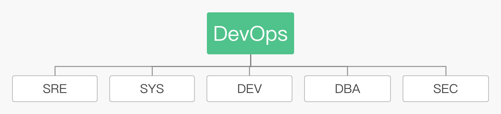
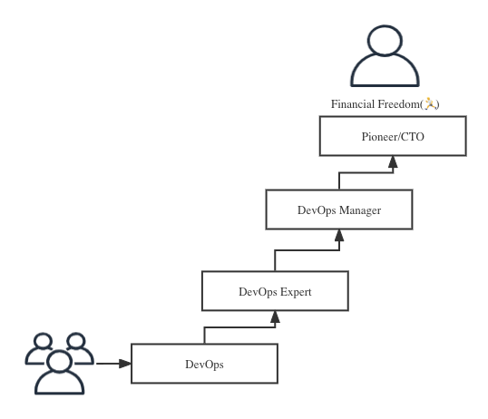

<iframe src="../detail-header.html" title="Github of Anigkus" style="height:0px,widht:0px;display:none" id="kusifreamheader"></iframe>

<h1 style="color:#606c71;text-align:center;" id="h1" >运维工程师这些技能你应该知道!</h1> 

[<h1 style="color:#606c71;text-align:center;" >Operation and Maintenance Engineer These Skills You Should Know</h1> ]:#

>  &nbsp;&nbsp;&nbsp;&nbsp; 运维工程师有点像传统行业中的售后角色(不要误会,没其它意思).就是产品研究人员提供一个idea想法(产品经理),再到产品设计师或者工业制造者把产品的想法变成一个成品(研发人员),再到销售人员把成品的东西卖给客户(运营人员).但是东西已经推向市场如果出现问题,我们的售后客服就会收到市场的反馈,然后让技术售后负责协助解决(运维人员).如果这个问题或者这个现象已经已经发生过,并且在规范文档或者历史存档资料中有相应的解决方案,那么就把产品修护好,让产品回归正常(比如应用自动挂了,需要重启即可(别杠精).如果不是售后的文件规定的或者不知道怎么修,可能需要反馈给产品设计者(研发人员)一起沟通和协助解决.因此售后工程师需要丰富的经验和技能,不然啥情况都找设计者,公司就一直停留的原地,没法产出新产品(设计->维修->设计...循环).所以在IT工程中也一样,我们的运维工程师也需要集成多种专业知识才能维护生产上运行的应用.让我们来看看作为运维工程师应该具备哪些技能呢? 
>  

[>  &nbsp;&nbsp;&nbsp;&nbsp; The operation and maintenance engineer is a bit like the after-sales role in the traditional industry (don't get me wrong, no other meaning). It is a product researcher who provides an idea (product manager), and then to product designers or industrial manufacturers Turn the idea of ​​the product into a finished product (R&D staff), and then the sales staff sell the finished product to the customer (operation staff). But the product has been put on the market. If there is a problem, our after-sales customer service will receive feedback from the market , and then let the technical after-sales be responsible for assisting the solution (operation and maintenance personnel). If this problem or this phenomenon has already occurred, and there is a corresponding solution in the specification document or historical archived data, then repair the product and let the product Return to normal (for example, the application hangs automatically and needs to be restarted (Don't be rude). If it is not specified in the after-sales document or you do not know how to repair it, you may need to give feedback to the product design. Therefore, after-sales engineers need rich experience and skills, otherwise they will find designers in any situation, and the company will stay in place and cannot produce new products (design->maintenance-> Design...cycle). So in IT engineering too, our operations engineers also need to integrate a variety of expertise to maintain applications running in production. Let's take a look at what skills an operations engineer should have? ]:#
[>  ]:#

# 运维职责

&nbsp;&nbsp;&nbsp;&nbsp; 运维工程师,负责维护并确保整个服务的高可用性,同时不断优化系统架构提升部署效率、优化资源利用率提高整体的ROI.

&nbsp;&nbsp;&nbsp;&nbsp; 运维工程师面对的最大挑战是大规模集群的管理问题,如何管理好上万甚至几十万台服务器上的服务,同时保障服务的高可用性,是运维工程师面临的最大挑战.

&nbsp;&nbsp;&nbsp;&nbsp; 无论做什么运维,运维工程师最基本的职责都是负责服务的稳定性,确保服务可以7*24H不间断地为用户提供服务.在此之上运维工程师的主要工作职责如下:

* 范围: 评估发生问题的影响边界,让事故的范围尽量对整体的项目影响变小.

* 进度: 保障服务可用性,用最切实际、最快的解决方案去解决正在发生的问题.

* 成本: 通过技术手段优化服务架构、性能调优；通过资源优化组合降低成本、提升ROI(投资回报率).

* 质量：保障并不断提升服务的可用性,确保用户数据安全,提升用户体验.

[# O&M responsibilities]:#

[&nbsp;&nbsp;&nbsp;&nbsp; Operation and maintenance engineer, responsible for maintaining and ensuring the high availability of the entire service, while continuously optimizing the system architecture to improve deployment efficiency, optimizing resource utilization and improving the overall ROI.]:#

&nbsp;&nbsp;&nbsp;&nbsp; The biggest challenge faced by operation and maintenance engineers is the management of large-scale clusters, how to manage services on tens of thousands or even hundreds of thousands of servers, and at the same time ensure the high availability of services. The biggest challenge.]:#

[&nbsp;&nbsp;&nbsp;&nbsp; No matter what operation and maintenance do, the most basic responsibility of the operation and maintenance engineer is to be responsible for the stability of the service, to ensure that the service can provide services to users 7*24H uninterrupted. On top of this, the operation and maintenance The main responsibilities of an engineer are as follows:]:#

[* Scope: Assess the impact boundary of the problem, and make the scope of the accident as small as possible on the overall project.]:#

[* Progress: Guarantee service availability and use the most practical and fastest solution to solve ongoing problems.]:#

[* Cost: Optimize service architecture and performance tuning through technical means; reduce costs and improve ROI (return on investment) through resource optimization combinations]:#

[* Quality: Guarantee and continuously improve the availability of services, ensure user data security, and improve user experience.]:#

<mark>项目管理黄金三角:</mark>

[<mark>Project Management Golden Triangle:</mark>]:#

 

By Job

 

By Role

 

 
By Career

# Linux基础

&nbsp;&nbsp;&nbsp;&nbsp; Linux操作系统绝对是当前线上服务器的王者.因此必须要熟悉底层系统模型的一些原理,才能在遇到问题更好的去分析问题的所在.比如Linux 内核、文件系统模型、Linux C编程、常用网络IO模型、系统安全模型、Linux设备模型、Linux权限模型、以及Linux常用的发行版等.

* Linux发行版: Debian GNU/Linux、Deepin、Ubuntu 、Red Hat Enterprise Linux、CentOS、Fedora、SUSE／openSUSE等.

* Linux权限模型: linux的权限分基础权限体系是基于UGO的(U:所属用户权限\G:所属组的权限\O:其他用户权限),以及文件和文件夹RWX( 读/写/执行 权限,可以用7表示（4+2+1）)权限及扩展权限(suid、sgid、sticky)等.

* Linux设备模型: Linux设备模型中的四个重要概念：Bus(总线)/Class(分类)/Device(设备）/Driver(驱动)及当中是存储哪些数据和各自交互的基本操作等.

* Linux 安全模型: 理解SELinux强制访问控制、内核安全、网络安全、远程认证 、文件系统安全、本地认证、安全策略、安全控制基本理论知识等,并知道应用和配置基本的系统安全\物理安全和登录安全\禁用root登录和sudo\可插拔认证模块（PAM）\基于PAM的口令安全和口令策略\基于PAM的访问控制.

* 常用网络IO模型: Linux下可用的网络模式有6种:同步模型\阻塞式IO\非阻塞式IO\IO复用\信号驱动式IO（SIGIO）\异步IO,要理解用户空间和内核空间收据交换的思路等.

* Linux C编程: 因为Linux底层好多功能都是用C语言写的,因此需要基本的C语言编程知识.

* 文件系统模型: Linux文件系统(ext2/ext3/ext4/xfs/tmpfs)的区别及文件系统层次、文件系统分类、文件系统的存储结构、不同存储介质的区别(RAM、ROM、Flash)、存储节点inode等.

* Linux 内核: 需要理解 i386 和 x86-64 不同CPU架构模型在寄存器、指令集、内存寻址、工作模式、分页管理等相关功能的区别以及对不同操作系统厂商和硬件中所支持的差异性等.

[# Linux Basics]:#

[&nbsp;&nbsp;&nbsp;&nbsp; The Linux operating system is definitely the king of the current online server. Therefore, you must be familiar with some principles of the underlying system model in order to better analyze the problem when you encounter a problem. For example, the Linux kernel, File system model, Linux C programming, common network IO model, system security model, Linux device model, Linux permission model, and commonly used Linux distributions, etc.]:#

[* Linux distributions: Debian GNU/Linux, Deepin, Ubuntu, Red Hat Enterprise Linux, CentOS, Fedora, SUSE/openSUSE, etc.]:#

[* Linux permission model: The basic permission system of linux is based on UGO (U: user permission\G: permission of the group\O: other user permission), and files and folders RWX (read/write/execute) Permissions can be represented by 7 (4+2+1)) permissions and extended permissions (suid, sgid, sticky), etc.]:#

[* Linux device model: Four important concepts in the Linux device model: Bus (bus)/Class (classification)/Device (device)/Driver (driver) and which data are stored and the basic operations of their respective interactions, etc.]:#

[* Linux security model: understand SELinux mandatory access control, kernel security, network security, remote authentication, file system security, local authentication, security policy, basic theoretical knowledge of security control, etc., and know the application and configuration of basic system security\physical security and login security\disable root login and sudo\pluggable authentication module (PAM)\PAM-based password security and password policy\PAM-based access control.]:#

[* Common network IO models: There are 6 network modes available under Linux: synchronous model \ blocking IO \ non-blocking IO \ IO multiplexing \ signal-driven IO (SIGIO) \ asynchronous IO, to understand user space and kernel The idea of ​​space receipt exchange, etc.]:#

[* Linux C programming: Because many functions at the bottom of Linux are written in C language, basic knowledge of C language programming is required.]:#

[* File system model: Differences between Linux file systems (ext2/ext3/ext4/xfs/tmpfs) and file system levels, file system classifications, file system storage structures, differences between different storage media (RAM, ROM, Flash), Storage node inode, etc.]:#

[* Linux kernel: It is necessary to understand the differences between i386 and x86-64 different CPU architecture models in registers, instruction sets, memory addressing, working modes, paging management and other related functions, as well as the differences supported by different operating system manufacturers and hardware Wait.]:#

# 常用命令

&nbsp;&nbsp;&nbsp;&nbsp; 操作Linux就是基本都是操作命令,因此在日常中常用的一些命名已经每个命令常用的参数必须要知道,就算不需要全部背下来,也要知道怎么查看帮助文档,比如man或者-h等,我就贴出Linux常用的100个命令,这些都要基本掌握,非常方便和提高日常工作中效率.

[# Common commands]:#

[&nbsp;&nbsp;&nbsp;&nbsp; Operating Linux is basically operating commands, so some commonly used names in daily life and parameters commonly used in each command must be known, even if you don’t need to memorize them all, you must know how to view the help Documents, such as man or -h, etc., I will post 100 commands commonly used in Linux. These must be basically mastered, which is very convenient and improves the efficiency in daily work.]:#

# 脚本语言

&nbsp;&nbsp;&nbsp;&nbsp; 运维基本都要至少会一两门脚本语言,因为Linux上好多中间件或者系统日志分析的功能都是通过脚本实现的.如果不知道几门语言的简单操作,会给工作带来诸多不便,而且也会影响你去分析问题的原因.因为Linux好多软件都是开源的,可以直接查看源代码,如果不清楚语言,可能也看不懂问题出现在哪里,也不知道是什么引起的.因此至少要对Shell或者Python这两门中的一门脚本语言要比较熟悉,其实Shell在Linux上能做好多事情.你看Linux下好多命令都直接就是Shell写的,足以看出这个重要性,Python能够去分析一些文件或者去处理一些一次性的任务特别方便.其他的如Perl\Ruby就看你自己的兴趣和能力了,有精力可以花时间学习,多多益善.但是如果对Shell或者Python比较熟悉了,基本大多数服务器上的脚本处理问题都可以解决了.

[# scripting language]:#

[&nbsp;&nbsp;&nbsp;&nbsp; Operation and maintenance basically requires at least one or two scripting languages, because many middleware or system log analysis functions on Linux are implemented through scripts. If you do not know the simple operation of several languages , it will bring a lot of inconvenience to your work, and it will also affect your analysis of the cause of the problem. Because many Linux software are open source, you can directly view the source code. If you don't know the language, you may not understand where the problem is. I don't know what caused it. So at least you should be familiar with one of the two scripting languages Shell or Python. In fact, Shell can do many things on Linux. You see that many commands under Linux are directly written by Shell , enough to see the importance, Python can analyze some files or deal with some one-time tasks is very convenient. Others such as Perl\Ruby depends on your own interests and abilities. If you have the energy to spend time learning, the more the better. But if you are familiar with Shell or Python, most of the script processing problems on the server can be solved.]:#

# 基础平台

&nbsp;&nbsp;&nbsp;&nbsp; 运维需要了解些常用的一些中间件,如做什么功能、相同功能的差异性、优缺点、基本的安装方式、集群部署、启动/停止脚本、中间件安全权限控制、防火墙控制等.Linux运行什么中间件和公司方向、团队技术、项目背景都有很大的关系.我就说些通用的中间件,这在大多数公司都会用得到.

* 数据库: MySQL、HBase、Mariadb

* Web服务器:Apache、Tomcat、Jboss

* 缓存中间件: Redis、MongoDB、MemCached

* 搜索引擎: ElasticSearch、Solr

* 服务器监控: Zabbix、Cacti、Nagios、Openfalcon

* 堡垒机: JumpServer、Teleport

* 消息中间件: ActiveMQ、Kafka、RocketMQ

* 代理中间件: LVS、Nginx、Keepalive、HAProxy

* 机器系统管理: Puppet、SaltStackSalt、ssh、dsh、pssh

* 其他软件:FTP、DNS、EMAIL、NTP(统一时钟服务器)、DHCP、SSH证书.

* AMP/LNMP(Linux+Apache/Nginx+MySQL+PHP)

[# Basic Platform]:#

[&nbsp;&nbsp;&nbsp;&nbsp; Operation and maintenance need to understand some commonly used middleware, such as what functions, differences in the same functions, advantages and disadvantages, basic installation methods, cluster deployment, start/stop scripts, middleware security Access control, firewall control, etc. What middleware Linux runs has a lot to do with the direction of the company, team technology, and project background. I will talk about some common middleware, which will be used in most companies.]:#

[* Databases: MySQL, HBase, Mariadb]:#

[* Web server: Apache, Tomcat, Jboss]:#

[* Cache middleware: Redis, MongoDB, MemCached]:#

[* search engine: ElasticSearch, Solr]:#

[* Server monitoring: Zabbix, Cacti, Nagios, Openfalcon]:#

[* Bastion: JumpServer, Teleport]:#

[* Message middleware: ActiveMQ, Kafka, RocketMQ]:#

[* Proxy middleware: LVS, Nginx, Keepalive, HAProxy]:#

[* Machine system management: Puppet, SaltStackSalt, ssh, dsh, pssh]:#

[* Other software: FTP, DNS, EMAIL, NTP (unified clock server), DHCP, SSH certificate.]:#

[* AMP/LNMP(Linux+Apache/Nginx+MySQL+PHP)]:#

# 虚拟技术

&nbsp;&nbsp;&nbsp;&nbsp; 讲到服务器,不得不提虚拟化技术,虚拟化分全虚拟化(软件辅助的全虚拟化 & 硬件辅助的全虚拟化)、半虚拟化两种.那么这里面就不止一点复杂,不是一两句话就能说得清楚的,估计都好几本书才行.但是在虚拟化领域里面的KVM,绝对在市场有举足轻重的地位,是 Linux 下 x86 硬件平台上的全功能虚拟化解决方案.KVM(Kernel-based Virtual Machine)基于内核的虚拟机,KVM是集成到Linux内核的Hypervisor,是X86架构且硬件支持虚拟化技术（Intel VT或AMD-V）的Linux的全虚拟化解决方案.它是Linux的一个很小的模块,利用Linux做大量的事,如任务调度、内存管理与硬件设备交互等.现在云上的好多Linux虚拟化底层都是KVM技术,那么KVM相关的知识点就必须要掌握了.

* 虚拟化分类: 全虚拟化、半虚拟化的区别.

* KVM原理: 内核态和用户态区别,KVM Driver是怎么负责模拟虚拟机的CPU运行,内存管理,设备管理等.

* KVM基础功能: 网络、存储、内存、CPU、输入\输出、驱动程序.

* KVM高级功能: 半虚拟化驱动、热插拔、VirtIO、动态迁移和静态迁移区别、KSM(共享内存)等.

* KVM管理工具: Virsh、OpenStack、CloudStack、OpenNebula、ZStack、WebVirtMgr、virt-manager、ConVirt.

[# virtual technology]:#

[&nbsp;&nbsp;&nbsp;&nbsp; When it comes to servers, we have to mention virtualization technology. Virtualization is divided into full virtualization (software-assisted full virtualization & hardware-assisted full virtualization) and paravirtualization. There is more than a bit of complexity in it. It can’t be explained clearly in one or two sentences. It is estimated that several books are required. However, KVM in the field of virtualization definitely plays a pivotal role in the market. It is on the x86 hardware platform under Linux. A full-featured virtualization solution. KVM (Kernel-based Virtual Machine) is a kernel-based virtual machine. KVM is a Hypervisor integrated into the Linux kernel. It is a Linux with X86 architecture and hardware supports virtualization technology (Intel VT or AMD-V). It is a small module of Linux, which uses Linux to do a lot of things, such as task scheduling, memory management and hardware device interaction. Now many Linux virtualization on the cloud bottom layer is KVM technology, Then KVM-related knowledge points must be mastered.]:#

[* Virtualization classification: The difference between full virtualization and paravirtualization.]:#

[* KVM principle: The difference between kernel mode and user mode, how is the KVM Driver responsible for simulating the virtual machine's CPU operation, memory management, device management, etc.]:#

[* KVM basic functions: network, storage, memory, CPU, input\output, driver.]:#

[* KVM advanced features: paravirtualized driver, hot plug, VirtIO, difference between dynamic migration and static migration, KSM (shared memory), etc.]:#

[* KVM management tools: Virsh, OpenStack, CloudStack, OpenNebula, ZStack, WebVirtMgr, virt-manager, ConVirt.]:#

# 硬件相关

&nbsp;&nbsp;&nbsp;&nbsp; 虽说现在都有云,有专业的IDC机房,不需要自己从头开始搭建IDC机房.但是还是有不少公司,会选择自己买单片机托管到IDC里面,这样某些时候需要公司运维去机房配合或者自己安装,或者某些公司在内部自己搭建一个小型的机柜,放几台单片机做内部测试等.相关的设备有网络设备、路由器、交换机、电话设备等,这些都是需要运维去安装和维护的.还有就是在操作系统里面想看下某个机器的某个设备是什么厂家的、什么型号等这些硬件信息,要知道相应的命令查看这些信息.

&nbsp;&nbsp;&nbsp;&nbsp;比如查看各类型服务器机架式、刀片式、塔式、机柜式的区别、查看网络接口类型、查看CPU、内存、硬盘的硬件信息等.

[# hardware related]:#

[&nbsp;&nbsp;&nbsp;&nbsp; Although there is a cloud and a professional IDC room, there is no need to build an IDC room from scratch. However, there are still many companies that choose to buy their own microcontrollers and host them in the IDC, so that some At times, the company needs to go to the computer room for operation and maintenance to cooperate or install it by itself, or some companies build a small cabinet internally and put a few microcontrollers for internal testing, etc. The related equipment includes network equipment, routers, switches, telephone equipment, etc. These They all need to be installed and maintained by operation and maintenance. Also, in the operating system, if you want to see the manufacturer and model of a certain device of a certain machine, you need to know the corresponding commands to view this information.] :#

[&nbsp;&nbsp;&nbsp;&nbsp;For example, check the difference between rack, blade, tower, and cabinet of various types of servers, check the network interface type, check the hardware information of CPU, memory, hard disk, etc.]:#

# 安全防护

&nbsp;&nbsp;&nbsp;&nbsp; IT技术可以说是一把双刃剑,为我们带来便捷的同时,也带来了威胁,网络安全问题就是其中之一.如今,随着黑客技术的发展,服务器被攻击的事件屡见不鲜,如何保障服务器安全是运维界广泛关注的问题.我们没有办法彻底解决网络安全问题,但可以不断加强防护,提高服务器的抵御能力.那么我们要如何提升服务器的安全性呢? IT运维专家为大家提供了八个维护服务器安全的技巧.

* 从基本做起,及时安装系统补丁

* 安装和设置防火墙

* 安装网络杀毒软件

* 关闭不需要的服务和端口

* 定期对服务器进行备份

* 设置账号和密码保护

* 监测系统日志

* 授权遵循目标责任原则

[# Security]:#

[&nbsp;&nbsp;&nbsp;&nbsp; IT technology can be said to be a double-edged sword, bringing us convenience and threats at the same time. Network security is one of them. Today, with the development of hacking technology , it is not uncommon for the server to be attacked. How to ensure the security of the server is an issue that is widely concerned by the operation and maintenance community. We cannot completely solve the network security problem, but we can continuously strengthen the protection and improve the resistance of the server. So how do we improve the security of the server What about sex? IT operation and maintenance experts provide you with eight tips for maintaining server security.]:#

[* Start from the basics and install system patches in time]:#

[* Install and setup firewall]:#

[* Install network antivirus software]:#

[* Close unnecessary services and ports]:#

[* Regularly back up the server]:#

[* Set account and password protection]:#

[* Monitoring system log]:#

[* Authorization follows the principle of target responsibility]:#

# 云上厂商

&nbsp;&nbsp;&nbsp;&nbsp; 现在云平台已经非常成熟和稳定,云平台产品简单高效、处理能力可弹性伸缩的计算服务.帮助您快速构建更稳定、安全的应用,提升运维效率,降低 IT 成本,使您更专注于核心业务创新.因此必须要熟悉并使用当前主流的云厂商的产品,包括云服务器、数据库、负载均衡、弹性伸缩、CDN等,并且大型的云厂商都有相关认证,如阿里有ACA/ACP/ACE.亚马逊有SAA/SAP,腾讯有TCA/TCP/TCE,谷歌的PCA/PCD,微软AZ-300/AZ-301等.如果你通过了几家的云平台高级认证资质,一定会让你在求职过程加分不少.国内业务就用阿里云就够了,其它云厂商的市场份额基本都可以忽略可以(太少了),国外业务就亚马逊云就行.

[# Cloud vendors]:#

[&nbsp;&nbsp;&nbsp;&nbsp; Now the cloud platform is very mature and stable, the cloud platform products are simple and efficient, and the processing capacity is elastically scalable computing services. Help you quickly build more stable and secure applications, improve operation and maintenance efficiency, reduce IT costs make you more focused on core business innovation. Therefore, you must be familiar with and use the products of current mainstream cloud vendors, including cloud servers, databases, load balancing, elastic scaling, CDN, etc., and large cloud vendors have relevant certifications , For example, Ali has ACA/ACP/ACE. Amazon has SAA/SAP, Tencent has TCA/TCP/TCE, Google's PCA/PCD, Microsoft AZ-300/AZ-301, etc. If you have passed several cloud platform advanced The certification qualification will definitely give you a lot of points in the job search process. It is enough to use Alibaba Cloud for domestic business, and the market share of other cloud vendors can basically be ignored (too little), and Amazon Cloud is enough for foreign business.]:#

# 结论

&nbsp;&nbsp;&nbsp;&nbsp; 以上罗列的运维技术方面主要还是根据本人这些年在工作经验中和运维人员经常打交道而梳理出来的.我记得我早期参加工作的时候是PS、前端、后端、测试、服务器运维、数据库运维、机房运维等等都是一条龙服务啊.但是领的薪水只要一份(🤬)啊.那时候国内的技术圈编剧还没有现在划分得这么清楚,现在分的可细了,是技术的发展和市场的进步,希望每个工种都能更加聚焦和深度专业化.运维技术工种现在也分了好几种.因此一定要把自己的运维定位弄清楚,到底是运维研发(DevOps)、系统保障运维(SRE)、还是安全运维架构和管理(Expert&Manager).技术之路路途漫漫,应当学会勉励前行!

[# Conclusion ]:#

[&nbsp;&nbsp;&nbsp;&nbsp; The operation and maintenance technical aspects listed above are mainly based on my working experience and frequent dealings with operation and maintenance personnel in these years. Terminal, testing, server operation and maintenance, database operation and maintenance, computer room operation and maintenance, etc. are all one-stop services. But the salary is only one (🤬). At that time The screenwriters in the domestic technical circle have not been divided so clearly. Now they can be divided into more detail. It is the development of technology and the progress of the market. I hope that each type of work can be more focused and deeply specialized. Operation and maintenance technical work is also divided now. There are several. Therefore, you must clarify your own operation and maintenance positioning, whether it is operation and maintenance research and development (DevOps), system assurance operation and maintenance (SRE), or security operation and maintenance architecture and management (Expert&Manager). The road to technology is long. You should learn to be motivated to move forward!]:#

 

### [back](./)
