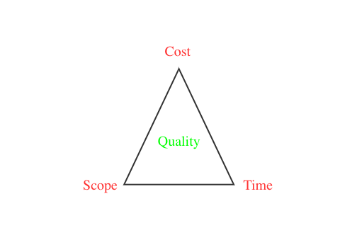

<h1 style="color:#606c71;text-align:center;" >运维工程师这些技能你应该知道!</h1> 

[<h1 style="color:#606c71;text-align:center;" >Operation and Maintenance Engineer These Skills You Should Know</h1> ]:#

[
]:#
[]:#
[
]:#

>  &nbsp;&nbsp;&nbsp;&nbsp; 运维工程师有点像传统行业中的售后角色(不要误会,没其它意思).就是产品研究人员提供一个idea想法(产品经理),再到产品设计师或者工业制造者把产品的想法变成一个成品(研发人员),再到销售人员把成品的东西卖给客户(运营人员).但是东西已经推向市场如果出现问题,我们的售后客服就会收到市场的反馈,然后让技术售后负责协助解决(运维人员).如果这个问题或者这个现象已经已经发生过,并且在规范文档或者历史存档资料中有相应的解决方案,那么就把产品修护好,让产品回归正常(比如应用自动挂了,需要重启即可(别杠精).如果不是售后的文件规定的或者不知道怎么修,可能需要反馈给产品设计者(研发人员)一起沟通和协助解决.因此售后工程师需要丰富的经验和技能,不然啥情况都找设计者,公司就一直停留的原地,没法产出新产品(设计->维修->设计...循环).所以在IT工程中也一样,我们的运维工程师也需要集成多种专业知识才能维护生产上运行的应用.让我们来看看作为运维工程师应该具备哪些技能呢? 
>  

[>  &nbsp;&nbsp;&nbsp;&nbsp; Some general notes on article. ]:#
[>  ]:#

# 运维职责

&nbsp;&nbsp;&nbsp;&nbsp; 运维工程师,负责维护并确保整个服务的高可用性,同时不断优化系统架构提升部署效率、优化资源利用率提高整体的ROI.

&nbsp;&nbsp;&nbsp;&nbsp; 运维工程师面对的最大挑战是大规模集群的管理问题,如何管理好上万甚至几十万台服务器上的服务,同时保障服务的高可用性,是运维工程师面临的最大挑战.

&nbsp;&nbsp;&nbsp;&nbsp; 无论做什么运维,运维工程师最基本的职责都是负责服务的稳定性,确保服务可以7*24H不间断地为用户提供服务.在此之上运维工程师的主要工作职责如下:

* 范围: 评估发生问题的影响边界,让事故的范围尽量对整体的项目影响变小.

* 进度: 保障服务可用性,用最切实际、最快的解决方案去解决正在发生的问题.

* 成本: 通过技术手段优化服务架构、性能调优；通过资源优化组合降低成本、提升ROI(投资回报率).

* 质量：保障并不断提升服务的可用性,确保用户数据安全,提升用户体验.

<mark>项目管理黄金三角:</mark>

 

按照工作分类

 

按照角色分类

 

 
职业发展方向

# Linux基础

&nbsp;&nbsp;&nbsp;&nbsp; Linux操作系统绝对是当前线上服务器的王者.因此必须要熟悉底层系统模型的一些原理,才能在遇到问题更好的去分析问题的所在.比如Linux 内核、文件系统模型、Linux C编程、常用网络IO模型、系统安全模型、Linux设备模型、Linux权限模型、以及Linux常用的发行版等.

* Linux发行版: Debian GNU/Linux、Deepin、Ubuntu 、Red Hat Enterprise Linux、CentOS、Fedora、SUSE／openSUSE等.

* Linux权限模型: linux的权限分基础权限体系是基于UGO的(U:所属用户权限\G:所属组的权限\O:其他用户权限),以及文件和文件夹RWX( 读/写/执行 权限,可以用7表示（4+2+1）)权限及扩展权限(suid、sgid、sticky)等.

* Linux设备模型: Linux设备模型中的四个重要概念：Bus(总线)/Class(分类)/Device(设备）/Driver(驱动)及当中是存储哪些数据和各自交互的基本操作等.

* Linux 安全模型: 理解SELinux强制访问控制、内核安全、网络安全、远程认证 、文件系统安全、本地认证、安全策略、安全控制基本理论知识等,并知道应用和配置基本的系统安全\物理安全和登录安全\禁用root登录和sudo\可插拔认证模块（PAM）\基于PAM的口令安全和口令策略\基于PAM的访问控制.

* 常用网络IO模型: Linux下可用的网络模式有6种:同步模型\阻塞式IO\非阻塞式IO\IO复用\信号驱动式IO（SIGIO）\异步IO,要理解用户空间和内核空间收据交换的思路等.

* Linux C编程: 因为Linux底层好多功能都是用C语言写的,因此需要基本的C语言编程知识.

* 文件系统模型: Linux文件系统(ext2/ext3/ext4/xfs/tmpfs)的区别及文件系统层次、文件系统分类、文件系统的存储结构、不同存储介质的区别(RAM、ROM、Flash)、存储节点inode等.

* Linux 内核: 需要理解 i386 和 x86-64 不同CPU架构模型在寄存器、指令集、内存寻址、工作模式、分页管理等相关功能的区别以及对不同操作系统厂商和硬件中所支持的差异性等.

# 常用命令

&nbsp;&nbsp;&nbsp;&nbsp; 操作Linux就是基本都是操作命令,因此在日常中常用的一些命名已经每个命令常用的参数必须要知道,就算不需要全部背下来,也要知道怎么查看帮助文档,比如man或者-h等,我就贴出Linux常用的100个命令,这些都要基本掌握,非常方便和提高日常工作中效率.

# 脚本语言

&nbsp;&nbsp;&nbsp;&nbsp; 运维基本都要至少会一两门脚本语言,因为Linux上好多中间件或者系统日志分析的功能都是通过脚本实现的.如果不知道几门语言的简单操作,会给工作带来诸多不便,而且也会影响你去分析问题的原因.因为Linux好多软件都是开源的,可以直接查看源代码,如果不清楚语言,可能也看不懂问题出现在哪里,也不知道是什么引起的.因此至少要对Shell或者Python这两门中的一门脚本语言要比较熟悉,其实Shell在Linux上能做好多事情.你看Linux下好多命令都直接就是Shell写的,足以看出这个重要性,Python能够去分析一些文件或者去处理一些一次性的任务特别方便.其他的如Perl\Ruby就看你自己的兴趣和能力了,有精力可以花时间学习,多多益善.但是如果对Shell或者Python比较熟悉了,基本大多数服务器上的脚本处理问题都可以解决了.

# 基础平台

&nbsp;&nbsp;&nbsp;&nbsp; 运维需要了解些常用的一些中间件,如做什么功能、相同功能的差异性、优缺点、基本的安装方式、集群部署、启动/停止脚本、中间件安全权限控制、防火墙控制等.Linux运行什么中间件和公司方向、团队技术、项目背景都有很大的关系.我就说些通用的中间件,这在大多数公司都会用得到.

* 数据库: MySQL、HBase、Mariadb

* Web服务器:Apache、Tomcat、Jboss

* 缓存中间件: Redis、MongoDB、MemCached

* 搜索引擎: ElasticSearch、Solr

* 服务器监控: Zabbix、Cacti、Nagios、Openfalcon

* 堡垒机: JumpServer、Teleport

* 消息中间件: ActiveMQ、Kafka、RocketMQ

* 代理中间件: LVS、Nginx、Keepalive、HAProxy

* 机器系统管理: Puppet、SaltStackSalt、ssh、dsh、pssh

* 其他软件:FTP、DNS、EMAIL、NTP(统一时钟服务器)、DHCP、SSH证书.

* AMP/LNMP(Linux+Apache/Nginx+MySQL+PHP)

# 虚拟技术

&nbsp;&nbsp;&nbsp;&nbsp; 讲到服务器,不得不提虚拟化技术,虚拟化分全虚拟化(软件辅助的全虚拟化 & 硬件辅助的全虚拟化)、半虚拟化两种.那么这里面就不止一点复杂,不是一两句话就能说得清楚的,估计都好几本书才行.但是在虚拟化领域里面的KVM,绝对在市场有举足轻重的地位,是 Linux 下 x86 硬件平台上的全功能虚拟化解决方案.KVM(Kernel-based Virtual Machine)基于内核的虚拟机,KVM是集成到Linux内核的Hypervisor,是X86架构且硬件支持虚拟化技术（Intel VT或AMD-V）的Linux的全虚拟化解决方案.它是Linux的一个很小的模块,利用Linux做大量的事,如任务调度、内存管理与硬件设备交互等.现在云上的好多Linux虚拟化底层都是KVM技术,那么KVM相关的知识点就必须要掌握了.

* 虚拟化分类: 全虚拟化、半虚拟化的区别.

* KVM原理: 内核态和用户态区别,KVM Driver是怎么负责模拟虚拟机的CPU运行,内存管理,设备管理等.

* KVM基础功能: 网络、存储、内存、CPU、输入\输出、驱动程序.

* KVM高级功能: 半虚拟化驱动、热插拔、VirtIO、动态迁移和静态迁移区别、KSM(共享内存)等.

* KVM管理工具: Virsh、OpenStack、CloudStack、OpenNebula、ZStack、WebVirtMgr、virt-manager、ConVirt.

# 硬件相关

&nbsp;&nbsp;&nbsp;&nbsp; 虽说现在都有云,有专业的IDC机房,不需要自己从头开始搭建IDC机房.但是还是有不少公司,会选择自己买单片机托管到IDC里面,这样某些时候需要公司运维去机房配合或者自己安装,或者某些公司在内部自己搭建一个小型的机柜,放几台单片机做内部测试等.相关的设备有网络设备、路由器、交换机、电话设备等,这些都是需要运维去安装和维护的.还有就是在操作系统里面想看下某个机器的某个设备是什么厂家的、什么型号等这些硬件信息,要知道相应的命令查看这些信息.

&nbsp;&nbsp;&nbsp;&nbsp;比如查看各类型服务器机架式、刀片式、塔式、机柜式的区别、查看网络接口类型、查看CPU、内存、硬盘的硬件信息等.

# 安全防护

&nbsp;&nbsp;&nbsp;&nbsp; IT技术可以说是一把双刃剑,为我们带来便捷的同时,也带来了威胁,网络安全问题就是其中之一.如今,随着黑客技术的发展,服务器被攻击的事件屡见不鲜,如何保障服务器安全是运维界广泛关注的问题.我们没有办法彻底解决网络安全问题,但可以不断加强防护,提高服务器的抵御能力.那么我们要如何提升服务器的安全性呢? IT运维专家为大家提供了八个维护服务器安全的技巧.

* 从基本做起,及时安装系统补丁

* 安装和设置防火墙

* 安装网络杀毒软件

* 关闭不需要的服务和端口

* 定期对服务器进行备份

* 设置账号和密码保护

* 监测系统日志

* 授权遵循目标责任原则

# 云上厂商

&nbsp;&nbsp;&nbsp;&nbsp; 现在云平台已经非常成熟和稳定,云平台产品简单高效、处理能力可弹性伸缩的计算服务.帮助您快速构建更稳定、安全的应用,提升运维效率,降低 IT 成本,使您更专注于核心业务创新.因此必须要熟悉并使用当前主流的云厂商的产品,包括云服务器、数据库、负载均衡、弹性伸缩、CDN等,并且大型的云厂商都有相关认证,如阿里有ACA/ACP/ACE.亚马逊有SAA/SAP,腾讯有TCA/TCP/TCE,谷歌的PCA/PCD,微软AZ-300/AZ-301等.如果你通过了几家的云平台高级认证资质,一定会让你在求职过程加分不少.国内业务就用阿里云就够了,其它云厂商的市场份额基本都可以忽略可以(太少了),国外业务就亚马逊云就行.

# 结论

&nbsp;&nbsp;&nbsp;&nbsp; 以上罗列的运维技术方面主要还是根据本人这些年在工作经验中和运维人员经常打交道而梳理出来的.我记得我早期参加工作的时候是PS、前端、后端、测试、服务器运维、数据库运维、机房运维等等都是一条龙服务啊.但是领的薪水只要一份(🤬)啊.那时候国内的技术圈编剧还没有现在划分得这么清楚,现在分的可细了,是技术的发展和市场的进步,希望每个工种都能更加聚焦和深度专业化.运维技术工种现在也分了好几种.因此一定要把自己的运维定位弄清楚,到底是运维研发(DevOps)、系统保障运维(SRE)、还是安全运维架构和管理(Expert&Manager).技术之路路途漫漫,应当学会勉励前行!

[# Conclusion ]:#

 

### [back](./)
