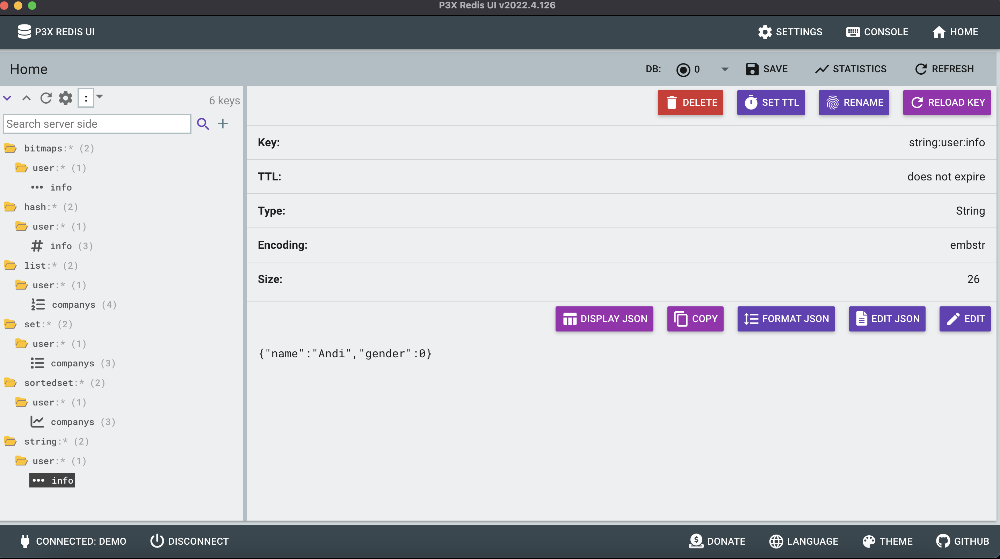
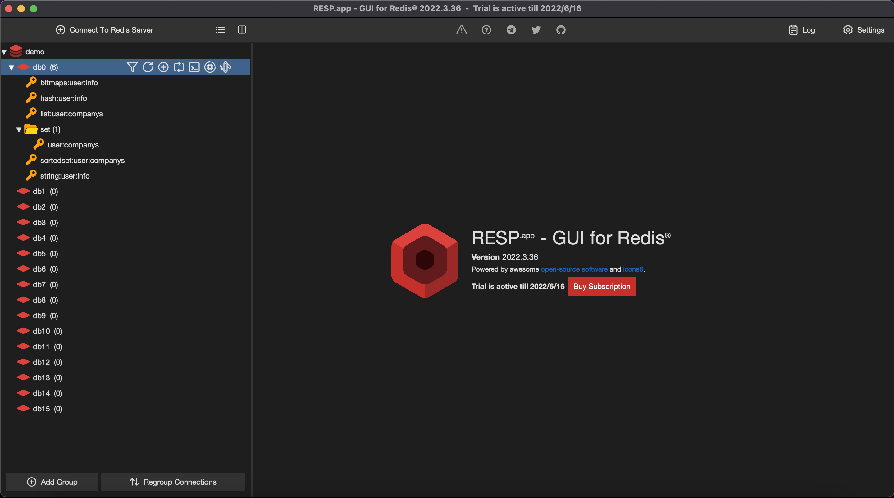
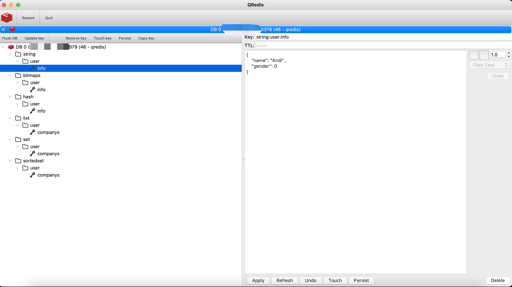
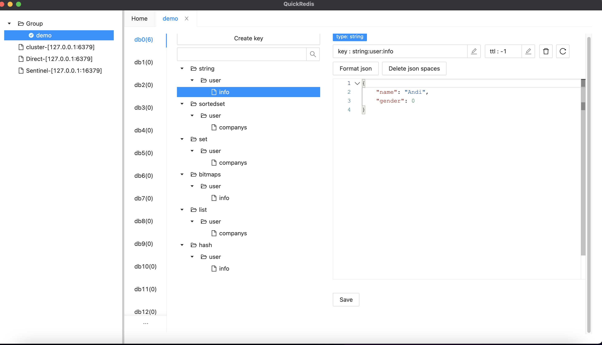
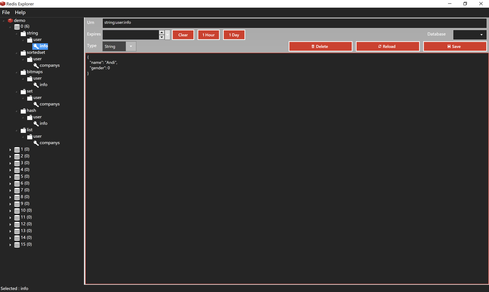
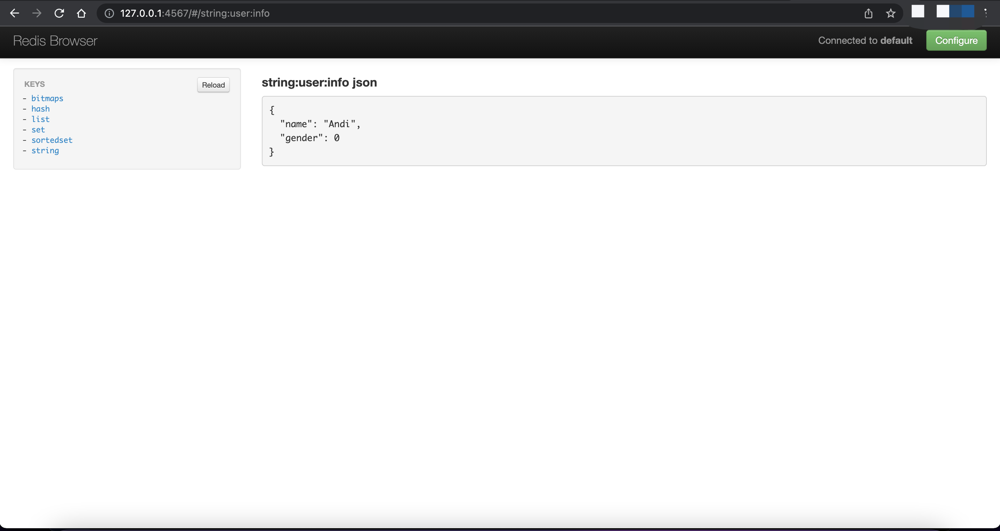

<script>
var pageHeader=document.getElementsByClassName("page-header")[0].innerHTML;
 pageHeader="<center></center>"+pageHeader;
document.getElementsByClassName("page-header")[0].innerHTML=pageHeader;
</script>

<h1 style="color:#606c71;text-align:center;" >Redis 数据可视化管理工具推荐</h1><br/>

[<h1 style="color:#606c71;text-align:center;" >Redis data visualization management tool recommendation</h1><br/>]:#

<center>

</center>

> <br/>&nbsp;&nbsp;&nbsp;&nbsp; 作为程序员来说, Redis 对我们来说并不会陌生,几乎都会与它打过交道. Redis 是一款 NoSQL 类型的键值对内存型数据库,在大数据量高并发下的场景下尤为重要,但是大多数的时候还是作为缓存使用,是为了减少后端关系型数据库IO压力. Redis 本身查询数据展现方式还是不够直观,安装包中只提供了一个 `redis-cli`命令行的工具.其实社区有不少图形化的管理工具,某些时候使用图形化确实比较惬意(只想鼠标点点的时候,😄).工具基本也分是管理工具还是监控工具,我在下面也都会说到.那么我这里推荐几款开源的图形化工具,以下应用都经过本人亲自验证,大家有空也可以去试试.<br/>
> <br/>

[> <br/>&nbsp;&nbsp;&nbsp;&nbsp; Some general notes on article.<br/>]:#
[> <br/>]:#


# 测试数据
 

```
127.0.0.1:6379> keys *
(empty array)
127.0.0.1:6379> info server
# Server
redis_version:6.2.7
redis_git_sha1:00000000
redis_git_dirty:0
redis_build_id:f300021a674a92d6
redis_mode:standalone
os:Linux 4.18.0-277.el8.x86_64 x86_64
arch_bits:64
monotonic_clock:POSIX clock_gettime
multiplexing_api:epoll
atomicvar_api:c11-builtin
gcc_version:8.5.0
process_id:568483
process_supervised:no
run_id:920f24df4f0321d047e6d1aa2ca7900bb16109f5
tcp_port:6379
server_time_usec:1654074930873401
uptime_in_seconds:181028
uptime_in_days:2
hz:10
configured_hz:10
lru_clock:9907762
executable:/usr/local/redis-627/bin/redis-server
config_file:
io_threads_active:0

# Sting
127.0.0.1:6379> SET string:user:info '{"name":"Andi","gender":0}'
OK
127.0.0.1:6379> GET  string:user:info
"{\"name\":\"Andi\",\"gender\":0}"

# List
127.0.0.1:6379> LPUSH list:user:companys "facebook"
(integer) 1
127.0.0.1:6379> LPUSH list:user:companys "twitter"
(integer) 2
127.0.0.1:6379> LPUSH list:user:companys "microsoft"
(integer) 3
127.0.0.1:6379> LPUSH list:user:companys "facebook"
(integer) 4
127.0.0.1:6379> 
127.0.0.1:6379> LRANGE list:user:companys 0 -1
1) "facebook"
2) "microsoft"
3) "twitter"
4) "facebook"

# Hash
127.0.0.1:6379> HMSET hash:user:info username Andi company Facebook gender 0
OK
127.0.0.1:6379> HGETALL hash:user:info
1) "username"
2) "Andi"
3) "company"
4) "Facebook"
5) "gender"
6) "0"

# Set
127.0.0.1:6379> SADD set:user:companys "facebook"
(integer) 1
127.0.0.1:6379> SADD set:user:companys "twitter"
(integer) 1
127.0.0.1:6379> SADD set:user:companys "microsoft"
(integer) 1
127.0.0.1:6379> SADD set:user:companys "facebook"
(integer) 0
127.0.0.1:6379> SMEMBERS set:user:companys
1) "microsoft"
2) "facebook"
3) "twitter"

# Sorted Set
127.0.0.1:6379> ZADD  sortedset:user:companys 10 facebook
(integer) 1
127.0.0.1:6379> ZADD  sortedset:user:companys 60 twitter
(integer) 1
127.0.0.1:6379> ZADD  sortedset:user:companys 40 microsoft
(integer) 1
127.0.0.1:6379> ZRANGE sortedset:user:companys 0 -1
1) "facebook"
2) "microsoft"
3) "twitter"

# Bitmaps
127.0.0.1:6379> setbit bitmaps:user:info 1001 1
(integer) 0
127.0.0.1:6379> setbit bitmaps:user:info 1002 0
(integer) 0
127.0.0.1:6379> setbit bitmaps:user:info 1003 1
(integer) 0
127.0.0.1:6379> getbit  bitmaps:user:info 1001
(integer) 1
127.0.0.1:6379> getbit  bitmaps:user:info 1002
(integer) 0
127.0.0.1:6379> getbit  bitmaps:user:info 1003
(integer) 1
127.0.0.1:6379> bitcount bitmaps:user:info
(integer) 2

```


# RedisInsight

&nbsp;&nbsp;&nbsp;&nbsp; RedisInsight 是由 RedisLab 公司出品的, Redis Labs 是一家云数据库服务供应商,致力于为 Redis、 Memcached 等流行的 NoSQL 开源数据库提供云托管服务平台.官方提供了很多 Redis 集成插件,比如 RediSearch、RedisJSON、RedisGears、RedisAI、RedisGraph、RedisTimeSeries、RedisBloom 等.这些都是通过`.so`包形式和Redis集成,并且在社区反响都非常好,而且性能也很高.RedisInsight 核心代码是使用TypeScript开发,然后通过构建成不同平台发行包,也就是外面套个不同平台的壳而已,内部集成HTML渲染引擎而成的.

## 功能特点

* RedisLab出品

* 对Redis模块的内置支持

* Redis的内存分析

* Trace Redis命令

* Redis资源监控

* 支持主流的操作系统

* 支持单机版、Redis Sentinel、Redis Enterprise Cluster、Redis Enterprise Cloud等多个版本

* 支持自动选择数据库、SSL协议、新版Auth鉴权模式

* 支持CLI操作

## 软件截图

<center>

</center>

## 评测心得

* 界面非常漂亮

* 功能一目了然

* 操作非常简单

* 各种资源报表

* 支持RedisJSON格式 

* 方便浏览、过滤和可视化Redis数据结构中的关键值

* 高级命令行界面(Workbench)


<mark>Recommended</mark> : 🌟🌟🌟🌟🌟🌟🌟🌟🌟🌟

<mark>Repository</mark> : https://github.com/RedisInsight/RedisInsight

<mark>Download</mark> : https://redis.com/redis-enterprise/redis-insight/

<mark>Developer languages</mark> : TypeScript

<mark>Support platform</mark> : Mac App Intel、Mac App M1、Windows、Linux、Docker

# p3x-redis-ui

&nbsp;&nbsp;&nbsp;&nbsp; P3X Redis UI 是一个非常实用的便捷数据库 GUI，可在响应式 Web 上或作为桌面应用程序在您的口袋中使用

[&nbsp;&nbsp;&nbsp;&nbsp; P3X Redis UI is a very functional handy database GUI and works in your pocket on the responsive web or as a desktop app]:#

## 功能特点

* 服务器资源监控

* 树的形式查看键

* 查看和编辑键值

* 支持CLI操作

* 提供命令行帮助功能

* 跨平台支持


## 软件截图

<center>

</center>

## 评测心得

* 界面还不错,支持键值查找

* 支持主从、集群模式,不支持哨兵模式

* 支持RedisJSON格式 

* 支持多语言

* 支持多皮肤切换

<mark>Recommended</mark> : 🌟🌟🌟🌟🌟🌟🌟🌟🌟

<mark>Repository</mark> : https://github.com/patrikx3/redis-ui

<mark>Download</mark> : https://www.corifeus.com/redis-ui

<mark>Developer languages</mark> : JavaScript、HTML

<mark>Support platform</mark> : Mac App 、Windows、Linux

# AnotherRedisDesktopManager

&nbsp;&nbsp;&nbsp;&nbsp; 一个更快、更好、更稳定的redis GUI工具,兼容Linux、windows、mac,更重要的是,它在加载大量数据时不会崩溃.

[&nbsp;&nbsp;&nbsp;&nbsp; A faster, better and more stable redis desktop manager, compatible with Linux, windows, mac. What's more, it won't crash when loading massive keys ]:#


## 功能特点

* 树的形式查看键

* 支持CLI操作

* 支持不同的DB选择

* 支持服务器配置信息展示

*  支持直连、哨兵和集群模式


## 软件截图

<center>

</center>

## 评测心得

* 界面一般,功能还行

* 支持服务器资源信息监控

* 支持键过滤

* 支持不同的Tab页切换很方便

<mark>Recommended</mark> : 🌟🌟🌟🌟🌟🌟🌟🌟

<mark>Repository</mark> : https://github.com/qishibo/AnotherRedisDesktopManager

<mark>Download</mark> : https://github.com/qishibo/AnotherRedisDesktopManager

<mark>Developer languages</mark> : C++ ,C

<mark>Support platform</mark> : Windows、Mac App、Linux


# RESP.app

&nbsp;&nbsp;&nbsp;&nbsp; RESP.app (以前称为 RedisDesktopManager),是由 Ukraine 一家公司开发的一个用于 Redis 跨平台开源 GUI应用,可以在 Windows、Linux 和 macOS 上使用.该工具为您提供了一个易于使用的界面来访问您的 Redis 并执行一些基本操作等,并且还可以连接主流云上的Redis实例.这个工具是需要付费的,只有Linux版本是全功能免费的,其他版本根据不同功能收费还不一样,但是可以通过免费订阅使用14天.


## 功能特点

* 树的形式查看键

* 支持 CRUD 操作

* 支持 SSL/TLS 加密

* 支持通过SSH 隧道连接云上 Redis 实例

## 软件截图

<center>

</center>

## 评测心得

* 界面一般,功能可以满足基本使用

* 收费软件(linux免费),并且不同平台、不同功能收费不一样

* 没有资源监控功能

* 支持RedisJSON格式 

* 支持导入导出数据

* 不足点:集群模式支持不够,好想默认就主从

<mark>Recommended</mark> : 🌟🌟🌟🌟🌟🌟🌟

<mark>Repository</mark> : https://github.com/uglide/RedisDesktopManager

<mark>Download</mark> : https://resp.app/ , https://docs.resp.app/en/latest/install/

<mark>Developer languages</mark> : C++、QML

<mark>Support platform</mark> : Mac App 、Windows、Linux

# Redis Commander(npm uninstall -g redis-commander)

&nbsp;&nbsp;&nbsp;&nbsp; Redis-Commander 是一个 node.js Web 应用程序,可以用于查看、编辑和管理 Redis 数据库.

[&nbsp;&nbsp;&nbsp;&nbsp; Redis-Commander is a node.js web application used to view, edit, and manage a Redis Database]:#

## 功能特点

* 服务器信息

* 树的形式查看键

* 查看和编辑键值

* 支持CLI操作

* 提供命令行帮助功能

## 软件截图

<center>

</center>

## 评测心得

* 界面一般,功能可以满足基本使用

* 支持主从模式的集群

* 无服务器资源监控

* Node安装,支持跨平台

* 不足点:默认启动会去连本机6379端口,如果没有会有错误日志,就是有点体验不好而已

<mark>Recommended</mark> : 🌟🌟🌟🌟🌟🌟

<mark>Repository</mark> : https://github.com/joeferner/redis-commander

<mark>Download</mark> : http://joeferner.github.io/redis-commander/

<mark>Developer languages</mark> : JavaScript、EJS

<mark>Support platform</mark> : Web browser

# QRedis ( pip uninstall qredis)

&nbsp;&nbsp;&nbsp;&nbsp; QRedis 是一个使用Python +Qt开发的小型GUI工具,命令行安装方式.

[&nbsp;&nbsp;&nbsp;&nbsp; ]:#

## 功能特点

* 树的形式查看键

* 支持CLI操作

* 支持连接TCP和Socket

* 支持展示服务器配置信息


## 软件截图

<center>

</center>

## 评测心得

* 界面还可以,比较是Qt的皮肤,但是只有基本功能

* 程序本身有点不稳定,容易异常退出

* 资源监控、导入导出、集群模式全的不支持

* 连接时支持key过滤和分割,可以减少加载数据量


<mark>Recommended</mark> : 🌟🌟🌟🌟🌟

<mark>Repository</mark> : https://github.com/tiagocoutinho/qredis

<mark>Download</mark> : https://github.com/tiagocoutinho/qredis

<mark>Developer languages</mark> : Python+Qt 

<mark>Support platform</mark> : Mac App 、Windows、Linux

# QuickRedis

&nbsp;&nbsp;&nbsp;&nbsp; QuickRedis 是一款 永久免费 的 Redis 可视化管理工具.它支持直连、哨兵、集群模式，支持亿万数量级的 key,还有令人兴奋的 UI.QuickRedis 支持 Windows 、 Mac OS X 和 Linux 下运行.QuickRedis 是一个效率工具,当别人在努力敲命令的时候,而你已经在喝茶.

[&nbsp;&nbsp;&nbsp;&nbsp; ]:#


## 功能特点

* 树的形式查看键

* 支持CLI操作

* 支持不同的DB选择

* 支持服务器配置信息展示

* 支持服务器分组

* 支持直连、哨兵和集群模式


## 软件截图

<center>

</center>

## 评测心得

* 界面还行,满足基本功能使用

* 左侧分组功能有Bug

* 不支持 Redis 6的`Auth User Password`模式,仅支持`Password`模式

* 支持键过滤

* 不支持服务器资源监控功能


<mark>Recommended</mark> : 🌟🌟🌟🌟

<mark>Repository</mark> : https://github.com/quick123official/quick_redis_blog

<mark>Download</mark> : https://quick123.net/

<mark>Developer languages</mark> : JavaScript

<mark>Support platform</mark> : Windows 、 Mac OS X 、 Linux


# RedisStudio

&nbsp;&nbsp;&nbsp;&nbsp; Redis Studio是Redis GUI Client,支持Windows xp\Vista\7\8\8.1\10等版本,内核是MSOpenhiredis，GUILIB是duilib,支持官方Redis 2.6 2.7 2.8以及最新版本.

[&nbsp;&nbsp;&nbsp;&nbsp; ]:#


## 功能特点

* 树的形式查看键

* 支持CLI操作

* 支持不同的DB选择

* 支持服务器配置信息展示


## 软件截图

<center>

</center>

## 评测心得

* 界面还行,功能简单

* 不支持集群模式,主从支持

* 不支持键过滤

* 没法跨平台,只是 Windows 系统

<mark>Recommended</mark> : 🌟🌟🌟

<mark>Repository</mark> : https://github.com/cinience/RedisStudio

<mark>Download</mark> : https://github.com/cinience/RedisStudio

<mark>Developer languages</mark> : C++ ,C

<mark>Support platform</mark> : Windows


# Redis Explorer

&nbsp;&nbsp;&nbsp;&nbsp; Redis Explorer 是一个简单的桌面 Redis 客户端,使用 C# 开发.

[&nbsp;&nbsp;&nbsp;&nbsp; ]:#

## 功能特点

* 树的形式查看键

* 支持CLI操作

* 支持不同的DB选择

## 软件截图

<center>

</center>

## 评测心得

* 界面还行,功能简单

* 不支持密码连接

* 不支持集群模式,主从支持

* 不支持键过滤,但是支持配置最大加载key数量

* 没法跨平台,只是 Windows 系统

<mark>Recommended</mark> : 🌟🌟

<mark>Repository</mark> : https://github.com/leegould/RedisExplorer

<mark>Download</mark> : https://github.com/leegould/RedisExplorer

<mark>Developer languages</mark> : C#

<mark>Support platform</mark> : Windows 


# Redis Browser (gem uninstall redis-browser)

&nbsp;&nbsp;&nbsp;&nbsp; 基于Ruby+JavaScript开发的一个Web应用程序,功能真的是及其简单.

[&nbsp;&nbsp;&nbsp;&nbsp; ]:#

## 功能特点

* 树的形式查看键

* 查看所有redis类型的内容

* 列表分页

* 支持键值查找

* 格式化JSON

* 可以连接多个数据库

* 可以与 Rails 应用程序集成


## 软件截图

<center>

</center>

## 评测心得

* 界面太简陋,功能太简单

* 连接信息根据启动参数或者配置文件加载,不方便

* 除了可以查看基本键值外,再无其他功能,简直就是个demo而已


<mark>Recommended</mark> : 🌟

<mark>Repository</mark> : https://github.com/humante/redis-browser

<mark>Download</mark> : https://github.com/humante/redis-browser

<mark>Developer languages</mark> : JavaScript、Ruby

<mark>Support platform</mark> :Linux、Mac OS、Windows

# 总结

&nbsp;&nbsp;&nbsp;&nbsp; 以上介绍了差不多有十款 Redis GUI 工具,有支持多平台的应用,也有些是需要通过命令行自己去启动的,有几款仅支持 Windows系统,大家可以看自己的需要,可以参考`Recommended` 指数,希望大家喜欢这些.


<br>

### [back](./)


