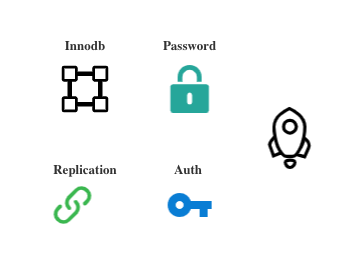
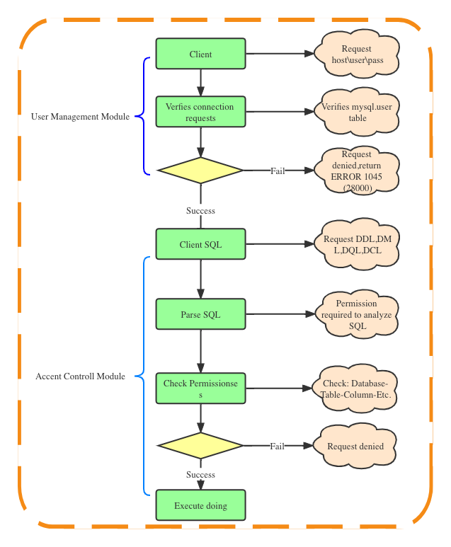
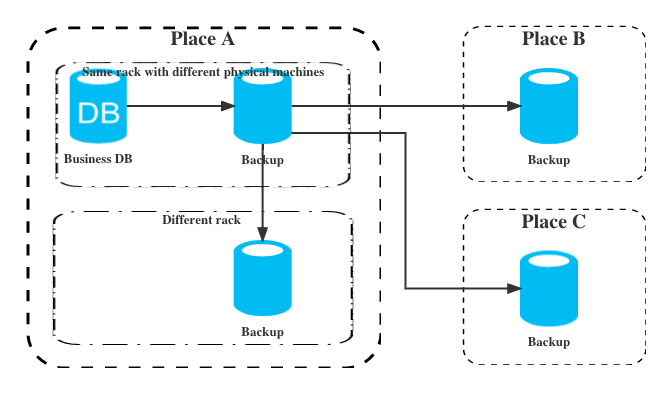

<script>
var pageHeader=document.getElementsByClassName("page-header")[0].innerHTML;
 pageHeader="<center></center>"+pageHeader;
document.getElementsByClassName("page-header")[0].innerHTML=pageHeader;
</script>

<h1 style="color:#606c71;text-align:center;" >提升 MySQL 数据库安全的一些建议</h1><br/>

[<h1 style="color:#606c71;text-align:center;" >Some suggestions for improving mysql database security</h1><br/>]:#


[!Some suggestions for improving mysql database security(assets/images/some-suggestions-for-improving-mysql-database-security/figure-1.jpg "Github of Anigkus")]:#

> <br/>&nbsp;&nbsp;&nbsp;&nbsp; MySQL 是最流行的RDBMS(Relational Database Management System)关系数据库管理系统,由瑞典MySQL AB 公司开发,最终被 Oracle 收入麾下.然后也出现了多个开源分支,比较流行的有XtraDB、Percona、MariaDB(MariaDB的主要创建者是Monty Widenius,也是MySQL的初始创建者),MySQL以及开源版本都是作为备受欢迎的关系型OLDP数据库,在无数的企业中帮助用户解决OLDP的相关难题,那么如何来提升MySQL自身的安全呢?本文就来带领大家做好MySQL的安全工作.<br/>
> <br/>

[> <br/>&nbsp;&nbsp;&nbsp;&nbsp; MySQL is the most popular RDBMS (Relational Database Management System) relational database management system. It was developed by the Swedish MySQL AB company and eventually acquired by Oracle. Later, a number of open source branches appeared one after another,the more popular ones being XtraDB, Percona, MariaDB (The main creator of MariaDB is Monty Widenius,Who is also the original creator of MySQL). MySQL and the open source version are both popular relational OLTP databases, helping users solve OLTP-related problems in countless enterprises, so how to How to improve the security of MySQL itself?This article will lead you to do a good job of MySQL security.<br/>]:#
[> <br/>]:#

## 升级操作系统
[## Upgrade the operating system]:#
&nbsp;&nbsp;&nbsp;&nbsp;<font color="red">提升MySQL安全的第一步就是先升级MySQL所在服务器的操作系统.</font>操作系统本身会存在安全漏洞等问题,操作系统的供应商也会定期推出升级补丁,所以为了避免出现由系统漏洞造成的安全隐患，我们要定期做好操作系统内核和补丁升级.需要考虑补丁版本的兼容性以及做好所有数据库相关的备份及提前最好多套预案,并且需要在测试数据库同内核和同版本数据库服务器先打补丁验证,然后一定要实施相关压测并认真分析是否已经修复了这个系统漏洞,验证升级前和升级后的区别,然后逐步升级到生产环境的数据库机器系统,避免造成公司重大安全事故,如果出现了,DB和运维基本可以开始跑路了,开发也可以更新简历了,准备开启新的生活(😄)...

[&nbsp;&nbsp;&nbsp;&nbsp;<font color="red">The first step in improving MySQL security is to upgrade the operating system of the server where MySQL is located. </font>The operating system itself will have security vulnerabilities and other problems, and the operating system suppliers will also regularly release upgrade patches, so in order to avoid security risks caused by system vulnerabilities , we must regularly upgrade the operating system kernel and patches. We need to consider the compatibility of the patch version, do a good job of all database-related backups, and make multiple sets of plans in advance, and we need to test the database with the kernel and the same version of the database server first. Patch verification, then be sure to implement relevant stress tests and carefully analyze whether the system vulnerability has been fixed, verify the difference between before and after the upgrade, and then gradually upgrade to the database machine system in the production environment to avoid major security incidents in the company. Now, DB and operation and maintenance can basically start running, and developers can update their resumes, ready to start a new life (😄)...<br/>]:#

<center>

</center>

## 升级MySQL
[## Upgrade MySQL]:#
&nbsp;&nbsp;&nbsp;&nbsp;MySQL产品一直在不断演进,社区在不断地反馈问题,社区团队一直在修复测试过程中发现的各种问题,所以为了保证你的MySQL一直是安全可靠的,最好的方式就是定期修复或升级MySQL内核补丁以及相关的插件补丁,避免MySQL本身存在重大漏洞或者隐患,给公司业绩带来不可挽回的损失.

[&nbsp;&nbsp;&nbsp;&nbsp;MySQL products are constantly evolving, the community is constantly feeding back problems, and the community team has been fixing various problems found in the testing process, so in order to ensure that your MySQL has always been safe and reliable, the best way is to regularly repair or upgrade MySQL Kernel patches and related plug-in patches can avoid major vulnerabilities or hidden dangers in MySQL itself, which will bring irreparable losses to the company's performance.<br/>]:#

<center>

</center>

## 升级MySQL依赖组件
[## Upgrading MySQL Dependent Components]:#
&nbsp;&nbsp;&nbsp;&nbsp;MySQL除了自身软件以外,还包括了很多依赖的软件,比如Innodb、Password组件、Replication组件、Auth组件等。和前面提到的操作系统类似,这些软件本身也会存在安全隐患,为保证整个 MySQL 体系的安全,建议大家要升级 MySQL 依赖软件的版本.当然也要注意依赖软件的版本的兼容性,要注意查看MySQL官网或者社区发布的相关补丁升级的相关说明.

[&nbsp;&nbsp;&nbsp;&nbsp;In addition to its own software, MySQL also includes a lot of dependent software, such as Innodb, Password components, Replication components, Auth components, etc. Similar to the operating systems mentioned above, these softwares themselves also have potential security risks. In order to ensure the security of the entire MySQL system, it is recommended that you upgrade the version of the MySQL-dependent software. Of course, you must also pay attention to the compatibility of the version of the dependent software, and pay attention to the instructions on the relevant patch upgrades released by the MySQL official website or the community.<br/>]:#
<center>

</center>

## 操作系统的安全组件
[## Security Components of Operating Systems]:#
&nbsp;&nbsp;&nbsp;&nbsp;操作系统本身也有多种安全组件,比如Window中的防火墙、安全策略(本地策略、域策略、OU 策略)、Defender反间谍软件、Action Center(操作中心和问题诊断提醒功能),而Linux 比如CentOS 自身包含了 Firewalld(Iptables 防火墙) 、Selinux(强制访问控制)、AIDE(高级入侵检测环境) 、 ACL(R\W\X的文件权限)来提供安全能力，所以在部署相关软件时一定要配置好相关组件的安全级别和系颗粒度策略,最好不要关闭MySQL 的服务器中Iptables 防火墙和 Selinux。当然开启 Iptables 就需要在运维管理的时候更多地注意，一定要把 MySQL 使用到的几个端口及应用必须要的端口开放即可,其它一律关闭或者禁止掉。

[&nbsp;&nbsp;&nbsp;&nbsp;The operating system itself also has a variety of security components, such as firewalls in Windows, security policies (local policies, domain policies, OU policies), Defender anti-spyware, Action Center (action center and problem diagnosis reminder function), and Linux such as CentOS itself It includes Firewalld (Iptables firewall), Selinux (mandatory access control), AIDE (advanced intrusion detection environment), ACL (file permissions of R\W\X) to provide security capabilities, so be sure to configure related software when deploying related software Component security level and system granularity policy, it is best not to turn off the Iptables firewall and Selinux in the MySQL server. Of course, when Iptables is turned on, more attention needs to be paid to the operation and maintenance management. It is necessary to open several ports used by MySQL and the ports required by the application, and all others must be closed or prohibited.<br/>]:#

<center>

</center>

## 提高密码复杂度
[## Improve password complexity]:#
&nbsp;&nbsp;&nbsp;&nbsp密码设置应该尽量复杂,千万不要泄露需经常更换,比如操作系统密码、各种其它软件访问密码.这里就只说MySQL密码增强插件,validate_password 是 mysql5.6以后可以引入的一个新密码校验插件, 管理用户密码长度、强度等，相关参数设置的较为严格。使用了该插件会检查设置的密码是否符合当前设置的强度规则，若不满足则拒绝设置,相关参数主要通过mysql> show variables like 'validate%';开头的参数判断,具体怎么配置,搜寻下相关博客,主要参数如下:

[&nbsp;&nbsp;&nbsp;&nbsp;Password settings should be as complicated as possible, and must not be leaked and need to be changed frequently, such as operating system passwords and various other software access passwords. Here we only talk about the MySQL password enhancement plug-in, and validate_password is a new password verification plug-in that can be introduced after mysql5.6. , to manage the length and strength of user passwords, and the related parameters are set more strictly. When this plugin is used, it will check whether the set password conforms to the currently set strength rules. If not, the setting will be rejected. The relevant parameters are mainly judged by the parameters at the beginning of mysql> show variables like 'validate%';, how to configure it, and search for the relevant parameters. Blog, the main parameters are as follows:]:#
```
1. validate_password_policy
#密码策略(0 or LOW\1 or MEDIUM\2 or STRONG )
2. validate_password_length
#用来设置密码的最小长度，默认值是8最小是0
3. validate_password_mixed_case_count
#当validate_password_policy设置为MEDIUM或者STRONG时，密码中至少同时拥有的小写和大写字母的数量，默认是1最小是0；默认是至少拥有一个小写和一个大写字母
4. validate_password_number_count     
# 当validate_password_policy设置为MEDIUM或者STRONG时，密码中至少拥有的数字的个数，默认1最小是0
5. validate_password_special_char_count
# 当validate_password_policy设置为MEDIUM或者STRONG时，密码中至少拥有的特殊字符的个数，默认1最小是0
```

[```]:#
[1. validate_password_policy]:#
[#Password Policy(0 or LOW\1 or MEDIUM\2 or STRONG )]:#
[2.validate_password_length]:#
[#Used to set the minimum length of the password, the default value is 8, the minimum is 0]:#
[3. validate_password_mixed_case_count]:#
[#When validate_password_policy is set to MEDIUM or STRONG, the number of lowercase and uppercase letters in the password at least, the default is 1 and the minimum is 0; the default is at least one lowercase and one uppercase letter]:#
[4.validate_password_number_count]:#
[# When validate_password_policy is set to MEDIUM or STRONG, the number of digits at least in the password, the default is 1 and the minimum is 0]:#
[5. validate_password_special_char_count]:#
[# When validate_password_policy is set to MEDIUM or STRONG, the minimum number of special characters in the password, the default is 1 and the minimum is 0]:#
[```]:#


密码复杂性规则:
* 数字、大写字母、小写字母、特殊符号，4个类别最低选择3个类别
* 密码长度尽可能足够长，一般大于7位
* 最好使用随机字符串，不要使用容记的字符串
* 要定期进行密码更换，一般是两个月
* 密码的循环周期要大，比如你的密码更换不能使用最近使用过的密码

[Password Complexity Rules:]:#
[* Numbers, uppercase letters, lowercase letters, special symbols, 4 categories at least choose 3 categories]:#
[* The length of the password should be as long as possible, generally greater than 7 digits]:#
[* It's better to use random strings, don't use Yung Kee strings]:#
[* Regularly change passwords, usually two months]:#
[* The cycle period of the password should be large, for example, your password replacement cannot use the most recently used password]:#

密码长度破解难度(美国佐治亚理工学院的科学家说如果使用12位密码(多种字符:数字+大小写字母+特殊字符)，以目前技术水平，黑客得花上17134年才能破解).

如果使用12位密码(研究人员仍推荐使用12位密码).

那么都是用数字呢,那么复杂性是10的12次方..

如果使用的是数字和小写字母,那么复杂性是10位数字加上26位小写字母的12次方，即36的12次方.

如果使用数字、小写字母、大写字母，那么复杂性就是10位数字加上26位小写字母加上26位大写字母,即62的12次方.<br/>

[Password length cracking difficulty (scientists from Georgia Institute of Technology in the United States said that if a 12-bit password (multiple characters: numbers + uppercase and lowercase letters + special characters) is used, with the current technical level, it will take hackers 17134 years to crack).]:#

[If you use a 12-bit password (researchers still recommend 12-bit passwords), then all use numbers, then the complexity is 10 to the 12th power.]:#

[If numbers and lowercase letters are used, the complexity is 10 digits plus 26 lowercase letters to the 12th power, which is 36 to the 12th power.]:#

[If you use numbers, lowercase letters, uppercase letters, then the complexity is 10 digits plus 26 lowercase letters plus 26 uppercase letters, which is 62 to the 12th power.<br/>]:#

<center>

</center>

## 使用SSL协议
[## Use SSL Protocol]:#

&nbsp;&nbsp;&nbsp;&nbsp;SSL的诸多好处就不用说了吧,如果数据库需要外部访问,我所说的外部是来自公网,那么我强烈建议你申请一个SSL证书,之后部署好 ssl 证书,关闭掉HTTP的访问方式,让所有人通过 HTTPS 协议来访问 MySQL数据库,如果是内网,就没有必要了,可以在其它方面控制安全,因为启用SSL请求,开启ssl加密连接是性能必然会下降，性能开销在25%左右(网上说的,我实际没压测过).

[&nbsp;&nbsp;&nbsp;&nbsp;Needless to say, there are many benefits of SSL. If the database needs external access, and the external I am talking about is from the public network, then I strongly recommend that you apply for an SSL certificate, then deploy the ssl certificate, close the HTTP access method, and let Everyone accesses the MySQL database through the HTTPS protocol. If it is an intranet, it is not necessary. You can control security in other aspects, because enabling SSL requests and enabling ssl encrypted connections will inevitably reduce performance, and the performance overhead is about 25% (online I mean, I haven't actually tested it).<br/>]:#
<center>

</center>

## 最小授权原则
[## Principle of least privilege]:#

&nbsp;&nbsp;&nbsp;&nbsp;MySQL授权用户至始至终都应该遵守权限最小化原则,MySQL权限分为这么几级,主机授权->用户授权->数据库授权-表授权-列授权-其它操作(如存储过程、主从复制、函数执行)等,总体来说就这么6级.因此在授权时,一定要严格控制好对应的权限级别,不要设置过大(边界超出,有风险)或者过小(限制业务操作).需要严格控制OS和DB账号的管理，以防账号信息外泄，尤其是root和mysql账号,访问授权限定来访主机信息。我们可以在授权的时候，通过指定主机的主机名、域名或IP地址信息来限定来访主机的范围,这些帐号会给系统带来极大的安全隐患，所以我们必须在正式启用之前尽早删除，或者设置一个比较安全的密码.要为某个用户授权，可以使用GRANT命令，要去除某个用户已有的权限则使用REVOKE命令。当然除了这两个命令之外，还有一种比较暴力的办法，那就是直接更新系统表,都在mysql(user(proxies_priv)\db\tables_priv\columns_priv\procs_priv\)和information_schema(USER_PRIVILEGES\SCHEMA_PRIVILEGES\TABLE_PRIVILEGES\COLUMN_PRIVILEGES)两下内部库下,不同库下的权限相关的表90%都重叠,MySQL的访问控制实际上由两个功能模块共同组成，一个是负责“看守mysql大门”的用户管理模块，另一个就是负责监控来访者每一个动作的访问控制模块.

[&nbsp;&nbsp;&nbsp;&nbsp;MySQL authorized users should abide by the principle of minimizing permissions from beginning to end. MySQL permissions are divided into several levels, host authorization->user authorization->database authorization-table authorization-column authorization-other operations (such as stored procedures, master-slave replication) , function execution), etc., generally speaking, there are 6 levels. Therefore, when authorizing, you must strictly control the corresponding permission level, and do not set too large (boundary exceeded, risky) or too small (restrict business operations). Required Strictly control the management of OS and DB accounts to prevent account information from leaking, especially for root and mysql accounts, and access authorization limits access to host information. We can limit the range of visiting hosts by specifying the host name, domain name or IP address information of the host during authorization. These accounts will bring great security risks to the system, so we must delete them as soon as possible before they are officially activated, or Set a relatively secure password. To authorize a user, use the GRANT command, and to remove a user's existing permissions, use the REVOKE command. Of course, in addition to these two commands, there is also a more violent method, which is to update the system tables directly, both in mysql(user(proxies_priv)\db\tables_priv\columns_priv\procs_priv\) and information_schema(USER_PRIVILEGES
\SCHEMA_PRIVILEGES\TABLE_PRIVILEGES\COLUMN_PRIVILEGES) under the two internal libraries, 90% of the permission-related tables under different libraries overlap, MySQL's access control is actually composed of two functional modules, one is the user responsible for "guarding the MySQL gate" The management module, the other is the access control module responsible for monitoring every action of the visitor.<br/>]:#
<center>

</center>

## 授权遵循原则
[## Authorization follows principles]:#

&nbsp;&nbsp;&nbsp;&nbsp;MySQL授权的基本依据是目标责任,权限就是使用者需要承担的目标责任,不要授权过大或者不足,满足实际业务所属就行,因此在授权时还要遵循以下一些原则

[&nbsp;&nbsp;&nbsp;&nbsp;The basic basis of MySQL authorization is the target responsibility, and the authority is the target responsibility that the user needs to assume. Do not authorize too much or insufficient, just meet the actual business. Therefore, the following principles should be followed when authorizing]:#

* 最小原则:即只授予决策或处理某一问题的权力，问题解决后，权力即行收回
* 条件授权:即只在某一特定环境条件下，授予下级某种权力，环境条件改变了，权限也应随之改变
* 定时授权:即授予下级的某种权力有一定的时间期限，到期权力应该收回
* 授权传递:在MySQL数据库中有一个很重要的特点就是权限传递,如果在为用户授权的时候没有添加WITH GRANT OPTION参数,则权限不能传递.
* 操作轨迹:就是一定通过某些系统管理平台去下发授权,这样就能知道是谁在什么时候给哪位授予哪些权限用于操作哪些资源,然后哪个用户在什么时候操作,通过何种方式操作何种资源,都需要有详细的日志存档.
* 定期复查:就是需要账号管理员定期是检查日志是否有异常情况,或者查看某些账号是否不用了,即时清除,避免后续造成事故.

[* Minimum principle: that is, only the power to make decisions or deal with a certain problem is granted, and the power will be withdrawn after the problem is solved]:#
[* Conditional authorization: that is, only under a certain environmental condition, grant a certain power to the subordinate, and the environmental conditions change, the authority should also change accordingly]:#
[* Timing authorization: that is, a certain power granted to subordinates has a certain time limit, and the expired power should be withdrawn]:#
[* Authorization transfer: A very important feature in the MySQL database is the transfer of permissions. If the WITH GRANT OPTION parameter is not added when authorizing the user, the permissions cannot be transferred.]:#
[* Operation track: It is necessary to issue authorization through some system management platforms, so that you can know who and when to grant which permissions to which resources to operate which resources, and then which user operates when and in what way A detailed log archive is required for any resource to be operated.]:#
[* Regular review: It means that the account administrator needs to regularly check whether the log is abnormal, or check whether some accounts are no longer used, and clear them immediately to avoid subsequent accidents.]:#
  
<br/>
<center>

</center>

## 安全审计日志
[## Security Audit Log]:#

&nbsp;&nbsp;&nbsp;&nbsp;现在数据就是金钱,防止出现数据泄露,尽快查询出是从哪里泄露出去的源头,必须需要相关的日志记录,不然就会在技术圈里面出现爆炸性新闻,某某公司出现数据泄露了,或者拖库了,但是企业出来澄清,我们正在继续排查,也没说是谁通过某种方法泄露了哪些内容(因为没日志,根本一时半会回答不出来),这对公司的市场会有致命性的打击,数据库审计能够实时记录网络上的数据库活动，对数据库操作进行细粒度审计的合规性管理，对数据库遭受到的风险行为进行警告，对攻击行为进行阻断。它通过对用户访问数据库行为的记录、分析和汇报，用来帮助用户时候生成合规报告、事故追根溯源，同时加强内外部数据库网络行为记录，提高数据资产安全.

[&nbsp;&nbsp;&nbsp;&nbsp;Now data is money, to prevent data leakage, to find out where the source of the leak came from as soon as possible, you must need relevant log records, otherwise there will be breaking news in the technology circle, a certain company has data leakage, or the database is dragged However, the company came out to clarify, we are continuing to investigate, and we have not said who leaked what content through some method (because there is no log, it will not be able to answer for a while), which will have a fatal blow to the company's market. ,Database auditing can record database activities on the network in real time, conduct fine-grained audit compliance management for database operations, warn the risk behaviors suffered by the database, and block attack behaviors. It records, analyzes and reports the user's access to the database to help users generate compliance reports and trace the source of accidents.<br/>]:#

<center>

</center>

## 数据备份策略
[## Data Backup Policy]:#
&nbsp;&nbsp;&nbsp;&nbsp;数据安全已经是当下或者企业的核心竞争力,各行业数据规模呈TB级增长,如何确保网络数据的完整性、可用性和保密性,不受到信息泄漏和非法篡改的安全威胁影响,已成为政府机构、事业单位信息化健康发展所要考虑的核心问题.MySQL数据安全备份有以下几种:

[&nbsp;&nbsp;&nbsp;&nbsp;Data security is now the core competitiveness of enterprises or enterprises, and the scale of data in various industries is growing at the terabyte level. How to ensure the integrity, availability and confidentiality of network data, and not be affected by the security threats of information leakage and illegal tampering, has become a government agency. The core issues to be considered in the healthy development of the informatization of public institutions. MySQL data security backup has the following types:]:#

### 根据备份类型的方法划分
* Hot Backup(热备):热备就是在线备份,对正在运行的数据库操作没有任何影响,就是业务是无感知的,也称在线备份.
* Cold Backup(冷备):冷备就刚好和热备相反,需要数据库停止的情况下操作,一般是业务可以接受停机要求,这个也是最安全的一种备份操作.
* Warm Backup(温备):温备介于热备和冷备之间,会对当前数据库操作有丢丢影响,通过一些锁或者限流或降低业务性能来保证备份数据的一致性.

### 根据备份文件的内容划分
* 逻辑备份:逻辑备份就是内容是可读的,比如之间导出SQL或者xls文件等.
* 文件备份:直接复制Mysql数据目录下相关文件(frm\ibdata\mysql-bin.000\mysql-bin.index)或者备份整个MySQL数据目录

### 根据备份数据的内容划分
* 完全备份:完全备份就是对数据库进行一个完整的备份,一般是第一次备份或者增量备份前时都会进行完整备份.
* 增量备份:在完整备份基础上进行备份,可以设置时间为每分钟\每小时\每天\每周等.
* 日志备份:日志备份就是利用MySQL的(Replication)原理实现异步实时的将二进制日志同步到从数据库进行重做来实现的备份.

### 根据备份数据的区域划分
* 同机房策略:就是备份的数据库机器不能和被需备份的数据库机器在同一台设备上,预防当前硬件设备的系统问题或者硬件问题等.
* 跨机房策略:也叫双机异地热备份,就是需要备份的数据库机器不能和被需备份的数据库机器在同一个机房,最好做三份备份测试,如同机房一份、跨机房两份.<br/>

[### Divide by method according to backup type]:#
[* Hot Backup: Hot backup is online backup, which has no impact on the running database operation, that is, the business is imperceptible, also known as online backup.]:#
[* Cold Backup (cold backup): Cold backup is just the opposite of hot backup. It needs to be operated when the database is stopped. Generally, the business can accept the shutdown request. This is also the safest backup operation.]:#
[* Warm Backup: Warm backup is between hot backup and cold backup, which will affect the current database operation, and ensure the consistency of backup data through some locks or current limiting or reducing business performance.]:#

[### Divide according to the content of the backup file]:#
[* Logical backup: Logical backup is that the content is readable, such as exporting SQL or xls files, etc.]:#
[* File backup: directly copy the relevant files in the Mysql data directory (frm\ibdata\mysql-bin.000\mysql-bin.index) or back up the entire MySQL data directory]:#

[### According to the content of the backup data]:#
[* Full backup: A full backup is a complete backup of the database. Generally, a full backup is performed before the first backup or incremental backup.]:#
[* Incremental backup: backup on the basis of full backup, you can set the time to every minute\hour\day\week, etc.]:#
[* Log backup: Log backup is a backup that uses MySQL's (Replication) principle to realize asynchronous real-time synchronization of binary logs to the slave database for redoing.]:#

[### According to the area of ​​backup data]:#
[* Same computer room strategy: that is, the database machine to be backed up cannot be on the same device as the database machine to be backed up, to prevent system problems or hardware problems of the current hardware equipment, etc.]:#
[* Cross-machine room strategy: also known as dual-machine remote hot backup, that is, the database machine to be backed up cannot be in the same machine room as the database machine to be backed up, it is best to do three backup tests, such as one in the machine room and two across the machine room.<br/>]:#

<center>

</center>

<br>

[back](./)