<iframe src="../detail-header.html" title="Github of Anigkus" style="height:0px,widht:0px;display:none" id="kusifreamheader"></iframe>

<h1 style="color:#606c71;text-align:center;" id="h1">聊聊消息中间件中的投递语义</h1> 

[<h1 style="color:#606c71;text-align:center;" >Talk about delivery semantics in message middleware</h1> ]:#

>  &nbsp;&nbsp;&nbsp;&nbsp; 分布式系统的流式计算已经成为大数据处理领域越来越热门的话题.业界社区比较流行的流处理引擎(SPE)包括 Flink (Flink DataStream)、Spark (Spark Streaming)、Storm (Storm Streams )、Pulsar (Pulsar Functions)、Kafka (Kafka Streams)等.其中里面讨论最广泛的特性之一就是它们的消息处理语义,但是现在业界公认的投递语义的有三种(At Least Once、At Most Once、Exactly Once).其中讨论最多的也是最复杂的语义就是Exactly Once,Exactly Once通常理解为“有且只有一次,消息不丢失不重复,且只消费一次”.我其实更愿意把Exactly Once处理语义称为"恰好一次",不多不少刚刚好.以下内容我将以我个人的理解以及一些文章整理而来,下面就是简单聊聊这三种语义的特点以及在各个消息中间件中的语义实现思路等. 
>  

[>  &nbsp;&nbsp;&nbsp;&nbsp; Stream computing in distributed systems has become an increasingly popular topic in the field of big data processing. Popular stream processing engines (SPE) in the industry community include Flink (Flink DataStream), Spark (Spark Streaming), Storm (Storm Streams), Pulsar (Pulsar Functions), Kafka (Kafka Streams), etc. One of the most widely discussed features is their message processing semantics, but now there are three types of delivery semantics recognized by the industry (At Least Once, At Most Once, Exactly Once ). Among them, the most discussed and most complex semantics is Exactly Once. Exactly Once is usually understood as "there is and only once, the message is not lost, not repeated, and only consumed once". I actually prefer to call the processing semantics of Exactly Once "Exactly once", no more, no less, just right. The following content will be compiled based on my personal understanding and some articles. The following is a brief talk about the characteristics of these three semantics and the semantic implementation ideas in each message middleware, etc. . ]:#
[>  ]:#

# 背景说明
[# Background]:#

&nbsp;&nbsp;&nbsp;&nbsp; 流处理,有时也称为事件处理,可以简洁地描述为对无限数据或事件的连续处理.流或事件处理应用程序可以或多或少地被描述为有向图(Directed Graph),但通常被描述为有向无环图 (Directed Acyclic Graph)DAG.在这样的图中,每条边代表一个数据或事件流,每个顶点代表一次或多次计算操作,该运算符使用应用程序定义的逻辑来处理来自相邻边的数据或事件.有两种特殊类型的顶点,通常称为数据源和接收器.数据源消耗外部数据/事件并将它们注入应用程序,而接收器通常收集应用程序产生的结果.如下图描述了一个典型处理的拓扑应用示例.

[&nbsp;&nbsp;&nbsp;&nbsp; Stream processing, sometimes called event processing, can be succinctly described as the continuous processing of infinite data or events. Stream or event processing applications can be described more or less as directed graphs (Directed Graph), but is often described as a (Directed Acyclic Graph) DAG. In such a graph, each edge represents a data or event flow, Each vertex represents one or more computational operations that use application-defined logic to process data or events from adjacent edges. There are two special types of vertices, commonly referred to as data sources and sinks. Data sources Consume external data/events and inject them into the application, while the receiver usually collects the results produced by the application. The following figure depicts an example of a typical processing topology application.]:#

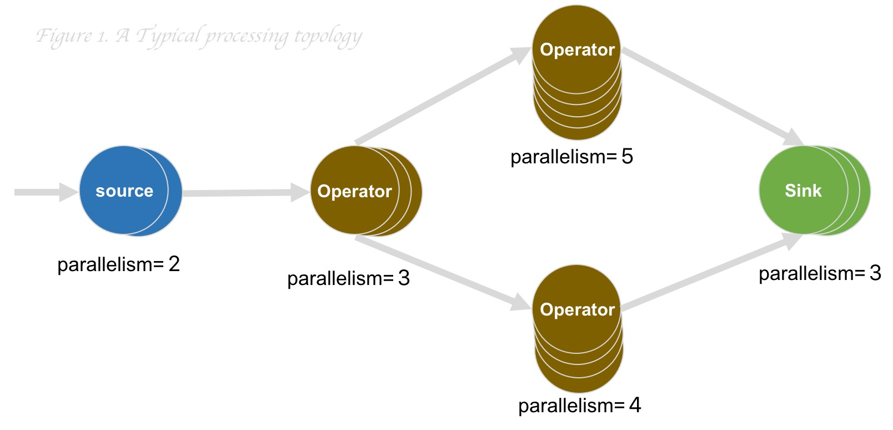

&nbsp;&nbsp;&nbsp;&nbsp;执行流或事件的应用处理程序通常允许用户指定可靠性模式或处理语义,以表示它将为整个应用程序流程中的图数据处理提供哪些保证.这些保证是有意义的,因为您始终可以假设通过网络、机器等发生故障的可能性会导致数据丢失.这里涉及到三种模式: 最多一次、至少一次、恰好一次,通常用于描述流处理引擎 (SPE) 提供给应用程序的数据处理语义.

[&nbsp;&nbsp;&nbsp;&nbsp;Application handlers that execute streams or events often allow the user to specify reliability modes or processing semantics to express what guarantees it will provide for graph data processing throughout the application flow. These guarantees make sense , because you can always assume data loss due to the possibility of a failure over the network, machine, etc. There are three patterns involved here: at most once, at least once, exactly once, usually used to describe what a Stream Processing Engine (SPE) provides to The data processing semantics of the application.]:#

* At-Most-Once: 至多一次,消息可能会丢,但不会重复
* At-least-Once: 至少一次,消息肯定不会丢失,但可能重复
* Exactly-Once: 有且只有一次,消息不丢失不重复,且只消费一次

[* At-Most-Once: at most once, the message may be lost, but not repeated]:#
[* At-least-Once: at least once, the message is definitely not lost, but may be repeated]:#
[* Exactly-Once: there is and only once, the message is not lost or repeated, and it is only consumed once]:#
  
# At-Most-Once

&nbsp;&nbsp;&nbsp;&nbsp; 最多一次意味着消息最多传递一次,一旦交付,就没有机会再次交付.如果消费者由于某种异常无法处理消息,则消息丢失,这样就可能出现消息并没有被消费者消费到的情况.这本质上是一种"尽力而为"的方法.数据或事件保证最多被应用程序中的所有操作处理一次.这意味着如果在流应用程序中可能完全处理它之前丢失了事件,那么也不会进行额外的尝试来重试或重新传输该事件.如下图描述了一个At-Most-Once简单示例.

[&nbsp;&nbsp;&nbsp;&nbsp; At most once means that the message is delivered at most once, and once delivered, there is no chance to deliver it again. If the consumer cannot process the message due to some exception, the message is lost, so it may appear that the message is not consumed. This is essentially a "best effort" approach. The data or event is guaranteed to be processed at most once by all operations in the application. This means that if in a streaming application it may be lost before it is fully processed If the event has been retrieved, then no additional attempts will be made to retry or retransmit the event. The following diagram depicts a simple At-Most-Once example.]:#

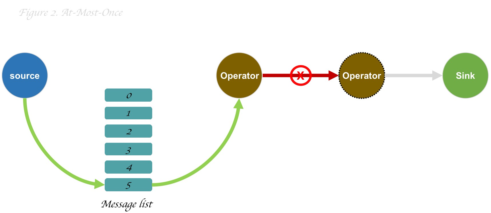

这个是代价最便宜且性能最高的,因为使用最少的性能开销,因为它可以以即发即忘的方式完成,而无需在发送端或传输机制中保持状态.

[This is the cheapest and most performant because it uses the least performance overhead, as it can be done in a fire-and-forget fashion without maintaining state on the sender or transport mechanism.]:#

# At-Most-Once

&nbsp;&nbsp;&nbsp;&nbsp; 数据或事件保证至少被应用程序图中的所有操作者操作过一次.这通常意味着如果事件在流应用程序完全处理之前丢失或失败,则可能会重新传输事件.然而,由于它可以被重传,那么一个事件就有时可以被处理不止一次,因此说是“至少一次”语义.如下图所示,第二个操作第一次处理是吧,然后第一个操作在重试时才成功,然后在结果证明是进行了不必要的第二次(异步跨网络)操作,但是在又重试时又成功了(成功了2次).

[&nbsp;&nbsp;&nbsp;&nbsp; Data or events are guaranteed to be manipulated at least once by all operators in the application graph. This usually means that events may be retransmitted if they are lost or fail before the streaming application is fully processed. However, since it can be retransmitted, an event can sometimes be processed more than once, hence the "at least once" semantics. As shown in the figure below, the second operation is processed the first time, right, and then the first operation It only succeeds when it retries, then it turns out to be an unnecessary second (async cross-network) operation, but it succeeds when it retries again (successful 2 times).]:#

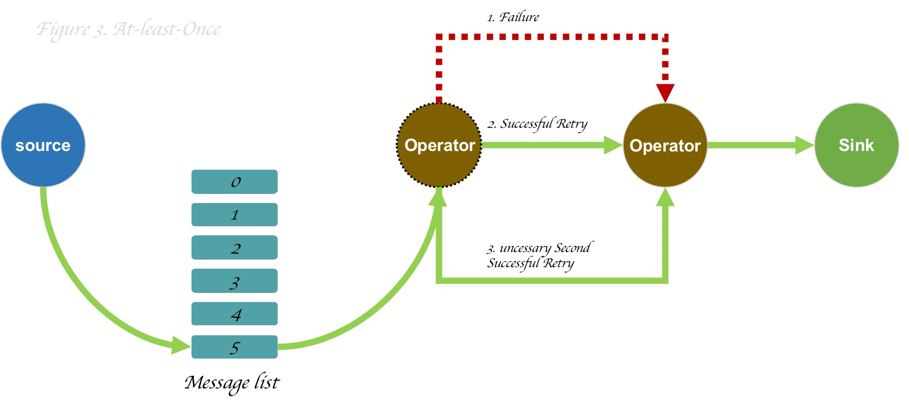

这个模式是需要每个操作者去解决数据被重复处理的逻辑(幂等问题),而且存在多余的无效请求和逻辑处理.

[This mode requires each operator to solve the logic of repeated processing of data (idempotent problem), and there are redundant invalid requests and logical processing.]:#

# Exactly-Once

&nbsp;&nbsp;&nbsp;&nbsp; 实际上在事件处理过程中,各种异常情况都有可能发生,所以根本不可能百分百保证每条消息真的只会被处理一次,因此跨系统之间的数据操作一致性一般使用2PC协议来保证(权衡3PC).

[&nbsp;&nbsp;&nbsp;&nbsp; In fact, in the event processing process, various abnormal situations may occur, so it is impossible to guarantee 100% that each message will only be processed once Data operation consistency is generally guaranteed by the 2PC protocol (weighing 3PC).]:#

一般业界常用的有2种方案来实现所谓"恰好一次”:
* 分布式检查点
* 重复数据删除

&nbsp;&nbsp;&nbsp;&nbsp; 分布式检查点的机制实际是流应用程序中的每个算子的所有状态都会被周期保存快照点,如果系统中的任何地方发生故障,那么每个算子的所有状态都会回滚到最近的全局一致检查点.优点是性能开销较低(内存级别).缺点是随着集群的扩大也会潜在的影响性能.

[Generally, there are two schemes commonly used in the industry to achieve the so-called "exactly once":]:#
[* Distributed checkpoint]:#
[* Deduplication]:#

[&nbsp;&nbsp;&nbsp;&nbsp; The mechanism of distributed checkpointing is that all states of each operator in the streaming application will be periodically saved as snapshot points. If a failure occurs anywhere in the system, then the All state is rolled back to the most recent globally consistent checkpoint. The advantage is a lower performance overhead (memory level). The disadvantage is that it can potentially affect performance as the cluster grows.]:#

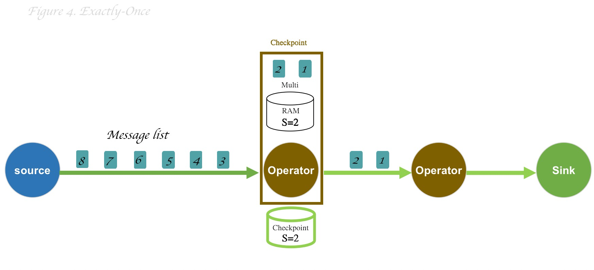

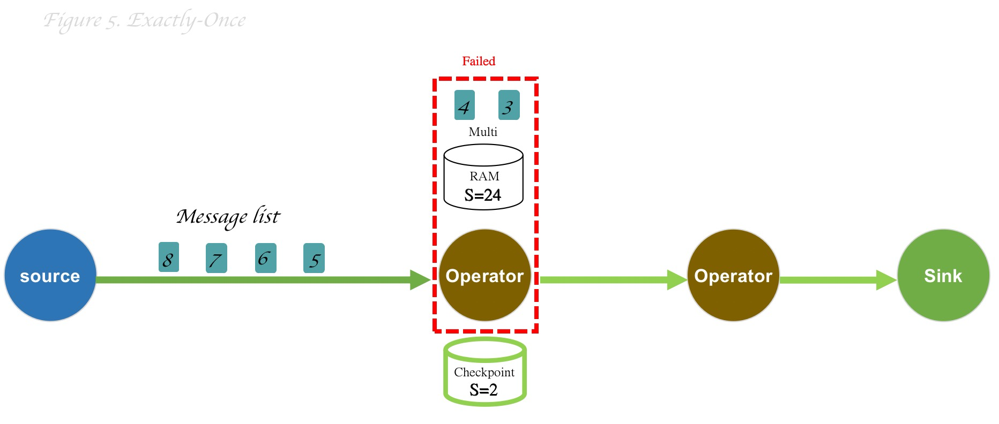

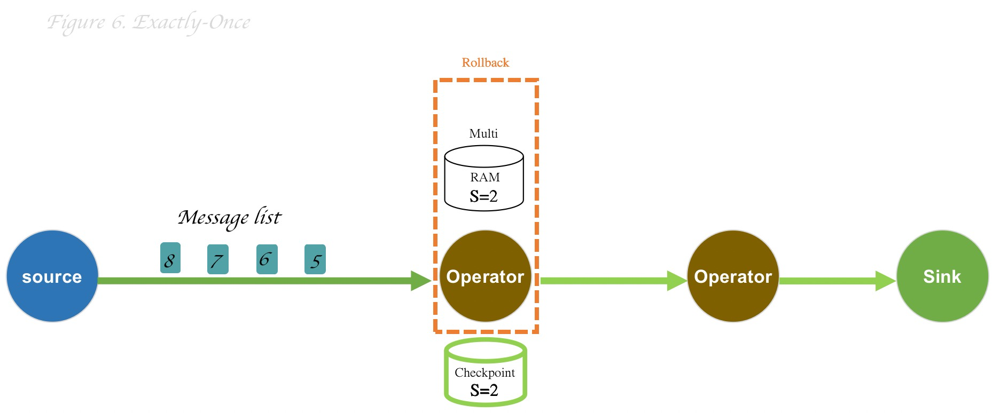

如上图所示,正常情况下流式处理程序是周期的保存当前检查点(图4),如果在出现异常的情况,此时,上一个检查点的S=2已经落地持久存储了,而当前的检查点S=24的操作算子还只是保存在内存中(图5).为了解决这种异常情况,内部多个算子的状态会回滚到最近已经持久的检查点(图6),那么虽然某些操作被处理了多次,但是这个不是不会影响结果,因为最终的结果都是一样的.

重复数据删除的机制实际是结合事件日志来为每个操作维护一个事务日志,这是机制的好处是性能性能影响比较低,并且不会随着集群的规模变化而增大,缺点是需要多余的磁盘空间用来存储操作日志.(Kafka和Pulsar都是使用此机制实现).

Exactly-Once是成本最高的,需要很多的机制和存储成本来保证准确率,对于大多数系统来说At-Most-Once就足够了.

[As shown in the figure above, under normal circumstances, the stream processing program periodically saves the current checkpoint (Figure 4). S=2 has been permanently stored, and the operation operator of the current checkpoint S=24 is only stored in memory (Figure 5). In order to solve this abnormal situation , the state of multiple internal operators will be rolled back to the most recent persistent checkpoint (Figure 6), so although some operations have been processed multiple times, this is not will affect the result, because the end result is always the same.]:#

[The mechanism of deduplication is actually to maintain a transaction log for each operation in combination with the event log. The advantage of this mechanism is that the performance impact is relatively low, and it will not increase with the scale of the cluster. The disadvantage is that it needs to be redundant. Disk space is used to store operation logs. (Kafka and Pulsar both use this mechanism to implement).]:#

[Exactly-Once is the most expensive and requires a lot of mechanisms and storage costs to ensure accuracy. For most systems, At-Most-Once is sufficient.]:#

# 流批处理和流式消息的各自实现及差异

[# The respective implementations and differences of streaming batch processing and streaming messages]:#

&nbsp;&nbsp;&nbsp;&nbsp; 每个中间件都实现了多种语义,每个语义的实现都与性能和效率有必然的联系,因此下面的说明只会说每个中间件中对Exactly-Once的实现大致思路,其它两项(At-Most-Once&At-Most-Once)在此不会说明.
  
[&nbsp;&nbsp;&nbsp;&nbsp; Each middleware implements a variety of semantics, and the implementation of each semantics is necessarily related to performance and efficiency, so the following description will only describe the general idea of the implementation of Exactly-Once in each middleware, and the other two (At-Most-Once&At-Most-Once) will not be explained here.]:#

## Flink

&nbsp;&nbsp;&nbsp;&nbsp; Flink声称实现了Exactly Once语义,其中最核心的功能就是Checkpoint容错机制.它会根据用户的配置周期性地对流中各个算子(Operator)的状态生成快照,然后持久化到外部存储.Flink中不同connector中的实现语义是不一样的,是需要第三方存储组件支持事务实现,因此才能实现官方所说端到端的一致性语义,以下以kafka举例说明:

[&nbsp;&nbsp;&nbsp;&nbsp; Flink claims to implement Exactly Once semantics, the core function of which is the Checkpoint fault tolerance mechanism. It will periodically generate snapshots of the state of each operator in the stream according to the user's configuration, and then persist The implementation semantics of different connectors in Flink are different, and third-party storage components are required to support transaction implementation, so the official end-to-end consistency semantics can be realized. The following is an example of kafka:]:#

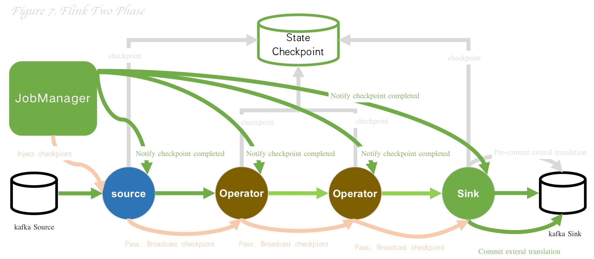

<mark>其实二阶段是有这么3个重要角色:</mark>

* 客户端(AP):就是图中的kafka source
* 协调者(TM):就是图中的JobManager
* 参与者(RM):就是图中的各个算子`(source|Operator|Sink)`等

上图的大致流程分以下三个执行步骤:

* Start
&nbsp;&nbsp;&nbsp;&nbsp; JobManager向 kafka source 节点注入Checkpoint,然后内部就会初始化一些数据并开启一个新的事务,并且也会把当前 barrier间的数据向 checkout state 上报(一次commit会提交两个 checkpoint barrier 之间所有的数据) .

* Pre-Commit
&nbsp;&nbsp;&nbsp;&nbsp; kafka source 会把checkpoint barrier 广播到每个下游Operator节点,并且也会同时执行本地的checkout snapshot到state机器,以此类推,等到这个链路中所有计算节点都收到 barrier 和执行 checkpoint之后,最后当 kafka sink 执行checkpoint 的时候,向 kafka 提交事务 pre-commit(一阶段事务),并且state checkout机器也都会周期性的持久化磁盘.

* Commit
&nbsp;&nbsp;&nbsp;&nbsp; 当流图的所有节点都完成 checkpoint，JobManager会通知所有operator,已经完成本次完整流程的checkpoint,此时 kafka sink 向 kafka 提交事务 commit(二阶段最终事务提交并依靠connector实现落地存储).

[<mark>Actually, there are 3 important roles in the second stage:</mark>]:#

[* Client (AP): It is the kafka source in the picture]:#
[* Coordinator (TM): It is the JobManager in the figure]:#
[* Participant (RM): It is the operator `(source|Operator|Sink)` in the graph, etc.]:#

[The general process in the above figure is divided into the following three execution steps:]:#

[* Start]:#
[&nbsp;&nbsp;&nbsp;&nbsp; The JobManager injects Checkpoint into the kafka source node, and then initializes some data internally and starts a new transaction, and also reports the data between the current barriers to the checkout state (A commit will submit all data between two checkpoint barriers) .]:#

[* Pre-Commit]:#
[&nbsp;&nbsp;&nbsp;&nbsp; kafka source will broadcast the checkpoint barrier to each downstream operator node, and will also execute the local checkout snapshot to the state machine at the same time, and so on, until all computing nodes in the link have received After the barrier and the checkpoint execution, finally when the kafka sink executes the checkpoint, the transaction pre-commit (one-stage transaction) is submitted to kafka, and the state checkout machine will also persist periodically. hard disk.]:#

[* Commit]:#
[&nbsp;&nbsp;&nbsp;&nbsp; When all nodes of the flow graph complete the checkpoint, the JobManager will notify all operators that the checkpoint of this complete process has been completed. At this time, the kafka sink submits the transaction commit(Second-phase final transaction submission and relying on the connector to achieve on-the-ground storage).]:#

## Spark

&nbsp;&nbsp;&nbsp;&nbsp; Spark 中的 Exactly Once语义是使用Spark Streaming实现.Streaming是一个实时计算框架,那么就分为source(输入)、operater(算子)、sink(输出)这三步,三步需要一起相互配合才行,而且对应不同的集成组件实现方式也都不一样.Spark Streaming集成现在有两个方案:旧的基于receiver的方法、新的基于direct stream的方法.下图是Spark Streaming基于direct stream(Spark 1.3引入的)结合Kafka的例子.

[&nbsp;&nbsp;&nbsp;&nbsp; The Exactly Once semantics in Spark is implemented using Spark Streaming. Streaming is a real-time computing framework, so it is divided into three steps: source (input), operator (operator), and sink (output). The three steps need to cooperate with each other, and the implementation methods of different integration components are also different. Spark Streaming integration now has two solutions: the old receiver-based method and the new direct stream-based method. The following figure is Spark Streaming is based on the example of direct stream (introduced by Spark 1.3) combined with Kafka.]:#

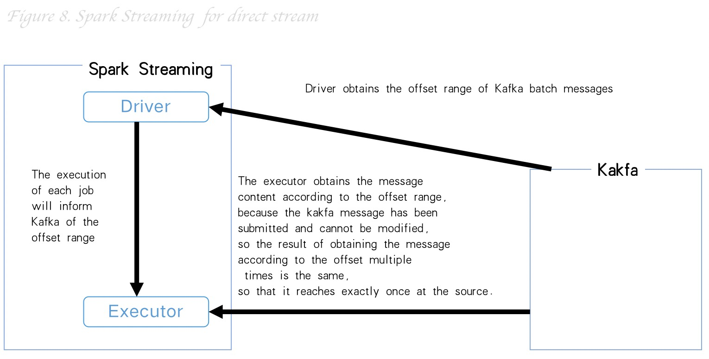

* ource: 输入端,如上图
* operater: 处理端,处理逻辑使用Spark RDD实现,因为RDD具有不可变、可分区、可并行计算、容错的特征.
* sink: 输出端,输出需要业务支持幂等性写入或者事务性写入来保证所谓的exactly once.

[* ource: input terminal, as shown above]:#
[* operator: The processing side, the processing logic is implemented using Spark RDD, because RDD has the characteristics of immutable, partitionable, parallel computing, and fault tolerance.]:#
[* sink: The output end, the output requires the business to support idempotent writing or transactional writing to ensure the so-called exactly once.]:#

## Storm

&nbsp;&nbsp;&nbsp;&nbsp; Storm 中的 Exactly Once 语义是使用Trident API实现.核心机制是在拓扑中跟踪元组(Tuple)的状态,从而达到所谓的Exactly Once,Tuple 内部使用Spout(源)、Bolt(可以理解为算子或者下阶段处理者)、Acker(确认点,类似二阶段的TM)一起协调完成处理.

[&nbsp;&nbsp;&nbsp;&nbsp; The Exactly Once semantics in Storm is implemented using the Trident API. The core mechanism is to track the state of the tuple (Tuple) in the topology, so as to achieve the so-called Exactly Once, Tuple uses Spout (source), Bolt (which can be understood as an operator or next-stage processor) and Acker (confirmation point, similar to a two-stage TM) coordinate to complete the processing.]:#

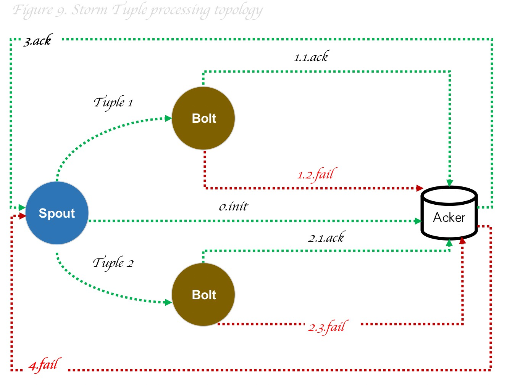

从Spout源端发送Tuple数据到到下游Bolt算子,并且也会告知Acker相关信息,如果整个Tuple树中某个节点处理完了,也会告知Acker相关信息,不论是成功还是失败都会告知,最后只有所有的Bolt都处理成功,那么Acker就会通知Tuple成功,如果过程中有失败情况Acker也会告知Spout端判断是否进行消息重传;

[Send Tuple data from the Spout source to the downstream Bolt operator, and also inform Acker of related information. If a node in the entire Tuple tree is processed, it will also inform Acker of related information, whether it succeeds or fails. All Bolts are processed successfully, then Acker will notify Tuple of success, and if there is a failure in the process, Acker will also tell Spout to determine whether to retransmit the message;]:#

## Pulsar

&nbsp;&nbsp;&nbsp;&nbsp; Pulsar是 Yahoo 2016 捐献给Apache,并与2018年成为Apache 顶级项目.为什么要说这个项目呢,因为几年Pulsar 社区发展很快,并且也成立了开源基础软件公司运作. Pulsar是云原生、多租户、存算分离、弹性扩展的分布式流式处理平台.

[&nbsp;&nbsp;&nbsp;&nbsp; Pulsar was donated to Apache by Yahoo in 2016, and became the top-level project of Apache in 2018. Why do I say this project, because the Pulsar community has developed rapidly in recent years, and an open source basic software company has also been established to operate . Pulsar is a cloud-native, multi-tenant, storage-computing separation, and elastically scalable distributed stream processing platform.]:#

&nbsp;&nbsp;&nbsp;&nbsp; Pulsar 中的 Exactly Once 语义是实现了消息去重和重复数据删除机制实现的.

[&nbsp;&nbsp;&nbsp;&nbsp; The Exactly Once semantics in Pulsar implements the mechanism of message deduplication and deduplication.]:#

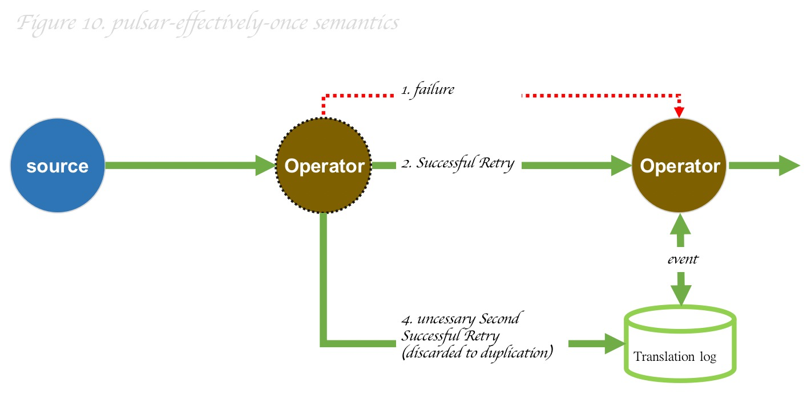

在分布式系统中,会出现各种问题(网络、磁盘、电源)等等,如上图所示当第一个操作给下游传递数据的时候,第一次失败了,那么系统会进行第二次重试成功(成功一次),但是系统都是分布式或者说下游的操作业务逻辑还没有来得及反馈给上游,那么系统会在此进行重试也成功了(成功两次),那么这个时候下游就已经知道已经处理过一次(全局性事务TxnID,pulsar 事务 ID 为 128 位),那么就会丢弃并把响应的信息反馈记录到事务日志中,那么当前下游的上游节点就会去日志里面删除多余的处理记录,从而达到操作“恰好一次”,不会多给也不会少给.

[In a distributed system, there will be various problems (network, disk, power supply), etc. As shown in the figure above, when the first operation fails to pass data to the downstream, the system will perform the second operation. The retry is successful (successful once), but the system is distributed or the downstream operation business logic has not had time to feed back to the upstream, then the system will retry here successfully (successfully twice), then at this time the downstream will It is known that it has been processed once (global transaction TxnID, pulsar transaction ID is 128 bits), then it will be discarded and the response information will be recorded in the transaction log, then the current downstream upstream node will go to the log to delete the excess Process the records so that the operation is "exactly once", neither over nor under.]:#

## Kafka

&nbsp;&nbsp;&nbsp;&nbsp; Kafka 中的 Exactly Once 语义是使用事务机制,事务支持跨多个分区的原子写入,并且在结合重复数据删除机制来保证的.

[&nbsp;&nbsp;&nbsp;&nbsp; The Exactly Once semantics in Kafka uses a transaction mechanism, which supports atomic writes across multiple partitions, and is guaranteed in combination with a data deduplication mechanism.]:#

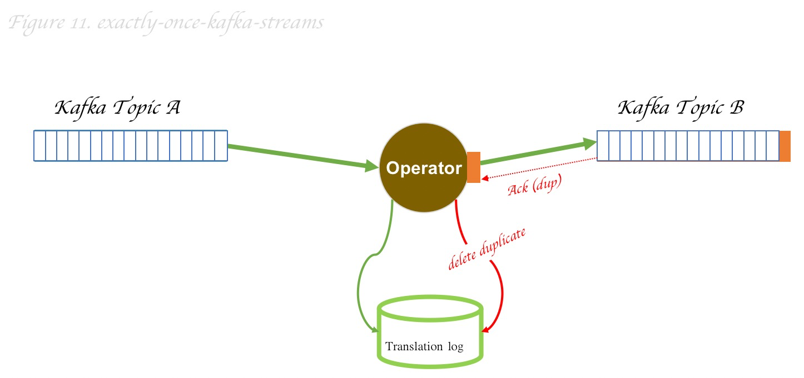

Kafka在一个事务中,单个分区或者跨分区都是原子性的,因此每个操作都会有一个全局性的事务ID,如果一个事务ID被生产者发送多次,那么当消息kafka的消费者broker时候会知道是重复消息,它将忽略该记录并返回一个 DUP响应给客户端,并且会删除重复日志信息.

[Kafka is atomic for a single partition or across partitions in a transaction, so each operation will have a global transaction ID. If a transaction ID is sent multiple times by the producer, then when the message Kafka consumer broker will know that it is a duplicate message, it will ignore the record and return a DUP response to the client, and will delete the duplicate log information.]:#

# 结论
[# Conclusion]:#

&nbsp;&nbsp;&nbsp;&nbsp; 本文主要是简单说明下消息处理语义中 At-Most-Once、At-least-Once、Exactly-Once 三种实现原理和思路以及为什么要有这三种,不同的处理语义机制和当前组件想要到达到的目标是紧密相关的.有性能优先的(At-Most-Once)、消息不丢失但要解决幂等(At-least-Once)、强保证的(Exactly-Once),不同实现思路的难度和应用场景.并且也分析了当前主流的几个分布式流批处理框架和流式处理消息中间件的相应的内部语义实现机制.

[&nbsp;&nbsp;&nbsp;&nbsp; This article is mainly to briefly explain the three implementation principles and ideas of At-Most-Once, At-least-Once and Exactly-Once in message processing semantics and why there are these three, different processing The semantic mechanism is closely related to the goal that the current component wants to achieve. There are performance priorities (At-Most-Once), messages are not lost but idempotent (At-least-Once), and strongly guaranteed (Exactly- Once), the difficulty and application scenarios of different implementation ideas. And also analyzed the corresponding internal semantic implementation mechanism of several current mainstream distributed stream batch processing frameworks and stream processing message middleware.]:#

 

### [back](./)
