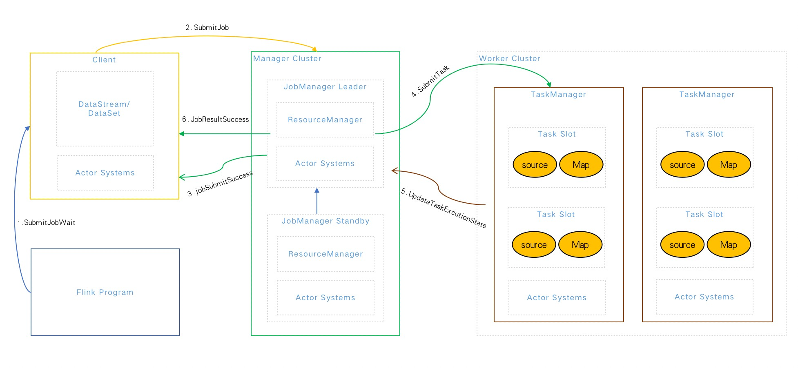
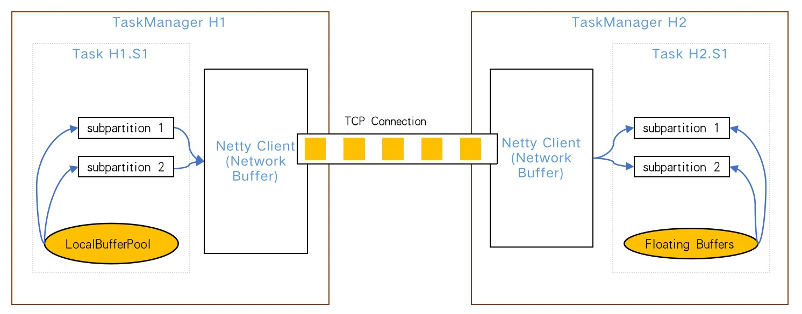
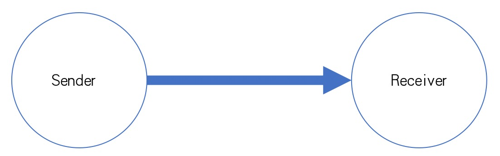
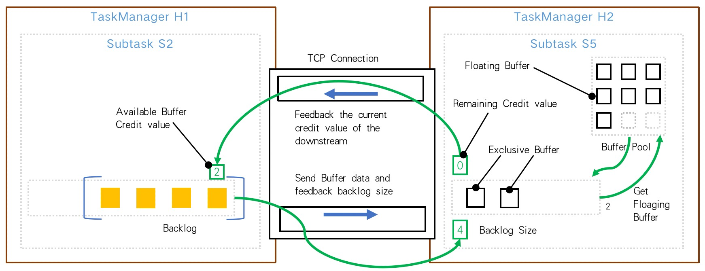
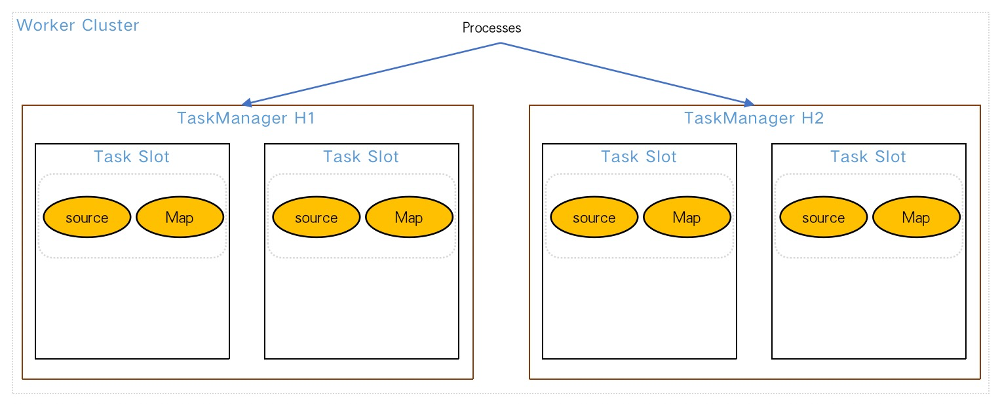
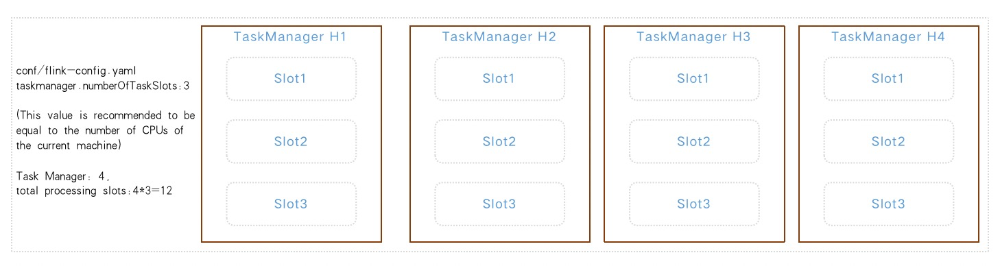
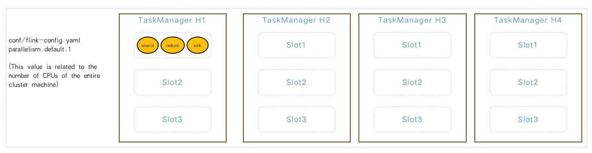
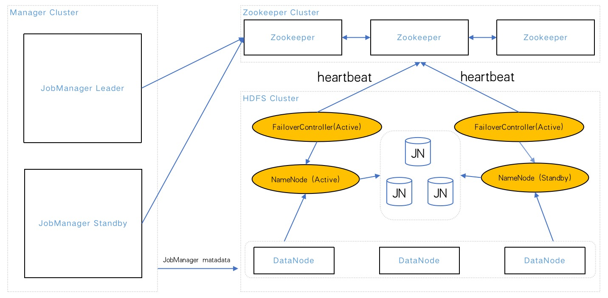
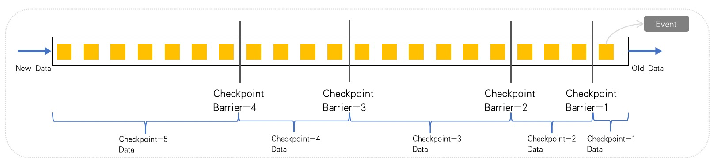

<h1 style="color:#606c71;text-align:center;" >聊聊Flink流批一体中的"三高"</h1> 

[<h1 style="color:#606c71;text-align:center;" >Talk about the three highs in the integration of flink streaming and batching</h1> ]:#

[
]:#
[]:#
[
]:#

>  &nbsp;&nbsp;&nbsp;&nbsp; 此处所说的"三高"非彼"[三高](https://baike.baidu.com/item/三高/2898551)"(😂)哦,软件发展迭代历史过程中一直有三个追求目标:高性能、高并发、高可用,俗称三高.三者既有区别也有联系,从软件发展历史来看,我个人认为的发展历程是高性能(单核)->高并发(多核)->高可用(多机). 
>  &nbsp;&nbsp;&nbsp;&nbsp; 当然是首先高性能,从很老的DOS为单用户操作系统,到后来的Window98是一个多任务系统(实际还是单进程),在到后来UNIX支持多用户多任务操作系统(真正意义的多进程、多线程系统),目的都是在一个CPU的情况下怎样最高性能的处理程序. 
>  &nbsp;&nbsp;&nbsp;&nbsp; 其次才是高并发,需要突破的当然是单机处理极限.单机如果内存或者CPU不足,可以通过纵向扩展来提高单个机器的硬件配置从而达到并发的最大化,单核变多核,这样就能同时并行多个任务,从而加速处理的总时间成本. 
>  &nbsp;&nbsp;&nbsp;&nbsp; 那么当单机处理的性能达到一定的瓶颈的时候,这时候就必须横向扩展,就是发展分布式,分布式就涉及到高可用,就是必须考虑单个节点挂掉的可能性,业界通常的中间件部署3个节点,也就是为了高可用而设计的. 
>  

[>  &nbsp;&nbsp;&nbsp;&nbsp; The "three highs" mentioned here are not "??three hights??(https://baike.baidu.com/item/三高/2898551)"(😂) Oh,there have always been three pursuit goals in the iterative history of software development: high performance, high concurrency, and higt availability, commonly known as three hights. The there are both different and related. From the perspective of software development history, I personally think that the development process is high performance ( Single core) -> high concurrency (multi-core) -> high availability (multi-machine). ]:#
[>  &nbsp;&nbsp;&nbsp;&nbsp; Of course, it is high performance first. From the very old DOS as as single-user operating system, to the later Window98 as a multi-tasking system (actually a single process), and later UNIX supports a multi-user multi-tasking operating system (the real meaning of multi-process, multi-threaded system),the purpose is how to process the program with the highest performance in the case of a CPU.]:#
[>  &nbsp;&nbsp;&nbsp;&nbsp; The second is high concurrency. Of course, what needs to the broken is the processing limit of a single machine. If the memory of CPU of a single machine is insufficient, the hardware configuration os a single machine can be increased  by vertical expansion to maximize concurrency, and single-core becomes multi-core, so that parallelism can be achieved at the same time. Multiple tasks, thereby speeding up the overall thime cost of processing. ]:#
[>  &nbsp;&nbsp;&nbsp;&nbsp; Then when the performance of the single-machine processing reaches a certain bottleneck, it must scale horizontally, that is, to develop and distributed involves high availability, that is, the possibility of a single node hanging up must be considered. The industry's usual middleware deployment 3 nodes, which is designed for high availability.  ]:#
[>  ]:#

Flink基本架构和执行流程

[Flink architecture and process]:#

Flink中所有分布式RPC通信都是借助于[Akka框架](https://doc.akka.io/docs/akka/current/general/terminology.html)(一款高性能、高容错性的分布式并发应用框架).
* Flink Program：使用CLI、WebUI、Code(Java&Scala) 提交任务等;
* Client：使用DataStream(流计算)、DataSet(批计算)进行业务逻辑开发等;
* JobManager：负责是资源的分配、CheckPoint的协调、任务状态维护等(JobManager Standby需要借助Zookeeper或者Yarn来实现);
* TaskManager：相当于Slave,负责具体的任务执行和以及对应任务在每个节点的资源申请和管理等;

[All distributed RPC communication in Flink relies on the ??Akka framework??(https://doc.akka.io/docs/akka/current/general/terminology.html) (a high-performance, fault-tolerant distributed Concurrent Application Framework).]:#
[* Flink Program: Submit tasks using CLI, WebUI, Code(Java&Scala), etc.;]:#
[* Client: Use DataStream (stream computing), DataSet (batch computing) for business logic development, etc.;]:#
[* JobManager: Responsible for resource allocation, CheckPoint coordination, task stats maintenance, etc. (JobManager Standby needs to be implemented with Zookeeper or Yarn); ]:#
[* TaskManager: equivalent to Slave, responsible for specific task execution and resource application and management of corresponding tasks in echo node, etc.]:#

# 高性能

[# High Performance]:#

## Flink缓存机制

[## Flink Cache Mechanism]:#

### 分布式缓存

[### Distributed Cache]:#

&nbsp;&nbsp;&nbsp;&nbsp; 在批计算中,需要处理的数据大部分来自外部文件,这些文件可能来自类似于HDFS系统,也可以是类似于AWS中S3文件系统中,但是Flink并不像MapReduce一样可以让计算随着数据所在的位置上而进行,因此多数情况下会出现网络频繁地复制文件的情况.因此对于有些高频使用的文件可以通过使用Flink内部提供的一种分布式缓存机制,将其放置在每台计算节点实例的本地内存中,可以使用户在并行函数中很方便的读取本地文件,并把它放在taskmanager节点中,防止task重复拉取.此缓存的工作机制是程序注册一个文件或者目录(本地或者远程文件系统，例如hdfs或者s3),通过ExecutionEnvironment注册缓存文件并为它起一个名称。然后当程序执行,Flink自动将文件或者目录复制到所有taskmanager节点的本地文件系统,仅会执行一次.用户可以通过这个指定的名称查找文件或者目录,然后从taskmanager节点的本地文件系统访问它.其实分布式缓存就相当于消息队列中的广播模式,把一个变量广播到所有的taskmanager上,只不过这里广播的是一个文件.这样就能有效的避免因为读取某些文件而必须通过远程网络获取文件内容的情况,进而提升整个任务的执行效率.

[&nbsp;&nbsp;&nbsp;&nbsp; In batch computing, most of the data to be processed comes from external files, which may come from systems like HDFS or S3 file systems in AWS, but Flink is not like MapReduce In the same way, the calculation can be performed with the location of the data, so in most cases, the network frequently copies files. Therefore, for some frequently used files, you can use a distributed cache mechanism provided  by Flink internally, Placing it in the local memory of each computing node instance allows users to easily read the local file in parallel functions, and put it in the taskmanager node to prevent tasks from being repeatedly pulled. The working mechanism of this cache is The program registers a file or directory (local or remote file system, such as hdfs or s3), registers the cache file with the ExecutionEnvironment and  gives it a name. Then when the program is executed, Flink automatically copies the file or directory to the local file system of all taskmanager nodes, which will only be executed once. Users can search for the file or directory by this specified name, and then access it from the local file system of the taskmanager node. In fact The distributed cache is equivalent to the broadcast mode in the message queue, which broadcasts a variable to all taskmanagers, except that a file is broadcast here. This can effectively avoid reading some files and having to obtain them through a remote network The situation of the file content, thereby improving the execution efficiency of the entire task. ]:#

### Network Buffer

&nbsp;&nbsp;&nbsp;&nbsp; Network Buffer就是在网络传输中使用到的 Buffer(实际非网络传输也会用到).了解 Flink 网络栈的同学应该会比较清楚,Flink 经过网络传输的上下游 Task 的设计会比较类似生产者-消费者模型.如果没有这个缓冲区,那么生产者或消费者会消耗大量时间在等待下游拿数据和上游发数据的环节上.加上这个缓冲区,生产者和消费者解耦开,任何一方短时间内的抖动理论上对另一方的数据处理都不会产生太大影响.

[&nbsp;&nbsp;&nbsp;&nbsp; Network Buffer is the Buffer used in network transmission (actually non-network transmission will also be used). Students who understand the Flink network stack should know better that Flink transmits the upstream and downstream tasks through the network. The design will be similar to the producer-consumer model. Without this buffer, the producer or consumer will spend a lot of time waiting for the downstream to get data and the upstream to send data. With this buffer, the producer and consumer In theory, the jitter of one party in a short time will not have much impact on the data processing of the other party.]:#

  
在 Flink 中有三种情况下 Netty 服务器可以消费缓存：
* 缓冲区满后刷新
* 缓冲区超时后刷新
* 特殊事件后刷新

[There are three situations in Flink where the Netty server can consume the cache:]:#
[* Refrsh when the buffer is full]:#
[* Refresh after buffer timeout]:#
[* Refresh after special events]:#

## Flink反压机制

[## Flink back pressure machanism ]:#

先说一下什么是反压,如下图:

[Let's about what back pressure is, as shown below:]:#

&nbsp;&nbsp;&nbsp;&nbsp; 正常情况下消息处理速度(Receiver)>=消息的发送速度(Sender),就不会发送消息拥堵.系统运行流畅,但是当消息发送的太快,消息接受的太慢,产生消息拥堵,如果系统可以自动降低消息发送的速度,这就是反压机制.

&nbsp;&nbsp;&nbsp;&nbsp;Flink 如何在吞吐量和延迟之间做权衡呢?在流式处理系统中,如果出现下游消费的速度跟不上上游生产数据的速度,就种现象就叫做反压.出现反压时,理所应当限制上游生产者的速度,使得下游的速度跟得上上游的速度.反压会导致流处理作业数据延迟的增加,同时还会影响到Checkpoint.Flink 天然支持流式处理,即每来一条数据就能处理一条,而不是像 Spark Streaming 一样,完全是微批处理.但是为了提高吞吐量,默认使用的 Flink 并不是每来一条数据就处理一条.那这个到底是怎么控制的呢?Flink 是使用了高效有界的分布式阻塞队列.

[&nbsp;&nbsp;&nbsp;&nbsp; Under normal circumstances, if the message processing speed (Receiver) >= the message sending speed (Sender), there will be no message congestion. The system runs smoothly, but when the message is sent too fast, the message is received too slowly, resulting in message congestion. It can automatically reduce the speed of message sending, which is the back pressure mechanism.]:#

[&nbsp;&nbsp;&nbsp;&nbsp;How does Flink trade off between throughput and latency? In a streaming system, if the speed of downstream consumption cannot keep up with the speed of upstream production data, this phenomenon is called back pressure .When backpressure occurs, it is reasonable to limit the speed of upstream producers so that the downstream speed can keep up with the upstream speed. Backpressure will increase the data delay of stream processing jobs, and will also affect Checkpoint. Flink naturally supports streaming It can process one piece of data every time it comes, instead of a complete micro-batch like Spark Streaming. However, in order to improve throughput, the default Flink used does not process one piece of data every time. How to control it? Flink uses an efficient and bounded distributed blocking queue.]:#

&nbsp;&nbsp;&nbsp;&nbsp;例如,上游 Subtask S2 发送完数据后，还有 4 个 Buffer 被积压,那么会把发送数据和 Backlog size = 4 一块发送给下游 Subtask S5,下游接受到数据后,知道上游积压了 4 个Buffer,于是向 Buffer Pool 申请 Buffer,由于容量有限,下游 InputChannel 目前仅有 2 个 Buffer 空间,所以,Subtask S6 会向上游 Subtask S2 反馈 Channel Credit = 2.然后上游下一次最多只给下游发送 2 个 Buffer 的数据,这样每次上游发送的数据都是下游 InputChannel 的 Buffer 可以承受的数据量,所以通过这种反馈策略,保证了不会在共用的 Netty 和 TCP 这一层数据堆积而影响其他 Subtask 通信.

[&nbsp;&nbsp;&nbsp;&nbsp;For example, after the upstream Subtask S2 sends data, there are still 4 Buffers that are backlogged, then the sent data and Backlog size = 4 will be sent to the downstream Subtask S5. After receiving the data, the downstream knows There is a backlog of 4 Buffers in the upstream, so apply for Buffers from the Buffer Pool. Due to the limited capacity, the downstream InputChannel currently has only 2 Buffer spaces. Therefore, Subtask S6 will feedback Channel Credit = 2 to the upstream Subtask S2. Then the upstream will only give at most the next time. The data of 2 Buffers is sent downstream, so that the data sent upstream each time is the amount of data that the Buffer of the downstream InputChannel can bear. Therefore, through this feedback strategy, it is ensured that data will not accumulate in the shared Netty and TCP layers. Affects other Subtask communications.]:#

如何定位反压:

[How to locate back pressure:]:#

* [Monitoring Back Pressure](https://nightlies.apache.org/flink/flink-docs-release-1.14/docs/ops/monitoring/back_pressure/)
* [Monitoring, Metrics](https://flink.apache.org/2019/07/23/flink-network-stack-2.html)

## Flink内存管理

[## Flink Memory Management]:#

&nbsp;&nbsp;&nbsp;&nbsp;针对内存管理,Flink实现的自身的独立内存机制(堆外内存),这样的好处就是尽可能减少JVM GC对系统的影响.Java 生态圈提供了众多的序列化框架:Java serialization, Kryo, Apache Avro 等等.但是 Flink 实现了自己的序列化框架,Flink通过序列化和反序列化将所有的数据对象转换成二进制在内存中存储,降低数据存储大小的同时,能够更加有效地对内存空间进行利用,降低GC带来的性能下降或者任务特殊异常等问题,因此Flink较为其他分布式框架共用JVM内存会显得更加稳定,不会因为JVM GC等问题而影响整个应用的运行状态.

[&nbsp;&nbsp;&nbsp;&nbsp;For memory management, Flink implements its own independent memory mechanism (out-of-heap memory), which has the advantage of minimizing the impact of JVM GC on the system. The Java ecosystem provides many serialization frameworks : Java serialization, Kryo, Apache Avro, etc. But Flink implements its own serialization framework. Flink converts all data objects into binary and stores them in memory through serialization and deserialization. While reducing the size of data storage, it can More effective use of memory space, reducing performance degradation or special task exceptions caused by GC, so Flink will be more stable than other distributed frameworks sharing JVM memory, and will not affect the entire application due to JVM GC and other problems. Operating status.]:# 

* 堆外内存的好处:超大内存的分配不受GC影响、堆外内存在写磁盘或网络传输时是 zero-copy、堆外内存是进程间共享;
* 堆外内存的坏处:内存管理更加复杂(需要自己分配和释放)、分配速度比堆内内存要慢、短生命期的内存分配效率不高;

[* Benefits of off-heap memory: allocation of very large memory is not affected by GC, off-heap memory is zero-copy when writing to disk or network transmission, off-heap memory is shared between processes;]:#
[* Disadvantages of off-heap memory: memory management is more complicated (need to allocate and release by yourself), the allocation speed is slower than on-heap memory, and the efficiency of short-lived memory allocation is not high;]:#

# 高并发

[High Concurrency]:#

## Akka框架

[## Akka Framework]:#

&nbsp;&nbsp;&nbsp;&nbsp;前面我们提到,Flink中所有分布式RPC通信都是借助于[Akka框架](https://doc.akka.io/docs/akka/current/general/terminology.html),Flink从0.9版本采用的[Akka分布式通信](https://cwiki.apache.org/confluence/display/FLINK/Akka+and+actors)的实现.有了Akka,所有的远程过程调用(RPC)被实现成异步消息.这主要影响了JobManager、TaskManager和JobClient三个组件.未来,很可能更多的组件将被转换成一个actor,使它们可以发送和处理异步消息.

[&nbsp;&nbsp;&nbsp;&nbsp;As we mentioned earlier, all distributed RPC communication in Flink relies on the ??Akka framework??(https://doc.akka.io/docs/akka/current/general/terminology .html), the implementation of ??Akka distributed communication??(https://cwiki.apache.org/confluence/display/FLINK/Akka+and+actors) adopted by Flink from version 0.9. With Akka, all Remote Procedure Calls (RPC) are implemented as asynchronous messages. This mainly affects the three components JobManager, TaskManager and JobClient. In the future, it is likely that more components will be converted into an actor, allowing them to send and process asynchronous messages.]:#

&nbsp;&nbsp;&nbsp;&nbsp;Akka主要特性:
* 高并发与分布式:主要是Akka Streams API实行
* 弹性设计可扩展:基于Akka Cluster库和Cluster Sharding机制
* 容错机制:Akka 的容错机制是基于层次结构
* 去中心化:没有单点故障的分布式系统,自动负载和跨节点自适应路由
* Actors模型:Actor模式是一种并发模型,与另一种模型共享内存完全相反，Actor模型share nothing,这个模型发展有些年代了,简单理解就是流水线,这在流式计算场景中非常适合.
* 事务性 Actors:基于CRDT保证最终一致性
* 支持 JAVA 与 Scala:同时支持这两种语言的API库
* 高性能:单台机器上高达 5000 万条消息/秒。内存占用小；每 GB 堆约 250 万个 actor

[&nbsp;&nbsp;&nbsp;&nbsp;Akka main features:]:#
[* High concurrency and distribution: mainly implemented by Akka Streams API.]:#
[* Elastic design is scalable: based on Akka Cluster library and Cluster Sharding mechanism.]:#
[* Fault tolerance: Akka's fault tolerance is based on a hierarchy.]:#
[* Decentralization: Distributed systems with no single point of failure, automatic load and adaptive routing across nodes.]:#
[* Actors model: Actor mode is a concurrency model, which is completely opposite to another model of sharing memory. Actor model shares nothing. This model has been developed for some years. Simple understanding is pipeline, which is very suitable in streaming computing scenarios. ]:#
[* Transactional Actors: Guaranteed eventual consistency based on CRDT.]:#
[* Supports JAVA and Scala: API library that supports both languages.]:#
[* High performance: up to 50 million messages/sec on a single machine. Small memory footprint; ~2.5M actors per GB heap.]:#

## 低延迟

[## Low Latency]:#

&nbsp;&nbsp;&nbsp;&nbsp; 这个基本也是利用有界的分布式阻塞队列,也就是利用反压机制而做到低延迟并提高响应速度,从而达到提高并发数;

[&nbsp;&nbsp;&nbsp;&nbsp; This basically also uses a bounded distributed blocking queue, that is, using a backpressure mechanism to achieve low latency and improve response speed, thereby increasing the number of concurrency;]:#

## Flink并发执行

[## Flink Concurrently Executes ]:#

&nbsp;&nbsp;&nbsp;&nbsp; 说到并发执行,就不得不说Flink中的slot和parallelism,我们先来了解下slot和parallelism的关系.

&nbsp;&nbsp;&nbsp;&nbsp; 下面图片中有两个 Task Manager,每个 Task Manager 有2个 slot,这样我们的算子最大并行度那么就可以达到 4 个,在同一个 slot 里面可以执行 1 至多个子任务.

[&nbsp;&nbsp;&nbsp;&nbsp;When it comes to concurrent execution, we have to talk about slot and parallelism in Flink. Let's first understand the relationship between slot and parallelism]:#

[&nbsp;&nbsp;&nbsp;&nbsp; There are two Task Managers in the image below, each with 2 slots, so that the maximum parallelism of our operators can reach 4, and 1 to multiple subtasks can be executed in the same slot.]:#

### slot是指taskmanager的并发执行能力
&nbsp;&nbsp;&nbsp;&nbsp;下图所示:taskmanager.numberOfTaskSlots:3;即每一个 taskmanager 中的分配 3 个 TaskSlot,4 个 taskmanager 一共有 12 个 TaskSlot.

[### slot refers to the concurrent execution capability of taskmanager]:#
[&nbsp;&nbsp;&nbsp;&nbsp;As shown in the figure below: taskmanager.numberOfTaskSlots:3; That is, each taskmanager is allocated 3 TaskSlots, and 4 taskmanagers have a total of 12 TaskSlots.]:#

### parallelism是指taskmanager实际使用的并发能力
&nbsp;&nbsp;&nbsp;&nbsp; 下图所示:parallelism.default:1;即运行程序默认的并行度为 1,12个 TaskSlot 只用了 1 个,有 11 个空闲,设置合适的并行度才能提高效率.

[### parallelism refers to the concurrency capability actually used by taskmanager]:#
[&nbsp;&nbsp;&nbsp;&nbsp; As shown in the figure below: parallelism.default:1; That is, the default parallelism of the running program is 1, only 1 of the 12 TaskSlots are used, and 11 are idle. Setting the appropriate parallelism can improve efficiency.]:#

可以这么理解上面两个概念:
* slot决定taskmanager了有多少个slot,每个任务代表分配给任务槽的一组资源,slot 在 Flink 里面可以认为是资源组,Flink 将每个任务分成子任务并且将这些子任务分配到 slot 来并行执行程序.
* parallelism决定了taskmanager可以并行运行多少个,可以理解为并发线程数或者并发算子数.

我们尽可能地不从系统上设置，而是针对不同的任务，自己内部设置。所以设置parallelism的防范优先级是：
算子(operator)级别 > 运行环境级别 > 客户端级别 > 系统级别

[The above two concepts can be understood as follows:]:#
[* Slot determines how many slots the taskmanager has. Each task represents a set of resources allocated to the task slot. A slot can be considered as a resource group in Flink. Flink divides each task into subtasks and assigns these subtasks to slots. Execute programs in parallel.]:#
[* Parallelism determines how many taskmanager can run in parallel, which can be understood as the number of concurrent threads or the number of concurrent operators.]:#

[We try not to set it from the system as much as possible, but to set it internally for different tasks. So the precautionary priority for setting parallelism is:]:#
[Operator level > Runtime environment level > Client level > System level]:#

# 高可用
[# High Availability]:#

## JobManager高可用
&nbsp;&nbsp;&nbsp;&nbsp; 目前Flink高可用可以支持Standalone Cluster和Yarn Cluster两种集群模式,同时Flink高可用主要针对的是JobManager,因为JobManager是整个集群的管理节点,负责整个集群的任务调度、任务分配、资源管理等,如果JobManager出现问题那么将会导致新的Job无法提交,并且已经存在的Job也会全部失败,因此对JobManager的高可用保证就显得尤为重要,Flink默认是不开启JobManager高可用配置的,(留个小问题,如果是Kubernetes呢!).

### Standalone Cluster
&nbsp;&nbsp;&nbsp;&nbsp; Flink在Standalone集群中高可用主要是借助Zookeeper来实现的,并且还需要一个文件系统,如hdfs等(用来存储JobManager的元数据).JobManager的服务信息会被注册到Zookeeper中,并通过[Zookeeper](https://nightlies.apache.org/flink/flink-docs-master/docs/deployment/ha/zookeeper_ha/)完成JobManager Leader的选举.Standalone集群会同时存在多个JobManager,但是只有一个提供服务,其他处于Standby状态,当Active JobManager失去连接后(节点消失或者网络超时等),Zookeeper会自动从其他Standby列表中选举一个新的JobManager来接管Flink集群并提供服务.

[## JobManager high availability]:#
[&nbsp;&nbsp;&nbsp;&nbsp; Currently Flink high availability can support Standalone Cluster and Yarn Cluster two cluster modes, and Flink high availability is mainly aimed at JobManager, because JobManager is the management node of the entire cluster, responsible for task scheduling, Task allocation, resource management, etc. If there is a problem with the JobManager, the new job will not be submitted, and the existing jobs will all fail. Therefore, the high availability guarantee of the JobManager is particularly important. Flink does not enable the JobManager high availability by default. Configurable, (Leave a small question, what about Kubernetes!).]:#

[### Standalone Cluster]:#
[&nbsp;&nbsp;&nbsp;&nbsp; In Zookeeper, and through ??Zookeepe??(https://nightlies.apache.org/flink/flink-docs-master/docs/deployment/ha/zookeeper_ha/) to complete the election of the JobManager Leader. There will be multiple JobManagers in the Standalone cluster at the same time , but only one provides services, and the others are in the Standby state. When the Active JobManager loses connection (node ​​disappears or network timeout, etc.), Zookeeper will automatically elect a new JobManager from the other Standby lists to take over the Flink cluster and provide services.]:#

### Yarn Cluster

&nbsp;&nbsp;&nbsp;&nbsp; Flink Yarn Session集群模式的高可用是依赖Yarn协助进行,主要因为是Yarn本身对运行在其上面的的应用具有一定的容错保证.Flink On Yarn 的模式其实就是将Flink JobManager执行在ApplicationMaster所在的容器中,同时Yarn也不会启动多个JobManager(和zookeeper机制有点相似),但是不是通过zookeeeper选举来决定那个Standby成为Leader,而是通过重启的方式保证JobManager的高可用.

[### Yarn Cluster]:#

[&nbsp;&nbsp;&nbsp;&nbsp; The high availability of the Flink Yarn Session cluster mode relies on the assistance of Yarn, mainly because Yarn itself has a certain fault tolerance guarantee for the applications running on it. The Flink On Yarn mode is actually a The JobManager is executed in the container where the ApplicationMaster is located, and Yarn will not start multiple JobManagers (similar to the zookeeper mechanism), but it does not decide which Standby becomes the Leader through zookeeper election, but ensures the high availability of the JobManager by restarting.]:#

## Checkpoints和Savepoints机制

&nbsp;&nbsp;&nbsp;&nbsp; 我们都知道出了独立的组件需要高可用外,task也需要高可用,比如异常情况或者机器扩容升级等情况,这个时候就需要系统提供一些机制来保证当前正在运行的task的计算状态能够做到语义保证或者说类似的事务保证机制,Flink对于task提供2种方式,一种是自动(Checkpoints)和手动(Savepoints).[Savepoint different from a Checkpoint?](https://nightlies.apache.org/flink/flink-docs-master/docs/ops/state/savepoints/).

[## Checkpoints and Savepoints mechanism]:#

[&nbsp;&nbsp;&nbsp;&nbsp; We all know that independent components need high availability, and tasks also need high availability, such as abnormal situations or machine expansion and upgrades. The computing state of the task can achieve semantic guarantee or a similar transaction guarantee mechanism. Flink provides two methods for tasks, one is automatic (Checkpoints) and manual (Savepoints). ??Savepoint different from a Checkpoint???(https: //nightlies.apache.org/flink/flink-docs-master/docs/ops/state/savepoints/).]:#

&nbsp;&nbsp;&nbsp;&nbsp; [Checkpoints](https://nightlies.apache.org/flink/flink-docs-master/docs/ops/state/checkpoints/)是保存点的意思,就是说Flink会在输入的数据集上或者说过程中间隔性的生成Checkout barrier(分界点),通过barrier把间隔时间内的数据分到对应的保存点中,这样当应用出现异常情况时,就能够从上次的快照中中恢复task之前的状态,但是当前状态的空间大小和应用有直接关系,如果当前计算的任务很大,那么保存的时间就会很长,并且也会影响吞吐量.checkout的保存点的支持Memory、FileSystem、RocksDB,但是数据通常保存在JobManager节点上或者HDFS上,性能差异Memory>FileSystem>RocksDB(性能最差),支持三种设置(全局、任务、实例)级别.

[&nbsp;&nbsp;&nbsp;&nbsp; ??Checkpoints??(https://nightlies.apache.org/flink/flink-docs-master/docs/ops/state/checkpoints/) means save points, which means that Flink will Checkout barriers (demarcation points) are generated at intervals on the input data set or in the process, and the data in the interval time is divided into corresponding save points through the barrier, so that when an abnormal situation occurs in the application, it can start from the last time. The state before the task is restored in the snapshot, but the space size of the current state is directly related to the application. If the current computing task is large, the saving time will be very long, and it will also affect the throughput. Supports Memory, FileSystem, RocksDB, but the data is usually stored on the JobManager node or HDFS, the performance difference is Memory>FileSystem>RocksDB (the worst performance), and three settings (global, task, instance) levels are supported.]:#

如图所示,总共有4个保存点:
* 第一个Checkpoint保存1个Event
* 第二个Checkpoint保存3个Event
* 第三个Checkpoint保存6个Event
* 第四个Checkpoint保存4个Event

新的数据因为时间还没到因此暂时不会触发定时任务去保存Checkpoint.

[As shown, there are a total of 4 savepoints:]:#
[* The first Checkpoint saves 1 Event]:#
[* The second Checkpoint saves 3 Events]:#
[* The third Checkpoint saves 6 Events]:#
[* The fourth Checkpoint saves 4 Events]:#

[The new data will not trigger the scheduled task to save the Checkpoint because the time has not yet come.]:#

Checkpoint机制

[Checkpoint mechanism]:#

&nbsp;&nbsp;&nbsp;&nbsp;[Savepoints](https://nightlies.apache.org/flink/flink-docs-master/docs/ops/state/savepoints/)其实就是检查点的一种特殊实现,底层还是使用Checkpoints机制,只不过Savepoints是用户以手动的方式触发,并将数据持久化到指定的存储路径,主要目的是系统升级或者集群维护过程中的状态数据,避免因为停机运维或者正常终止等操作而导致系统无法恢复到原有的计算状态的情况.

[&nbsp;&nbsp;&nbsp;&nbsp; ??Savepoints??(https://nightlies.apache.org/flink/flink-docs-master/docs/ops/state/savepoints/) is actually a special implementation of checkpoints. The Checkpoints mechanism is still used, except that Savepoints are manually triggered by the user and persist the data to the specified storage path. The main purpose is the status data in the process of system upgrade or cluster maintenance, avoiding operation and maintenance due to downtime or normal termination, etc. The system cannot be restored to the original computing state due to the operation.]:#

# 结论

&nbsp;&nbsp;&nbsp;&nbsp;本文主要分析了和讨论Flink在流式计算的一些技术和机制,Flink是目前开源社区中唯一一套集高吞吐、低延迟、高性能三者于一身的分布式流式数据处理框架.像Apache Spark也只能兼顾高吞吐和高性能特性,主要因为在Spark Streaming流式计算中无法做到低延迟保障(因为Spark Streaming 对低延迟支持不足);而流式计算框架Apache Storm只能支持低延迟和高性能特性,但是无法满足高吞吐(框架本身和语义逻辑)的要求;而满足高吞吐、低延迟、高性能这三个目标对分布式流式计算框架来说是非常重要.

[# Conclusion]:#

[&nbsp;&nbsp;&nbsp;&nbsp;This article mainly analyzes and discusses some technologies and mechanisms of Flink in stream computing. Flink is the only set of distribution in the open source community that integrates high throughput, low latency and high performance Streaming data processing framework. Like Apache Spark, it can only take into account the characteristics of high throughput and high performance, mainly because there is no guarantee of low latency in Spark Streaming stream computing (because Spark Streaming does not support low latency); while streaming The computing framework Apache Storm can only support low-latency and high-performance features, but it cannot meet the requirements of high throughput (the framework itself and semantic logic); while satisfying the three goals of high throughput, low latency, and high performance is critical to the distributed stream computing framework is very important.]:#

 

### [back](./)
