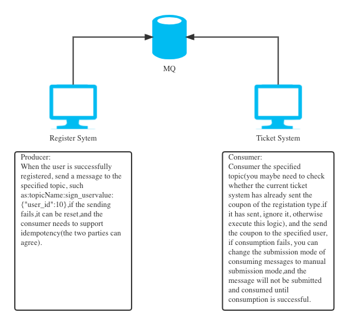
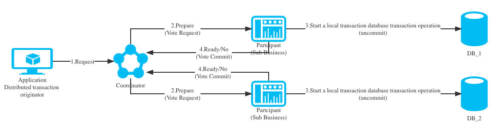
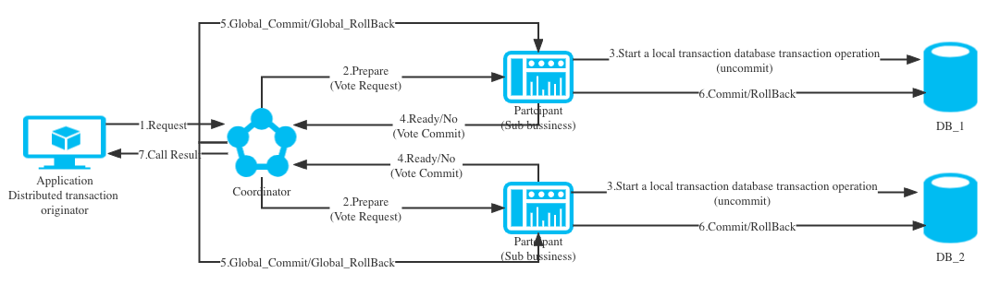
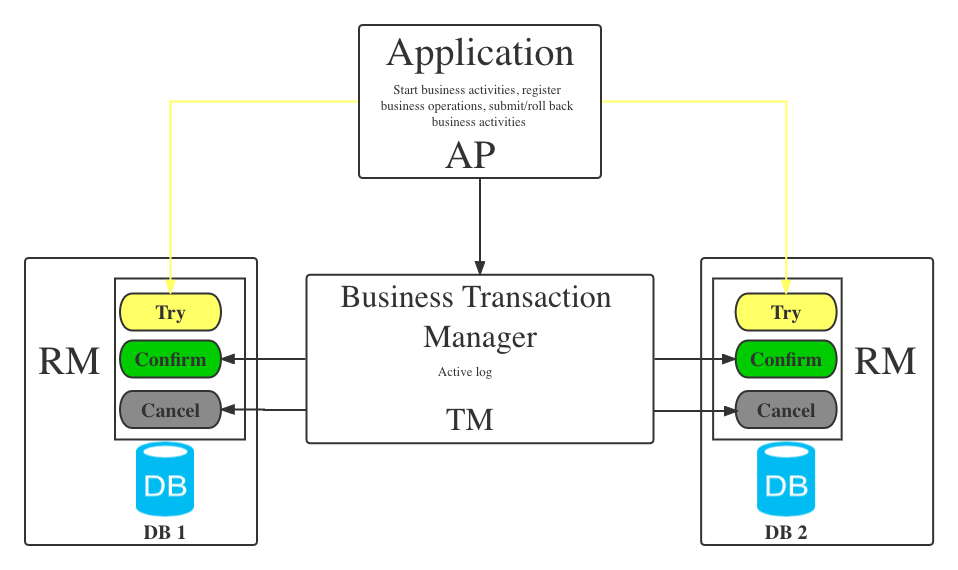

<h1 style="color:#606c71;text-align:center;" >分布式事务概念和几种实现思路</h1> 

[<h1 style="color:#606c71;text-align:center;" >The concept of distributed transaction and several implementation ideas</h1> ]:#

[! The concept of distributed transaction and several implementation ideas (assets/images/the-concept-of-distributed-transaction-and-several-implementation-ideas/figure-1.jpg "Github of Anigkus")]:#

>  &nbsp;&nbsp;&nbsp;&nbsp;服务化后单体系统被拆分成多个服务系统,各服务访问自己的数据库.而我们的一次请求操作很可能要跨多个服务,同时需要操作多个数据库的数据,我们发现以前用的数据库事务不好用了.那么基于微服务的拆分架构后如何才能再次保证数据一致性呢？ 
>  

[>  &nbsp;&nbsp;&nbsp;&nbsp;After serviceization, the single system is split into multiple service systems,and each service accesses its own database. Our one request operation is likely so span multiple services, and we need to operate the data of multilple databases at the same time. We found that the previously used Database transactions are not easy to use. So how can ensure data consistency again after the split architecture based on microservices? ]:#
[>  ]:#

## 分布式事务中的一些名词和概念
[## Some nouns and concepts in distributed transactions]:#

- 事务: 事务是由一组操作构成的可靠的独立的工作单元,事务具备ACID的特性,即原子性、一致性、隔离性和持久性.
  
[Transaction: A transaction is a reliable and independent unit of work composed of a set of operations, and transaction has the charecteristics of ACID,namely atomicity, consistency, isolation and durability.]:#

- 本地事务: 当事务由资源管理器本地管理时被称作本地事务.本地事务的优点就是支持严格的ACID特性,高效,可靠,状态可以只在资源管理器中维护,而且应用编程模型简单.但是本地事务不具备分布式事务的处理能力,隔离的最小单位受限于资源管理器.

[- Local Transaction: When the transaction is managed locally by the resource manager, it is called local transaction. The advantages of local transaction are that it supports strict ACID charecteristics, is efficient, reliable,the state can be maintained only in the resource manager, and the application programming modle is simple. But local transaction do not have the processiong capabilities of distributed transactions, and the smallest unit of isolation is limited by the resource manager.]:#

- 全局事务: 当事务由全局事务管理器进行全局管理时成为全局事务,事务管理器负责管理全局的事务状态和参与的资源,协同资源的一致提交或回滚.

[- Global Transaction: When a transaction is globally managed by the global transaction manager, it becomes a global transaction. and the transaction manage is responsible for managing the global transaction state and participating resources, and coordinating the consistent commit or rollback of resources.]:#

- TX协议: 应用或者应用服务器与事务管理器的接口.

[- TX Protocel: The interface between  the application or application server and the transaction manager.]:#

- XA协议: 全局事务管理器与资源管理器的接口.XA(eXtended Architecture)是由X/Open组织提出的分布式事务规范.该规范主要定义了全局事务管理器和局部资源管理器之间的接口.主流的数据库产品都实现了XA接口.XA接口是一个双向的系统接口,在事务管理器以及多个资源管理器之间作为通信桥梁.之所以需要XA是因为在分布式系统中从理论上讲两台机器在同一时间是无法达到完全一致性状态的,因此引入一个单点进行协调.由全局事务管理器管理和协调的事务可以跨越多个资源和进程.全局事务管理器一般使用XA二阶段协议与数据库进行交互.

[- XA Protocol: The interface between the global transaction manager and the resource manager. XA(eXtended Architecture) is a distributed transaction specification proposed by the X/Open organization. The specification mainly defines the interface between the global transaction manager and the local resource manager. Mainstream database products all implement the XA interface. The XA interface is a didirectional system interface that acts as a communication bridge between the transaction manager and multiple resource managers. The reason why XA is needed is theoretically in a distributed system. It is said that two machines cannot achieve a fully consistent state at the same time, so a single point is introduced for coordination. Transactions managed and coordinated by the global transaction manager can span multiple resources and processes. The global transaction manager generally uses XA two The phase protocol interacts with the database.]:#

- AP: 应用程序`(Application Program)`.

[- AP: Application program`(Application Program)`.]:#

- RM: 资源管理器,这里可以是一个DBMS或者消息服务器管理系统,应用程序通过资源管理器对资源进行控制,资源必须实现XA定义的接口.资源管理器负责控制和管理实际的资源`(Resource Manager)`.

[RM: Resource Manager, here can be a DBMS or a messsage server management system, the application controls resources throught the resource manager, and the resource must implement the interface defined by XA. The resource manager is responsible for controlling and manager the actual resources`(Resource Manager)`.]:#

- TM：事务管理器,负责协调和管理事务,提供给AP编程接口以及管理资源管理器.事务管理器控制着全局事务,管理事务的生命周期,并且协调资源`(Transaction Manager)`.

[TM: Transaction manager, responsible for coordinating and managing transactions, prividing API programming interfaces and managing resource manager. The transaction manager controls global transactions, manages the life cycle of transactions, and coordinates resource`(Transaction Manager)`]:#

- 两阶段提交协议: XA用于在全局事务中协调多个资源的机制.TM和RM之间采取两阶段提交的方案来解决一致性问题.两节点提交需要一个协调者（TM:Transaction Manager）来掌控所有参与者（RM:Resource Manager）节点的操作结果并且指引这些节点是否需要最终提交.两阶段提交的局限在于协议成本,准备阶段的持久成本,全局事务状态的持久成本,潜在故障点多带来的脆弱性,准备后,提交前的故障引发一系列隔离与恢复难题.

[Two-phase commit protocol: XA is a mechanism for coordinating multiple resources in a global transaction. A two-phase commit scheme is adopted between TM and RM to solve the consistency problem. Two-node commit requires a coordinator (TM: Transaction Manager) to Controls the operation results of all participants (RM: Resource Manager) nodes and guides whether these nodes need final submission. The limitations of two-phase submission are the protocol cost, the persistence cost of the preparation phase, the persistence cost of the global transaction state, and the multiple potential failure points. The vulnerability, after preparation, and failure before submission cause a series of isolation and recovery problems. ]:#

- BASE理论: BASE理论是由eBay架构师提出的.BA(Basically Available)指的是基本业务可用性,支持分区失败,S(Soft State)表示柔性状态,也就是允许短时间内不同步,E(Eventually Consistent)表示最终一致性,数据最终是一致的,但是实时是不一致的.原子性和持久性必须从根本上保障,为了可用性、性能和服务降级的需要.

[BASE thory: BASE theory was proposed by eBay architects. BA (Basically Available) refers to the basic business availability, supports partition failure, S (Soft State) represents a flexible state, that is, allows a short time out of synchronization, E (Eventually Consistent) means eventual consistency, the data is eventually consistent, but the real-time is inconsistent. Atomicity and durability must be fundamentally guaranteed. For the needs of availability, performance and service degradation, only the requirements for consistency and isolation are reduced. ]:#

- CAP定理: CAP定理(CAP theorem),又被称作布鲁尔定理(Brewer's theorem).对于共享数据系统,最多只能同时满足CAP其中的两项,任意两个都有其适应的场景,真实的业务系统中通常是ACID与CAP的混合体.分布式系统中最重要的是满足业务需求,而不是追求高度抽象,绝对的系统特性.C(Consistence)表示一致性,也就是所有用户看到的数据是一样的.A(Availability)表示可用性,是指总能找到一个可用的数据副本.P(Partition tolerance)表示分区容错性,能够容忍网络中断等故障.

[CAP theorem: CAP theorem, also known as Brewer's theorem. For a shared data system, at most two of the CAP can be satisfied at the same time, and any two have their own suitable scenarios. The most important thing in distributed systems is to meet business requirements, rather than to pursue highly abstract, absolute system characteristics. C (Consistence) means consistency, that is, all users see the data is the same. A (Availability) means availability, which means that an available copy of the data can always be found. P (Partition tolerance) means partition fault tolerance, which can tolerate network interruptions and other failures. ]:#

## 分布式事务的大体思路就这么几种
[### The general ideas of distributed transactions are as follows]:#

### 最终一致性事务(MQ中间件解耦) 
[### Eventually consistent transactions (MQ middleware decoupling) ]:#

<mark>优点</mark>:

[<mark>Advantage</mark>:]:#

- 消息数据独立存储,独立伸缩,降低业务系统和消息系统之间的耦合.
- 对最终一致性时间敏感度较高,降低业务被动方的实现成本.
- 兼容所有实现JMS标准的MQ中间件,确保业务数据可靠的前提下,实现业务的最终一致性,理想状态下是准实时的一致性.

[- Independent storage of message data, independent scaling, reducing the coupling between the business system and the message system.]:#
[- It is highly sensitive to eventual consistency time and reduces the implementation cost of the passive side of the business.]:#
[- Compatible with all MQ middleware that implements the JMS standard, and on the premise of ensuring the reliability of business data, realizes the eventual consistency of the business, ideally quasi-real-time consistency.]:#

<mark>缺点</mark>:

[<mark>defect</mark>:]:#

- 依赖耦合高,组件公用差.
- 需要维护一套定时任务.

[- High dependency coupling, poor component commonality.]:#
[- Need to maintain a set of scheduled tasks.]:#

### 事务型消息(单库事物或者MQ中间件事务性消息)
[### Transactional messages (single-respoitory transactions or MQ middleware transactional messages) ]:#

<mark>特点</mark>:

DB:单库基本上所有的主流OLTP数据库产品都支持事务一致性,单库事务是一定具备ACID的特性,即原子性、一致性、隔离性和持久性.

MQ:比如kafka和rocketMQ都支持事务型的生产和消费消息类型的功能,理论这个也是可以做到事务安全保证的,这个其实和第一种最终一致性基本是同一个东东.

[<mark>Features</mark>:]:#

[DB:Basically, all mainstream OLTP database products in a single database support transaction consistency, and a single database transaction must have the characteristics of ACID, namely atomicity, consistency, isolation and durability.]:#

[MQ:For example, both kafka and rocketMQ support the function of transactional production and consumption of message types. In theory, this can also be guaranteed for transaction security. In fact, this is basically the same thing as the first final consistency.]:#

### 两阶段提交（2PC）
[### Two-phase commit（2PC）]:#

&nbsp;&nbsp;&nbsp;&nbsp;其实讲到两阶段提交,还是三阶段提交和XA事务(也是2阶段提交),里面有这么几个角色:
- 执行者:也叫业务发起人.
- 协调者:也叫事务管理器(TM).
- 参与者:也叫资源管理器(RM).

[&nbsp;&nbsp;&nbsp;&nbsp;In fact, when it comes to two-phase commit, or three-phase commit and XA transaction (also two-phase commit), there are several roles in it:]:#
[- Executor: Also called business sponsor.]:#
[- Coordinator: Also called Transaction Manager (TM).]:#
[- Participant: Also called Resource Manager (RM).]:#

相比较2PC而言,3PC对于协调者（Coordinator）和参与者（Partcipant）都设置了超时时间,而2PC只有协调者才拥有超时机制.这解决了一个什么问题呢？这个优化点,主要是避免了参与者在长时间无法与协调者节点通讯（协调者挂掉了）的情况下,无法释放资源的问题,因为参与者自身拥有超时机制会在超时后,自动进行本地commit/rollback从而进行释放资源.而这种机制也侧面降低了整个事务的阻塞时间和范围,但是性能问题和不一致问题仍然没有根本解决.

[Compared with 2PC, 3PC sets a timeout for both the coordinator (Coordinator) and the participant (Partcipant), while 2PC only has a timeout mechanism for the coordinator. What problem does this solve? This optimization point is mainly to avoid the problem that the participants cannot release resources when they cannot communicate with the coordinator node for a long time (the coordinator hangs up), because the participants themselves have a timeout mechanism, which will automatically execute after the timeout. Local commit/rollback is used to release resources. This mechanism also reduces the blocking time and scope of the entire transaction, but performance problems and inconsistency problems are still not fundamentally resolved.]:#
  
#### 准备阶段
[#### Preparation phase]:#

1. 业务发起者发起请求给协调者来获取Connection连接.
2. 协调者询问各个参与者现在是否可以开始新的业务,返回Ready/No.
3. 如果参与者可以开始新的业务,就开启一个事务(但是未提交).
4. 如果参与者不能开始新的业务,就返回协调者No,协调者如果收到任意一个参与者返回No的结果或者在一定时间内未收到结果,就会返回给业务发起者说此次请求失败(可以重试).

[1. The business initiator initiates a request to the coordinator to obtain the Connection connection.]:#
[2. The coordinator asks each participant if they can start a new business now, and returns Ready/No.]:#
[3. If the participant can start new business, start a transaction (but not commit).]:#
[4. If the participant cannot start a new business, it will return to the coordinator No. If the coordinator receives the result that any participant returns No or does not receive the result within a certain period of time, it will return to the business initiator saying that this time The request failed (may be retried).]:#

#### 提交/回滚阶段
[#### Commit/Rollback phase]:#

5. 这时业务发起者就可以给协调者发布提交/回滚事务指令(在2PC阶段的时候协调者是有超时时间检查的逻辑).
6. 然后协调者给业务参与者发送指令,业务参与者就可以提交或者回滚本地事务.
7. 协调者与者返回结果给业务发起者这次操作的结果是成功还是失败.

[5. At this time, the business initiator can issue a commit/rollback transaction command to the coordinator (in the 2PC stage, the coordinator has the logic of timeout check).]:#
[6. Then the coordinator sends an instruction to the business participant, and the business participant can commit or roll back the local transaction.]:#
[7. The coordinator and the coordinator return the result to the business initiator whether the result of this operation is a success or a failure.]:#

<mark>存在的问题</mark>

[<mark>known issues</mark>]:#

1. 同步阻塞: 所有事务参与者在等待其它参与者响应的时候都处于同步阻塞状态,无法进行其它操作.
2. 单点问题: 协调者在 2PC 中起到非常大的作用,发生故障将会造成很大影响.特别是在阶段二发生故障,所有参与者会一直等待状态,无法完成其它操作.
3. 数据不一致: 在阶段二,如果协调者只发送了部分 Commit 消息,此时网络发生异常,那么只有部分参与者接收到 Commit 消息,也就是说只有部分参与者提交了事务,使得系统数据不一致.
4. 太过保守: 任意一个节点失败就会导致整个事务失败,没有完善的容错机制.

[1. Synchronous blocking: All transaction participants are in a synchronous blocking state while waiting for responses from other participants and cannot perform other operations.]:#
[2. Single point problem: The coordinator plays a very important role in 2PC, and a failure will have a great impact. Especially when a failure occurs in Phase 2, all participants will be in a waiting state and cannot complete other operations.]:#
[3. Data inconsistency: In Phase 2, if the coordinator only sends part of the Commit message and the network is abnormal, then only some participants receive the Commit message, that is to say, only some participants submit the transaction, making the system data inconsistent .]:#
[4. Too conservative: the failure of any node will lead to the failure of the entire transaction, and there is no perfect fault tolerance mechanism.]:#

## TCC分布式事务
[## TCC Distributed transaction]:#

 

<mark>特点</mark>:

&nbsp;&nbsp;&nbsp;&nbsp;不与具体的服务框架耦合,位于业务服务层,而不是资源层,可以灵活的选择业务资源的锁定粒度.TCC内部对每个服务资源操作的是本地事务,数据被锁住的时间短,可扩展性好,可以说是为独立部署的SOA服务而设计的.

[<mark>Features</mark>:]:#
[&nbsp;&nbsp;&nbsp;&nbsp;It is not coupled with a specific service framework, and is located in the business service layer, not the resource layer, and can flexibly choose the locking granularity of business resources. TCC operates local transactions for each service resource, and the data is locked for a short time, which can be It has good scalability and can be said to be designed for independently deployed SOA services.]:#

## Java分布式微服务事务一些框架
[## Some frameworks for distributed microservice transactions in Java]:#

&nbsp;&nbsp;&nbsp;&nbsp;Java中分布式微服务事务常用的一些框架有Hmily、Byte-TCC、Tcc-Transaction、Seata等

[&nbsp;&nbsp;&nbsp;&nbsp;Some frameworks commonly used in distributed microservice transactions in Java include Hmily, Byte-TCC, Tcc-Transaction, Seata, etc.]:#

 

[back](./)