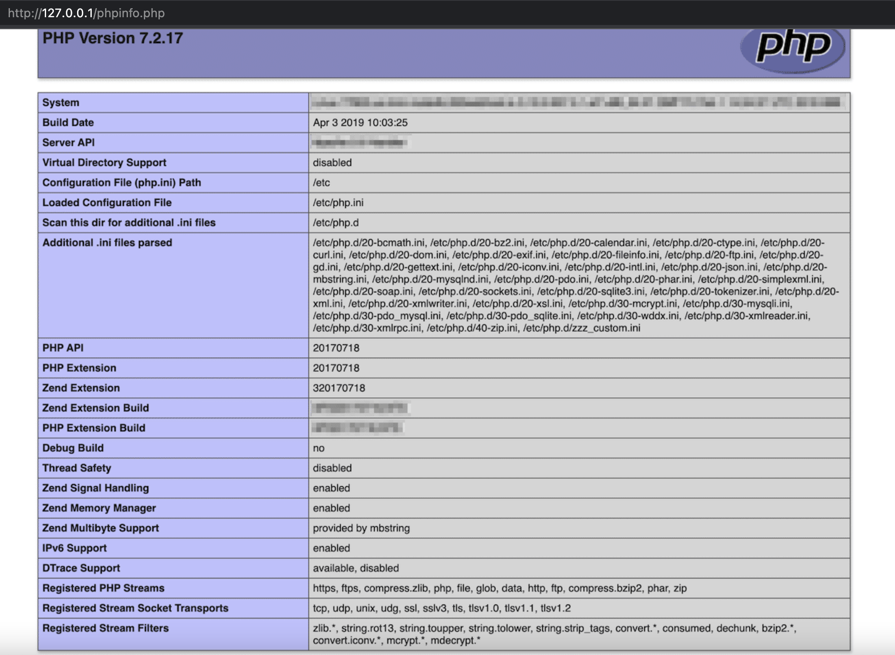

<iframe src="../detail-header.html" title="Github of Anigkus" style="height:0px,widht:0px;display:none" id="kusifreamheader"></iframe>

<h1 style="color:#606c71;text-align:center;" id="h1">你必须得明白的 Redis 安全措施</h1><br/>

[<h1 style="color:#606c71;text-align:center;" >You must understand Redis security measures</h1><br/>]:#

<center>

</center>

> <br/>&nbsp;&nbsp;&nbsp;&nbsp; Redis 本身对我们来说并不陌生,现在大多数业务如果需要用到分布式缓存的时候.首先都会想到使用它来做中间数据的缓存层,主要原因就是性能高、分布式、入门简单且是开源免费的.但是开源意味着需要我们对它了解的更多,不然出现任何问题就只能自己解决(因为你是白嫖😄).那么我认为当中最需要关注的点就是安全问题,安全问题一直是开源软件首先需要完善的基础功能.从2022年大家最为熟悉和震感的 Log4j 的 [RCE](https://cve.mitre.org/cgi-bin/cvename.cgi?name=CVE-2021-44228) 安全问题,还有 FastJson 的 [Autotype](https://securityonline.info/fastjson-remote-code-execution-vulnerability/) 安全问题,这些都是当前最流行和使用最频繁的开源软件,当中不乏还是有不少安全问题.因此团队如果需要引入一个新组件,需要我们就它的安全功能作一个全面的评估和验证测试.本文主要就我们在使用 Redis 时需要关注的一些安全主题做下介绍,也为了避免我们后续碰到这些问题的时候有个预防措施和解决思路等.<br/>
> <br/>

[> <br/>&nbsp;&nbsp;&nbsp;&nbsp; Redis itself is not unfamiliar to us. Now, when most businesses need to use distributed cache, they will first think of using it as a cache layer for intermediate data. The main reason is high performance. , distributed, easy to get started, and open source free. But open source means that we need to know more about it, otherwise any problems can only be solved by ourselves (because you are a white prostitute 😄). Then I think the most important thing is to pay attention to it. The point is the security issue. Security issues have always been the basic functions that open source software needs to improve first. From 2022, Log4j's ___RCE+++(https://cve.mitre.org/cgi-bin/cvename. cgi?name=CVE-2021-44228) security issues, and FastJson's ___Autotype+++(https://securityonline.info/fastjson-remote-code-execution-vulnerability/) security issues, these are the most popular and Many of the most frequently used open source software still have many security issues. Therefore, if the team needs to introduce a new component, we need to conduct a comprehensive evaluation and verification test on its security function. This article mainly focuses on what we need when using Redis. Some security topics that we are concerned about are introduced, and there are preventive measures and solutions in order to avoid our subsequent encounters with these problems.<br/>]:#
[> <br/>]:#


# 进程安全

&nbsp;&nbsp;&nbsp;&nbsp; Redis 本身是不需要很大的权限的,因此启动 Redis 进程千万不要使用`root`用户做完服务启动用户,因为这会带来诸多安全问题.比如通过redis本身的`config set *` 指令,可以做出SSH登录攻击、shell任意脚本风险、webshell任意脚本风险等等,远远不止这些风险.

以下给个简单的参考步骤.

[# Process Security]:#

[&nbsp;&nbsp;&nbsp;&nbsp; Redis itself does not require a lot of permissions, so when starting the Redis process, do not use the `root` user to finish the service and start the user, because this will bring many security problems. For example, through redis The `config set *` command itself can make SSH login attacks, shell arbitrary script risks, webshell arbitrary script risks, etc., far more than these risks.]:#

[The following is a simple reference step.]:#

```
$ groupadd redis

$ useradd -g redis -M redis -s /sbin/nologin

$ mkdir -p /home/redis/run 

$ mkdir -p /home/redis 

$ mkdir -p /home/redis/data  

$ mkdir -p /home/redis/log 

$ chown -R redis:redis /home/redis 
   
$ vi  /home/redis/redis.conf
pidfile "/home/redis/run/redis.pid"
dir "/home/redis/data"
logfile "/home/redis/log/redis.log"
bind 127.0.0.1 
daemonize yes


$ vi /etc/passwd
redis:x:1001:1001::/home/redis:/bin/bash

$ su redis 

$ nohup /home/redis/redis-6.0.6/src/redis-server /home/redis/redis.conf &

$ ps -ef | grep redis

$ exit


$ vi /etc/passwd
redis:x:1001:1001::/home/redis:/bin/nologin 

```

# 网络安全

[# Network security]:#

## 网络边界

&nbsp;&nbsp;&nbsp;&nbsp; 大多数情况下,不要把Redis服务暴露给公网访问,因此,内网服务和外网服务一定要严格区分,不能服务使用的不同的VPC,并且严格控制不同VPC的路由规则和访问控制.安装后要及时更改Redis默认的端口号(6379),避免网络上的端口探测器侦测.

## 限制访问

&nbsp;&nbsp;&nbsp;&nbsp; 以下是表示的是指定本机可以接受连接的IP地址,因为一台服务器可能有多个IP地址,以下下表示只绑定127.0.0.1这一个IP地址.

[## Network Boundary]:#

[&nbsp;&nbsp;&nbsp;&nbsp; In most cases, do not expose Redis services to public network access. Therefore, internal network services and external network services must be strictly distinguished, and different VPCs cannot be used for services, and different strictly controlled Routing rules and access control of VPC. Change the default port number (6379) of Redis in time after installation to avoid detection by port detectors on the network.]:#

[## Restricted Access]:#

[&nbsp;&nbsp;&nbsp;&nbsp; The following is to specify the IP address that the machine can accept connections to, because a server may have multiple IP addresses, the following indicates that only the 127.0.0.1 IP address is bound.]:#

```
bind 127.0.0.1 -::1  # default
```

只能 192.168.1.100和127.0.0.1的访问.

[Only access to  192.168.1.100 and 127.0.0.1.]:#

```
bind 192.168.1.100 127.0.0.1  # listens on two specific IPv4 addresses
```

如果你想控制统一的Redis出口路由地址,可以配置下面这个参数,因此是所有Redis出口地址都指向 `10.0.0.1`.一般情况下,我们不会设置这个,除非你想在统一的出口处做其它安全控制或者敏感信息过滤等.

[If you want to control the unified Redis exit routing address, you can configure the following parameter, so all Redis exit addresses point to `10.0.0.1`. Under normal circumstances, we will not set this unless you want to be at the unified exit Do other security controls or sensitive information filtering, etc.]:#

```
# bind-source-addr 10.0.0.1
```

## TLS 

&nbsp;&nbsp;&nbsp;&nbsp; 如果需要使用 Redis 的TLS功能,需要在编译阶段就把 TLS 模块编译进去,不然是不能使用.TLS其实大家都很熟悉,只要涉及到外网或者说不可控的网络环境下,建议都要使用TLS协议交互,虽然会有一点性能损失.Redis TLS支持客户端和服务器通信、主从模式、集群模式、哨兵模式等.以下是启用TLS的基本步骤,供大家参考.

[&nbsp;&nbsp;&nbsp;&nbsp; If you need to use the TLS function of Redis, you need to compile the TLS module in the compilation stage, otherwise it cannot be used. TLS is actually familiar to everyone, as long as it involves the external network or uncontrollable In the network environment, it is recommended to use the TLS protocol for interaction, although there will be a little performance loss. Redis TLS supports client-server communication, master-slave mode, cluster mode, sentinel mode, etc. The following are the basic steps to enable TLS for your reference .]:#

### 安装

[### Install]:#

```
$ yum -y install openssl-devel

$ mkdir -p /usr/local/redis-627

$ wget https://download.redis.io/releases/redis-6.2.7.tar.gz

$ tar -xf redis-6.2.7.tar.gz

$ cd  redis-6.2.7 &&  make BUILD_TLS=yes &&  make PREFIX=/usr/local/redis-627 install

$ chmod 777 /root/redis-6.2.7/tests/tls/*

```

### 配置

[### Configurate]:#

[redis](https://download.redis.io/releases/)

```
port 0 # Must port 0
tls-port 6379
tls-cert-file /root/redis-6.2.7/tests/tls/redis.crt
tls-key-file /root/redis-6.2.7/tests/tls/redis.key
tls-ca-cert-file /root/redis-6.2.7/tests/tls/ca.crt
tls-dh-params-file /root/redis-6.2.7/tests/tls/redis.dh
```

### 启动

[### Start]:#

```
/usr/local/redis-627/bin/redis-server /usr/local/redis-627/bin/redis.conf
```

### 使用

[### Use]:#

```
# No TSL
/usr/local/redis-627/bin/redis-cli
127.0.0.1:6379> keys *
Error: Connection reset by peer
127.0.0.1:6379> exit

# Use TSL
/usr/local/redis-627/bin/redis-cli --tls \
    --cert ./tests/tls/redis.crt \
    --key ./tests/tls/redis.key \
    --cacert ./tests/tls/ca.crt
127.0.0.1:6379> keys *
(empty array)
```

### 生成JKS证书

[### Generate JKS Certificate]:#

```
$ ll /root/redis-6.2.7/tests/tls/
total 44
-rwxrwxrwx. 1 root root 1895 May 30 02:20 ca.crt
-rwxrwxrwx. 1 root root 3243 May 30 02:20 ca.key
-rwxrwxrwx. 1 root root   41 May 30 02:20 ca.txt
-rwxrwxrwx. 1 root root 1468 May 30 02:20 client.crt
-rwxrwxrwx. 1 root root 1679 May 30 02:20 client.key
-rwxrwxrwx. 1 root root  163 May 30 02:20 openssl.cnf
-rwxrwxrwx. 1 root root 1415 May 30 02:20 redis.crt
-rwxrwxrwx. 1 root root  424 May 30 02:21 redis.dh
-rwxrwxrwx. 1 root root 1679 May 30 02:20 redis.key
-rwxrwxrwx. 1 root root 1468 May 30 02:20 server.crt
-rwxrwxrwx. 1 root root 1675 May 30 02:20 server.key

# crt To p12,Password:123456
$ openssl pkcs12 -export -in /root/redis-6.2.7/tests/tls/redis.crt -inkey /root/redis-6.2.7/tests/tls/redis.key -out /root/redis-6.2.7/tests/tls/redis.p12 -name "alias"
Enter Export Password:
Verifying - Enter Export Password:

$ ll /root/redis-6.2.7/tests/tls/
total 48
-rwxrwxrwx. 1 root root 1895 May 30 02:20 ca.crt
-rwxrwxrwx. 1 root root 3243 May 30 02:20 ca.key
-rwxrwxrwx. 1 root root   41 May 30 02:20 ca.txt
-rwxrwxrwx. 1 root root 1468 May 30 02:20 client.crt
-rwxrwxrwx. 1 root root 1679 May 30 02:20 client.key
-rwxrwxrwx. 1 root root  163 May 30 02:20 openssl.cnf
-rwxrwxrwx. 1 root root 1415 May 30 02:20 redis.crt
-rwxrwxrwx. 1 root root  424 May 30 02:21 redis.dh
-rwxrwxrwx. 1 root root 1679 May 30 02:20 redis.key
-rw-------. 1 root root 2656 May 30 02:57 redis.p12
-rwxrwxrwx. 1 root root 1468 May 30 02:20 server.crt
-rwxrwxrwx. 1 root root 1675 May 30 02:20 server.key

# p12 To jks
# Enter destination keystore password:654321 #jks password
# Enter source keystore password:123456 #p12 password

$ keytool -importkeystore -srckeystore /root/redis-6.2.7/tests/tls/redis.p12 -destkeystore  /root/redis-6.2.7/tests/tls/redis.jks -deststoretype pkcs12
Enter destination keystore password:  
Re-enter new password: 
Enter source keystore password:  
Entry for alias alias successfully imported.
Import command completed:  1 entries successfully imported, 0 entries failed or cancelled

# jks to p12(This command can ignore.)
$ keytool -importkeystore -srckeystore  /root/redis-6.2.7/tests/tls/redis.jks -srcstoretype JKS -deststoretype PKCS12 -destkeystore /root/redis-6.2.7/tests/tls/redis2.p12

```


### Reference Code

&nbsp;&nbsp;&nbsp;&nbsp; 可以参考这个文件里面的说明[java_redis_tls](https://github.com/anigkus/anigkus.github.io/blob/main/snippets/java_redis_tls.md).完整的说明请查看官方手册 [TLS](https://redis.io/docs/manual/security/encryption/).

[&nbsp;&nbsp;&nbsp;&nbsp; You can refer to the instructions in this file___java_redis_tls+++(https://github.com/anigkus/anigkus.github.io/blob/main/snippets/java_redis_tls.md). For complete instructions, please Check out the official manual ___TLS+++(https://redis.io/docs/manual/security/encryption/).]:#

## Protected mode

&nbsp;&nbsp;&nbsp;&nbsp; 这个参数的作用就是为了保护Redis自身,然后会屏蔽掉一些特殊指令.如果是在 Redis <3.2 之前的版本,只能通过bind和密码来做.对于 Redis >= 3.2以后的版本中,默认保护模式是打开的,意思在这种模式下Redis 只回复来自回环接口的查询,也就是本机,其它地址请求将返回错误.

[&nbsp;&nbsp;&nbsp;&nbsp; The function of this parameter is to protect Redis itself, and then block some special instructions. If it is a version before Redis <3.2, it can only be done by bind and password. For Redis >= In versions after 3.2, the default protection mode is turned on, which means that in this mode, Redis will only reply to the query from the loopback interface, that is, the local machine, other address requests will return errors.]:#

[redis.conf](https://github.com/redis/redis/blob/unstable/redis.conf)

```
protected-mode yes # default
```

手动关闭保护模式 (<font color="red">公网情况千万不要这么做</font>) ,这个只代表当前Redis进程生效,重启后就没用了,一切以 `redis.conf` 配置文件为准.

[Turn off the protected mode manually (<font color="red">Do not do this in the case of the public network</font>), this only means that the current Redis process takes effect, and it will be useless after restarting, everything is `redis.conf` The configuration file shall prevail.]:#

```
CONFIG SET protected-mode no
```

# 指令安全

[# Instruction Security]:#

## NoSQL 注入

[## NoSQL Injection ]:#

&nbsp;&nbsp;&nbsp;&nbsp; Redis 协议本身是不存在字符串转义的概念的.以前我们可能总是认为注入只能在 `SQL` 中存在,但是注入其实在 NoSQL 也一样会发生.这就要看客户端是否处理了,比如我们看下面,这是 Redis 和 Node 结合的例子.

例如,以下两个调用导致完全相同的结果.

[&nbsp;&nbsp;&nbsp;&nbsp; The Redis protocol itself does not have the concept of string escaping. We may always think that injection can only exist in `SQL`, but injection can actually happen in NoSQL as well. This It depends on whether the client handles it. For example, let's look at the following, which is an example of the combination of Redis and Node.]:#

[For example, the following two calls lead to the exact same result.]:#

```
redisClient.set("key", "value1"); 
redisClient.set(["key", "value1"]);
```

* <mark>正常请求</mark>: JSON 设置为`{key : "key"}` 并会执行 `redisClient.set("key", "value1")`.

* <mark>注入请求</mark>: JSON 正文设置为`{key : ["key", "value2"]}` 并会执行 `redisClient.set(["key", "value2"], "value1")`.

[* <mark>`Normal request`</mark>: sets the JSON body to {key : "key"} and results in redis.set("key", "value1").]:#

[* <mark>`Injection request`</mark>: sets the JSON body to {key : !!!"key", "evil"???} and results in redis.set(!!!"key", "value2"???, "value1").]:#

```
app.post('/', function (req, res) { 
    redisClient.set(req.body.key , "value1"); 
});
```

如果注入成功,最终的结果是 `key=value2`.

[If the injection is successful, the final result is `key=value2`.]:#

## 重写特殊指令

&nbsp;&nbsp;&nbsp;&nbsp; 前面说过某些指令是对服务器来说是非常关键和危险的,因此 Redis 提供了一个功能,就是可以重写某些指令,或者也可以说是禁止了某些指令,这个对于客户端和服务端是同时生效的.

[## Override Special Instructions]:#

[&nbsp;&nbsp;&nbsp;&nbsp; As mentioned earlier, some instructions are very critical and dangerous to the server, so Redis provides a function that can rewrite some instructions, or it can be said that certain instructions are prohibited. These commands are valid for both client and server.]:#

[redis.conf](https://github.com/redis/redis/blob/unstable/redis.conf)

```
rename-command CONFIG CONFIG_mQINBF9FWio
rename-command SHUTDOWN SHUTDOWN_mQINBF9FWio
rename-command FLUSHDB ""
rename-command FLUSHALL ""
```

比如我在上面重写了`CONFIG` 指令,那么再次执行的时候就会报 `ERR unknown command` 错误.

[For example, if I rewrite the `CONFIG` command above, then the `ERR unknown command` error will be reported when it is executed again.]:#

```
127.0.0.1:6379> CONFIG get  protected*
(error) ERR unknown command `CONFIG`, with args beginning with: `get`, `protected*`, 
127.0.0.1:6379> CONFIG get dir
(error) ERR unknown command `CONFIG`, with args beginning with: `get`, `dir`, 
```

## 代码安全

[## Code Security]:# 

&nbsp;&nbsp;&nbsp;&nbsp; Redis 本身已经提供了非常优秀的方式来保护代码安全,比如防止缓冲区溢出、格式错误和其他内存损坏问题等,但是有些指令本身作用就非常大,如果使用不当,很可能造成非常危险的事故,比如以下两个指令.

[&nbsp;&nbsp;&nbsp;&nbsp; Redis itself has provided a very good way to protect code security, such as preventing buffer overflow, format errors and other memory corruption problems, etc., but some instructions themselves are very useful, if used improperly , is likely to cause a very dangerous accident, such as the following two commands.]:#

```
CONFIG
EVAL 
```

* EVAL: 执行任意脚本,特别需要注意的地方,就是这个地方不能让用户直接传参,不然后果很严重.因此在需要执行 `EVAL` 指令的时候,一定要做字符串白名单等. 语法: `EVAL script numkeys key [key ...] arg [arg ...] `

[* EVAL: Execute an arbitrary script. Special attention should be paid to the fact that this place cannot allow users to directly pass parameters, otherwise the consequences will be serious. Therefore, when the `EVAL` command needs to be executed, you must do a string whitelist, etc. Syntax : `EVAL script numkeys key ___key ...+++ arg ___arg ...+++ `]:#

```
127.0.0.1:6379> eval "return {KEYS[1],ARGV[1],ARGV[2]}" 1 k1 v1 v2
1) "k1"
2) "v1"
3) "v2"
```

* CONFIG : 获取服务器信息或者动态更改服务器配置信息等.最危险的还是` config set `指令.

[* CONFIG : Get server information or dynamically change server configuration information, etc. The most dangerous is the ` config set ` command.]:#

[redis](https://download.redis.io/releases/)

```
$ yum install -y gcc automake autoconf libtool make

$ mkdir -p /usr/local/redis-{3,4,5,6,627,7}

$  wget https://download.redis.io/releases/redis-3.0.0.tar.gz
$  wget https://download.redis.io/releases/redis-4.0.0.tar.gz
$  wget https://download.redis.io/releases/redis-5.0.0.tar.gz
$  wget https://download.redis.io/releases/redis-6.0.0.tar.gz
$  wget https://download.redis.io/releases/redis-6.2.7.tar.gz
$  wget https://download.redis.io/releases/redis-7.0.0.tar.gz

$ tar -xf redis-3.0.0.tar.gz
$ tar -xf redis-4.0.0.tar.gz
$ tar -xf redis-5.0.0.tar.gz
$ tar -xf redis-6.0.0.tar.gz
$ tar -xf redis-6.2.7.tar.gz
$ tar -xf redis-7.0.0.tar.gz

$ cd  redis-3.0.0 &&  make &&  make PREFIX=/usr/local/redis-3 install
$ cd  redis-4.0.0 &&  make &&  make PREFIX=/usr/local/redis-4 install
$ cd  redis-5.0.0 &&  make &&  make PREFIX=/usr/local/redis-5 install
$ cd  redis-6.0.0 &&  make &&  make PREFIX=/usr/local/redis-6 install
$ cd  redis-6.2.7 &&  make &&  make PREFIX=/usr/local/redis-627 install
$ cd  redis-7.0.0 &&  make &&  make PREFIX=/usr/local/redis-7 install

# Note redis port 6379 conflict
$ /usr/local/redis-3/bin/redis-server 
$ /usr/local/redis-4/bin/redis-server 
$ /usr/local/redis-5/bin/redis-server 
$ /usr/local/redis-6/bin/redis-server 
$ /usr/local/redis-627/bin/redis-server 
$ /usr/local/redis-7/bin/redis-server 
```

&nbsp;&nbsp;&nbsp;&nbsp; `var/www/` 目录必须存在,此实验可以在 redis-3.0.0、redis-4.0.0、redis-5.0.0、redis-6.0.0、redis-6.2.7 都能重现,其它版本我没有去验证,但是 `redis-7.0.0` 是重现不了的,因为 7.0 中对 `config set` 一些特殊参数做了进一步的限制,看下面 `config set dir /var/www/` 报错日志.

&nbsp;&nbsp;&nbsp;&nbsp; `dir` 默认没有配置文件指定的话,是以在哪个目录启动redis-server脚本存储目录,比如下面就是 `/tmp/` 目录下就会生成 `dump.rdb` 文件.

[&nbsp;&nbsp;&nbsp;&nbsp; `var/www/` directory must exist, this experiment can be in redis-3.0.0, redis-4.0.0, redis-5.0.0, redis-6.0.0, redis-6.2 .7 can be reproduced, I have not verified other versions, but `redis-7.0.0` cannot reproduce, because 7.0 has further restrictions on some special parameters of `config set`, see the following `config set` dir /var/www/` error log.]:#

[&nbsp;&nbsp;&nbsp;&nbsp; `dir` If there is no configuration file specified by default, it is the directory in which to start the redis-server script storage directory, such as the following is the `/tmp/` directory will generate `dump.rdb` document.]:#

```
# CONFIG SET protected-mode no
127.0.0.1:6379> info Server
# Server
redis_version:3.0.0
redis_git_sha1:00000000
redis_git_dirty:0
redis_build_id:ffd58eb7da41810a
redis_mode:standalone
os:Linux 4.18.0-277.el8.x86_64 x86_64
arch_bits:64
multiplexing_api:epoll
gcc_version:8.5.0
process_id:529807
run_id:4c9ae3d11208b2a8416eb6d31678bfaec4e6c74e
tcp_port:6379
uptime_in_seconds:44
uptime_in_days:0
hz:10
lru_clock:9661853
config_file:

# Since version 3.2.0
127.0.0.1:6379> CONFIG get  protected*
(empty list or set)

127.0.0.1:6379>  CONFIG get  protected*
1) "protected-mode"
2) "yes"
127.0.0.1:6379> CONFIG get dir
1) "dir"
2) "/tmp"
127.0.0.1:6379> config set dir /var/www/ 
OK

# Since version 7.0.0
127.0.0.1:6379> config set dir /var/www/ 
(error) ERR CONFIG SET failed (possibly related to argument 'dir') - can't set protected config

127.0.0.1:6379> set xxx "\n\n\n<?php phpinfo() ;?>\n\n\n" 
OK
127.0.0.1:6379> config set dbfilename phpinfo.php 
OK
127.0.0.1:6379> save
OK
127.0.0.1:6379> CONFIG get  dir
1) "dir"
2) "/var/www"

$ cat  /var/www/phpinfo.php
REDIS0009�      redis-ver6.2.7�
�edis-bits�@�ctime��v�bused-mem�xU
 aof-preamble���xxx


<?php phpinfo() ;?>


```

<center>

</center>

# 鉴权安全

[# Authentication Security]:#

## ACL

&nbsp;&nbsp;&nbsp;&nbsp; ACL (Access control list) 全称访问控制列表,类似的权限控制还有MAC、DAC、RBAC已经ABAC等. kubernetes就是实现RBAC来控制权限的,其实维度不一样,ACL更多是控制命令或者说执行指令,RBAC更多是控制资源等.一直以来 Redis 的命令权限控制力度一直是社区在讨论的地方.但从 Redis 6发布了第一个 ACL 版本开始到现在 ACL 已经比较完善了.如果多个团队是共用一个Redis集群并且需要严格控制更细粒度的权限,那么ACL就能够满足这个要求,否则不用也行,因为引入 ACL对操作本身到不会增加工作,但是会提示`no permissions`,不知道的话还以为报错了.以下是个基本的操作例子.

[&nbsp;&nbsp;&nbsp;&nbsp; ACL (Access control list) is the full name of the access control list. Similar permission controls include MAC, DAC, RBAC, and ABAC. Kubernetes implements RBAC to control permissions. In fact, the dimensions are different. ACL It is more about controlling commands or executing instructions, and RBAC is more about controlling resources, etc. Redis’s command permission control has always been a topic of discussion in the community. But since Redis 6 released the first ACL version, ACL has been It is relatively complete. If multiple teams share a Redis cluster and need to strictly control more fine-grained permissions, then ACL can meet this requirement, otherwise it is not necessary, because the introduction of ACL will not add work to the operation itself, but it will Prompt `no permissions`, if you don't know it, you will think that an error is reported. The following is a basic operation example.]:#

### Terminal 1

&nbsp;&nbsp;&nbsp;&nbsp; 添加一个`anigkus`用户,并设置密码为`123456`,赋予`get` 指令权限,只能匹配着几个键开头的键:`objects:*、 items:*、public:*、cached:*`.

[&nbsp;&nbsp;&nbsp;&nbsp; Add a `anigkus` user, and set the password to `123456`, grant the `get` command permission, can only match the keys at the beginning of several keys: `objects:*, items:* , public:*, cached:*`.]:#

```
127.0.0.1:6379> ACL LIST
1) "user default on nopass ~* &* +@all"
127.0.0.1:6379> ACL SETUSER anigkus
OK
127.0.0.1:6379> ACL LIST
1) "user anigkus off &* -@all"
2) "user default on nopass ~* &* +@all"
127.0.0.1:6379> ACL SETUSER anigkus on >123456 ~cached:* +get
OK

127.0.0.1:6379> set key1 v1
OK
127.0.0.1:6379> ACL GETUSER anigkus
 1) "flags"
 2) 1) "on"
    2) "allchannels"
 3) "passwords"
 4) 1) "2d9c75273d72b32df726fb545c8a4edc719f0a95a6fd993950b10c474ad9c927"
 5) "commands"
 6) "-@all +get"
 7) "keys"
 8) 1) "cached:*"
 9) "channels"
10) 1) "*"
127.0.0.1:6379>  set cached:c1 c1
OK
127.0.0.1:6379> keys *
1) "cached:c1"
2) "key1"
127.0.0.1:6379> ACL SETUSER anigkus ~objects:* ~items:* ~public:*
OK
127.0.0.1:6379> ACL GETUSER anigkus
 1) "flags"
 2) 1) "on"
    2) "allchannels"
 3) "passwords"
 4) 1) "8d969eef6ecad3c29a3a629280e686cf0c3f5d5a86aff3ca12020c923adc6c92"
 5) "commands"
 6) "-@all +get"
 7) "keys"
 8) 1) "cached:*"
    2) "objects:*"
    3) "items:*"
    4) "public:*"
 9) "channels"
10) 1) "*"
127.0.0.1:6379> set objects:o1 o1
OK
127.0.0.1:6379> set itmes:i1 i1
OK
127.0.0.1:6379> set public:p1 p1
OK
127.0.0.1:6379> ACL LIST
1) "user anigkus on #8d969eef6ecad3c29a3a629280e686cf0c3f5d5a86aff3ca12020c923adc6c92 ~cached:* ~objects:* ~items:* ~public:* &* -@all +get"
2) "user default on nopass ~* &* +@all"
127.0.0.1:6379> keys *
1) "cached:c1"
2) "itmes:i1"
3) "public:p1"
4) "key1"
5) "objects:o1"
```

### Terminal 2

&nbsp;&nbsp;&nbsp;&nbsp; 切换 `anigkus`用户验证,符合上面配置的权限,访问 `key1` 就提示权限不足,因为并没有授权可以访问 `key1` 这种格式的键.

[&nbsp;&nbsp;&nbsp;&nbsp; Switch `anigkus` user authentication, in line with the permissions configured above, access `key1` will prompt insufficient permissions, because there is no authorization to access keys in the format of `key1`.]:#

```
127.0.0.1:6379> AUTH anigkus 123456
OK
27.0.0.1:6379> get  cached:c1
"c1"
127.0.0.1:6379> get public:p1
"p1"
127.0.0.1:6379> get key1
(error) NOPERM this user has no permissions to access one of the keys used as arguments
127.0.0.1:6379> 
```

完整的说明请查看官方手册 [ACL](https://redis.io/docs/manual/security/acl/).

[Please check the official manual ___ACL+++(https://redis.io/docs/manual/security/acl/) for complete instructions]:#

## 密码鉴权

&nbsp;&nbsp;&nbsp;&nbsp; Redis提供了一个简单的身份验证层,可以通过编辑 [redis.conf](https://download.redis.io/releases/) 文件来打开它.当启用授权后,Redis 将拒绝未经身份验证的客户端的任何查询.但是客户端可以通过发送 `AUTH` 指令和密码来验证是否是授权的请求.有个地方要注意的是,`AUTH` 指令本身和其它 Redis 命令一样,是通过明文发送的,因此传输需要使用 `TLS` 协议才能保证不会被窃听攻击.

&nbsp;&nbsp;&nbsp;&nbsp; `requirepass` 是以明文的形式存储在配置文件中,因此设置的密码,密码长度和复杂性不能太过简单,防止被暴力破解.以下是个简单的例子,我直接动态手工测试,正常情况 `requirepass` 应该写在配置文件中,并且除来管理员不能随便任意访问和编辑这个文件.

[## Password Authentication]:#

[&nbsp;&nbsp;&nbsp;&nbsp; Redis provides a simple authentication layer that can be turned on by editing the ___redis.conf+++(https://download.redis.io/releases/) file. When authorization is enabled, Redis will reject any query from an unauthenticated client. However, the client can verify that it is an authorized request by sending the `AUTH` directive and password. One thing to note is that the `AUTH` directive itself and other Redis commands The same, is sent in clear text, so the transmission needs to use the `TLS` protocol to ensure that it is not subject to eavesdropping attacks.]:#

[&nbsp;&nbsp;&nbsp;&nbsp; `requirepass` is stored in the configuration file in plaintext, so the set password, password length and complexity should not be too simple to prevent brute force cracking. The following is a simple example, I Direct dynamic manual testing, normally `requirepass` should be written in the configuration file, and administrators cannot access and edit this file arbitrarily.]:#

[redis.conf](https://download.redis.io/releases/) 
```
requirepass "mQINBF9FWioBEADfBiOE"
```

```
127.0.0.1:6379> config set requirepass 123456
OK
127.0.0.1:6379> set key1 v1
OK
127.0.0.1:6379> auth 1234567
(error) WRONGPASS invalid username-password pair or user is disabled.
127.0.0.1:6379> auth 123456
OK
127.0.0.1:6379> get key1
"v1"

```

# 结论

&nbsp;&nbsp;&nbsp;&nbsp; 本文主要涵盖 Redis 提供的进程安全、网络安全、指令安全、鉴权安全等几方面.提供了一些保证措施和可能出现的危险说明,这些都需要在使用之前提前去控制,需要和公司运维、研发一起去协助完成的.避免给公司造成更严重的安全事故.

[# Conclusion]:#

[&nbsp;&nbsp;&nbsp;&nbsp; This article mainly covers process security, network security, instruction security, authentication security and other aspects provided by Redis. It provides some guarantee measures and possible danger descriptions, which need to be used in advance To control, it needs to be completed with the company's operation and maintenance and R&D. To avoid causing more serious security incidents to the company.]:#


<br>

### [back](./)
